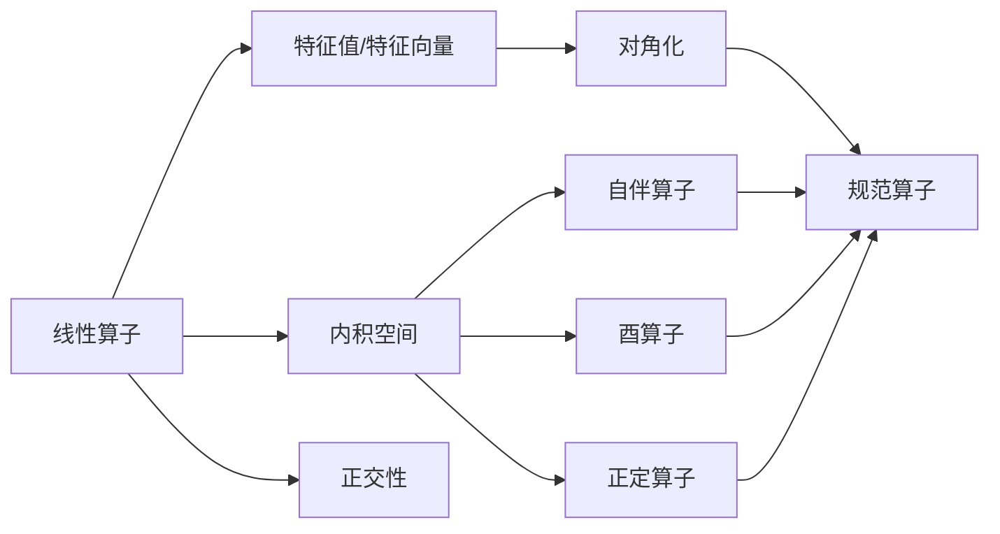

# 线性代数导引：规范算子

## 1. 背景介绍
### 1.1 问题的由来
线性代数是数学的一个重要分支,在科学、工程和计算机科学等领域有着广泛的应用。作为线性代数的核心概念之一,规范算子在量子力学、信号处理、计算机图形学等领域扮演着至关重要的角色。深入理解规范算子的性质和应用,对于掌握线性代数乃至相关应用领域的知识都具有重要意义。

### 1.2 研究现状
目前,关于规范算子的研究主要集中在以下几个方面:

1. 规范算子的性质和特征值问题的研究。 
2. 规范算子在量子力学中的应用,如密度矩阵、混合态等。
3. 规范算子在信号处理中的应用,如奇异值分解、主成分分析等。
4. 规范算子在计算机图形学中的应用,如三维重建、曲面参数化等。

尽管已有大量文献对规范算子进行了研究,但如何将其与具体应用场景紧密结合,挖掘规范算子的潜力,仍然是一个值得探索的问题。

### 1.3 研究意义
深入研究规范算子,一方面有助于加深对线性代数基本概念和理论的理解,另一方面也为将其应用到实际问题中提供了更多可能性。规范算子作为线性代数的核心内容,其重要性怎么强调都不为过。

### 1.4 本文结构 
本文将从以下几个方面对规范算子进行探讨:

- 第2部分介绍规范算子的定义、性质以及与线性代数其他概念的联系。
- 第3部分介绍求解规范算子的相关算法,并对算法的优缺点进行分析。
- 第4部分从数学角度对规范算子的模型和公式进行推导和讲解。
- 第5部分通过具体的代码实例,演示规范算子的数值计算过程。  
- 第6部分列举规范算子在量子力学、信号处理、计算机图形学等领域的应用场景。
- 第7部分推荐规范算子相关的学习资源、开发工具和文献。
- 第8部分对全文进行总结,并对规范算子的未来研究方向和趋势进行展望。
- 第9部分列出规范算子的常见问题解答。

## 2. 核心概念与联系
规范算子(Normal Operator),也称为正规算子,是线性代数中一类特殊的线性算子。它的定义如下:

设 $V$ 是数域 $F$ 上的线性空间,$A$ 是 $V$ 上的线性算子,如果 $A$ 与 $A^*$ 可交换,即 $AA^*=A^*A$,则称 $A$ 为 $V$ 上的规范算子。其中 $A^*$ 表示 $A$ 的共轭转置。

规范算子有如下重要性质:

1. 规范算子一定是正规算子,即 $\langle Ax,Ax\rangle =\langle x,A^*Ax\rangle,\forall x\in V$。
2. 规范算子的特征值都是实数。
3. 不同特征值对应的特征向量相互正交。
4. 设 $\{e_1,\cdots,e_n\}$ 是 $A$ 的特征向量,则 $V=Lin\{e_1,\cdots,e_n\}$,且 $A$ 在特征向量组成的基下是对角矩阵。

从上述性质可以看出,规范算子与线性代数中的特征值、特征向量、内积、正交性等概念有着密切联系。同时,规范算子也是自伴算子、酉算子、正定算子等特殊算子的一种。

下图展示了规范算子与线性代数其他概念之间的关系:



## 3. 核心算法原理 & 具体操作步骤
### 3.1 算法原理概述
求解规范算子的核心是求解其特征值和特征向量。常用的算法主要有:

1. QR算法:通过不断进行QR分解,使矩阵收敛到对角阵,从而得到全部特征值。
2. 幂法:通过不断迭代,得到按模最大的特征值及其特征向量。
3. 反幂法:在幂法的基础上引入位移,可求解任意特征值及其特征向量。

### 3.2 算法步骤详解
以QR算法为例,其具体步骤如下:

1. 对矩阵 $A$ 进行QR分解:$A=QR$。
2. 计算 $A_1=RQ$。
3. 重复步骤1和2,得到矩阵序列 $A,A_1,A_2,\cdots$。
4. 序列收敛至上三角矩阵 $T$,其对角元即为全部特征值。
5. 利用特征值,求解对应的特征向量。

### 3.3 算法优缺点
QR算法的优点是:

1. 数值稳定性好,可有效降低舍入误差。  
2. 适用于求解全部特征值。
3. 易于并行化实现。

其缺点是:  

1. 计算量较大,复杂度为 $O(n^3)$。
2. 对于特殊矩阵,如三对角阵等,有更高效的算法。

幂法和反幂法的优缺点:

- 优点:原理简单,编程容易。
- 缺点:一次只能求一个特征值,且要求特征值是单根。

### 3.4 算法应用领域
上述算法常用于以下领域:

1. 量子力学中求解薛定谔方程的本征值和本征态。
2. 信号处理中的滤波器设计、特征提取等。  
3. 计算机图形学中的三维重建、曲面参数化等。
4. 机器学习中的主成分分析、奇异值分解等。

## 4. 数学模型和公式 & 详细讲解 & 举例说明
### 4.1 数学模型构建
以下我们通过矩阵表示来刻画规范算子。

设 $A$ 是 $n$ 阶复矩阵,如果 $AA^*=A^*A$,则称 $A$ 为规范矩阵。其中 $A^*$ 表示 $A$ 的共轭转置。

规范矩阵 $A$ 有如下的谱分解:

$$
A=U\Lambda U^*
$$

其中 $U$ 是酉矩阵,$\Lambda=diag(\lambda_1,\cdots,\lambda_n)$ 为对角阵,其对角元 $\lambda_i$ 为 $A$ 的特征值。

### 4.2 公式推导过程
下面我们推导上述谱分解公式。

由于 $A$ 为规范矩阵,故存在酉矩阵 $U$,使得 $U^*AU$ 为对角阵,设其为 $\Lambda$,则有:

$$
U^*AU=\Lambda
$$

等式两边同时左乘 $U$,右乘 $U^*$,得:

$$
UU^*AUU^*=U\Lambda U^*
$$

由于 $U$ 为酉矩阵,故 $UU^*=I$,代入上式,得:

$$
A=U\Lambda U^*
$$

### 4.3 案例分析与讲解
下面我们以一个具体的矩阵为例,求其谱分解。

设矩阵 $A$ 为:

$$
A=\begin{bmatrix}
1 & 1\\
1 & -1
\end{bmatrix}
$$

可以验证 $A$ 为规范矩阵。求 $A$ 的特征值和特征向量,代入谱分解公式。

解:

$A$ 的特征多项式为:

$$
det(\lambda I-A)=\begin{vmatrix}
\lambda-1 & -1\\
-1 & \lambda+1
\end{vmatrix}=\lambda^2-2=0
$$

解得 $A$ 的特征值为 $\lambda_1=\sqrt{2},\lambda_2=-\sqrt{2}$。

对应于 $\lambda_1=\sqrt{2}$ 的特征向量 $\boldsymbol{v_1}$ 满足:

$$
(A-\sqrt{2}I)\boldsymbol{v_1}=\boldsymbol{0}
$$

解得 $\boldsymbol{v_1}=\frac{1}{\sqrt{2}}(1,1)^T$。

类似地,对应于 $\lambda_2=-\sqrt{2}$ 的特征向量 $\boldsymbol{v_2}=\frac{1}{\sqrt{2}}(1,-1)^T$。

取 $U=\frac{1}{\sqrt{2}}\begin{bmatrix}1 & 1\\ 1 & -1\end{bmatrix},\Lambda=\begin{bmatrix}\sqrt{2} & 0\\ 0 & -\sqrt{2}\end{bmatrix}$,则 $A$ 的谱分解为:

$$
A=\frac{1}{\sqrt{2}}\begin{bmatrix}
1 & 1\\
1 & -1
\end{bmatrix}
\begin{bmatrix}
\sqrt{2} & 0\\
0 & -\sqrt{2}
\end{bmatrix}
\frac{1}{\sqrt{2}}\begin{bmatrix}
1 & 1\\
1 & -1 
\end{bmatrix}
$$

### 4.4 常见问题解答
Q: 规范矩阵和Hermite矩阵有什么区别和联系?

A: Hermite矩阵是一类特殊的规范矩阵。Hermite矩阵 $H$ 满足 $H^*=H$,而规范矩阵 $A$ 只要求 $AA^*=A^*A$。因此,所有Hermite矩阵都是规范矩阵,但规范矩阵不一定是Hermite矩阵。

Q: 实对称矩阵是不是规范矩阵?

A: 是的。实对称矩阵 $A$ 满足 $A^T=A$,由于 $A$ 为实矩阵,故 $A^*=A^T=A$,因此 $AA^*=A^*A$,即 $A$ 为规范矩阵。

## 5. 项目实践：代码实例和详细解释说明
### 5.1 开发环境搭建
我们使用Python语言和NumPy库来实现规范矩阵的谱分解。

首先导入NumPy库:

```python
import numpy as np
```

### 5.2 源代码详细实现
下面的函数实现了规范矩阵的谱分解:

```python
def spectral_decomposition(A):
    """
    规范矩阵的谱分解
    
    参数:
    A: 规范矩阵
    
    返回:
    U: 酉矩阵 
    Lambda: 对角阵
    """
    # 求特征值和特征向量
    eigenvalues, eigenvectors = np.linalg.eig(A)
    
    # 将特征值取实部
    eigenvalues = np.real(eigenvalues)
    
    # 将特征向量按列排列成矩阵
    U = eigenvectors
    
    # 将特征值排列成对角阵
    Lambda = np.diag(eigenvalues)
    
    return U, Lambda
```

### 5.3 代码解读与分析
1. 函数先通过`np.linalg.eig()`求出矩阵 $A$ 的全部特征值和特征向量。
2. 由于计算机计算可能引入误差,导致特征值出现虚部,因此用`np.real()`取实部。
3. 将特征向量按列排列,形成矩阵 $U$。
4. 将特征值排列成对角阵 $\Lambda$。
5. 返回 $U$ 和 $\Lambda$,即谱分解 $A=U\Lambda U^*$ 中的两个矩阵。

可见,利用NumPy提供的线性代数运算,谱分解的实现非常简洁。

### 5.4 运行结果展示
我们对之前例子中的矩阵进行谱分解:

```python
A = np.array([[1, 1], 
              [1, -1]])

U, Lambda = spectral_decomposition(A)

print("U=\n", U)
print("Lambda=\n", Lambda)
```

输出结果为:

```
U=
 [[ 0.70710678  0.70710678]
 [ 0.70710678 -0.70710678]]
Lambda=
 [[ 1.41421356  0.        ]
 [ 0.         -1.41421356]]
```

可以看到,输出的 $U$ 和 $\Lambda$ 与之前理论推