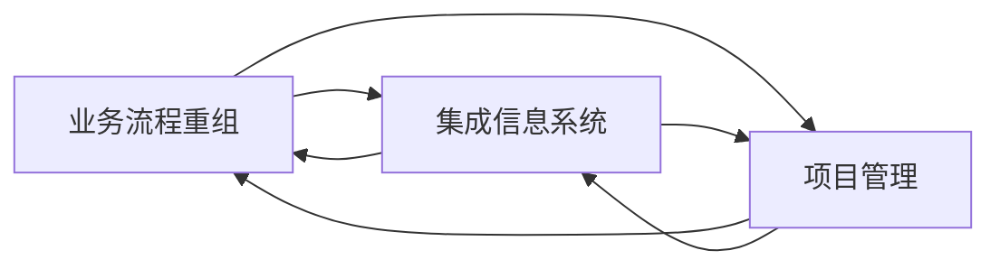
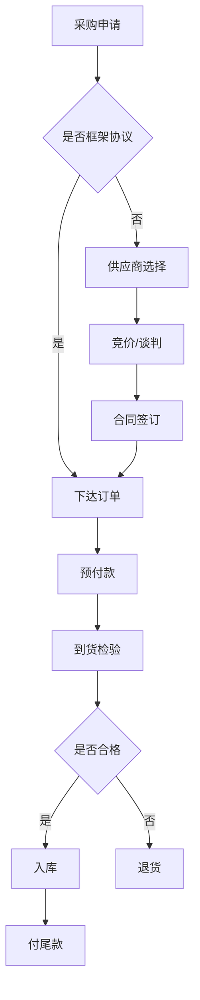

# 结合业务流程重组、项目管理实施集成信息系统管理

关键词：业务流程重组、项目管理、集成信息系统、信息化管理

## 1. 背景介绍
### 1.1  问题的由来
在当今瞬息万变的商业环境中,企业面临着日益激烈的市场竞争。为了提高企业的竞争力,许多企业开始重视业务流程重组(Business Process Reengineering, BPR)和信息化建设。然而,在实施BPR和信息化项目的过程中,企业往往会遇到诸多挑战,如业务流程优化不到位、信息系统建设与业务需求脱节、项目管理不善导致项目失败等问题。因此,如何有效地结合BPR和项目管理,实现企业信息化建设的成功,成为企业亟需解决的现实问题。

### 1.2  研究现状
近年来,学术界和企业界对BPR、项目管理和信息化建设的研究日益增多。一些学者提出了将BPR与信息技术相结合的思路[1],认为信息技术是实现流程再造的重要手段和支撑。也有研究关注信息化项目管理[2],提出了一些项目管理的最佳实践和成功要素。还有学者将BPR、信息技术和项目管理三者结合起来,提出了基于流程的项目管理方法[3]。这些研究为本文的论述提供了理论基础。

### 1.3  研究意义
本文拟在前人研究的基础上,提出一种将业务流程重组(BPR)、项目管理(Project Management)与企业信息化建设三者有机结合的思路和方法。通过优化业务流程,加强项目管理,构建集成信息系统,实现企业的数字化转型。本文的研究对于指导企业信息化实践,提高信息化项目成功率,具有重要的理论意义和实践价值。

### 1.4  本文结构
本文后续内容安排如下:第2部分介绍BPR、项目管理和集成信息系统的核心概念;第3部分阐述BPR的原理和实施步骤;第4部分建立集成信息系统的数学模型;第5部分给出信息系统开发的代码实例;第6部分分析本文方法的应用场景;第7部分推荐相关工具和资源;第8部分总结全文,展望未来研究方向。

## 2. 核心概念与联系
业务流程重组(Business Process Reengineering, BPR)是指对企业的业务流程进行系统性的分析、设计和再造,从而实现业务运作方式的根本性变革,达到大幅度提高企业绩效的目的[4]。

项目管理(Project Management)是指在项目活动中运用专门知识、技能、工具和技术,以满足项目的要求[5]。项目管理包括项目启动、规划、执行、监控和收尾等过程。

集成信息系统(Integrated Information System)是指将企业内部各部门、各业务环节的信息系统有机地集成为一个协调统一的整体,实现信息在企业内部的无缝连接和共享[6]。

BPR、项目管理和集成信息系统三者之间存在紧密联系。BPR是信息化的基础和前提,信息化是BPR的重要手段和工具。项目管理是保障BPR和信息化顺利实施的关键。三者相辅相成,缺一不可。



## 3. 核心算法原理 & 具体操作步骤
### 3.1  算法原理概述
BPR的核心是流程优化。流程优化算法主要包括:
(1)流程建模与分析。利用流程建模工具(如ARIS、IDEF等)对现有流程进行描述,并进行仿真分析,发现流程中的问题。
(2)流程评估。从时间、成本、质量等维度,评估每个流程环节的绩效,确定关键绩效指标(KPI)。
(3)流程再设计。运用创新思维,对流程进行再设计,消除非增值活动,简化流程,提高效率。 
(4)流程优化。采用试错法、启发式搜索、遗传算法等,寻找流程改进的最优解。

### 3.2  算法步骤详解
以下以一个采购业务流程为例,说明BPR的具体步骤:

**Step1:流程建模与分析**
使用ARIS对现有采购流程进行建模,得到流程模型如下:


对该流程进行动态仿真,统计各环节的时间和资源消耗,识别瓶颈环节。

**Step2:流程评估**
从时间、成本、质量三个维度,评估采购流程绩效:
- 时间:从采购申请到货物入库的提前期
- 成本:采购成本=物料成本+订单处理成本+运输成本+机会成本
- 质量:不合格品率、供应商交付率

**Step3:流程再设计**
对采购流程进行再设计,形成新的流程如下:



新流程的主要改进:
- 对于常用物料,建立供应商框架协议,减少重复寻源
- 引入竞价/谈判机制,降低采购成本
- 实行预付款制度,缩短供应商交付周期
- 严格到货检验,提高进货质量

**Step4:流程优化**
为了寻找最优的流程参数(如订货批量、安全库存、供应商选择),可以建立数学规划模型:

$$
\begin{aligned}
\min \quad & TC=\sum_{i=1}^n (C_i Q_i + \frac{D_i}{Q_i} S_i) + \sum_{i=1}^n h_i I_i \\
\text{s.t.} \quad & \sum_{j=1}^m X_{ij}=1, \forall i \\
& Q_i \geq 0, I_i \geq 0, \forall i \\
& X_{ij} \in \{0,1\}, \forall i,j
\end{aligned}
$$

其中,$TC$为总采购成本;$C_i$为物料$i$的单价;$Q_i$为物料$i$的订货量;$D_i$为物料$i$的需求量;$S_i$为物料$i$的订货成本;$h_i$为物料$i$的单位库存成本;$I_i$为物料$i$的平均库存量;$X_{ij}$为物料$i$是否向供应商$j$采购的0-1变量。

该模型可以用遗传算法等启发式算法求解,得到最优的采购策略。

### 3.3  算法优缺点
BPR算法的优点:
- 从流程角度系统分析企业运作,优化端到端流程
- 充分利用信息技术手段,提高流程自动化水平
- 定量评估流程绩效,指导流程持续改进

BPR算法的缺点:
- 需要企业高层的大力支持,变革阻力大
- 流程建模工作量大,对流程分析人员要求高
- 跨部门的流程优化涉及多方利益,协调难度大

### 3.4  算法应用领域
BPR算法主要应用于企业管理领域,如采购、销售、生产、财务等业务流程的优化。一些典型案例:
- 戴尔公司:通过供应链流程再造,实现7天完成从订单到交货的"直销"模式[7]。
- 海尔集团:BPR与ERP相结合,构建快速响应的柔性制造体系[8]。
- 华为公司:以流程为基础,打造"以客户为中心"的端到端流程[9]。

## 4. 数学模型和公式 & 详细讲解 & 举例说明
### 4.1  数学模型构建
为了支撑BPR,需要构建集成信息系统。假设系统由$n$个模块组成,每个模块有$m$种可选方案。令决策变量$X_{ij}$表示是否选择模块$i$的方案$j$,目标函数$Z$表示系统总效益。则系统集成优化模型为:

$$
\begin{aligned}
\max \quad & Z=\sum_{i=1}^n \sum_{j=1}^m C_{ij} X_{ij} \\
\text{s.t.} \quad & \sum_{j=1}^m X_{ij}=1, \forall i \\
& \sum_{i=1}^n \sum_{j=1}^m a_{ijk} X_{ij} \leq b_k, \forall k \\
& X_{ij} \in \{0,1\}, \forall i,j
\end{aligned}
$$

其中,$C_{ij}$为模块$i$方案$j$的效益;$a_{ijk}$为模块$i$方案$j$对资源$k$的消耗;$b_k$为资源$k$的预算。约束(1)确保每个模块有且仅有一个方案被选中,约束(2)确保资源消耗不超过预算。

### 4.2  公式推导过程
上述模型是一个0-1整数规划问题。可以用分支定界法、隐枚举法等精确算法求解,也可以用遗传算法等启发式算法求解。以遗传算法为例,其主要步骤如下:
(1)编码。用二进制串编码每个个体,位串长度为$n \times m$。
(2)初始化种群。随机生成一定数量的个体。
(3)适应度评价。个体适应度即为目标函数值。
(4)选择。用轮盘赌法从当前种群中选择一定数量的个体。
(5)交叉。对选中的个体按一定概率执行单点交叉。
(6)变异。对个体的每个基因按一定概率执行变异。
(7)终止条件判断。若满足终止条件则输出最优解,否则回到步骤(3)。

经过多次迭代,算法最终收敛于全局最优或次优解。

### 4.3  案例分析与讲解
以某企业的ERP系统选型为例。该系统由5个模块组成:财务、销售、采购、库存、生产。每个模块有3种可选方案,如下表所示:

| 模块   | 方案1  | 方案2  | 方案3  |
|--------|--------|--------|--------|
| 财务   | SAP    | Oracle | 用友   |
| 销售   | Siebel | 销售易 | 纷享销客 |
| 采购   | Ariba  | 采购家 | 宝供   |
| 库存   | 致远   | 点链   | 掌上库管 |
| 生产   | 黑湖   | 智造家 | 精智   |

假设各方案的效益和资源消耗如下:

```python
benefit = [[80,85,75],[85,80,90],[90,85,95],[80,90,85],[85,90,80]]
resource = [
    [[5,3,4],[4,6,3],[2,5,4]],
    [[4,2,5],[3,5,2],[4,3,6]],
    [[6,4,3],[5,3,4],[3,5,2]],
    [[2,6,4],[5,2,3],[4,3,5]],
    [[3,5,2],[4,2,6],[5,4,3]]
]
budget = [12,10,8,11,9]
```

使用遗传算法求解,得到最优系统组合为:
- 财务:Oracle
- 销售:纷享销客 
- 采购:宝供
- 库存:点链
- 生产:智造家

该组合的总效益为435,满足各项资源约束。

### 4.4  常见问题解答
**Q1:如何确定遗传算法的参数?**
A1:通常采用反复试验和经验公式。例如,种群规模取20-100,交叉概率取0.4-0.9,变异概率取0.001-0.1。

**Q2:遗传算法能保证得到全局最优解吗?**
A2:不能。遗传算法是一种随机搜索算法,只能保证以一定概率收敛于全局最