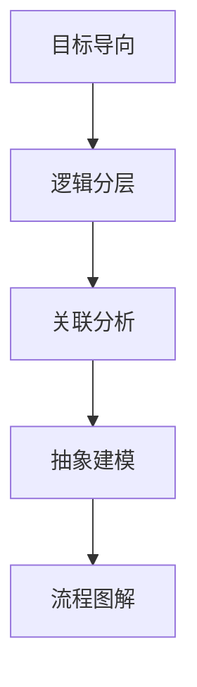

# 结构化思维的力量：从思维到行动

## 1. 背景介绍

### 1.1 问题的由来
在当今快速变化的世界中，我们每天都面临着大量的信息和决策。如何在纷繁复杂的环境中保持清晰的思路，做出正确的判断和行动，成为了一个关键的问题。很多人在工作和生活中感到困惑和迷茫，难以理清头绪，无法有效地解决问题。这其中的一个重要原因，就是缺乏结构化思维的能力。

### 1.2 研究现状
近年来，结构化思维受到了学术界和商业界的广泛关注。哈佛大学、麻省理工学院等著名高校纷纷开设了相关课程，培养学生的逻辑思维和问题解决能力。麦肯锡、波士顿等知名咨询公司也将结构化思维作为面试和培训的重点。一些畅销书如《金字塔原理》《思考，快与慢》等也从不同角度阐述了结构化思维的重要性。然而，目前对于如何系统地培养和运用结构化思维，还缺乏全面深入的研究。

### 1.3 研究意义
结构化思维不仅是一种思维方式，更是一种行动指南。它能够帮助我们梳理复杂的信息，识别关键问题，并提出有效的解决方案。无论是在学习、工作还是生活中，结构化思维都能极大提升我们的效率和决策质量。对个人而言，掌握结构化思维是一项核心竞争力；对组织而言，打造结构化思维的团队文化，能够增强凝聚力和创新力。因此，深入研究结构化思维的内在机理和实践路径，具有重要的理论价值和现实意义。

### 1.4 本文结构
本文将从以下几个方面系统阐述结构化思维：
- 首先，介绍结构化思维的核心概念和要素，厘清其内在逻辑。 
- 其次，提出一套结构化思维的操作化方法和步骤，并通过案例说明其运用。
- 再次，探讨结构化思维背后的数学模型和原理，增强其理论基础。
- 然后，给出结构化思维的代码实现，并详细解读，帮助读者将理论转化为可执行的程序。
- 接着，分析结构化思维在实际工作和生活场景中的应用，展望其未来发展。
- 最后，推荐一些结构化思维的学习资源和工具，方便读者进一步研究实践。

通过本文的学习，读者将对结构化思维有一个全面系统的认识，掌握基本的理论和方法，能够将其灵活运用到实际问题的分析和解决中，从而全面提升思维能力和行动效率。

## 2. 核心概念与联系

结构化思维的核心是将复杂问题分解为一系列相互关联但更容易处理的子问题，并以清晰的逻辑框架组织起来。它包含了以下几个关键概念：

- 目标导向：明确思考的终极目的，聚焦主要矛盾
- 逻辑分层：将问题分解为若干层级，每层内部平行，层级之间递进
- 关联分析：找出各要素之间的因果联系、并列关系、递进关系等
- 抽象建模：提炼问题的本质属性，建立简化但不失偏颇的模型
- 流程图解：用流程图等可视化工具，直观呈现思路和决策过程

这些概念之间环环相扣、相互支撑。以目标为导向，运用逻辑分层将问题条理化，通过关联分析理清要素联系，再抽象为简洁的模型，最后用流程图解进行呈现。这套方法形成了一个有机的整体，为系统思考和科学决策提供了路线图。

## 3. 核心算法原理 & 具体操作步骤

### 3.1 算法原理概述
结构化思维的算法可以概括为"目标树+逻辑树"。首先，通过对目标的层层分解，形成一个倒立的树状结构，根节点是终极目标，中间节点是子目标，叶节点是具体任务。在此基础上，再对每个任务进行逻辑拆分，找出平行并列的逻辑分支，形成一个横向展开的树状结构。两个树状结构相互交织，形成了结构化思维的基本骨架。

### 3.2 算法步骤详解
1. 确定根本目标
   - 问题是什么？
   - 目的是什么？
   - 达成目标的约束条件有哪些？

2. 分解子目标
   - 达成根本目标需要哪些必要条件？
   - 这些必要条件是否相互独立？是否需要进一步分解？
   - 分解出的子目标是否完备，是否与根本目标形成因果链条？

3. 拆解任务
   - 每个子目标需要完成哪些具体任务？
   - 这些任务的先后次序如何？
   - 任务的产出是否可度量、可验收？

4. 逻辑分类
   - 围绕每个任务，有哪些不同的解决思路和方案？
   - 这些思路方案是否相互独立，能否归入不同的逻辑分支？
   - 不同分支之间有没有优先级排序？

5. 关联分析
   - 不同任务之间是否有依赖关系、制约因素？
   - 不同分支之间如何选择组合，才能形成最优解？
   - 各任务的产出如何汇总，以支撑目标达成？

6. 建立模型
   - 能否用一个简洁的模型来描述任务之间的逻辑关系？
   - 模型中的关键变量有哪些？其取值范围如何？
   - 模型能否用数学公式表达？如何优化求解？

7. 生成流程
   - 将目标树和逻辑树整合为一个顺序流程图
   - 每个节点的输入输出是否匹配？
   - 流程图是否呈现了完整的决策过程？

### 3.3 算法优缺点
优点：
- 将看似混沌的问题条理化，使思路清晰、结构缜密
- 分解后的每个节点都可被独立处理，易于分工协作
- 可视化的树状结构和流程图，有利于思维定式的打破
- 定量的数学模型，提供了优化决策的可能

缺点：
- 过度简化问题，可能遗漏重要信息和关键制约因素
- 割裂了要素之间的有机联系，忽视了整体的涌现属性
- 线性的逻辑框架，不适用于动态复杂的开放系统
- 要求使用者具备一定的抽象思维和建模能力

### 3.4 算法应用领域
结构化思维算法可以应用到以下领域：
- 战略规划：如企业发展战略、城市规划等
- 项目管理：如软件开发、工程建设等
- 商业决策：如投资并购、营销策略等
- 问题解决：如技术攻关、流程优化等
- 个人成长：如职业规划、目标管理等

## 4. 数学模型和公式 & 详细讲解 & 举例说明

### 4.1 数学模型构建
我们可以用一个矩阵来表示目标-任务网络。矩阵的行表示目标，列表示任务，元素值表示完成某个任务对实现某个目标的贡献度。假设有m个目标和n个任务，则该矩阵可表示为：

$$
A=
\begin{bmatrix} 
a_{11} & a_{12} & \cdots & a_{1n}\\ 
a_{21} & a_{22} & \cdots & a_{2n}\\
\vdots & \vdots & \ddots & \vdots\\
a_{m1} & a_{m2} & \cdots & a_{mn}
\end{bmatrix}
$$

其中，$a_{ij}$表示完成任务j对实现目标i的贡献度，取值范围为[0,1]。

另一个矩阵表示任务之间的依赖关系。如果任务i依赖于任务j，则矩阵元素$b_{ij}=1$，否则为0。该矩阵是一个n行n列的方阵：

$$
B=
\begin{bmatrix}  
0 & b_{12} & \cdots & b_{1n}\\
b_{21} & 0 & \cdots & b_{2n}\\
\vdots & \vdots & \ddots & \vdots\\
b_{n1} & b_{n2} & \cdots & 0
\end{bmatrix}
$$

最后，我们定义一个n维列向量X，表示对各任务的完成程度，每个元素$x_i$取值范围为[0,1]。

目标是求解向量X，使得在满足任务依赖约束(BX≤X)的条件下，目标实现度$\sum_{i=1}^{m}(\sum_{j=1}^{n}a_{ij}x_j)$最大化。用数学公式表达如下：

$$
\max \sum_{i=1}^{m}(\sum_{j=1}^{n}a_{ij}x_j) \\
s.t. \ BX \leq X \\
0 \leq x_j \leq 1, \ j=1,2,\cdots,n
$$

这实际上是一个线性规划问题，可以用单纯形法等方法求解。

### 4.2 公式推导过程
以上模型的推导过程如下：

1. 定义目标实现度。第i个目标的实现度$y_i$可以表示为：

$$
y_i=\sum_{j=1}^{n}a_{ij}x_j, \ i=1,2,\cdots,m
$$

其中，$a_{ij}$表示任务j对目标i的贡献度，$x_j$表示任务j的完成程度。将m个目标的实现度求和，得到总的目标实现度$y$：

$$
y=\sum_{i=1}^{m}y_i=\sum_{i=1}^{m}(\sum_{j=1}^{n}a_{ij}x_j)
$$

2. 定义任务依赖约束。如果任务i依赖于任务j，则有$x_i \leq x_j$。将所有任务对(i,j)的依赖关系表示为矩阵B，则任务依赖约束可以表示为：

$$
BX \leq X
$$

其中，不等号对向量而言表示逐元素比较。

3. 定义决策变量取值范围。由于$x_j$表示任务完成程度，其取值范围为[0,1]，所以有：

$$
0 \leq x_j \leq 1, \ j=1,2,\cdots,n
$$

4. 定义优化目标。我们希望在满足任务依赖约束的条件下，使总的目标实现度最大化，因此优化目标可以表示为：

$$
\max y=\max \sum_{i=1}^{m}(\sum_{j=1}^{n}a_{ij}x_j)
$$

5. 整合模型。将以上四个部分整合在一起，就得到了完整的数学模型。

### 4.3 案例分析与讲解
下面我们用一个简单的例子来说明该模型的应用。

假设某公司有3个发展目标：
1. 扩大市场份额
2. 提高客户满意度
3. 增加利润

为达成这些目标，公司拟定了5个任务：
1. 加大营销投入
2. 改进产品质量
3. 优化内部流程
4. 开拓新市场
5. 控制成本

经过分析，得到目标-任务贡献度矩阵A为：

$$
A=
\begin{bmatrix}
0.6 & 0.3 & 0 & 0.8 & 0\\
0.2 & 0.7 & 0.4 & 0.1 & 0.3\\
0.4 & 0.2 & 0.6 & 0.3 & 0.8
\end{bmatrix}
$$

任务依赖关系矩阵B为：

$$
B=
\begin{bmatrix}
0 & 0 & 0 & 0 & 0\\
0 & 0 & 1 & 0 & 0\\  
0 & 0 & 0 & 0 & 1\\
0 & 0 & 0 & 0 & 0\\
0 & 0 & 0 & 0 & 0
\end{bmatrix}
$$

代入模型求解，得到最优解向量X为：

$$
X=