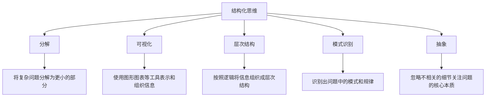
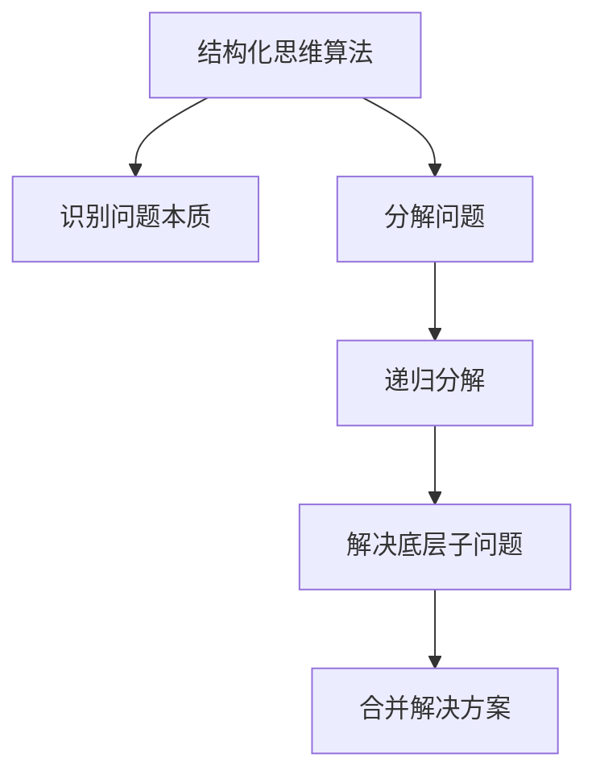

# 结构化思维的应用：从理论到实践

## 1. 背景介绍

### 1.1 问题的由来

在当今快节奏的数字时代，我们每天都面临着大量的信息和任务。如何高效地处理和组织这些信息,并将其转化为行动,已成为一项重要的技能。传统的思维方式往往是线性的、无序的,难以应对复杂的问题。因此,结构化思维(Structured Thinking)应运而生,它提供了一种系统化的方法来分析、组织和解决问题。

### 1.2 研究现状

结构化思维作为一种认知方法,已经在多个领域得到广泛应用,如软件工程、项目管理、决策分析等。许多知名公司和组织,如IBM、谷歌和麻省理工学院,都将结构化思维作为必备技能之一。同时,也有大量的书籍、课程和工具致力于推广和教授结构化思维。

### 1.3 研究意义

掌握结构化思维技能,可以帮助我们更好地理解和解决复杂问题。它不仅提高了思维的清晰性和逻辑性,还能促进团队协作和沟通效率。此外,结构化思维还可以应用于个人生活,帮助我们更好地规划和管理时间。

### 1.4 本文结构

本文将从理论和实践两个层面探讨结构化思维的应用。首先,我们将介绍结构化思维的核心概念和原理,包括思维模型、可视化工具等。然后,我们将详细阐述结构化思维在不同领域的具体应用,如软件开发、项目管理和决策分析。最后,我们将总结结构化思维的未来发展趋势和挑战。

## 2. 核心概念与联系

结构化思维的核心概念包括:

1. **分解(Decomposition)**: 将复杂问题分解为更小、更易管理的部分。
2. **可视化(Visualization)**: 使用图形、图表等可视化工具来表示和组织信息。
3. **层次结构(Hierarchy)**: 按照一定的逻辑将信息组织成层次结构。
4. **模式识别(Pattern Recognition)**: 识别出问题中的模式和规律。
5. **抽象(Abstraction)**: 忽略不相关的细节,关注问题的核心本质。

这些概念相互关联,共同构成了结构化思维的基础框架。例如,我们可以先将问题分解为更小的部分,然后使用可视化工具将它们组织成层次结构,并识别出其中的模式和规律,最后抽象出问题的核心本质。

## 3. 核心算法原理 & 具体操作步骤

### 3.1 算法原理概述

结构化思维的核心算法原理是将复杂问题分解为更小、更易管理的部分,然后按照一定的逻辑将它们组织成层次结构。这个过程可以被视为一种递归算法,即将大问题不断分解为小问题,直到小问题足够简单可以直接解决为止。

算法的基本步骤如下:

1. 识别出问题的核心本质,抽象出问题的关键要素。
2. 将问题分解为更小的子问题。
3. 对每个子问题重复步骤1和2,直到子问题足够简单可以直接解决。
4. 解决最底层的子问题。
5. 按照层次结构,将子问题的解决方案组合起来,得到原始问题的解决方案。

### 3.2 算法步骤详解

1. **识别问题本质**

   在这一步,我们需要抽象出问题的核心本质,忽略不相关的细节。这可以通过提出一系列问题来实现,例如:"这个问题的关键是什么?""我们真正想要解决的是什么?"等。

2. **分解问题**

   将原始问题分解为更小、更易管理的子问题。分解的方式可以是功能分解、对象分解或者过程分解等。分解的粒度取决于问题的复杂程度,直到每个子问题足够简单可以直接解决为止。

3. **递归分解**

   对于每个子问题,重复步骤1和2,将其进一步分解,直到子问题足够简单可以直接解决。这个过程可以被视为一种递归算法。

4. **解决底层子问题**

   解决最底层的子问题,这些子问题足够简单,可以直接使用已知的方法或工具来解决。

5. **合并解决方案**

   按照层次结构,将子问题的解决方案组合起来,得到原始问题的解决方案。这个过程可以被视为一种递归合并。

### 3.3 算法优缺点

**优点**:

- 将复杂问题分解为更易管理的部分,降低了问题的复杂性。
- 层次结构化的组织方式,使得问题更加清晰和有序。
- 可以重用已有的解决方案,提高了效率。
- 适用于各种类型的问题,具有很强的通用性。

**缺点**:

- 分解和组织过程可能会增加一定的开销。
- 对于一些难以分解的问题,效果可能不佳。
- 需要一定的训练和经验,才能熟练掌握这种思维方式。

### 3.4 算法应用领域

结构化思维算法可以应用于多个领域,包括但不限于:

- **软件开发**: 在需求分析、系统设计和代码实现等各个阶段,结构化思维都可以发挥重要作用。
- **项目管理**: 将复杂的项目分解为更小的任务,并按照层次结构进行组织和管理。
- **决策分析**: 通过分解和组织,可以更好地理解决策问题,评估不同方案的优缺点。
- **问题解决**: 结构化思维为解决各种复杂问题提供了有效的方法。
- **学习和教育**: 可以帮助学生更好地理解和掌握知识。

## 4. 数学模型和公式 & 详细讲解 & 举例说明

### 4.1 数学模型构建

为了更好地理解和应用结构化思维算法,我们可以构建一个数学模型。假设一个问题可以表示为一个集合 $P$,其中包含了所有需要解决的子问题。我们的目标是找到一个函数 $f$,可以将 $P$ 分解为更小的子集:

$$P = f(P_1, P_2, \ldots, P_n)$$

其中,每个 $P_i$ 都是 $P$ 的一个子集,并且它们的并集等于 $P$。

我们可以递归地应用这个函数,将子集进一步分解,直到每个子集足够小,可以直接解决。然后,我们可以使用另一个函数 $g$ 来合并这些子问题的解决方案,得到原始问题的解决方案:

$$S = g(s_1, s_2, \ldots, s_n)$$

其中,每个 $s_i$ 是子问题 $P_i$ 的解决方案。

这个数学模型为结构化思维算法提供了一个形式化的描述,有助于我们更好地理解和分析算法的性质和行为。

### 4.2 公式推导过程

我们可以通过一个具体的例子来推导上述公式。假设我们要解决一个软件开发项目,其中包括以下子任务:

- 需求分析 ($P_1$)
- 系统设计 ($P_2$)
- 编码实现 ($P_3$)
- 测试 ($P_4$)
- 部署上线 ($P_5$)

我们可以将整个项目表示为一个集合 $P$,其中包含了所有这些子任务:

$$P = \{P_1, P_2, P_3, P_4, P_5\}$$

我们可以定义一个函数 $f$,将 $P$ 分解为这些子集:

$$P = f(P_1, P_2, P_3, P_4, P_5)$$

对于每个子集,我们可以进一步将其分解为更小的子任务。例如,需求分析可以分解为用户访谈、市场调研等子任务。

最终,我们将得到一系列最小的子任务,可以直接解决。假设它们的解决方案分别为 $s_1, s_2, \ldots, s_n$,我们可以使用函数 $g$ 将它们合并,得到整个项目的解决方案 $S$:

$$S = g(s_1, s_2, \ldots, s_n)$$

通过这个例子,我们可以看到数学模型如何描述结构化思维算法的分解和合并过程。

### 4.3 案例分析与讲解

为了更好地理解结构化思维算法,我们来分析一个具体的案例。假设我们需要设计一个在线购物网站,它包括以下主要功能:

- 用户注册和登录
- 商品浏览和搜索
- 购物车和订单管理
- 支付和物流系统
- 评论和反馈系统

我们可以将整个网站视为一个问题集合 $P$,其中包含了所有这些功能模块。然后,我们可以使用结构化思维算法将其分解为更小的子问题。

1. **识别问题本质**

   在线购物网站的核心本质是为用户提供一个便捷、安全的购物平台,实现商品的展示、交易和配送。

2. **分解问题**

   我们可以按照功能模块将问题分解为以下子问题:

   - 用户系统 ($P_1$): 包括用户注册、登录、个人信息管理等功能。
   - 商品系统 ($P_2$): 包括商品浏览、搜索、详情展示等功能。
   - 订单系统 ($P_3$): 包括购物车管理、下单、支付等功能。
   - 物流系统 ($P_4$): 包括订单跟踪、物流信息查询等功能。
   - 评论系统 ($P_5$): 包括商品评论、反馈等功能。

   因此,我们可以将原始问题表示为:

   $$P = f(P_1, P_2, P_3, P_4, P_5)$$

3. **递归分解**

   对于每个子问题,我们可以进一步将其分解为更小的子任务。例如,用户系统可以分解为注册模块、登录模块、个人中心模块等。

4. **解决底层子问题**

   最终,我们将得到一系列最小的子任务,如实现注册表单、设计数据库表结构等,可以直接使用已知的技术和工具来解决。

5. **合并解决方案**

   解决了所有底层子任务后,我们可以按照层次结构,将它们的解决方案组合起来,得到整个在线购物网站的解决方案。

通过这个案例,我们可以看到结构化思维算法如何将复杂的问题分解为更小、更易管理的部分,并最终得到解决方案。

### 4.4 常见问题解答

1. **如何确定分解的粒度?**

   分解的粒度取决于问题的复杂程度和您的熟练程度。一般来说,您可以先进行粗粒度的分解,然后对每个子问题进行进一步的细化,直到子问题足够简单可以直接解决为止。

2. **如何处理难以分解的问题?**

   对于一些难以分解的问题,您可以尝试从不同的角度来分解,如功能分解、对象分解或过程分解等。另外,您也可以先暂时将难以分解的部分视为一个黑盒子,等到后面再进行细化。

3. **分解和合并过程是否会增加开销?**

   确实,分解和合并过程会增加一定的开销,但是相比于直接解决复杂问题所带来的挫折和低效,这个开销是可以接受的。另