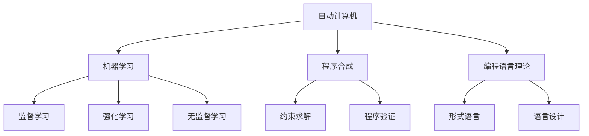
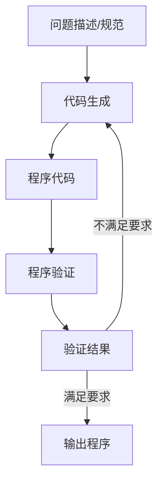

# 自动计算机与编程语言的研究

## 1. 背景介绍

### 1.1 问题的由来

在计算机科学的发展历程中,自动化一直是一个核心目标。从最初的机械计算机到现代电子计算机,我们不断追求更高的运算效率和更强的计算能力。然而,传统的计算机系统仍然需要人工编写程序,这使得开发过程低效且容易出错。因此,如何实现真正的"自动计算机"成为了计算机科学家们孜孜以求的目标。

自动计算机(Automatic Computer)的概念最早可以追溯到20世纪40年代。当时,计算机科学家们设想能够构建一种不需要人工编程的智能计算机系统,它可以自主分析问题、设计算法并生成可执行代码。这种自动化的编程过程将极大提高软件开发的效率,减少人为错误,并使计算机能够解决更加复杂的问题。

### 1.2 研究现状

尽管自动计算机的想法已经存在了几十年,但实现这一目标的道路并不平坦。早期的研究主要集中在人工智能领域,试图通过知识表示、推理和学习等技术来模拟人类的编程过程。然而,由于计算能力和算法的限制,这些尝试并没有取得令人满意的成果。

近年来,随着机器学习、深度学习等技术的飞速发展,自动计算机的研究重新受到关注。研究人员们尝试利用神经网络等模型来自动生成代码,或者通过程序合成等技术自动构建算法。同时,一些新兴的编程范式,如函数式编程、逻辑编程等,也为自动计算机的实现提供了新的思路。

### 1.3 研究意义

自动计算机不仅是计算机科学领域的一个重要目标,也具有广泛的应用前景。如果能够实现真正的自动化编程,将极大提高软件开发的效率,降低成本,并使更多复杂的问题得以解决。此外,自动计算机技术还可以应用于人工智能系统的构建、科学计算、大数据处理等诸多领域,为人类的科技发展做出重要贡献。

### 1.4 本文结构

本文将全面探讨自动计算机与编程语言的研究。我们将首先介绍自动计算机的核心概念和相关技术,包括机器学习、程序合成等。接下来,我们将深入探讨自动计算机的核心算法原理,并详细讲解其具体实现步骤。然后,我们将构建数学模型,推导相关公式,并通过案例分析加深理解。在此基础上,我们将展示一个实际项目的代码实现,并对其进行详细解释。最后,我们将讨论自动计算机的应用场景、发展趋势和面临的挑战。

## 2. 核心概念与联系

自动计算机是一个跨学科的研究领域,它涉及计算机科学、人工智能、编程语言理论等多个领域的知识。在探讨自动计算机的核心概念之前,我们需要先了解一些相关的基础概念。

### 2.1 机器学习

机器学习是实现自动计算机的一种重要方法。通过训练神经网络或其他机器学习模型,我们可以让计算机自动学习编程知识,并生成相应的代码。根据学习方式的不同,机器学习可以分为监督学习、强化学习和无监督学习三种类型。

1. **监督学习**:通过提供大量的输入-输出示例对,训练模型学习它们之间的映射关系。在自动编程中,我们可以使用源代码-目标程序的数据对来训练模型,使其能够生成符合预期的代码。

2. **强化学习**:通过与环境交互并获得奖惩反馈,训练模型学习最优策略。在自动编程中,我们可以将代码生成过程建模为一个序列决策问题,并通过强化学习算法来优化代码生成策略。

3. **无监督学习**:从未标记的数据中发现内在模式和结构。在自动编程中,我们可以使用无监督学习技术来发现代码中的模式和规律,从而提高代码生成的质量。

### 2.2 程序合成

程序合成是另一种实现自动计算机的重要方法。它通过形式化的方法,根据给定的约束条件和规范,自动构建满足要求的程序。程序合成技术主要包括以下两个方面:

1. **约束求解**:将程序合成问题建模为一个约束满足问题,并使用约束求解算法来寻找满足所有约束的程序。

2. **程序验证**:通过形式化的方法验证生成的程序是否满足给定的规范,从而保证程序的正确性。

### 2.3 编程语言理论

编程语言理论为自动计算机提供了理论基础。它研究编程语言的语法、语义和设计原则,为自动生成和理解程序奠定了基础。

1. **形式语言**:用于描述编程语言语法的数学模型,如正则语言、上下文无关语言等。自动计算机需要基于形式语言来生成符合语法规则的代码。

2. **语言设计**:研究编程语言的设计原则和范式,如命令式编程、函数式编程、逻辑编程等。不同的编程范式对应不同的代码生成方式,需要在语言设计层面加以考虑。

通过将机器学习、程序合成和编程语言理论等技术相结合,我们可以构建出更加智能、高效的自动计算机系统。

## 3. 核心算法原理 & 具体操作步骤

### 3.1 算法原理概述

自动计算机的核心算法原理主要包括两个方面:代码生成和程序验证。

1. **代码生成**:根据给定的问题描述或规范,自动生成满足要求的计算机程序代码。这可以通过机器学习或程序合成等技术来实现。

2. **程序验证**:验证生成的程序代码是否满足预期的功能和性能要求。这需要使用形式化的方法对程序进行静态分析和动态测试。

上图展示了自动计算机的基本工作流程。首先,根据给定的问题描述或规范,使用代码生成算法生成初始的程序代码。然后,使用程序验证算法对生成的代码进行验证,检查它是否满足预期的功能和性能要求。如果验证通过,则输出该程序;否则,将验证结果反馈给代码生成算法,进行下一轮迭代。这个过程将重复进行,直到生成满足要求的程序为止。

### 3.2 算法步骤详解

#### 3.2.1 代码生成算法

代码生成算法的主要步骤如下:

1. **问题表示**:将给定的问题描述或规范转换为机器可理解的形式,如自然语言处理后的语义表示、形式逻辑表示等。

2. **代码空间搜索**:在所有可能的程序代码空间中搜索满足问题要求的候选程序。这可以通过启发式搜索、随机搜索、机器学习等方法实现。

3. **代码生成**:根据搜索结果,生成相应的程序代码。如果使用机器学习方法,则需要训练一个神经网络模型来生成代码;如果使用程序合成方法,则需要构建约束求解器来生成满足约束的程序。

4. **代码优化**:对生成的程序代码进行优化,提高其性能和可读性。这可以通过代码重构、优化编译等技术实现。

5. **输出代码**:将优化后的程序代码输出,作为代码生成算法的最终结果。

#### 3.2.2 程序验证算法

程序验证算法的主要步骤如下:

1. **形式化规范**:将问题的功能和性能要求转换为形式化的规范,如先决条件、后置条件、不变量等。

2. **静态分析**:对生成的程序代码进行静态分析,检查它是否满足形式化规范。这可以使用形式化验证、型系统检查、抽象解释等技术实现。

3. **动态测试**:对程序进行动态测试,检查它在各种输入情况下是否能正确执行并产生预期的输出。这可以使用单元测试、集成测试、性能测试等方法。

4. **验证结果评估**:综合静态分析和动态测试的结果,评估程序是否满足全部要求。如果满足,则输出该程序;否则,将验证结果反馈给代码生成算法,进行下一轮迭代。

### 3.3 算法优缺点

自动计算机算法具有以下优点:

1. **高效**:可以自动生成程序代码,大大提高了软件开发的效率。
2. **准确**:通过形式化的方法验证程序的正确性,减少了人为错误。
3. **可扩展**:算法可以应用于不同领域的问题,具有良好的通用性。

同时,自动计算机算法也存在一些缺点和挑战:

1. **问题复杂性**:对于一些复杂的问题,代码生成和程序验证的难度会大大增加。
2. **知识获取**:需要获取大量的编程知识和示例数据,以支持算法的训练和优化。
3. **可解释性**:生成的程序代码可能缺乏可读性和可解释性,难以人工理解和维护。

### 3.4 算法应用领域

自动计算机算法可以应用于多个领域,包括但不限于:

1. **软件开发**:自动生成应用程序、系统软件、嵌入式软件等各种类型的代码。
2. **人工智能**:生成智能系统的控制算法和决策逻辑。
3. **科学计算**:自动生成用于科学模拟和数值计算的程序。
4. **编译器构建**:自动生成编程语言的编译器和解释器。
5. **自动驾驶**:生成自动驾驶系统的决策和控制算法。
6. **机器人控制**:生成机器人运动规划和任务执行的程序。

总的来说,自动计算机算法为各个领域的软件开发提供了一种全新的范式,有望极大提高生产效率,推动科技的发展。

## 4. 数学模型和公式 & 详细讲解 & 举例说明

### 4.1 数学模型构建

为了更好地理解和优化自动计算机算法,我们需要构建相应的数学模型。在这里,我们将代码生成问题建模为一个序列生成问题,使用基于神经网络的机器学习模型来解决。

假设我们有一个问题描述 $X$,目标是生成一个满足要求的程序 $Y$。我们可以将 $Y$ 表示为一个长度为 $T$ 的标记序列 $\{y_1, y_2, \dots, y_T\}$,其中每个标记 $y_t$ 来自于一个预定义的词汇表 $\mathcal{V}$。

我们的目标是学习一个条件概率模型 $P(Y|X)$,能够根据给定的问题描述 $X$ 生成满足要求的程序序列 $Y$。具体来说,我们希望最大化生成序列 $Y$ 的条件对数似然:

$$\max_{\theta} \sum_{(X, Y) \in \mathcal{D}} \log P_{\theta}(Y|X)$$

其中 $\mathcal{D}$ 是训练数据集,包含了问题描述和对应的程序序列对 $(X, Y)$;$\theta$ 是模型参数。

为了对条件概率 $P(Y|X)$ 进行建模,我们可以使用基于序列的神经网络模型,如循环神经网络(RNN)或transformer等。这些模