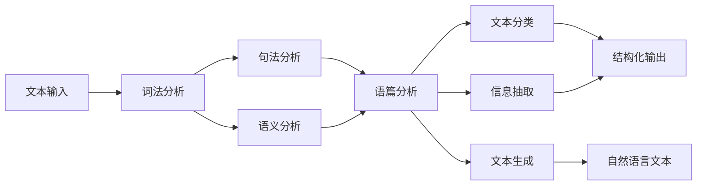

# 自然语言处理(Natural Language Processing) - 原理与代码实例讲解

## 1. 背景介绍
### 1.1 问题的由来
自然语言处理(Natural Language Processing, NLP)是人工智能(Artificial Intelligence, AI)领域中一个非常重要且充满挑战的分支。它旨在让计算机能够理解、生成和处理人类语言,使人机交互更加自然、高效。随着互联网时代的到来,海量的文本数据如雨后春笋般涌现,如何从这些非结构化的文本数据中挖掘出有价值的信息,成为了NLP技术需要解决的核心问题之一。

### 1.2 研究现状 
经过几十年的发展,NLP已经取得了长足的进步。传统的NLP技术主要基于规则、统计等方法,如词袋模型、条件随机场等。近年来,随着深度学习的兴起,大量基于神经网络的NLP模型不断涌现,如循环神经网络(RNN)、长短期记忆网络(LSTM)、注意力机制(Attention)、Transformer等,极大地提升了NLP任务的性能,如机器翻译、情感分析、问答系统、文本摘要等。同时,预训练语言模型如BERT、GPT等的出现,让NLP模型具备了更强大的语言理解和生成能力。

### 1.3 研究意义
NLP技术在现实生活中有着广泛的应用,如智能客服、语音助手、舆情监测、知识图谱等,极大地方便了人们的生活。深入研究NLP的原理和实现,对于推动人工智能的发展,实现人机交互的新突破具有重要意义。同时,对NLP核心算法的理解和实践,也能够帮助我们从海量文本数据中快速准确地挖掘出有价值的信息,为各行各业的智能化发展提供有力支撑。

### 1.4 本文结构
本文将从以下几个方面对NLP的原理和代码实例进行系统讲解:

1. 介绍NLP的核心概念与各概念之间的联系
2. 剖析NLP的核心算法原理,并给出详细的操作步骤
3. 建立NLP任务的数学模型,推导相关公式,并举例说明
4. 给出NLP项目的代码实例,并进行详细的解释说明
5. 探讨NLP技术在实际场景中的应用 
6. 推荐NLP领域常用的工具和学习资源
7. 总结NLP技术的发展趋势和面临的挑战
8. 归纳NLP研究中的常见问题,并给出解答

## 2. 核心概念与联系

在NLP领域中,有几个核心概念需要掌握:

- 词法分析(Lexical Analysis):将文本切分成一个个词汇单元(token)的过程。英文中以空格为分隔,中文需要专门的分词算法。
- 句法分析(Syntactic Analysis):分析句子的语法结构,如主语、谓语、宾语等成分。常见的句法分析任务有成分句法分析和依存句法分析。  
- 语义分析(Semantic Analysis):分析文本的含义,包括词汇语义和句子语义。词义消歧、指代消解都属于语义分析任务。
- 语篇分析(Discourse Analysis):分析语篇的结构和篇章关系,如照应关系、连贯关系等。
- 文本分类(Text Classification):将文本划分到预先定义的类别中,如垃圾邮件识别、情感分析等。
- 信息抽取(Information Extraction):从文本中抽取结构化信息,如命名实体识别、关系抽取等。
- 文本生成(Text Generation):根据给定的主题或上下文,生成自然流畅的文本,如机器写作、对话生成等。

这些概念之间并非孤立存在,而是相互关联、层层递进的。词法分析是NLP任务的基础,句法和语义分析是理解文本语义的关键,语篇分析进一步揭示了篇章结构。文本分类、信息抽取、文本生成等任务都需要综合利用词法、句法、语义等多个层面的分析结果。下图展示了NLP核心概念之间的联系:



## 3. 核心算法原理 & 具体操作步骤
### 3.1 算法原理概述
NLP领域的算法原理主要包括:

- 基于规则的方法:利用人工定义的规则对文本进行分析,如正则表达式、语法规则等。
- 基于统计的方法:利用大规模语料库训练统计模型,如隐马尔可夫模型、条件随机场等。
- 基于深度学习的方法:利用神经网络从语料中自动学习文本特征,如RNN、CNN、Transformer等。

### 3.2 算法步骤详解
以基于统计的分词算法为例,详细介绍算法步骤:

1. 语料预处理:对原始语料进行清洗,去除噪声数据,统一格式。
2. 标注训练语料:人工标注语料中每个词的边界,作为训练数据。
3. 特征提取:提取词汇、词性、上下文等特征,转化为特征向量。
4. 模型训练:使用条件随机场(CRF)等模型,估计模型参数。CRF通过最大化标注序列的条件概率来预测。
5. 模型评估:在测试集上评估模型的精确率、召回率、F1值等指标。
6. 模型应用:使用训练好的模型对新文本进行分词。

### 3.3 算法优缺点
基于统计的分词算法的优点是:

- 可以自动学习词汇特征,不需要手工构建复杂的规则。
- 在大规模语料上训练,可以获得不错的分词效果。

缺点是:

- 需要大量标注数据,人工成本高。
- 对于一些歧义词和未登录词,分词效果不够理想。

### 3.4 算法应用领域
分词算法是NLP任务的基础,在搜索引擎、信息抽取、文本分类等领域都有广泛应用。

## 4. 数学模型和公式 & 详细讲解 & 举例说明
### 4.1 数学模型构建
以条件随机场(CRF)分词模型为例,说明如何构建数学模型。

设句子 $X=(x_1,x_2,...,x_n)$,标注序列 $Y=(y_1,y_2,...,y_n)$,其中 $y_i \in \{B,M,E,S\}$ 表示每个字的标注。CRF模型定义为:

$$P(Y|X)=\frac{1}{Z(X)} \exp \left(\sum_{i=1}^n \sum_{k=1}^K w_k f_k(y_{i-1}, y_i, X, i)\right)$$

其中 $Z(X)$ 为归一化因子,  $f_k$ 为特征函数, $w_k$ 为特征权重。

### 4.2 公式推导过程
CRF的目标是最大化标注序列的条件概率,即:

$$\hat{Y} = \arg\max_{Y} P(Y|X)$$

使用最大似然估计,求解特征权重 $w_k$:

$$L(w) = \sum_{i=1}^N \log P(Y^{(i)}|X^{(i)})$$

$$w^* = \arg\max_{w} L(w)$$

其中 $N$ 为训练样本数。使用梯度下降法等优化算法求解。

### 4.3 案例分析与讲解
以句子"我爱自然语言处理"为例,说明CRF分词的过程。

1. 初始化:
   $$X=(我,爱,自,然,语,言,处,理)$$
   $$Y=(S,S,B,M,M,E,B,E)$$

2. 提取特征:
   - 字特征:我,爱,自,然,语,言,处,理
   - 词性特征:r,v,b,n,n,n,v,v
   - 上下文特征:我,爱,自,然,语,言,处

3. 模型预测:使用训练好的CRF模型,计算标注序列的条件概率,选择概率最大的序列作为输出。

4. 输出结果:
   $$Y^*=(S,S,B,M,M,E,B,E)$$
   分词结果:"我/爱/自然语言/处理"

### 4.4 常见问题解答
- 问:CRF分词的特征怎么选择?
  答:常用的特征有字特征、词性特征、上下文特征等。可以根据任务和语料的特点,选择合适的特征组合。一般来说,特征越丰富,分词效果越好,但也要注意特征的稀疏性。

- 问:CRF分词的训练复杂度如何?  
  答:CRF训练的时间复杂度为 $O(KN)$,其中 $K$ 为特征数, $N$ 为训练样本数。当 $K$ 和 $N$ 较大时,训练时间会比较长。可以使用一些优化算法如L-BFGS等加速训练。

## 5. 项目实践：代码实例和详细解释说明
### 5.1 开发环境搭建
使用Python作为开发语言,安装必要的NLP库:

```bash
pip install jieba
pip install nltk
pip install gensim
```

### 5.2 源代码详细实现
以利用jieba库实现中文分词为例:

```python
import jieba

text = "自然语言处理是人工智能的一个重要分支"

# 全模式分词
words1 = jieba.cut(text, cut_all=True)
print("【全模式】:", "/ ".join(words1))

# 精确模式分词
words2 = jieba.cut(text, cut_all=False)
print("【精确模式】:", "/ ".join(words2))

# 搜索引擎模式分词
words3 = jieba.cut_for_search(text) 
print("【搜索引擎模式】:", "/ ".join(words3))
```

### 5.3 代码解读与分析
- `jieba.cut(text, cut_all=True)`:使用全模式对文本进行分词,获得尽可能多的词候选。
- `jieba.cut(text, cut_all=False)`:使用精确模式对文本进行分词,获得更精确的分词结果。
- `jieba.cut_for_search(text)`:使用搜索引擎模式对文本进行分词,获得适合搜索引擎索引的分词结果。

jieba采用前缀词典实现高效分词,同时使用了动态规划算法查找最大概率路径,找出最大切分组合。

### 5.4 运行结果展示
运行上述代码,得到以下结果:

```
【全模式】: 自然/ 语言/ 自然语言/ 处理/ 是/ 人工/ 智能/ 人工智能/ 的/ 一个/ 重要/ 分支
【精确模式】: 自然语言/ 处理/ 是/ 人工智能/ 的/ 一个/ 重要/ 分支
【搜索引擎模式】: 自然/ 语言/ 自然语言/ 处理/ 是/ 人工/ 智能/ 人工智能/ 的/ 一个/ 重要/ 分支
```

可以看出,全模式获得了最多的候选词,精确模式获得了最准确的分词结果,搜索引擎模式兼顾了召回率和精确率。

## 6. 实际应用场景
NLP技术在现实生活中有着广泛的应用,主要包括:

- 智能客服:通过文本语义理解和对话生成技术,实现人机对话,自动解答用户问题。
- 舆情监测:通过文本分类和情感分析技术,对网络舆情进行监测和预警。
- 知识图谱:通过命名实体识别和关系抽取技术,从文本中抽取结构化知识,构建知识图谱。
- 机器翻译:通过编码-解码框架和注意力机制,实现多语言之间的自动翻译。
- 文本摘要:通过文本语义表示和关键句提取,自动生成文本摘要。

### 6.4 未来应用展望
随着NLP技术的不断发展,未来有望在更多领域得到应用,如医疗、法律、教育等。同时,NLP与其他AI技术的结合,如计算机视觉、语音识别等,将催生更多智能化应用,如多模态问答、视频描述、