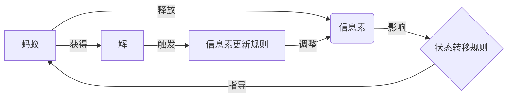

# 蚁群算法(Ant Colony Optimization) - 原理与代码实例讲解

关键词：蚁群算法、启发式优化、元启发式算法、组合优化、TSP问题

## 1. 背景介绍 
### 1.1 问题的由来
在现实生活中,我们经常会遇到一些复杂的组合优化问题,如旅行商问题(TSP)、车间调度问题、网络路由问题等。这些问题通常很难找到最优解,因为解空间随着问题规模呈指数级增长。传统的精确算法(如动态规划、分支定界等)难以在可接受的时间内求解大规模问题的最优解。因此,人们开始寻求一些启发式的优化算法。

### 1.2 研究现状
蚁群算法(Ant Colony Optimization, ACO)是一种基于群体智能的元启发式优化算法,由意大利学者 Marco Dorigo 等人于20世纪90年代初提出。它从蚂蚁觅食的行为中获得启发,通过模拟蚂蚁群体的集体协作行为来求解组合优化问题。经过20多年的发展,蚁群算法已经成为求解组合优化问题的重要方法之一,在TSP、车间调度、网络路由等问题上取得了很好的效果。

### 1.3 研究意义  
蚁群算法作为一种新型的智能优化算法,具有并行性好、适应性强、鲁棒性高等特点。深入研究蚁群算法的基本原理和关键技术,对于拓展其应用领域、提高算法性能具有重要意义。同时,蚁群算法与其他智能优化算法的融合也是一个富有挑战和前景的研究方向。

### 1.4 本文结构
本文将从以下几个方面对蚁群算法进行详细阐述：第2部分介绍蚁群算法的核心概念与联系;第3部分讲解蚁群算法的基本原理和具体操作步骤;第4部分给出蚁群算法的数学模型和公式推导过程;第5部分通过代码实例和注释说明蚁群算法的具体实现;第6部分讨论蚁群算法的实际应用场景;第7部分推荐一些蚁群算法的学习资源和开发工具;第8部分总结全文,展望蚁群算法的未来发展趋势和挑战;第9部分列出一些常见问题解答。

## 2. 核心概念与联系
蚁群算法中有几个核心概念：
- 蚂蚁(Ant):算法中的个体,代表问题的一个潜在解。
- 信息素(Pheromone):蚂蚁在运动过程中释放在路径上的化学物质,指导后续蚂蚁的搜索方向。信息素浓度越高,则路径被选择的概率越大。
- 状态转移规则(State Transition Rule):蚂蚁根据信息素和启发式信息选择下一步移动方向的规则。
- 信息素更新规则(Pheromone Update Rule):在一次迭代完成后,根据蚂蚁的解更新路径上的信息素浓度。

这些概念间的关系可以用下图表示:

## 3. 核心算法原理 & 具体操作步骤
### 3.1 算法原理概述
蚁群算法的基本思想是:通过模拟蚂蚁群体觅食的行为,利用蚂蚁之间通过信息素进行间接通信的机制,让整个蚁群协作搜索问题的解空间,最终收敛于优质解。

算法流程可以概括为:
1. 初始化参数,随机放置蚂蚁 
2. 迭代执行以下步骤直到达到停止条件:
   - 构建解:每只蚂蚁根据状态转移规则构建一个完整的解
   - 更新信息素:根据本次迭代获得的解更新路径上的信息素
3. 输出最优解

### 3.2 算法步骤详解

1. 初始化
   - 设置算法参数:蚂蚁数量 $m$、信息素重要程度因子 $\alpha$、启发式信息重要程度因子 $\beta$、信息素挥发系数 $\rho$、最大迭代次数 $N_{max}$ 等
   - 初始化路径上的信息素浓度 $\tau_{ij}$,通常取一个较小的正值 $\tau_0$
   - 随机产生 $m$ 只蚂蚁,放置在不同的起点城市

2. 迭代搜索
   
   对于每一代(迭代),执行以下步骤:

   (1) 构建解
      - 对于每只蚂蚁 $k (k=1,2,...,m)$,从当前城市 $i$ 开始,按照状态转移规则选择下一个城市 $j$,直到走完所有城市,构建一个完整的解(路径)。
      - 状态转移规则:蚂蚁 $k$ 在城市 $i$ 选择城市 $j$ 的概率为

        $p_{ij}^k(t)=\begin{cases}
        \frac{[\tau_{ij}(t)]^\alpha \cdot [\eta_{ij}]^\beta}{\sum_{u\in J_i^k}[\tau_{iu}(t)]^\alpha \cdot [\eta_{iu}]^\beta} & \text{if } j \in J_i^k \\
        0 & \text{otherwise}
        \end{cases}$

        其中,$J_i^k$ 是蚂蚁 $k$ 在城市 $i$ 时还未访问的城市集合;$\tau_{ij}(t)$ 是 $t$ 时刻边$(i,j)$上的信息素浓度;$\eta_{ij}$ 是边 $(i,j)$ 的启发式信息,通常取距离的倒数。

   (2) 更新信息素
      - 计算每只蚂蚁构建的路径长度 $L_k(k=1,2,...,m)$,取其中最短路径 $L_{best}$
      - 更新路径$(i,j)$上的信息素:

        $\tau_{ij}(t+1) = (1-\rho) \cdot \tau_{ij}(t) + \sum_{k=1}^m \Delta\tau_{ij}^k$

        $\Delta\tau_{ij}^k=\begin{cases}
        \frac{Q}{L_k} & \text{if ant } k \text{ pass edge } (i,j) \\
        0 & \text{otherwise}
        \end{cases}$

        其中,$\rho \in (0,1)$ 为信息素挥发系数;$Q$ 为信息素增加强度系数。

3. 输出结果
   - 迭代达到最大次数 $N_{max}$ 后,输出找到的最优解 $L_{best}$

### 3.3 算法优缺点
蚁群算法的主要优点有:
- 具有较强的鲁棒性,能够适应问题的动态变化
- 易于与其他启发式算法结合,形成更高效的混合算法  
- 容易并行化实现,可以显著加快求解速度

蚁群算法的缺点包括:  
- 算法收敛速度相对较慢,容易早熟收敛
- 对参数设置比较敏感,参数选择需要一定经验
- 缺乏理论分析,难以严格证明其收敛性

### 3.4 算法应用领域
蚁群算法可以求解多种组合优化问题,主要应用领域有:
- 旅行商问题(TSP)及其变种
- 车间调度问题,如作业车间调度、流水车间调度等
- 网络路由问题,如数据包路由、移动代理路由等
- 二次分配问题(QAP)
- 图着色问题、集合覆盖问题等

此外,蚁群算法还可以用于连续函数优化、数据聚类、模式识别等领域。

## 4. 数学模型和公式 & 详细讲解 & 举例说明
### 4.1 数学模型构建
以TSP问题为例,假设有 $n$ 个城市,城市 $i$ 和城市 $j$ 之间的距离为 $d_{ij}(i,j=1,2,...,n)$。设蚂蚁从城市 $i$ 移动到城市 $j$ 的概率为 $p_{ij}^k(t)$,则状态转移规则可以表示为:

$$p_{ij}^k(t)=\begin{cases}
\frac{[\tau_{ij}(t)]^\alpha \cdot [\eta_{ij}]^\beta}{\sum_{u\in J_i^k}[\tau_{iu}(t)]^\alpha \cdot [\eta_{iu}]^\beta} & \text{if } j \in J_i^k \\
0 & \text{otherwise}
\end{cases}$$

其中,$\tau_{ij}(t)$ 是 $t$ 时刻边 $(i,j)$ 上的信息素浓度,$\eta_{ij}$ 是边 $(i,j)$ 的启发式信息,通常取距离的倒数,即 $\eta_{ij}=1/d_{ij}$。$\alpha$ 和 $\beta$ 分别是信息素重要程度因子和启发式信息重要程度因子。

另一个关键公式是信息素更新规则:

$$\tau_{ij}(t+1) = (1-\rho) \cdot \tau_{ij}(t) + \sum_{k=1}^m \Delta\tau_{ij}^k$$

$$\Delta\tau_{ij}^k=\begin{cases}
\frac{Q}{L_k} & \text{if ant } k \text{ pass edge } (i,j) \\
0 & \text{otherwise}
\end{cases}$$

其中,$\rho \in (0,1)$ 为信息素挥发系数;$Q$ 为信息素增加强度系数;$L_k$ 是蚂蚁 $k$ 在本次迭代中构建的路径长度。

### 4.2 公式推导过程
状态转移概率 $p_{ij}^k(t)$ 的公式可以这样推导:

蚂蚁在选择下一步移动到哪个城市时,主要依据两个因素:
1. 边 $(i,j)$ 上的信息素浓度 $\tau_{ij}(t)$,浓度越高,则选择该边的概率越大。
2. 边 $(i,j)$ 的启发式信息 $\eta_{ij}$,通常与距离 $d_{ij}$ 成反比,距离越短,则选择该边的概率越大。

假设这两个因素对蚂蚁选择下一步的影响是独立的,则状态转移概率正比于它们的加权乘积:

$$p_{ij}^k(t) \propto [\tau_{ij}(t)]^\alpha \cdot [\eta_{ij}]^\beta$$

再考虑到概率之和为1的约束,就得到了状态转移概率的完整表达式。

信息素更新公式的推导思路是:
1. 信息素随时间会挥发,故每条边上的信息素浓度要乘以 $(1-\rho)$。
2. 每只蚂蚁完成一个解后,会在其经过的边上释放一定量的信息素 $\Delta\tau_{ij}^k$。所有蚂蚁释放的信息素累加起来,就得到了信息素增量。

### 4.3 案例分析与讲解
下面以一个简单的TSP问题说明蚁群算法的计算过程。

假设有4个城市,城市坐标如下:

|城市|1|2|3|4|
|---|---|---|---|---|
|x|0|4|4|0|
|y|0|0|4|4|

距离矩阵为:

$$D=\begin{bmatrix} 
0 & 4 & 5.66 & 4\\ 
4 & 0 & 4 & 5.66\\
5.66 & 4 & 0 & 4\\
4 & 5.66 & 4 & 0
\end{bmatrix}$$

取参数设置为:$m=4, \alpha=1, \beta=5, \rho=0.1, Q=10, \tau_0=1, N_{max}=100$。

在第1代,4只蚂蚁分别从4个城市出发,假设它们构建的路径为:

|蚂蚁|路径|长度|
|---|---|---|
|1|1->2->4->3->1|18.32|
|2|2->3->1->4->2|18.32|
|3|3->2->4->1->3|17.32|
|4|4->1->3->2->4|18.32|

则第1代结束后,各边上的信息素浓度更新