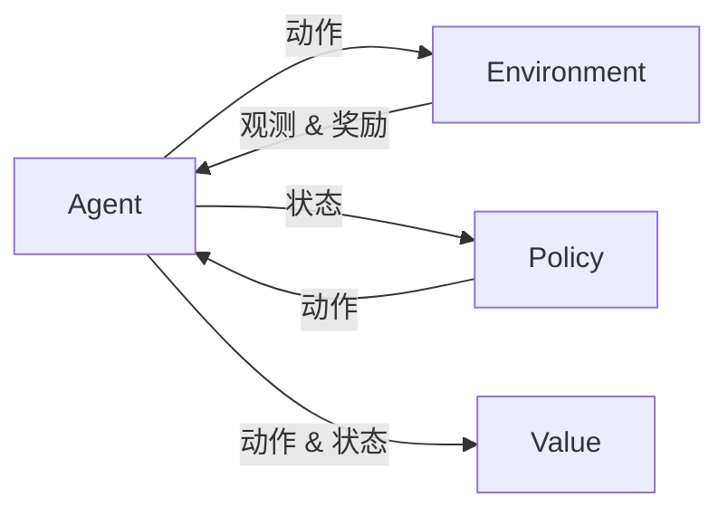

# 行动 (Action)

## 1. 背景介绍

### 1.1 问题的由来
在人工智能和机器人领域,如何使智能体具备自主行动的能力一直是研究的重点和难点。传统的控制方法大多基于预先设定好的规则,难以应对复杂多变的真实环境。近年来,强化学习等方法为解决这一问题提供了新的思路。

### 1.2 研究现状 
目前在行动决策领域,主流的方法包括基于规则的方法、基于搜索的方法和基于学习的方法。基于规则的方法通过预先定义行动策略,容易实现但灵活性差。基于搜索的方法如 MCTS,通过在决策树上进行采样搜索选择最优动作,但面对连续动作空间时搜索效率低下。基于学习的方法通过从经验中学习行动策略,其中尤以深度强化学习方法备受关注,代表算法包括 DQN、DDPG、PPO 等。

### 1.3 研究意义
研究智能体的行动决策问题,有助于我们构建更加智能、自主的机器人和软件智能体,在工业、服务、娱乐等诸多领域都有广阔的应用前景。同时对于认知科学和心理学,探索机器如何进行决策也有重要启示意义。

### 1.4 本文结构
本文将首先介绍行动决策中的一些核心概念,然后重点介绍基于强化学习的行动决策方法,给出算法原理、数学模型、代码实践的详细讲解。最后讨论其应用场景、发展趋势与面临的挑战。

## 2. 核心概念与联系

在行动决策领域,有几个核心概念:
- 智能体(Agent):自主进行决策和行动的主体,可以是机器人、软件程序等。
- 环境(Environment):智能体所处的环境,提供观测信息,接收智能体的动作,返回下一步观测和奖励。
- 状态(State):对环境的描述,反映了环境的特征信息。
- 动作(Action):智能体对环境施加的影响,如机器人的运动控制指令等。
- 策略(Policy):根据当前状态选择动作的映射函数,即行动决策的依据。
- 奖励(Reward):环境对智能体动作的即时反馈,引导智能体学习优化策略。
- 价值(Value):对未来累积奖励的预期,反映了某状态或动作的长期价值。

它们的关系可以用下图表示:



智能体根据环境观测得到状态,再由策略产生动作施加于环境,环境返回新的观测和奖励,同时智能体评估状态-动作的价值,通过优化价值函数来改进策略,最终使智能体的行动决策更加智能高效。

## 3. 核心算法原理 & 具体操作步骤

### 3.1 算法原理概述
强化学习是一种重要的行动决策算法范式,其核心思想是通过试错与环境互动,根据反馈的奖励信号来学习最优策略。常见的强化学习算法包括值迭代、策略梯度、演员-评论家等。以 DQN 算法为例,它使用深度神经网络来逼近动作-价值函数 Q(s,a),评估在某状态s下采取动作a的长期价值,并据此选择价值最高的动作。

### 3.2 算法步骤详解
以下是 DQN 算法的具体步骤:
1. 随机初始化动作-价值函数网络 Q 的参数θ
2. 初始化经验回放池 D
3. for episode = 1 to M do
4.    初始化初始状态 s_1
5.    for t = 1 to T do
6.        根据ϵ-贪婪策略,以概率ϵ随机选择动作 a_t,否则选择 a_t=argmax_a Q(s_t,a;θ)
7.        执行动作 a_t,观测奖励 r_t 和下一状态 s_{t+1}
8.        将转移样本(s_t,a_t,r_t,s_{t+1})存入 D
9.        从 D 中随机采样小批量转移样本(s_j,a_j,r_j,s_{j+1})
10.       计算目标值 y_j=r_j, 若 s_{j+1} 为终止状态, 否则 y_j=r_j+γ max_a' Q(s_{j+1},a';θ)
11.       最小化损失: L(θ)=E[(y_j - Q(s_j,a_j;θ))^2]
12.       每 C 步将 Q 的参数θ更新到目标网络的参数θ^-
13.   end for
14. end for

其关键在于使用目标网络和经验回放,来稳定训练,提高样本利用效率。

### 3.3 算法优缺点
DQN 的优点是端到端学习最优策略,不需要预先设定规则,可以处理高维观测输入。缺点是需要大量的环境互动数据,对奖励函数设计敏感,不适合连续动作空间。后续的一些算法如 DDPG 和 SAC 针对这些问题进行了改进。

### 3.4 算法应用领域  
强化学习在机器人控制、自动驾驶、游戏 AI、推荐系统等领域得到了广泛应用。如 DeepMind 的 DQN 在 Atari 游戏中达到超人表现,OpenAI 的 PPO 算法实现了机械臂的灵巧控制,谷歌的 AlphaGo 击败了顶尖围棋选手。

## 4. 数学模型和公式 & 详细讲解 & 举例说明

### 4.1 数学模型构建
强化学习可以用马尔科夫决策过程 MDP 来建模,一个 MDP 由状态空间 S、动作空间 A、转移概率 P、奖励函数 R 和折扣因子γ组成。在强化学习中,转移概率 P 和奖励函数 R 通常是未知的,需要通过与环境的交互来学习策略π:S→A,使得期望累积奖励最大化:
$$J(π) = E_{π}[\sum_{t=0}^{∞} γ^t r_t]$$

为了评估某状态 s 执行策略π的价值,定义状态价值函数:
$$V^{π}(s)=E_{π}[\sum_{k=0}^{∞}γ^k r_{t+k} |s_t=s]$$

为了评估在某状态 s 下采取动作 a 再执行策略π的价值,定义动作价值函数:
$$Q^{π}(s,a)=E_{π}[\sum_{k=0}^{∞}γ^k r_{t+k} |s_t=s,a_t=a]$$

它们满足贝尔曼方程:
$$V^{π}(s)=\sum_a π(a|s)Q^{π}(s,a)$$
$$Q^{π}(s,a)=R(s,a)+γ\sum_{s'}P(s'|s,a)V^{π}(s')$$

最优价值函数定义为:
$$V^*(s)=\max_{π} V^{π}(s)$$
$$Q^*(s,a)=\max_{π} Q^{π}(s,a)$$

因此最优策略可以通过贪婪地选择使最优 Q 值最大的动作得到:
$$π^*(s)=\arg\max_a Q^*(s,a)$$

### 4.2 公式推导过程
以 Q-learning 算法为例,我们希望学习逼近最优动作价值函数 Q^*(s,a),可以采用时序差分的思想,根据贝尔曼最优方程构建损失函数:
$$L(θ)=E[(r+γ\max_{a'}Q(s',a';θ^-)-Q(s,a;θ))^2]$$

其中θ为 Q 函数的参数,θ^-为目标网络的参数。然后通过随机梯度下降算法对参数θ进行优化:
$$θ←θ-α\nabla_θ L(θ)$$

其中α为学习率。在实际应用中,为了稳定训练,通常使用双 Q 网络,即维护两个 Q 网络 Q_1 和 Q_2,分别用于动作选择和目标值计算,并定期同步它们的参数。

### 4.3 案例分析与讲解
下面以一个简单的迷宫游戏为例来说明强化学习的过程。假设智能体处在一个 3x3 的网格迷宫环境中,状态空间为 S={s1,s2,...,s9},动作空间为 A={上,下,左,右},每走一步奖励为-1,走到终点奖励为+10,无效动作(撞墙)奖励为-5。我们的目标是学习一个最优策略,使智能体能够用最少的步数走到终点。

首先随机初始化 Q 表,假设折扣因子γ=0.9,学习率α=0.1,采用ϵ-贪婪策略(ϵ=0.1)进行探索。然后智能体开始与环境交互,不断更新 Q 表。例如在状态 s1 下,假设智能体随机选择动作"右",得到奖励-1,进入下一状态 s2,则 Q 值更新如下:
$$Q(s_1,右)←Q(s_1,右)+α[r+γ\max_a Q(s_2,a)-Q(s_1,右)]$$

重复这一过程,随着不断的试错与学习,Q 表最终会收敛到最优值,得到最优策略。

### 4.4 常见问题解答
- Q:强化学习和监督学习、非监督学习有什么区别?
- A:监督学习需要标注数据,非监督学习没有反馈,而强化学习通过奖励信号来指导学习,不需要预先准备数据,而是通过主动探索来学习最优策略。

- Q:如何设计奖励函数?
- A:奖励函数需要合理反映任务目标,太稀疏会难以学习,太密集会引入偏差。可以采用启发式奖励塑形的方法,手工设计辅助奖励来加速学习。

- Q:如何平衡探索和利用?  
- A:探索是尝试新的动作以发现更好的策略,利用是采取当前最优动作以获得更多奖励。ϵ-贪婪策略是一种常用的平衡方法,以小概率ϵ随机探索,以1-ϵ的概率采取贪婪动作。此外还可以用 UCB、Thompson 采样等方法来进行探索。

## 5. 项目实践：代码实例和详细解释说明

### 5.1 开发环境搭建
本项目使用 Python 语言和 PyTorch 深度学习框架,代码在 Jupyter Notebook 中实现。首先安装必要的依赖包:

```bash
pip install torch gym matplotlib notebook
```

然后启动 Jupyter Notebook:

```bash
jupyter notebook
```

### 5.2 源代码详细实现
创建一个新的 notebook,导入需要的包:

```python
import torch
import torch.nn as nn
import torch.optim as optim
import numpy as np
import matplotlib.pyplot as plt
import gym
```

定义 Q 网络:

```python
class QNet(nn.Module):
    def __init__(self, state_dim, action_dim):
        super(QNet, self).__init__()
        self.fc1 = nn.Linear(state_dim, 64)
        self.fc2 = nn.Linear(64, 64)
        self.fc3 = nn.Linear(64, action_dim)
        
    def forward(self, x):
        x = torch.relu(self.fc1(x))
        x = torch.relu(self.fc2(x))
        return self.fc3(x)
```

实现 DQN 算法:

```python
class DQN:
    def __init__(self, state_dim, action_dim, lr, gamma, epsilon, target_update):
        self.action_dim = action_dim
        self.q_net = QNet(state_dim, action_dim)
        self.target_q_net = QNet(state_dim, action_dim)
        self.optimizer = optim.Adam(self.q_net.parameters(), lr=lr)
        self.gamma = gamma
        self.epsilon = epsilon
        self.target_update = target_update
        self.count = 0
        
    def take_action(self, state):
        if np.random.random() < self.epsilon:
            action = np.random.randint(self.action_dim)
        else:
            state = torch.tensor(state, dtype=torch.float).unsqueeze(0)
            action = self.q_net(state).argmax().item()
        return action
    
    def update(self, transition_dict):
        states =