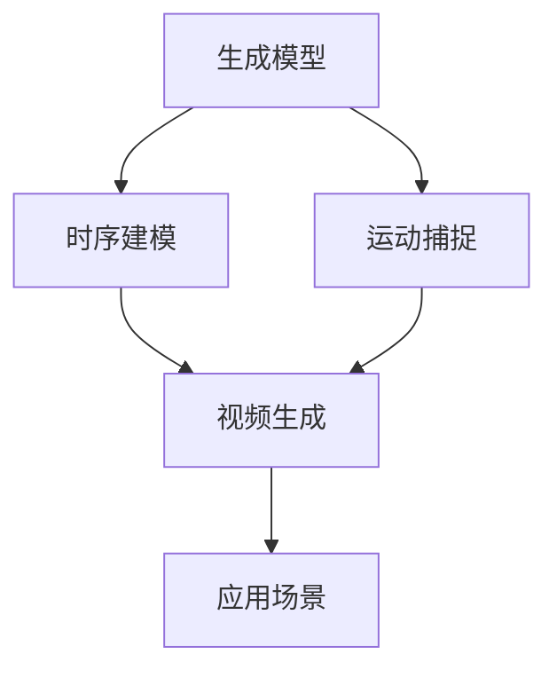

下面是以《视频生成(Video Generation) - 原理与代码实例讲解》为主题的技术博客文章正文内容:

# 视频生成(Video Generation) - 原理与代码实例讲解

## 1. 背景介绍

### 1.1 问题的由来

随着人工智能和深度学习技术的不断发展,视频生成(Video Generation)作为一种新兴的计算机视觉任务,越来越受到研究者的关注。传统的视频制作方式需要耗费大量的人力、物力和财力,而视频生成技术可以通过训练神经网络模型自动生成逼真的视频序列,为视频内容创作带来了革命性的变革。

视频生成技术源于图像生成(Image Generation)任务,但由于视频包含时间维度,因此生成逼真流畅的视频序列面临更多挑战。主要的挑战包括:

1. **时间一致性(Temporal Consistency)**:生成的视频帧之间需要保持时间上的连贯性和平滑过渡,避免出现视觉上的抖动和不连贯。

2. **运动建模(Motion Modeling)**:需要精确捕捉和模拟视频中的运动轨迹,如人物动作、物体运动等。

3. **高分辨率(High Resolution)**:生成高分辨率、高质量的视频帧,保持细节清晰。

4. **多模态融合(Multimodal Fusion)**:融合视频的多模态信息,如图像、语音、文本等,生成具有语义一致性的视频内容。

### 1.2 研究现状

近年来,基于生成对抗网络(Generative Adversarial Networks, GANs)和变分自编码器(Variational Autoencoders, VAEs)等深度生成模型,视频生成技术取得了长足进展。研究者们提出了多种创新的网络架构和训练策略,如视频生成对抗网络(Video GANs)、视频变分自编码器(Video VAEs)、视频转换模型(Video Transformation Models)等,显著提高了生成视频的质量和性能。

### 1.3 研究意义

视频生成技术具有广阔的应用前景,可以为多个领域带来颠覆性的影响:

1. **视觉特效和动画制作**:可以大幅降低视觉特效和动画制作的成本和工作量。

2. **虚拟现实和增强现实**:生成逼真的虚拟场景和动态内容,增强沉浸式体验。

3. **视频压缩和增强**:通过生成模型压缩和增强视频质量,节省存储和传输带宽。

4. **机器人控制和自动驾驶**:模拟和预测未来视频帧,为决策提供依据。

5. **视频编辑和内容创作**:根据文本或语音描述自动生成视频内容,提高创作效率。

### 1.4 本文结构

本文将全面介绍视频生成技术的原理和实践。首先阐述核心概念和算法原理,然后详细讲解数学模型和公式推导过程。接着通过代码实例演示具体的实现细节,并分析在不同应用场景中的实践。最后探讨未来发展趋势和面临的挑战,为读者提供学习资源和工具推荐。

## 2. 核心概念与联系

视频生成技术涉及多个核心概念,包括生成模型、时序建模、运动捕捉等,这些概念相互关联,共同构建了视频生成的理论基础和技术框架。

1. **生成模型(Generative Models)**:视频生成主要基于生成对抗网络(GANs)、变分自编码器(VAEs)等深度生成模型,通过学习数据分布,生成新的视频帧。

2. **时序建模(Sequence Modeling)**:视频包含时间维度,需要使用递归神经网络(RNNs)、时序卷积网络(TCNs)等模型,捕捉视频帧之间的时序依赖关系,保证生成视频的时间一致性。

3. **运动捕捉(Motion Capture)**:精确捕捉和模拟视频中的运动轨迹,是生成逼真视频的关键。常用的方法包括光流估计(Optical Flow)、人体姿态估计(Human Pose Estimation)等。

4. **视频生成(Video Generation)**:综合运用上述技术,生成逼真、流畅、高质量的视频序列,满足不同应用场景的需求。

5. **应用场景(Applications)**:视频生成技术可广泛应用于视觉特效、虚拟现实、视频压缩、机器人控制、内容创作等多个领域。

## 3. 核心算法原理 & 具体操作步骤

### 3.1 算法原理概述

视频生成算法的核心思想是通过深度生成模型学习视频数据的潜在分布,并基于该分布生成新的视频序列。常见的生成模型包括生成对抗网络(GANs)和变分自编码器(VAEs)。

1. **生成对抗网络(GANs)**:由生成器(Generator)和判别器(Discriminator)两个对抗网络组成。生成器从潜在空间(Latent Space)采样,生成假的视频帧;判别器则判断生成的视频帧是真是假。两个网络相互对抗训练,最终使生成器能生成逼真的视频。

2. **变分自编码器(VAEs)**:将视频帧编码为潜在表示(Latent Representation),再由解码器(Decoder)从潜在表示重构视频帧。通过最小化重构损失和KL散度损失,学习数据分布。

上述生成模型需要与时序建模技术相结合,捕捉视频帧之间的时序依赖关系,生成时间上连贯的视频序列。常用的时序建模方法包括:

- 递归神经网络(RNNs)
- 时序卷积网络(TCNs)
- 转换模型(Transformation Models)

### 3.2 算法步骤详解

以视频生成对抗网络(Video GANs)为例,具体的算法步骤如下:

1. **数据预处理**:从视频数据集中抽取视频片段,将其分割为固定长度的帧序列,作为网络的输入。

2. **生成器设计**:设计生成器网络架构,通常包括一个编码器(Encoder)将随机噪声编码为潜在表示,一个解码器(Decoder)将潜在表示解码为视频帧序列。解码器可采用RNNs或TCNs等时序模型,捕捉帧间依赖关系。

3. **判别器设计**:设计判别器网络架构,输入为真实或生成的视频帧序列,输出为真实性分数。判别器也可采用时序模型,捕捉视频的时序信息。

4. **对抗训练**:生成器和判别器进行对抗训练,生成器目标是使生成的视频足够逼真以欺骗判别器,判别器则努力区分真实和生成的视频。通过这种对抗过程,生成器不断提高生成视频的质量。

5. **损失函数**:生成器和判别器各自有不同的损失函数,生成器损失通常为对抗损失和其他正则化项(如梯度惩罚),判别器损失为二分类交叉熵损失。

6. **优化与采样**:使用优化算法(如Adam)分别优化生成器和判别器的损失函数。训练收敛后,可从生成器采样,生成新的视频序列。

算法的关键在于设计合理的网络架构、损失函数和训练策略,以有效捕捉视频的时序和运动信息,生成高质量的视频。

### 3.3 算法优缺点

**优点**:

1. 能够生成逼真、多样化的视频序列。
2. 通过对抗训练,不断提高生成视频的质量。
3. 可融合多模态信息(如文本、语音),生成具有语义一致性的视频内容。

**缺点**:

1. 训练过程不稳定,存在模型崩溃和模式坍塌的风险。
2. 生成高分辨率视频仍然具有挑战性,容易出现artifact和模糊。
3. 难以精确控制生成视频的内容和运动轨迹。
4. 训练数据集需求量大,需要大量标注数据。

### 3.4 算法应用领域

视频生成算法可广泛应用于以下领域:

1. **视觉特效和动画制作**:自动生成逼真的特效场景和动画角色。
2. **虚拟现实和增强现实**:生成虚拟环境和动态物体,增强沉浸式体验。
3. **视频压缩和增强**:通过生成模型压缩和增强视频质量,节省存储和传输带宽。
4. **机器人控制和自动驾驶**:预测未来视频帧,为决策提供依据。
5. **视频编辑和内容创作**:根据文本或语音描述自动生成视频内容。
6. **医疗影像分析**:生成病理扫描视频,辅助诊断和治疗。
7. **气象和环境模拟**:模拟天气和自然灾害的视频,用于预测和防灾。

## 4. 数学模型和公式 & 详细讲解 & 举例说明

### 4.1 数学模型构建

视频生成任务可以形式化为学习条件概率分布 $P(V|c)$,其中 $V$ 表示视频序列, $c$ 表示条件(如文本描述、起始帧等)。常用的数学模型包括生成对抗网络(GANs)和变分自编码器(VAEs)。

1. **生成对抗网络(GANs)**

GANs由生成器 $G$ 和判别器 $D$ 组成,目标是学习数据分布 $P_{data}(V)$。生成器 $G(z;θ_g)$ 将噪声 $z$ 映射为视频 $\hat{V}$,判别器 $D(V;θ_d)$ 判断输入视频是真实样本还是生成样本。二者构成的min-max游戏可表示为:

$$\min_G \max_D V(D,G) = \mathbb{E}_{V\sim P_{data}(V)}[\log D(V)] + \mathbb{E}_{z\sim P_z(z)}[\log(1-D(G(z)))]$$

通过对抗训练,生成器 $G$ 努力生成逼真的视频以欺骗判别器,判别器 $D$ 则努力区分真实和生成的视频。

2. **变分自编码器(VAEs)**

VAEs将视频 $V$ 编码为潜在表示 $z$,再由解码器 $G$ 重构视频 $\hat{V}=G(z)$。VAEs的证据下界(ELBO)目标函数为:

$$\mathcal{L}(θ,φ;V) = -\mathbb{E}_{q_φ(z|V)}[\log p_θ(V|z)] + KL(q_φ(z|V)||p(z))$$

其中第一项为重构损失,第二项为KL散度正则化项。通过最小化ELBO,可以学习数据分布 $p_θ(V|z)$ 和潜在分布 $p(z)$。

上述模型需要与时序建模技术相结合,捕捉视频帧之间的时序依赖关系。常用的时序模型包括递归神经网络(RNNs)、时序卷积网络(TCNs)等。

### 4.2 公式推导过程

以视频生成对抗网络(Video GANs)为例,推导其对抗损失函数的过程如下:

假设数据分布为 $P_{data}(V)$,生成器分布为 $P_g(V)$,则根据最大熵原理,判别器 $D$ 的最优策略是:

$$D^*(V) = \frac{P_{data}(V)}{P_{data}(V) + P_g(V)}$$

对于生成器 $G$,其目标是最小化判别器对生成样本的检测概率,即:

$$\min_G \mathbb{E}_{V\sim P_g}[\log(1-D(V))]$$

将 $D^*(V)$ 代入上式,可得:

$$\begin{aligned}
\min_G \mathbb{E}_{V\sim P_g}[\log(1-D^*(V))] &= \min_G \mathbb{E}_{V\sim P_g}\left[\log\left(1-\frac{P_{data}(V)}{P_{data}(V)+P_g(V)}\right)\right]\\
&= \min_G \mathbb{E}_{V\sim P_g}\left[\log\left(\f