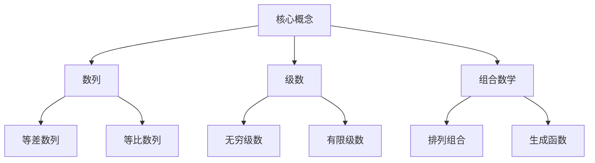
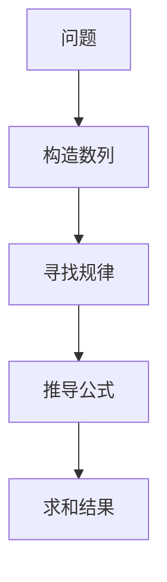

# 解析数论基础：第二章 求和公式

## 1. 背景介绍

### 1.1 问题的由来

在数学和计算机科学领域中,求和公式扮演着非常重要的角色。无论是在分析算法的时间复杂度、计算数值积分,还是求解组合数学问题,求和公式都是不可或缺的工具。求和公式的研究源于对数列求和的需求,旨在寻找一种更加高效、紧凑的表示方式,从而简化计算过程。

### 1.2 研究现状

求和公式的研究可以追溯到17世纪,当时数学家如牛顿、莱布尼茨等人对于无穷级数的研究为求和公式奠定了基础。19世纪,高斯、埃尔米特等人对于有限数列求和问题做出了重大贡献。20世纪,随着计算机的发展,求和公式在算法分析、组合数学等领域得到了广泛应用。如今,求和公式理论已经相当成熟,但仍有一些特殊情况下的求和问题有待解决。

### 1.3 研究意义

求和公式的研究意义主要体现在以下几个方面:

1. **简化计算**: 求和公式可以将复杂的数列求和问题转化为简单的公式计算,大大减少了计算量。
2. **提高效率**: 在算法分析中,求和公式可以帮助我们快速计算算法的时间复杂度,从而优化算法性能。
3. **解决实际问题**: 许多现实世界的问题都可以转化为求和问题,求和公式为解决这些问题提供了有力工具。
4. **推动数学发展**: 求和公式的研究不仅促进了组合数学、数论等分支学科的发展,也为其他数学领域提供了新的研究视角。

### 1.4 本文结构

本文将首先介绍一些核心概念,并阐述它们之间的联系。接下来,我们将深入探讨求和公式的核心算法原理及具体操作步骤。然后,我们将构建数学模型,推导公式,并通过案例分析加深理解。在此基础上,我们将实践一个代码项目,详细解释实现过程。最后,我们将讨论求和公式在实际应用中的场景,介绍一些有用的工具和资源,并对未来的发展趋势和挑战进行总结和展望。

## 2. 核心概念与联系

在探讨求和公式之前,我们需要了解一些核心概念,如数列、级数、组合数学等,它们之间存在着密切的联系。

1. **数列**是一个按照某种特定规律排列的无穷序列。常见的数列有等差数列和等比数列等。
2. **级数**是通过对无穷多个数求和而形成的无穷序列,可分为无穷级数和有限级数。
3. **组合数学**研究离散结构及其存在的规律,包括排列组合、生成函数等内容。

这些概念之间存在着紧密的联系。例如,等差数列和等比数列的求和可以使用特定的求和公式来计算;无穷级数的求和涉及到收敛性的讨论;组合数学中的生成函数可以用于求解组合数问题,其本质是对特定数列进行求和。因此,掌握这些核心概念及其联系,对于理解和运用求和公式至关重要。

## 3. 核心算法原理 & 具体操作步骤

### 3.1 算法原理概述

求和公式的核心算法原理可以概括为以下三个步骤:

1. **构造数列**: 根据给定的问题,构造出一个待求和的数列。
2. **寻找规律**: 分析数列的结构,寻找其中蕴含的规律或模式。
3. **推导公式**: 基于发现的规律,利用数学推导技巧,推导出求和公式。

这个过程需要数学分析能力和组合思维,是将具体问题抽象为数学模型,再通过推导得到解析解的过程。

### 3.2 算法步骤详解

1. **构造数列**
    - 根据问题描述,确定数列的初始项和一般项的表达式
    - 对于复杂的数列,可以考虑将其分解为简单数列的和或差
2. **寻找规律**
    - 观察数列项与项之间的关系,尝试发现递推关系或其他规律
    - 可以借助数学工具,如生成函数、特征方程等,帮助发现隐藏的规律
3. **推导公式**
    - 利用代数运算、数学归纳法等技巧,基于发现的规律推导出求和公式
    - 对于无穷级数,需要考虑收敛性问题,可能需要利用收敛判别法则
4. **求和计算**
    - 将具体的数列参数代入推导出的求和公式
    - 对于有限数列求和,直接计算即可
    - 对于无穷级数求和,需要先判断收敛性,然后计算其和

### 3.3 算法优缺点

**优点**:

- 求和公式可以将复杂的数列求和问题转化为简单的公式计算,大大减少计算量。
- 对于一些特殊形式的数列,求和公式可以给出解析解,避免了数值计算的误差累积。
- 求和公式理论完备,可以覆盖大部分常见的数列形式。

**缺点**:

- 对于一些特殊的、结构复杂的数列,可能很难直接找到其求和公式。
- 推导求和公式的过程可能比较繁琐,需要一定的数学功底。
- 无穷级数的收敛性问题可能使求和公式的应用受到限制。

### 3.4 算法应用领域

求和公式在数学和计算机科学等领域有着广泛的应用,主要包括:

- **算法分析**: 在分析算法的时间复杂度时,常需要对一些数列进行求和。
- **数值计算**: 许多数值积分和微分方程的解可以转化为求和问题。
- **组合数学**: 排列组合问题、递推关系等都可以使用求和公式求解。
- **概率统计**: 期望、方差等概率分布参数的计算常常涉及求和。
- **物理学**: 量子力学、统计力学等领域中的一些问题可以转化为求和形式。
- **工程技术**: 控制理论、信号处理等领域也会遇到求和问题。

总的来说,只要涉及到数列求和的地方,求和公式就可以发挥重要作用。掌握求和公式不仅可以简化计算,也有助于我们更好地理解和解决现实世界中的问题。

## 4. 数学模型和公式 & 详细讲解 & 举例说明

### 4.1 数学模型构建

在构建数学模型之前,我们首先需要明确问题。假设我们需要求解一个数列的前 n 项的和,该数列的一般项为 $a_n$,则我们的求和问题可以表示为:

$$
S_n = \sum_{k=1}^{n}a_k
$$

其中,$ S_n $表示前 n 项的和。

为了构建数学模型,我们需要对数列 $\{a_n\}$ 的结构进行分析,寻找其中蕴含的规律或模式。根据不同的规律,我们可以构建不同的数学模型,从而推导出对应的求和公式。

例如,对于等差数列 $\{a_n\} = \{a, a+d, a+2d, \ldots, a+(n-1)d\}$,我们可以构建以下数学模型:

$$
\begin{aligned}
S_n &= a + (a+d) + (a+2d) + \cdots + (a+(n-1)d) \\
    &= na + d\sum_{k=1}^{n-1}k \\
    &= na + \frac{d(n-1)n}{2}
\end{aligned}
$$

通过这种数学建模的过程,我们得到了等差数列的求和公式。

### 4.2 公式推导过程

在构建了数学模型之后,我们需要利用数学推导技巧,来推导出求和公式。这个过程通常需要运用代数运算、数学归纳法等方法。

以等差数列的求和公式为例,我们可以通过以下步骤进行推导:

1. 首先,我们将等差数列的一般项展开:

$$
\begin{aligned}
S_n &= a + (a+d) + (a+2d) + \cdots + (a+(n-1)d) \\
    &= na + [1 + 2 + 3 + \cdots + (n-1)]d
\end{aligned}
$$

2. 接下来,我们需要求出方括号内的表达式,也就是前 $n-1$ 项的和。这可以通过数学归纳法来证明:

$$
\sum_{k=1}^{n-1}k = \frac{(n-1)n}{2}
$$

3. 将上式代入等差数列的求和式中,我们就得到了最终的求和公式:

$$
S_n = na + \frac{d(n-1)n}{2}
$$

这个推导过程充分体现了代数运算和数学归纳法在求和公式推导中的重要作用。对于不同形式的数列,我们需要采用不同的推导技巧,但总的思路是类似的。

### 4.3 案例分析与讲解

为了加深对求和公式的理解,我们来分析一个具体的案例。

**问题**: 已知数列 $\{a_n\} = \{1, 4, 9, 16, \ldots\}$,求前 10 项的和。

**分析**:
1. 首先,我们需要找到这个数列的一般项表达式。通过观察,我们可以发现这是一个平方数列,即 $a_n = n^2$。
2. 接下来,我们构建数学模型:

$$
\begin{aligned}
S_{10} &= \sum_{k=1}^{10}k^2 \\
       &= 1^2 + 2^2 + 3^2 + \cdots + 10^2
\end{aligned}
$$

3. 为了求解这个求和式,我们需要利用一个技巧性的等式:

$$
\sum_{k=1}^{n}k^3 = \left(\sum_{k=1}^{n}k\right)^2
$$

通过对这个等式两边同时求导,我们可以得到:

$$
\sum_{k=1}^{n}k^2 = \frac{1}{3}\left(\sum_{k=1}^{n}k\right)^2 + \frac{n(n+1)(2n+1)}{6}
$$

4. 将已知的等差数列求和公式代入上式,我们就可以得到平方数列的求和公式:

$$
\sum_{k=1}^{n}k^2 = \frac{n(n+1)(2n+1)}{6}
$$

5. 将 $n=10$ 代入上式,我们可以计算出前 10 项的和为 $S_{10} = 285$。

通过这个案例,我们可以看到求和公式的推导过程需要灵活运用各种数学技巧,同时也体现了求和公式在实际问题中的应用价值。

### 4.4 常见问题解答

在学习和应用求和公式的过程中,我们可能会遇到一些常见的问题和疑惑,下面是一些常见问题的解答:

1. **如何判断一个无穷级数是否收敛?**

   对于无穷级数,我们需要先判断其是否收敛,才能对其求和。常用的收敛判别法则包括比值法则、根值法则、积分法则等。如果级数发散,我们就无法对其求和。

2. **如何求解结构复杂的数列?**

   对于结构复杂的数列,我们可以尝试将其分解为简单数列的和或差,然后分别求解。另外,我们也可以借助生成函数、特征方程等工具,帮助发现隐藏的规律。

3. **求和公式是否能解决所有求和问题?**

   理论上,求和公式可以解决大部分常见的数列求和问题。但在实际应