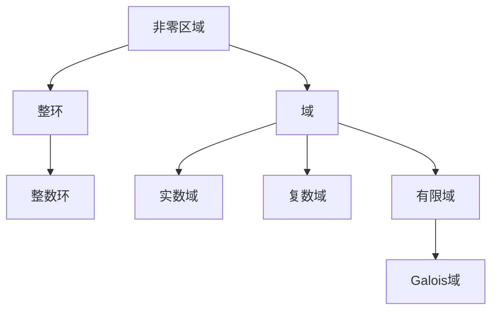

# 解析数论基础：非零区域（一）

## 1. 背景介绍

### 1.1 问题的由来

在数论领域中，非零区域是一个基础且重要的概念。它源于对整数的研究,尤其是在密码学、编码理论和计算机科学等领域中,非零区域的性质和应用备受关注。非零区域的研究不仅能深化我们对整数结构的理解,还能为相关领域提供理论基础和实用工具。

### 1.2 研究现状

非零区域的研究可以追溯到19世纪,当时数学家开始系统地研究整数的基本性质。20世纪初,随着现代代数的发展,非零区域的概念被正式引入,并成为抽象代数的一个重要分支。近年来,随着计算机科学的飞速发展,非零区域在密码学、编码理论等领域的应用越来越广泛,吸引了众多研究者的关注。

### 1.3 研究意义

非零区域的研究不仅具有重要的理论意义,也具有广泛的应用价值。在理论层面上,非零区域为我们提供了一种抽象的视角来研究整数的结构,有助于发现整数的新性质和规律。在应用层面上,非零区域在密码学、编码理论等领域发挥着关键作用,为信息安全和数据传输提供了重要的理论基础和实用工具。

### 1.4 本文结构

本文将全面介绍非零区域的基础知识,包括定义、性质、构造方法以及相关算法和应用。文章将从背景介绍出发,逐步深入探讨非零区域的核心概念、数学模型、算法原理和实际应用,并对未来发展趋势和挑战进行展望。

## 2. 核心概念与联系

非零区域是一种特殊的代数结构,它同时满足整环和域的性质。整环是指具有加法和乘法运算的代数系统,并且乘法运算对加法运算满足分配律。域则是指除了具有整环的性质外,还要求乘法运算有单位元,并且每个非零元素都有乘法逆元。

非零区域可以看作是整环和域的交集,它兼具了两者的特性。具体来说,非零区域是一个非空集合,对于该集合中任意两个元素,都可以进行加法、乘法和乘法的逆运算,并且这些运算满足结合律、交换律和分配律等代数运算规则。

在数论中,整数环是一个典型的整环,而有限域(如Galois域)则是一种特殊的域。非零区域可以看作是将整数环和有限域的性质结合起来的一种代数结构。因此,非零区域不仅继承了整数环的加法和乘法运算,还具有有限域中每个非零元素都有乘法逆元的性质。

需要注意的是,虽然非零区域同时满足整环和域的性质,但它并不是整环或域的一种特殊情况。相反,非零区域是一种独立的代数结构,具有自己的定义和性质。

## 3. 核心算法原理 & 具体操作步骤

### 3.1 算法原理概述

非零区域的核心算法主要包括构造非零区域、求逆元、计算阶等。这些算法的原理基于非零区域的代数性质,如加法和乘法运算的封闭性、结合律、交换律和分配律等。

构造非零区域的算法通常基于模运算和有限域的理论。具体来说,我们可以在整数环上引入一个等价关系,将整数分为若干等价类,这些等价类构成了一个非零区域。

求逆元算法则利用了非零区域中每个非零元素都有乘法逆元的性质。通过扩展欧几里德算法或者费马小定理等方法,我们可以有效地计算出任意非零元素的逆元。

计算阶算法是基于有限域的理论,它可以求出一个非零元素的阶,即该元素经过多少次乘法运算后会等于单位元。这对于研究非零区域的循环结构和生成元素具有重要意义。

### 3.2 算法步骤详解

#### 3.2.1 构造非零区域

1) 选择一个素数 $p$ 和一个正整数 $n$,构造模 $p^n$ 的整数环 $\mathbb{Z}_{p^n}$。
2) 在 $\mathbb{Z}_{p^n}$ 中找出所有与 $p$ 互素的元素,记为 $U(p^n)$。
3) $U(p^n)$ 就构成了一个非零区域,记为 $\mathbb{Z}_{p^n}^*$。

例如,取 $p=5$, $n=2$,我们可以构造出模 $5^2=25$ 的非零区域 $\mathbb{Z}_{25}^*$,它包含了 $\{1,2,3,4,6,7,8,9,11,12,13,14,16,17,18,19,21,22,23,24\}$ 这 20 个与 5 互素的元素。

#### 3.2.2 求逆元

已知一个非零区域 $\mathbb{Z}_{p^n}^*$ 和其中的一个元素 $a$,求 $a$ 的逆元 $a^{-1}$ 的步骤如下:

1) 使用扩展欧几里德算法计算 $a$ 和 $p^n$ 的最大公约数 $\gcd(a,p^n)$。
2) 如果 $\gcd(a,p^n)=1$,则 $a$ 在 $\mathbb{Z}_{p^n}^*$ 中有逆元,记为 $a^{-1}$。
3) 利用扩展欧几里德算法的结果,可以得到 $a^{-1} \equiv x \pmod{p^n}$,其中 $x$ 就是 $a$ 的逆元。

例如,在 $\mathbb{Z}_{25}^*$ 中,求 7 的逆元:

$$\gcd(7,25)=1$$
$$7 \cdot 18 \equiv 1 \pmod{25}$$

因此,7 的逆元是 18。

#### 3.2.3 计算阶

已知一个非零区域 $\mathbb{Z}_{p^n}^*$ 和其中的一个元素 $a$,求 $a$ 的阶 $\text{ord}(a)$ 的步骤如下:

1) 初始化 $i=1$, $a_1=a$。
2) 计算 $a_{i+1} = a_i \cdot a \bmod p^n$。
3) 如果 $a_{i+1} = 1$,则 $\text{ord}(a) = i+1$,算法结束。
4) 否则,令 $i = i+1$,回到步骤 2)。

例如,在 $\mathbb{Z}_{25}^*$ 中,求 7 的阶:

$$7^1 \equiv 7 \pmod{25}$$
$$7^2 \equiv 24 \pmod{25}$$
$$7^3 \equiv 18 \pmod{25}$$
$$7^4 \equiv 1 \pmod{25}$$

因此,7 的阶是 4。

### 3.3 算法优缺点

上述算法的优点在于原理简单,算法步骤清晰,易于实现和理解。构造非零区域的算法直接利用了模运算和整数环的性质,求逆元算法基于扩展欧几里德算法,计算阶算法则利用了有限域的循环性质。这些算法都有严格的数学理论支撑,可以保证结果的正确性。

不过,这些算法也存在一些缺点和局限性。首先,构造非零区域的算法需要预先选择合适的素数和指数,对于大指数情况下,计算量会迅速增加。其次,求逆元算法和计算阶算法都需要进行大量的模运算,当模数较大时,计算效率会受到影响。此外,这些算法只适用于特定的非零区域,对于更一般的代数结构,可能需要使用其他算法或方法。

### 3.4 算法应用领域

非零区域的算法在密码学、编码理论和计算机科学等领域有广泛的应用。

在密码学领域,非零区域的算法被广泛应用于设计和分析各种密码系统,如RSA加密、ElGamal加密、椭圆曲线密码等。这些密码系统的安全性通常依赖于非零区域中的某些难解的数论问题,如离散对数问题、整数因数分解问题等。

在编码理论领域,非零区域提供了构造线性码和循环码的代数工具。利用非零区域的性质,我们可以设计出具有良好纠错能力的编码方案,广泛应用于数据存储、通信传输等领域。

在计算机科学领域,非零区域的算法也有重要应用,如哈希函数的设计、伪随机数生成、有限域上的计算等。此外,非零区域的理论也为一些密码学算法的软硬件实现提供了理论基础。

## 4. 数学模型和公式 & 详细讲解 & 举例说明

### 4.1 数学模型构建

为了更好地研究非零区域的性质和算法,我们需要建立严格的数学模型。首先,我们定义非零区域如下:

$$\mathbb{Z}_{p^n}^* = \{a \in \mathbb{Z}_{p^n} | \gcd(a,p)=1\}$$

其中, $p$ 是一个素数, $n$ 是一个正整数, $\mathbb{Z}_{p^n}$ 表示模 $p^n$ 的整数环, $\gcd(a,p)$ 表示 $a$ 和 $p$ 的最大公约数。

非零区域 $\mathbb{Z}_{p^n}^*$ 是由模 $p^n$ 的整数环中所有与 $p$ 互素的元素构成的集合。它不仅具有整环的加法和乘法运算,而且每个非零元素都有乘法逆元,因此也满足域的性质。

接下来,我们定义非零区域中的乘法运算和逆元运算:

$$a \cdot b = (a \times b) \bmod p^n \quad (\forall a,b \in \mathbb{Z}_{p^n}^*)$$
$$a^{-1} \equiv x \pmod{p^n} \quad (\text{s.t. } a \cdot x \equiv 1 \pmod{p^n})$$

其中, $\cdot$ 表示非零区域中的乘法运算, $a^{-1}$ 表示 $a$ 的乘法逆元, $x$ 是满足 $a \cdot x \equiv 1 \pmod{p^n}$ 的整数。

基于这些定义,我们可以推导出非零区域的一些基本性质,如封闭性、结合律、交换律和分配律等。这些性质为后续的算法设计和分析奠定了理论基础。

### 4.2 公式推导过程

#### 4.2.1 逆元的存在性

对于任意 $a \in \mathbb{Z}_{p^n}^*$,我们需要证明它在 $\mathbb{Z}_{p^n}^*$ 中存在乘法逆元。

由 $\gcd(a,p)=1$ 可知,存在整数 $x,y$,使得:

$$ax + py = 1$$

两边同时模 $p^n$,可得:

$$ax \equiv 1 \pmod{p^n}$$

因此, $x$ 就是 $a$ 在 $\mathbb{Z}_{p^n}^*$ 中的逆元,记为 $a^{-1}$。

#### 4.2.2 阶的计算

对于任意 $a \in \mathbb{Z}_{p^n}^*$,我们定义它的阶 $\text{ord}(a)$ 为最小正整数 $k$,使得 $a^k \equiv 1 \pmod{p^n}$。

根据费马小定理,我们知道:

$$a^{\phi(p^n)} \equiv 1 \pmod{p^n}$$

其中, $\phi(p^n)$ 是欧拉函数,表示小于 $p^n$ 且与 $p^n$ 互素的正整数的个数。

由于 $\text{ord}(a)$ 是最小的满足上式的正整数,因此 $\text{ord}(a)$ 必然是 $\phi(p^n)$ 的一个正divisor。进一步地,我们可以证明:

$$\text{ord}(a) \mid \phi(p^n)$$

即 $\text{ord}(a)$ 是 $