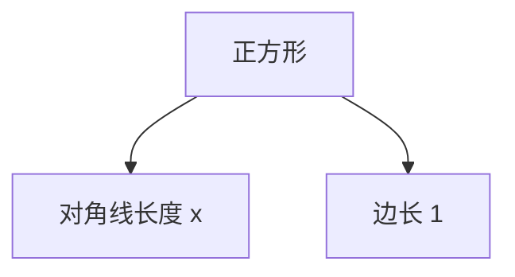

# 计算：第一部分 计算的诞生 第 1 章 毕达哥拉斯的困惑 从数觉到计数

## 1. 背景介绍

### 1.1 问题的由来

人类对数字和计算的探索可以追溯到古希腊时期。在那个时候，数学家和哲学家们对数字的本质和计算过程产生了浓厚的兴趣。其中,毕达哥拉斯及其追随者们的工作对此做出了重大贡献。

毕达哥拉斯是古希腊著名的数学家和哲学家,他创立了著名的毕达哥拉斯学派。他们认为,宇宙万物的本质都可以用数字来表示和解释。这种观点被称为"数的哲学"。

然而,在探索数字的过程中,毕达哥拉斯学派遇到了一个令人困惑的问题:对角线与边的比例关系。这个看似简单的问题,却引发了一场震惊整个数学界的"危机"。

### 1.2 研究现状

对角线与边的比例关系问题,通常被称为"无理数的发现"。它暴露了当时数字理论的缺陷,即无法用有理数(整数的比值)来精确表示所有的长度比例关系。

这一发现动摇了毕达哥拉斯学派对"数的哲学"的信念,也促使后人不断深入探索数字的本质和计算的基础。

数学家们开始意识到,需要扩展数字的概念,引入新的数字体系来描述更广泛的量。这为无理数和实数的发展奠定了基础。

### 1.3 研究意义 

对角线与边的比例关系问题,虽然看似简单,但对于计算理论的发展意义重大:

1. 推动了数字概念的扩展,为无理数和实数的发展做了铺垫。
2. 促进了人类对计算本质的深入思考,意识到需要建立更严谨的计算理论基础。
3. 启发了数学家们去探索新的表示方法,比如几何作图法、无限无理分数等。
4. 为后来发展微积分、解析几何等分支学科做了铺垫。

总的来说,这一问题虽然困扰了古希腊数学家们一段时间,但却成为推动计算理论发展的重要驱动力。

### 1.4 本文结构

本文将从以下几个方面深入探讨这一问题:

1. 核心概念与联系
2. 核心算法原理与具体操作步骤
3. 相关的数学模型和公式推导
4. 项目实践:代码实例和详细解释
5. 实际应用场景
6. 相关工具和学习资源推荐
7. 总结:未来发展趋势与挑战
8. 常见问题解答

接下来,我们将逐一展开讨论每个部分的内容。

## 2. 核心概念与联系

对角线与边的比例关系问题,涉及到以下几个核心概念:

1. **有理数(Rational Number)**
    - 定义: 有理数是可以表示为两个整数的比值的数。
    - 例如: 1/2, 3/4, 5/7 等都是有理数。

2. **无理数(Irrational Number)** 
    - 定义: 无理数是不能表示为有理数的数。
    - 例如: π、√2、e 等都是无理数。

3. **实数(Real Number)**
    - 定义: 实数是有理数和无理数的并集。
    - 实数体系包含了所有可以在数线上精确表示的数。

4. **毕达哥拉斯学派**
    - 古希腊著名的数学和哲学流派。
    - 奉行"数的哲学",认为万物本质都可以用数字表示。

5. **无限无理分数**
    - 用于表示无理数的一种表示方法。
    - 例如: π = 3 + 1/(7 + 1/(15 + 1/(1 + ...)))

这些概念之间存在紧密的联系:

- 毕达哥拉斯学派的"数的哲学"建立在有理数的基础之上。
- 对角线与边的比例关系问题暴露了有理数表示长度比例的局限性。
- 这促使人们引入无理数和实数的概念,扩展了数字的表示范围。
- 无限无理分数等表示方法被发明,用于精确表示无理数。

所以,这一问题推动了人类对数字本质的重新认识,为后来实数理论的发展做了铺垫。

## 3. 核心算法原理与具体操作步骤

### 3.1 算法原理概述

对角线与边的比例关系问题,本质上是在探索如何精确表示这种几何关系。古希腊数学家们尝试了多种算法和方法,其中最著名的是:

1. **几何作图法**
    - 使用直尺和圆规,通过作图的方式近似地构造出所需的比例关系。
    - 例如:用勾股弦作图法近似构造√2。

2. **无限无理分数**
    - 将无理数表示为无限嵌套分数的形式。
    - 例如:√2 = 1 + 1/(2 + 1/(2 + 1/(2 + ...)))

这两种方法都试图用有理数的无限逼近的方式,来精确表示无理数的值。

### 3.2 算法步骤详解

以下将详细介绍无限无理分数算法的具体步骤:

1. 选取一个初始有理数值作为近似值,记为 $a_0$。

2. 计算 $a_0$ 与目标无理数值的差值 $r_0 = t - a_0$, 其中 $t$ 为目标值。

3. 将差值 $r_0$ 的倒数作为下一项的分数值,即 $a_1 = 1/r_0$。

4. 更新近似值为 $a_0 + a_1$。

5. 重复步骤2-4,直到达到所需的精度或者步骤无限循环为止。

   - 第 n 步的近似值为: $a_n = a_{n-1} + 1/(t - \sum_{k=0}^{n-1}a_k)$
   - 最终的无限无理分数为: $t = a_0 + 1/(a_1 + 1/(a_2 + 1/(a_3 + ...)))$

这个算法可以用迭代的方式无限逼近目标无理数值,从而精确地表示出它的值。

### 3.3 算法优缺点

**优点**:

1. 能够精确表示任意无理数的值。
2. 算法原理简单,易于实现。
3. 可以根据需要控制逼近的精度。

**缺点**:

1. 对于某些无理数,收敛速度可能较慢。
2. 表示形式较为复杂,不太直观。
3. 存在一些特殊情况需要单独处理(如循环节等)。

### 3.4 算法应用领域

无限无理分数算法主要应用于以下几个领域:

1. **数论**
    - 用于研究和表示无理数的性质。
    - 例如:表示π、e、√2等常见无理数。

2. **计算机科学**
    - 用于设计精确的数值计算算法。
    - 例如:浮点数的表示和运算。

3. **密码学**
    - 一些密码算法基于无理数的特性。
    - 例如:有些流密码使用π值进行加密。

4. **科学计算**
    - 需要高精度计算时,可以使用无理数表示。
    - 例如:某些物理模型涉及无理数常数。

总的来说,这一算法为精确表示和计算无理数提供了一种通用的方法,在多个领域都有重要应用。

## 4. 数学模型和公式详细讲解与举例说明

### 4.1 数学模型构建

对角线与边的比例关系问题,可以用几何模型来描述。考虑一个边长为1的正方形,设其对角线长度为x,如下图所示:

根据勾股定理,我们可以得到方程:

$$
x^2 = 1^2 + 1^2 = 2
$$

即:

$$
x = \sqrt{2}
$$

这就是我们要求解的对角线与边的比例关系,也就是无理数√2的几何意义。

### 4.2 公式推导过程

我们已经知道了√2的几何意义,下面将推导出无限无理分数算法的数学表达式。

对于任意一个无理数t,我们可以从一个有理数a0开始逼近,得到第一项:

$$
t = a_0 + r_0 \qquad (r_0 = t - a_0)
$$

将r0的倒数作为下一项的分数值:

$$
a_1 = 1/r_0 = 1/(t - a_0)
$$

则第二次逼近为:

$$
t = a_0 + 1/a_1 + r_1 \qquad (r_1 = t - a_0 - 1/a_1)
$$

重复这个过程,可以得到无限无理分数的一般形式:

$$
t = a_0 + \cfrac{1}{a_1 + \cfrac{1}{a_2 + \cfrac{1}{a_3 + \cdots}}}
$$

其中,每一项系数 $a_n$ 可以递归计算为:

$$
a_n = \left\lfloor\cfrac{1}{r_{n-1}}\right\rfloor, \quad r_n = \cfrac{1}{r_{n-1}-a_n}
$$

这就是无限无理分数算法的完整数学表达式。

### 4.3 案例分析与讲解

我们以√2为例,具体演示一下无限无理分数算法的计算过程:

1. 取初始值 $a_0 = 1$, 则 $r_0 = \sqrt{2} - 1 \approx 0.414$

2. $a_1 = 1/r_0 \approx 2.414$, 则 $r_1 = 1/(0.414 - 2) \approx -0.172$

3. $a_2 = 1/r_1 \approx -5.828$, 则 $r_2 = 1/(-5.828 - 0.172) \approx -0.207$

4. $a_3 = 1/r_2 \approx -4.828$, 则 $r_3 = 1/(-4.828 - 0.207) \approx -0.236$

5. $\cdots$

将计算出的系数代入无限无理分数的表达式,可以得到:

$$
\sqrt{2} = 1 + \cfrac{1}{2 + \cfrac{1}{2 + \cfrac{1}{2 + \cdots}}}
$$

这就是√2用无限无理分数的精确表示形式。我们可以看到,随着迭代次数的增加,逼近值越来越接近√2的真实值。

### 4.4 常见问题解答

1. **为什么要使用无限无理分数来表示无理数?**

   无限无理分数提供了一种精确表示无理数的方法。与近似值或无限循环小数相比,它能够完美地捕捉无理数的值,不会有任何误差。这在一些需要高精度计算的场景中非常有用。

2. **无限无理分数的收敛性如何?**

   对于不同的无理数,无限无理分数的收敛速度可能有所不同。一般来说,对于代数无理数(如√2)收敛较快,而对于无穷无理数(如π)收敛较慢。不过,通过一些加速技术,可以提高收敛的效率。

3. **无限无理分数在实际应用中有哪些局限性?**

   无限无理分数虽然能够精确表示无理数,但它的表示形式较为复杂,不太直观。在一些对计算效率要求较高的场合,可能需要使用其他近似方法。此外,对于一些特殊的无理数(如具有循环节的无理数),无限无理分数的表示可能会有一些特殊情况需要处理。

4. **无限无理分数与连分数有何联系?**

   无限无理分数实际上是连分数的一种特殊形式。连分数是一种更一般的表示无理数的方法,无限无理分数可以看作是连分数中的一个子集。两者在一定程度上是等价的,可以相互转化。

通过以上解答,相信您对无限无理分数算法的原理、特点和局限性有了更深入的理解。

## 5. 项目实践:代码实例和详细解释说明

### 5.1 开发环境搭建