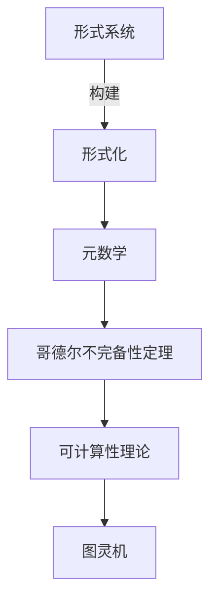

# 计算：第三部分 计算理论的形成 第 6 章 计算理论的奠基：希尔伯特进路 有穷主义证明论

## 1. 背景介绍

### 1.1 问题的由来

在20世纪初期，数学基础理论遇到了一场深刻的危机。经典数学建立在一系列公理和推理规则之上，但随着数学不断发展和深化,人们发现这些公理和推理规则存在着内在的矛盾和缺陷,使得数学的可靠性和一致性受到了质疑。这场危机被称为"数学基础危机"。

在这种背景下,著名数学家大卫·希尔伯特(David Hilbert)提出了一个雄心勃勃的计划,旨在通过形式化的方法来证明经典数学的一致性和完备性,从而为数学奠定坚实的基础。这个计划被称为"希尔伯特进路"或"有穷主义证明论"。

### 1.2 研究现状

希尔伯特进路的核心思想是将数学形式化,将所有的数学概念和推理过程都表示为有穷的符号序列和规则。通过这种形式化的方法,希尔伯特认为可以构建一个完备的形式系统,在该系统中,所有的数学真理都可以被机械地证明,从而确保数学的一致性和完备性。

然而,在20世纪30年代,奥地利逻辑学家库尔特·哥德尔(Kurt Gödel)提出了著名的"不完备性定理",证明了任何足够强大的形式系统都无法同时满足一致性和完备性。这一结果严重挫伤了希尔伯特进路的雄心,但也为计算理论的发展奠定了基础。

### 1.3 研究意义

尽管希尔伯特进路最终未能实现其最初的目标,但它对数学和计算机科学的发展产生了深远的影响。首先,希尔伯特进路促进了形式化数学和逻辑推理的研究,为计算机科学奠定了理论基础。其次,哥德尔的不完备性定理揭示了形式系统的内在局限性,引发了对计算能力和可计算性的深入探讨。最后,希尔伯特进路的失败也启发了人们寻求新的数学基础,促进了数学哲学和元数学的发展。

### 1.4 本文结构

本文将全面探讨计算理论的奠基:希尔伯特进路和有穷主义证明论。首先介绍背景和研究现状,阐述问题的由来和研究意义。接下来详细阐述核心概念和算法原理,包括数学模型、公式推导和代码实现。然后探讨实际应用场景和未来发展趋势。最后,总结研究成果,分析面临的挑战,并对未来研究方向进行展望。

## 2. 核心概念与联系

希尔伯特进路和有穷主义证明论的核心概念包括:

1. **形式系统(Formal System)**: 由一组有穷的符号、公理和推理规则组成的数学系统,旨在用形式化的方法表示和推导数学真理。

2. **形式化(Formalization)**: 将数学概念和推理过程转化为符号序列和规则的过程,使之可以在形式系统中进行机械推理。

3. **元数学(Metamathematics)**: 研究形式系统本身的数学分支,探讨形式系统的性质、局限性和可计算性等问题。

4. **哥德尔不完备性定理(Gödel's Incompleteness Theorems)**: 证明了任何足够强大的形式系统都无法同时满足一致性和完备性,从而限制了形式化方法的能力。

5. **可计算性理论(Computability Theory)**: 研究可以被有效计算的函数和问题的理论,与形式系统和元数学密切相关。

6. **图灵机(Turing Machine)**: 一种抽象的计算模型,用于研究可计算性和形式系统的能力。

这些核心概念相互关联,共同构建了计算理论的基础框架。形式化方法旨在将数学真理表示为形式系统中的定理,而元数学则研究这些形式系统的性质和局限性。哥德尔不完备性定理揭示了形式系统的内在矛盾,促进了可计算性理论的发展,图灵机则成为研究可计算性的重要工具。

## 3. 核心算法原理 & 具体操作步骤

### 3.1 算法原理概述

希尔伯特进路和有穷主义证明论的核心算法原理是通过形式化的方法将数学真理表示为形式系统中的定理,并使用机械推理的方式来证明这些定理。具体步骤如下:

1. **建立形式系统**: 首先需要建立一个形式系统,包括确定符号集、公理集和推理规则集。这个形式系统应该足够强大,能够表示所有的数学概念和推理过程。

2. **形式化数学概念**: 将数学概念和推理过程转化为形式系统中的符号序列和规则,使之可以在形式系统中进行机械推理。这个过程被称为"形式化"。

3. **机械推理**: 在形式系统中,使用推理规则从公理出发,通过机械推理的方式推导出所需要证明的定理。这个过程可以被视为一种算法,通过有穷步骤得到结果。

4. **一致性和完备性检验**: 最后,需要检验形式系统是否满足一致性(不会导出矛盾)和完备性(能够证明所有的真理)。如果满足这两个条件,就意味着该形式系统可以作为数学的坚实基础。

### 3.2 算法步骤详解

1. **建立形式系统**:
   - 确定符号集: 包括逻辑符号(如 $\neg$、$\wedge$、$\vee$、$\rightarrow$、$\forall$、$\exists$ 等)和非逻辑符号(如变量、常数、函数符号等)。
   - 确定公理集: 选择一组公理作为形式系统的起点,这些公理应该是自明的真理。
   - 确定推理规则集: 定义一组推理规则,用于从公理和已证明的定理推导出新的定理。常见的推理规则包括模式匹配、替换、分解等。

2. **形式化数学概念**:
   - 将数学概念转化为形式语言: 使用符号集中的符号来表示数学概念,如集合、函数、关系等。
   - 将推理过程形式化: 将推理过程转化为符号序列和推理规则的应用,使之可以在形式系统中进行机械推理。

3. **机械推理**:
   - 从公理开始,应用推理规则进行推导。
   - 每一步推导都需要严格遵循推理规则,确保推导过程的正确性。
   - 重复应用推理规则,直到推导出所需要证明的定理。

4. **一致性和完备性检验**:
   - 一致性检验: 证明形式系统不会导出矛盾,即不存在一个命题及其否定都可以被证明的情况。
   - 完备性检验: 证明形式系统能够证明所有的数学真理,即对于任何一个真命题,都可以在形式系统中被证明。

### 3.3 算法优缺点

**优点**:

1. **形式化和机械化**: 将数学真理转化为形式系统中的定理,并通过机械推理的方式进行证明,提高了推理过程的严谨性和可靠性。

2. **消除人为错误**: 机械推理过程减少了人为错误的干扰,有助于发现和修正推理中的错误和矛盾。

3. **促进数学形式化**: 推动了数学形式化的发展,为计算机科学奠定了理论基础。

**缺点**:

1. **局限性**: 哥德尔不完备性定理证明了任何足够强大的形式系统都无法同时满足一致性和完备性,限制了形式化方法的能力。

2. **复杂性**: 形式化过程和机械推理过程往往非常复杂,需要大量的符号和规则来表示数学概念和推理过程。

3. **缺乏直观性**: 形式化后的数学概念和推理过程缺乏直观性,难以直接理解和把握。

4. **计算开销**: 机械推理过程可能需要大量的计算资源,特别是对于复杂的数学问题。

### 3.4 算法应用领域

尽管希尔伯特进路最终未能实现其最初的目标,但它所引发的形式化和机械推理的思想对许多领域产生了深远影响:

1. **计算机科学**: 形式化和机械推理为计算机科学奠定了理论基础,促进了编程语言、形式验证、自动定理证明等领域的发展。

2. **人工智能**: 机械推理和自动定理证明是人工智能领域的重要研究方向,与推理系统、知识表示等密切相关。

3. **数学基础研究**: 哥德尔不完备性定理和可计算性理论推动了数学基础研究的发展,探索了形式系统的局限性和新的数学基础。

4. **逻辑学**: 形式化和机械推理是现代逻辑学的核心,影响了逻辑系统的构建和推理方法的发展。

5. **形式验证**: 在硬件和软件设计中,形式化方法被广泛应用于系统的建模和验证,确保系统的正确性和可靠性。

6. **密码学**: 形式化方法在密码学中被用于分析和设计加密算法,确保算法的安全性和可靠性。

总的来说,尽管希尔伯特进路未能实现其最初的目标,但它所引发的形式化和机械推理思想对许多领域产生了深远影响,促进了计算机科学、人工智能、数学基础研究等领域的发展。

## 4. 数学模型和公式 & 详细讲解 & 举例说明

### 4.1 数学模型构建

为了形式化数学概念和推理过程,需要构建一个合适的数学模型。在希尔伯特进路和有穷主义证明论中,常用的数学模型是基于一阶逻辑的形式系统。

一阶逻辑形式系统由以下几个部分组成:

1. **语言(Language)**: 包括逻辑符号(如 $\neg$、$\wedge$、$\vee$、$\rightarrow$、$\forall$、$\exists$ 等)和非逻辑符号(如常数符号、函数符号、谓词符号等)。

2. **语法(Syntax)**: 定义了合法的公式(formula)和句子(sentence)的构造规则。

3. **语义(Semantics)**: 定义了公式和句子在解释(interpretation)下的真值(truth value)。

4. **公理(Axioms)**: 一组被视为自明真理的公式,作为推理的起点。

5. **推理规则(Inference Rules)**: 一组规则,用于从已知的真理推导出新的真理。

在这个模型中,数学概念和推理过程被转化为一阶逻辑形式系统中的公式和句子,并通过应用推理规则进行推导。

例如,我们可以将集合论中的概念和运算形式化为一阶逻辑形式系统:

- 常数符号: 表示集合,如 $A$、$B$、$C$ 等。
- 函数符号: 表示集合运算,如并集 $\cup$、交集 $\cap$、补集 $\complement$ 等。
- 谓词符号: 表示集合关系,如属于关系 $\in$、子集关系 $\subseteq$ 等。
- 公理: 集合论的公理,如空集公理、并集公理、幂集公理等。
- 推理规则: 如模式匹配、替换、分解等。

通过这种形式化,我们可以在形式系统中表示和推导集合论中的定理和推理过程。

### 4.2 公式推导过程

在一阶逻辑形式系统中,公式的推导过程遵循一系列推理规则。常见的推理规则包括:

1. **模式匹配(Pattern Matching)**: 将公式与推理规则的前提部分进行匹配,找到可以应用的推理