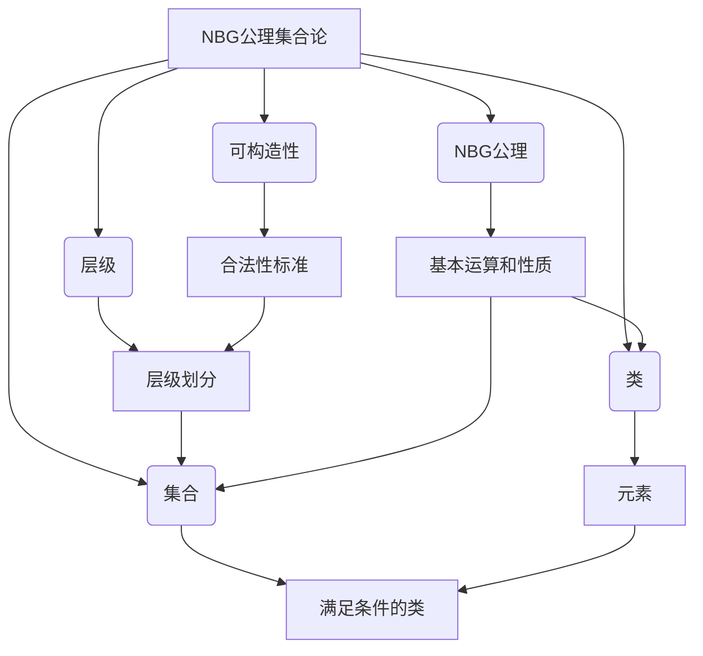

# 计算：第二部分 计算的数学基础 第 5 章 第三次数学危机 NBG 公理集合论

## 1. 背景介绍

### 1.1 问题的由来

在20世纪初期，数学基础理论遭遇了一场空前的危机。这场危机被称为"第三次数学危机"，它源于集合论中的一些悖论和矛盾。其中最著名的是由俄国数学家谢尔平斯基(Sergey Vopenka)于1904年提出的"谢尔平斯基悖论"。这个悖论揭示了经典集合论中存在内在矛盾,严重动摇了数学的根基。

### 1.2 研究现状

为了解决这一危机,数学家们做出了不懈的努力。其中,最具影响力的尝试是由德国数学家约翰·冯·诺伊曼(John von Neumann)、保罗·伯恩斯(Paul Bernays)和瑞士数学家埃尔恩斯特·齐尔梅洛(Ernst Zermelo)共同提出的"NBG公理集合论"(Neumann-Bernays-Gödel Set Theory)。NBG公理集合论在经典集合论的基础上,引入了一些新的公理和概念,旨在消除悖论,重建集合论的逻辑基础。

### 1.3 研究意义

NBG公理集合论对于数学基础理论和逻辑学的发展具有里程碑式的意义。它不仅解决了第三次数学危机,更为后续的数学研究提供了坚实的理论基础。同时,NBG公理集合论也对计算机科学产生了深远影响,为形式化验证、程序语义学等领域奠定了重要基础。

### 1.4 本文结构

本文将全面介绍NBG公理集合论的核心内容。第2节将阐述NBG公理集合论的核心概念及其相互联系。第3节将详细解释NBG公理集合论的核心算法原理和具体操作步骤。第4节将构建NBG公理集合论的数学模型,推导相关公式并进行案例分析。第5节将通过代码实例,实践NBG公理集合论的具体应用。第6节将探讨NBG公理集合论在实际场景中的应用。第7节将推荐相关学习资源和开发工具。最后,第8节将总结NBG公理集合论的研究成果,展望其未来发展趋势和面临的挑战。

## 2. 核心概念与联系

NBG公理集合论的核心概念包括:

1. **类(Class)**:类是NBG公理集合论中最基本的概念。类可以看作是一组元素的集合,但与经典集合论中的"集合"概念不同,类没有"太大"的限制。
2. **集合(Set)**:集合是一种特殊的类,它满足某些额外的条件。NBG公理集合论中的集合概念比经典集合论更加严格和规范。
3. **可构造性(Constructibility)**:可构造性是NBG公理集合论中的一个关键概念。它规定了一个类或集合是否被视为"合法"的标准,从而避免了悖论的产生。
4. **层级(Level)**:NBG公理集合论将类和集合按照其可构造性划分为不同的层级。每个层级都包含了特定的类和集合。
5. **NBG公理(NBG Axioms)**:NBG公理是NBG公理集合论的基石,它们规定了类、集合、可构造性和层级之间的关系,以及一些基本运算和性质。

这些核心概念相互关联、相辅相成,共同构建了NBG公理集合论的理论框架。其中,可构造性和层级的引入是NBG公理集合论区别于经典集合论的关键所在,它们有效地避免了悖论的产生,确保了理论的一致性和无矛盾性。

## 3. 核心算法原理 & 具体操作步骤

### 3.1 算法原理概述

NBG公理集合论的核心算法原理是基于可构造性和层级的概念。算法的目标是判断一个给定的类或集合是否合法,即是否可以被构造出来。

算法的基本思路是:首先将所有类和集合按照其可构造性划分为不同的层级。然后,在每个层级内,根据NBG公理规定的条件和运算,判断该层级中的类和集合是否合法。如果一个类或集合在某个层级中被判定为合法,那么它就可以被构造出来,否则就是非法的。

这种基于层级的判断方式,可以有效地避免悖论的产生,因为每个层级都是相对独立的,不会出现自我引用或无限循环的情况。

### 3.2 算法步骤详解

NBG公理集合论的核心算法可以分为以下几个步骤:

1. **初始化**:确定初始层级,通常是从最底层的"空集"开始。
2. **构造下一层级**:根据NBG公理规定的条件和运算,从当前层级构造出下一层级中的所有合法类和集合。
3. **判断合法性**:对下一层级中的每个类和集合,应用NBG公理中的条件,判断它们是否合法。
4. **更新层级**:将合法的类和集合加入下一层级,非法的类和集合舍弃。
5. **迭代**:将下一层级设为当前层级,重复步骤2-4,直到所有层级都被构造完毕。
6. **输出结果**:输出所有被判定为合法的类和集合。

这个算法的关键在于步骤3中的合法性判断。NBG公理中规定了多个条件,用于判断一个类或集合是否合法。其中最重要的条件是:

- 一个类是合法的,当且仅当它的所有元素都是合法的集合。
- 一个集合是合法的,当且仅当它满足某些特定的条件(例如,它的元素个数小于某个限制)。

通过这些条件,NBG公理集合论避免了经典集合论中的悖论,确保了理论的一致性和无矛盾性。

### 3.3 算法优缺点

NBG公理集合论的核心算法具有以下优点:

1. **避免悖论**:通过引入可构造性和层级的概念,有效地避免了经典集合论中的悖论和矛盾。
2. **理论一致性**:NBG公理集合论提供了一个严格的逻辑框架,确保了理论的一致性和无矛盾性。
3. **递归构造**:算法采用递归的方式构造层级,具有良好的可扩展性和可维护性。

同时,该算法也存在一些缺点:

1. **计算复杂度高**:由于需要逐层构造和判断,算法的计算复杂度较高,对于大型问题可能会导致性能瓶颈。
2. **理解难度大**:NBG公理集合论的概念和算法相对抽象,对于初学者来说理解起来较为困难。
3. **应用范围有限**:虽然NBG公理集合论在数学基础理论方面具有重要意义,但在实际应用中的使用范围相对有限。

### 3.4 算法应用领域

尽管NBG公理集合论的核心算法在实际应用中的使用范围有限,但它在以下领域具有重要影响:

1. **形式化验证**:NBG公理集合论为形式化验证提供了坚实的理论基础,许多形式化验证工具和技术都借鉴了NBG公理集合论的思想。
2. **程序语义学**:NBG公理集合论对于研究程序语义学具有重要意义,它为定义和分析程序语义提供了一种严格的数学框架。
3. **逻辑学**:NBG公理集合论是现代逻辑学的重要组成部分,它对于逻辑学的发展产生了深远影响。
4. **数学基础理论**:NBG公理集合论是数学基础理论的重要里程碑,它为后续的数学研究奠定了坚实的基础。

## 4. 数学模型和公式 & 详细讲解 & 举例说明

### 4.1 数学模型构建

为了更好地理解NBG公理集合论的核心概念和算法,我们可以构建一个数学模型。在这个模型中,我们将使用集合论的符号和表示法来描述NBG公理集合论的基本元素和运算。

首先,我们定义一个基本集合$\mathbb{V}$,它包含了所有可能的类和集合。然后,我们将$\mathbb{V}$划分为不同的层级$V_\alpha$,其中$\alpha$是一个序数(ordinal)。每个层级$V_\alpha$都包含了特定的类和集合。

我们使用$\in$符号表示"属于"关系,即$x \in y$表示元素$x$属于集合或类$y$。我们还定义了一个特殊的集合$\emptyset$,称为"空集",它不包含任何元素。

接下来,我们引入NBG公理集合论中的核心概念:可构造性。一个类或集合$x$被称为可构造的,当且仅当它满足以下条件:

$$
x \in V_\alpha \Leftrightarrow \forall y \in x, \exists \beta < \alpha, y \in V_\beta
$$

这个条件表示,一个类或集合$x$属于层级$V_\alpha$,当且仅当它的所有元素$y$都属于比$\alpha$小的层级$V_\beta$。这确保了每个层级都只包含了可构造的类和集合,从而避免了悖论的产生。

我们还定义了一些基本运算,例如并集$\cup$、交集$\cap$和幂集$\mathcal{P}$。这些运算都必须满足可构造性的条件,才能被视为合法。

### 4.2 公式推导过程

在NBG公理集合论中,有许多重要的公式和定理。我们将推导其中一个关键公式,即"层级公式"(Level Formula)。

首先,我们定义一个谓词$\Phi(x, \alpha)$,它表示"$x$是属于层级$V_\alpha$的可构造集合"。根据可构造性的定义,我们可以写出$\Phi(x, \alpha)$的形式化表达式:

$$
\Phi(x, \alpha) \Leftrightarrow x \subseteq V_\alpha \land \forall y \in x, \exists \beta < \alpha, y \in V_\beta
$$

接下来,我们引入一个新的概念:$\operatorname{rank}(x)$,它表示集合$x$所属的最小层级。形式化地,我们可以定义$\operatorname{rank}(x)$如下:

$$
\operatorname{rank}(x) = \min\{\alpha \mid \Phi(x, \alpha)\}
$$

利用这个定义,我们可以推导出层级公式:

$$
x \in V_\alpha \Leftrightarrow \operatorname{rank}(x) < \alpha
$$

这个公式表明,一个集合$x$属于层级$V_\alpha$,当且仅当它的rank小于$\alpha$。

我们可以通过数学归纳法来证明层级公式的正确性。首先,对于$\alpha = 0$,由于$V_0 = \emptyset$,因此层级公式显然成立。

假设对于所有$\beta < \alpha$,层级公式都成立,即:

$$
x \in V_\beta \Leftrightarrow \operatorname{rank}(x) < \beta
$$

现在,我们来证明对于$\alpha$,层级公式也成立。

1. 若$x \in V_\alpha$,根据可构造性的定义,我们知道$\forall y \in x, \exists \beta < \alpha, y \in V_\beta$。由归纳假设,这意味着$\forall y \in x, \operatorname{rank}(y) < \beta < \alpha$。因此,对于任意$y \in x$,都有$\operatorname{rank}(y) < \alpha$。根据$\operatorname{rank}(x)$的定义,我们可以得出$\operatorname{rank}(x) < \alpha$。

2. 若$\operatorname{rank}(x) < \alpha$,根据$\operatorname{rank}(x)$的定义,存在最小的$\beta$使得$\Phi(x, \beta)$成立。由于$\operatorname{rank}(x)