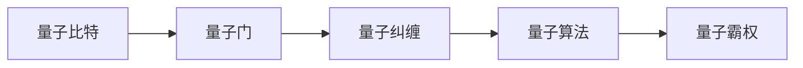

# 计算：第四部分 计算的极限 第 10 章 量子计算 从经典比特到量子比特

关键词：量子计算、量子比特、量子力学、量子纠缠、量子算法、量子霸权

## 1. 背景介绍
### 1.1 问题的由来
自20世纪80年代以来,随着计算机技术的飞速发展,传统计算机的运算能力正逐渐逼近物理极限。为了突破经典计算的瓶颈,科学家们开始探索全新的计算范式。在这种背景下,量子计算应运而生。量子计算利用量子力学的独特性质,有望实现指数级的计算加速,为解决传统计算机无法处理的复杂问题提供了新的可能。

### 1.2 研究现状
目前,量子计算的研究已取得了重大进展。各国政府和科技巨头纷纷投入巨资,力争在量子计算领域占据先机。谷歌、IBM、微软等公司都推出了自己的量子计算平台和原型机。2019年,谷歌宣布实现了"量子霸权",其53比特的量子处理器成功执行了一个传统超级计算机难以完成的特定任务。这一里程碑式的突破,标志着量子计算正逐步从理论走向实践。

### 1.3 研究意义
量子计算的研究具有重大意义:

1. 突破传统计算极限,为解决复杂问题提供新思路。
2. 推动量子力学、信息科学等基础学科的发展。 
3. 在密码学、药物设计、材料模拟等领域具有广泛应用前景。
4. 引领新一轮科技革命,重塑未来计算格局。

### 1.4 本文结构
本文将围绕量子计算的核心概念、原理和应用展开论述。首先介绍量子计算的基本概念和量子比特的特性。然后重点阐述量子计算的核心算法原理,并给出具体的操作步骤。接着,我们将建立量子计算的数学模型,推导相关公式,并结合案例进行详细讲解。在项目实践部分,本文将给出量子计算的代码实例,并对其进行解释说明。此外,我们还将探讨量子计算的实际应用场景,推荐相关的学习资源和开发工具。最后,本文将总结量子计算的研究成果,展望其未来发展趋势和面临的挑战。

## 2. 核心概念与联系
量子计算的核心概念包括:

- **量子比特(Qubit)**: 量子计算的基本单位,与经典比特不同,量子比特可以处于 |0⟩ 和 |1⟩ 的任意线性组合(叠加态)。
- **量子门(Quantum Gate)**: 对量子比特进行操作的基本量子线路,通过量子门可以实现量子比特状态的改变。
- **量子纠缠(Quantum Entanglement)**: 两个或多个量子比特之间存在的一种非局域关联,纠缠态是量子计算速度优势的关键。
- **量子算法(Quantum Algorithm)**: 利用量子力学原理设计的特殊算法,如 Shor 算法、Grover 算法等,可在特定问题上取得指数级加速。
- **量子霸权(Quantum Supremacy)**: 量子计算机在某些特定任务上超越传统计算机的计算能力,是量子计算发展的重要里程碑。

这些概念之间紧密相关,共同构成了量子计算的理论基础。下图展示了它们之间的联系:



## 3. 核心算法原理 & 具体操作步骤
### 3.1 算法原理概述
量子计算的核心算法包括 Shor 算法和 Grover 算法。Shor 算法用于大数分解,可在多项式时间内破解 RSA 加密体系。Grover 算法则用于无序数据库的搜索,可实现平方根级别的加速。这两种算法都利用了量子叠加和纠缠的特性,通过巧妙的量子门操作实现了经典算法无法企及的效率提升。

### 3.2 算法步骤详解
以 Grover 算法为例,其具体步骤如下:

1. 初始化 n 个量子比特到叠加态 $\frac{1}{\sqrt{2^n}} \sum_{x=0}^{2^n-1} |x⟩$。
2. 对叠加态应用 Oracle,对满足条件的状态进行相位反转。
3. 对叠加态应用扩散算子 $D = 2|ψ⟩⟨ψ| - I$,放大目标状态的振幅。
4. 重复步骤 2 和 3 约 $\sqrt{N}$ 次,其中 $N=2^n$ 为搜索空间大小。
5. 对所有量子比特进行测量,以高概率得到目标状态。

通过这些步骤,Grover 算法可以在 $O(\sqrt{N})$ 的时间复杂度内搜索出目标状态,相比经典算法的 $O(N)$ 有了显著的提速。

### 3.3 算法优缺点
量子算法的优点在于:
- 在特定问题上可取得指数级或平方根级的加速。
- 为传统计算难题提供了新的解决思路。

但量子算法也存在一些局限:
- 只适用于某些特定问题,尚无通用的量子加速算法。  
- 对量子硬件的质量和规模有较高要求,容错率较低。

### 3.4 算法应用领域
量子算法在以下领域具有广阔的应用前景:
- 密码学: Shor 算法可用于破解 RSA 等公钥密码体系。
- 优化问题: 量子退火、量子近似优化等算法可用于解决组合优化问题。
- 机器学习: 量子增强的机器学习算法有望加速训练和推理过程。
- 量子模拟: 量子系统可用于模拟复杂的物理、化学过程。

## 4. 数学模型和公式 & 详细讲解 & 举例说明
### 4.1 数学模型构建
量子计算的数学基础是量子力学的线性代数表示。量子态可以用希尔伯特空间中的向量来描述,量子门则对应于酉矩阵。例如,单量子比特的状态可表示为:

$$|\psi⟩ = \alpha|0⟩ + \beta|1⟩$$

其中 $\alpha, \beta$ 为复数,满足归一化条件 $|\alpha|^2 + |\beta|^2 = 1$。

常见的单量子比特门包括:

- Pauli-X 门(NOT门): $X = \begin{bmatrix} 0 & 1 \\ 1 & 0 \end{bmatrix}$
- Hadamard 门: $H = \frac{1}{\sqrt{2}} \begin{bmatrix} 1 & 1 \\ 1 & -1 \end{bmatrix}$  

多量子比特态可用张量积 $\otimes$ 来表示,如两量子比特的 Bell 态:

$$|\Phi^+⟩ = \frac{1}{\sqrt{2}}(|00⟩ + |11⟩) = \frac{1}{\sqrt{2}}(|0⟩ \otimes |0⟩ + |1⟩ \otimes |1⟩)$$

### 4.2 公式推导过程
以 Grover 算法中的扩散算子为例,我们来推导其数学表达式。

首先,定义 $|ψ⟩$ 为均匀叠加态:

$$|ψ⟩ = \frac{1}{\sqrt{N}} \sum_{x=0}^{N-1} |x⟩$$

扩散算子 $D$ 的定义为:

$$D = 2|ψ⟩⟨ψ| - I$$

将 $|ψ⟩$ 代入,可得:

$$
\begin{aligned}
D &= \frac{2}{N} \sum_{x,y} |x⟩⟨y| - I \\
&= \frac{2}{N} \begin{bmatrix} 1 & 1 & \cdots & 1 \\ 1 & 1 & \cdots & 1 \\ \vdots & \vdots & \ddots & \vdots \\ 1 & 1 & \cdots & 1 \end{bmatrix} - I
\end{aligned}
$$

可以看出,扩散算子 $D$ 的作用是对非目标态进行"反射",从而放大目标态的振幅。

### 4.3 案例分析与讲解
下面我们以一个简单的例子来说明 Grover 算法的过程。假设我们要在 $N=4$ 个元素 $\{0,1,2,3\}$ 中搜索目标元素 $x=2$。

1. 初始化量子态为 $|ψ⟩ = \frac{1}{2}(|00⟩ + |01⟩ + |10⟩ + |11⟩)$。
2. 构造 Oracle $O$,对 $|2⟩$ 进行相位反转:
$$O = I - 2|2⟩⟨2| = \begin{bmatrix} 1 & 0 & 0 & 0 \\ 0 & 1 & 0 & 0 \\ 0 & 0 & -1 & 0 \\ 0 & 0 & 0 & 1 \end{bmatrix}$$
3. 应用扩散算子 $D$,放大 $|2⟩$ 的振幅:
$$D = \frac{1}{2} \begin{bmatrix} -1 & 1 & 1 & 1 \\ 1 & -1 & 1 & 1 \\ 1 & 1 & -1 & 1 \\ 1 & 1 & 1 & -1 \end{bmatrix}$$  
4. 重复步骤 2 和 3 一次。
5. 测量量子态,以高概率得到 $|2⟩$。

通过这个例子,我们可以直观地理解 Grover 算法的工作原理,以及量子计算的优势所在。

### 4.4 常见问题解答
Q: 量子计算与经典计算的本质区别是什么?
A: 量子计算利用量子力学的叠加原理和纠缠效应,可以同时对多个状态进行并行计算。而经典计算则基于确定性的位(bit)操作,只能串行处理。

Q: 量子计算能否解决所有问题?
A: 目前已知的量子算法只能在某些特定问题上取得指数级或平方根级的加速,并非所有问题都适用。此外,量子计算还受到噪声、退相干等因素的影响,实用化仍面临诸多挑战。

## 5. 项目实践：代码实例和详细解释说明
### 5.1 开发环境搭建
要进行量子计算的编程实践,我们首先需要搭建开发环境。目前主流的量子编程框架包括:

- Qiskit(Python)
- Q#(C#)
- Cirq(Python)
- Pennylane(Python) 

以 Qiskit 为例,我们可以通过以下命令安装:

```bash
pip install qiskit
```

### 5.2 源代码详细实现
下面我们使用 Qiskit 来实现 Grover 算法的代码:

```python
from qiskit import QuantumCircuit, Aer, execute

def grover_search(oracle):
    # 初始化量子电路
    qc = QuantumCircuit(2, 2)
    
    # 制备均匀叠加态
    qc.h(0)
    qc.h(1)
    
    # 应用 Oracle 和扩散算子
    qc.barrier()
    oracle(qc)
    qc.h(0)
    qc.h(1)
    qc.x(0)
    qc.x(1)
    qc.h(1)
    qc.cx(0, 1)
    qc.h(1)
    qc.x(0)
    qc.x(1)
    qc.h(0)
    qc.h(1)
    qc.barrier()
    
    # 测量量子态
    qc.measure([0, 1], [0, 1])
    
    # 运行量子电路
    backend = Aer.get_backend('qasm_simulator')
    result = execute(qc, backend, shots=1).result()
    counts = result.get_counts(qc)
    
    return list(counts.keys())[0]

# 定义 Oracle
def oracle_2(qc):
    qc.cz(0, 1)

# 运行 Grover 算法
result = grover_search(oracle_2)
print(f"搜索结果: {result}")
```

### 5.3 代码解读与分析