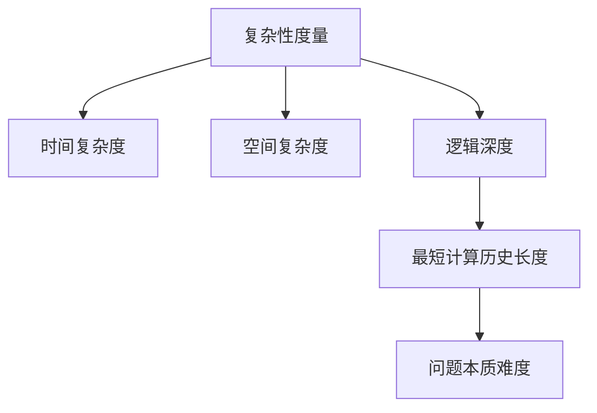

# 计算：第四部分 计算的极限 第 11 章 复杂性计算 逻辑深度

## 1. 背景介绍

### 1.1 问题的由来

在计算机科学领域中,复杂性理论是一个关键的研究领域,旨在探究问题的本质难度及其所需的计算资源。随着计算机系统日益复杂,对于高效算法的需求也与日俱增。逻辑深度(Logical Depth)作为衡量问题复杂性的一个新颖指标,近年来引起了广泛关注。

传统的复杂性度量通常关注时间复杂度和空间复杂度,但这些指标并不能完全捕捉问题的本质难度。例如,一个看似简单的问题,可能需要巨大的计算资源才能解决,而一个复杂的问题,有时也可以通过聪明的算法高效求解。因此,需要一个更加全面的指标来衡量问题的复杂性。

### 1.2 研究现状

逻辑深度的概念最早由计算机科学家查尔斯·H·贝内特(Charles H. Bennett)在1988年提出。它旨在度量一个问题的本质复杂性,而不仅仅是时间或空间复杂度。逻辑深度反映了生成一个特定输出所需的最短计算历史的长度。

近年来,逻辑深度理论在多个领域得到了广泛应用,包括量子计算、人工智能、密码学等。研究人员一直在努力探索逻辑深度的性质、计算方法以及在各个领域的应用。然而,由于逻辑深度的概念相对较新,许多理论和实践问题仍有待解决。

### 1.3 研究意义

深入研究逻辑深度理论对于推进计算机科学的发展具有重要意义:

1. **全面衡量问题复杂性**:逻辑深度提供了一种新的视角来衡量问题的本质难度,补充了传统的时间复杂度和空间复杂度的不足。

2. **优化算法设计**:通过深入理解逻辑深度,可以帮助设计更加高效的算法,减少不必要的计算资源浪费。

3. **量子计算和人工智能**:逻辑深度理论在量子计算和人工智能等前沿领域具有广泛的应用前景,有助于推动这些领域的发展。

4. **密码学安全性分析**:逻辑深度可用于评估密码系统的安全性,为密码学研究提供新的视角。

5. **计算复杂性理解**:研究逻辑深度有助于我们更深入地理解计算复杂性的本质,拓展计算机科学的理论基础。

### 1.4 本文结构

本文将全面探讨逻辑深度理论及其在复杂性计算中的应用。首先介绍逻辑深度的核心概念及其与其他复杂性度量的联系。然后详细阐述逻辑深度的算法原理和数学模型,并通过案例分析加深理解。接下来,我们将介绍逻辑深度在实际项目中的应用,包括代码实现和运行结果分析。最后,探讨逻辑深度的实际应用场景、未来发展趋势和面临的挑战。

## 2. 核心概念与联系

逻辑深度(Logical Depth)是一个衡量问题复杂性的新颖指标,它反映了生成一个特定输出所需的最短计算历史的长度。与传统的时间复杂度和空间复杂度不同,逻辑深度更多地关注问题的本质难度,而不仅仅是计算资源的消耗。



逻辑深度的核心思想是,一个问题的复杂性不仅取决于计算资源的消耗,还取决于生成该问题输出所需的最短计算历史的长度。换句话说,即使一个问题的时间复杂度和空间复杂度都很低,但如果生成其输出需要经历一个非常漫长的计算历史,那么该问题的逻辑深度就会很高,反映了该问题的本质难度。

例如,考虑一个简单的问题:生成一个长度为 n 的随机字符串。虽然这个问题的时间复杂度和空间复杂度都很低,但如果要通过一个非常复杂的计算过程来生成这个随机字符串,那么该问题的逻辑深度就会很高。相反,如果有一个高效的随机数生成算法可以直接生成这个字符串,那么该问题的逻辑深度就会很低。

逻辑深度与其他复杂性度量的关系如下:

- **时间复杂度**:衡量算法执行所需的时间,反映了计算资源的消耗。
- **空间复杂度**:衡量算法执行所需的内存空间,也反映了计算资源的消耗。
- **逻辑深度**:衡量生成特定输出所需的最短计算历史长度,反映了问题的本质难度。

需要注意的是,逻辑深度并不完全等同于时间复杂度或空间复杂度。一个问题可能具有较低的时间复杂度和空间复杂度,但如果生成其输出需要经历一个非常复杂的计算过程,那么它的逻辑深度就会很高。反之亦然,一个问题可能具有较高的时间复杂度和空间复杂度,但如果存在一个高效的算法可以直接生成其输出,那么它的逻辑深度就会较低。

综上所述,逻辑深度提供了一种全新的视角来衡量问题的复杂性,补充了传统复杂性度量的不足。通过结合时间复杂度、空间复杂度和逻辑深度,我们可以更全面地理解和评估问题的复杂性。

## 3. 核心算法原理 & 具体操作步骤

### 3.1 算法原理概述

逻辑深度算法的核心思想是寻找生成特定输出所需的最短计算历史。具体来说,给定一个输出 $y$,我们需要找到一个最短的计算过程 $P$,使得 $P(x) = y$,其中 $x$ 是一个简单的输入。计算过程 $P$ 的长度就是输出 $y$ 的逻辑深度。

形式化地,我们定义逻辑深度如下:

$$
\text{LD}(y) = \min_{P, x} \{\text{length}(P) \mid P(x) = y\}
$$

其中,LD(y)表示输出 y 的逻辑深度,length(P)表示计算过程 P 的长度。我们需要在所有可能的计算过程 P 和输入 x 中找到一个最小的 length(P),使得 P(x) = y。

算法的基本思路是通过搜索所有可能的计算过程,找到生成目标输出的最短计算历史。这个搜索过程可以被视为在一个无限的计算机程序空间中进行遍历,寻找最短的程序。

```mermaid
graph TD
    A[输入 x] -->|计算过程 P1| B[输出 y]
    A -->|计算过程 P2| B
    A -->|计算过程 P3| B
    A -->|...| B
    B --> C[最短计算历史长度]
    C --> D[逻辑深度 LD(y)]
```

需要注意的是,由于计算机程序的空间是无限的,因此找到最短计算历史是一个非常困难的问题。实际上,确定一个给定输出的逻辑深度是一个无法被有效计算的问题(undecidable problem)。因此,我们需要采用一些启发式方法和近似算法来估计逻辑深度。

### 3.2 算法步骤详解

虽然确定逻辑深度是一个无法被有效计算的问题,但我们可以采用一些启发式方法和近似算法来估计逻辑深度。下面是一种常见的逻辑深度估计算法的步骤:

1. **输入**:目标输出 y。
2. **初始化**:设置一个初始的计算过程集合 S,包含一些简单的计算过程。
3. **迭代搜索**:
   a. 从集合 S 中选择一个计算过程 P。
   b. 生成一组新的计算过程,通过对 P 进行一些变换操作,如组合、修改、扩展等。
   c. 将这些新的计算过程添加到集合 S 中。
   d. 如果在集合 S 中找到一个计算过程 P',使得 P'(x) = y,则记录下 P' 的长度作为当前最短计算历史长度。
   e. 重复步骤 a-d,直到达到某个停止条件,如迭代次数上限或计算时间上限。
4. **输出**:返回当前找到的最短计算历史长度作为逻辑深度的估计值。

在这个算法中,关键步骤是如何生成新的计算过程。常见的方法包括:

1. **组合**:将两个或多个现有计算过程组合成一个新的计算过程。
2. **修改**:对现有计算过程进行一些小的修改,如改变参数、调整顺序等。
3. **扩展**:在现有计算过程的基础上添加一些新的操作或子程序。

这些操作可以通过一些预定义的规则或启发式方法来实现。另外,我们还可以引入一些优化技术,如剪枝、缓存等,以提高算法的效率。

### 3.3 算法优缺点

逻辑深度估计算法具有以下优点:

1. **全面衡量复杂性**:逻辑深度算法可以更全面地衡量问题的复杂性,不仅考虑时间和空间复杂度,还考虑了生成输出所需的最短计算历史长度。
2. **适用范围广泛**:逻辑深度算法可以应用于各种类型的问题,包括计算机科学、物理学、生物学等多个领域。
3. **启发式方法**:算法采用了启发式搜索和近似估计的方法,可以在无法精确计算逻辑深度的情况下给出合理的估计值。

然而,逻辑深度估计算法也存在一些缺点和挑战:

1. **计算复杂度高**:由于需要搜索所有可能的计算过程,算法的计算复杂度通常很高,特别是对于大规模的输出。
2. **参数敏感性**:算法的性能和结果可能对一些参数设置(如初始计算过程集合、变换操作等)非常敏感,需要进行大量的调优和实验。
3. **局部最优陷阱**:在搜索过程中,算法可能会陷入局部最优解,无法找到全局最优的最短计算历史。
4. **理论局限性**:由于逻辑深度本身是一个无法被有效计算的问题,因此算法只能给出近似估计值,无法保证精确性。

尽管存在这些挑战,逻辑深度估计算法仍然是一种有价值的工具,可以为我们提供问题复杂性的新视角和见解。通过进一步的研究和优化,我们可以不断改进算法的性能和准确性。

### 3.4 算法应用领域

逻辑深度估计算法在多个领域都有着广泛的应用前景:

1. **计算机科学**:可用于评估算法的复杂性、优化程序设计、分析计算模型等。
2. **人工智能**:可用于衡量人工智能系统的复杂性,优化机器学习模型,探索智能系统的本质。
3. **密码学**:可用于评估密码系统的安全性,分析密码算法的复杂性。
4. **物理学**:可用于研究物理系统的复杂性,探索自然界的基本规律。
5. **生物学**:可用于分析生物系统的复杂性,如蛋白质折叠、基因调控网络等。
6. **数学**:可用于研究数学问题的复杂性,探索新的数学理论和方法。

总的来说,逻辑深度算法为我们提供了一种全新的视角来衡量和理解复杂系统的本质难度。通过将逻辑深度理论应用到各个领域,我们可以获得更深入的见解,推动相关领域的发展。

## 4