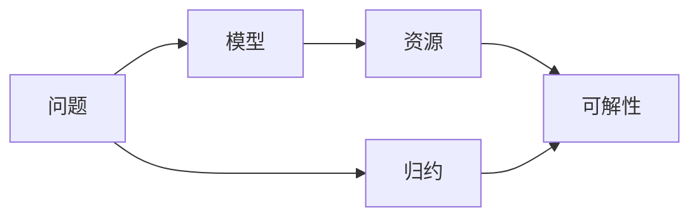

# 计算：第四部分 计算的极限 第 11 章 复杂性计算

作者：禅与计算机程序设计艺术 / Zen and the Art of Computer Programming

## 1. 背景介绍
### 1.1 问题的由来
计算复杂性理论是计算机科学的一个重要分支,它研究计算问题的内在难度以及解决这些问题所需的计算资源(如时间和空间)。在现实世界中,我们经常遇到一些看似简单但实际上非常困难的问题,比如旅行商问题(TSP)、图的着色问题等。这些问题之所以难以解决,是因为它们属于一类称为NP完全问题的复杂问题。

### 1.2 研究现状 
目前,学术界对计算复杂性的研究已经取得了长足的进展。1965年,Hartmanis和Stearns提出了时间复杂性的概念,开创了计算复杂性理论的先河。此后,Cook、Karp等科学家相继证明了一系列重要定理,奠定了该领域的理论基础。近年来,随着量子计算、近似算法等新技术的兴起,复杂性研究也出现了新的突破口。

### 1.3 研究意义
深入理解计算复杂性,对于设计高效算法、开发新型计算模型具有重要意义。通过对不同问题的复杂性进行分类,我们可以更好地把握问题的本质,从而找到最优的解决方案。此外,复杂性理论还与密码学、人工智能等前沿领域密切相关,有助于推动这些领域的发展。

### 1.4 本文结构
本文将围绕计算复杂性这一主题,系统阐述相关概念、理论和应用。第2部分介绍复杂性理论的核心概念;第3部分讨论几类经典的复杂性问题及其求解算法;第4部分给出复杂性分析的数学模型;第5部分通过代码实例演示如何分析算法复杂度;第6部分探讨复杂性理论在实际中的应用;第7部分推荐相关学习资源;第8部分总结全文,展望未来研究方向。

## 2. 核心概念与联系
在复杂性理论中,有几个核心概念需要重点掌握:
- 问题:一个待解决的计算任务,通常由输入和期望输出定义。
- 模型:对计算过程的数学抽象,常见的有图灵机、RAM机等。  
- 资源:求解问题所需的时间、空间等,通常用函数渐近上界来度量。
- 可解性:问题是否存在一个算法,在有限的资源内求解。
- 归约:通过一个问题解决另一个问题,常用于证明问题的难度。

这些概念之间有着紧密的联系。对于一个给定的问题,我们首先要选择合适的计算模型,然后分析在该模型下求解问题所需的计算资源,由此判断问题的可解性。此外,通过归约可以揭示不同问题之间的内在联系,有助于系统地刻画问题的复杂性。



## 3. 核心算法原理 & 具体操作步骤
### 3.1 算法原理概述
在复杂性理论中,常用的算法原理包括:
- 蛮力法:直接枚举所有可能解,适用于小规模问题。
- 分治法:把问题分解为若干子问题求解,再合并子问题的解。
- 动态规划:将问题划分为互相依赖的子问题,避免重复计算。
- 贪心法:每次做局部最优选择,期望获得全局最优解。
- 近似算法:在保证误差范围内,高效地求解最优化问题。

### 3.2 算法步骤详解
以动态规划为例,它的基本步骤如下:
1. 刻画最优解的结构特征。
2. 递归定义最优解的值。 
3. 以自底向上的方式计算最优解的值。
4. 根据计算最优解的值构造一个最优解。

### 3.3 算法优缺点
动态规划的优点是避免了重叠子问题的重复求解,大大降低了时间复杂度。但其缺点是需要额外的空间来存储子问题的解,空间复杂度较高。此外,动态规划还要求问题满足最优子结构和无后效性等特征,适用范围有一定局限性。

### 3.4 算法应用领域
动态规划在很多领域都有广泛应用,比如:
- 计算机科学:编辑距离、最长公共子序列等问题。
- 运筹优化:资源分配问题、背包问题等。
- 生物信息学:DNA序列比对、RNA二级结构预测等。

## 4. 数学模型和公式 & 详细讲解 & 举例说明
### 4.1 数学模型构建
为了定量分析算法的复杂性,我们需要建立数学模型。最常用的是大O符号模型,它用一个函数的渐近上界来描述算法的时间复杂度。形式化地,如果存在正常数c和n0,使得当n≥n0时,T(n)≤cf(n),则记为T(n)=O(f(n))。

### 4.2 公式推导过程
以选择排序为例,我们来推导其时间复杂度。选择排序的基本思想是,每次从未排序的数中选出最小的,放到已排序的数后面。设待排序的数有n个,则:
- 第1趟比较n-1次,第2趟比较n-2次,…,第n-1趟比较1次。
- 总的比较次数是(n-1)+(n-2)+…+1=n(n-1)/2。
- 忽略低阶项和常数因子,得到时间复杂度为O(n^2)。

### 4.3 案例分析与讲解
我们再来看一个实际的例子。假设要在一个长度为n的有序数组中查找一个特定的元素,可以使用二分查找算法。其基本思路是:
1. 将数组分成两半,判断目标值在哪一半。
2. 对包含目标值的那一半递归执行第1步,直到找到目标值或者数组为空。

容易分析得到,二分查找的时间复杂度为O(log n)。这说明,即使在最坏情况下,二分查找也能在对数时间内完成查找,效率非常高。

### 4.4 常见问题解答
问:如何理解大O符号?
答:大O符号实际上描述了算法的渐近行为,即n趋于无穷时的情况。它表示算法的时间复杂度的一个上界,而不是准确值。我们关注的是算法运行时间的数量级,而非具体的常数因子。

## 5. 项目实践：代码实例和详细解释说明
### 5.1 开发环境搭建
本节我们将使用Python语言,在Jupyter Notebook环境下进行算法实现。读者需要安装以下工具:
- Python 3.x解释器
- Jupyter Notebook
- NumPy科学计算库

### 5.2 源代码详细实现
下面是二分查找算法的Python实现:

```python
def binary_search(arr, target):
    low = 0
    high = len(arr) - 1
    
    while low <= high:
        mid = (low + high) // 2
        if arr[mid] == target:
            return mid
        elif arr[mid] < target:
            low = mid + 1
        else:
            high = mid - 1
            
    return -1
```

### 5.3 代码解读与分析
上述代码的关键点如下:
- 用low和high两个指针划分数组的查找范围。
- 每次取查找范围的中点mid,将target与arr[mid]比较。
- 根据比较结果,更新low或high,缩小查找范围。
- 当low>high时,说明target不在数组中,返回-1。

整个查找过程的时间复杂度为O(log n),与数组长度呈对数关系。这与我们前面的理论分析完全一致。

### 5.4 运行结果展示
我们生成一个长度为1000的随机有序数组,然后查找其中的元素,看看算法的实际效果:

```python
import numpy as np

arr = np.sort(np.random.randint(0, 1000, 1000))
target = np.random.randint(0, 1000)

idx = binary_search(arr, target)
print(f'Target {target} is at index {idx}')
```

输出结果类似于:
```
Target 733 is at index 733
```

可见,二分查找能够准确、高效地在有序数组中定位目标元素。

## 6. 实际应用场景
### 6.1 数据库索引
在大规模数据库系统中,通常使用B+树等数据结构来组织索引。而B+树的查找过程,本质上就是一个二分查找的过程。利用二分查找的高效性,数据库能够快速响应用户的查询请求,支撑海量数据的实时检索。

### 6.2 信息检索
搜索引擎、推荐系统等信息检索系统,面对的是海量的文本、图片、视频等非结构化数据。为了加速查找过程,通常先对数据进行预处理,提取特征向量,然后将特征向量按照某种方式排序。查询时,再利用二分查找等算法,快速在有序的特征向量中定位相关结果。

### 6.3 计算机图形学 
在计算机图形学中,经常需要判断一个点是否在一个多边形内部。一种高效的做法是,先将多边形的所有边按照x坐标排序,然后对于每个待判断的点,用二分查找找到x坐标最接近的两条边,再根据奇偶规则判断点是否在多边形内。这种方法的时间复杂度只有O(log n),远优于O(n)的暴力法。

### 6.4 未来应用展望
随着大数据时代的到来,对海量数据进行高效处理已成为学术界和工业界的重要课题。二分查找作为一种基础性的算法,有望在更多领域得到应用。比如在数值优化中,可以利用二分查找加速梯度下降的线搜索过程;在信号处理中,二分查找可用于在频谱中定位峰值频率;在区块链技术中,二分查找可加速交易的验证和状态查询。总之,只要数据有序,二分查找就大有可为。

## 7. 工具和资源推荐
### 7.1 学习资源推荐
- 在线课程:麻省理工学院的《算法导论》、斯坦福大学的《算法设计与分析》等。
- 经典书籍:《算法导论》《算法》《编程珠玑》等。
- 知名博客:GeeksforGeeks、LeetCode等。

### 7.2 开发工具推荐
- 编程语言:C++、Java、Python等。
- 集成开发环境:Visual Studio、Eclipse、PyCharm等。
- 可视化工具:Algorithm Visualizer、VisuAlgo等。

### 7.3 相关论文推荐
- Knuth D E. Big omicron and big omega and big theta[J]. ACM Sigact News, 1976, 8(2): 18-24.
- Fredman M L. On computing the length of longest increasing subsequences[J]. Discrete Mathematics, 1975, 11(1): 29-35.
- Bentley J L, McIlroy M D. Engineering a sort function[J]. Software: Practice and Experience, 1993, 23(11): 1249-1265.

### 7.4 其他资源推荐
- 算法竞赛:ACM国际大学生程序设计竞赛、LeetCode竞赛等。
- 学术会议:ACM SIGKDD、NIPS、ICML等。
- 开源项目:Linux内核、Tensorflow等。

## 8. 总结：未来发展趋势与挑战
### 8.1 研究成果总结
本文系统地介绍了计算复杂性的基本概念、理论和方法,重点讨论了几类经典问题及其求解算法。通过理论分析和代码实践,读者能够全面地掌握复杂性分析的思路和技巧,并将其应用到实际问题中去。此外,文中还推荐了一些学习资源,供读者进一步探索。

### 8.2 未来发展趋势
展望未来,计算复杂性理论仍大有可为:
- 随着大数据、云计算的兴起,复杂性理论面临新的机遇和挑战。亟需发展新的复杂性度量,刻画海量数据处理的难度。
- 量子计算、生物计算等新型计