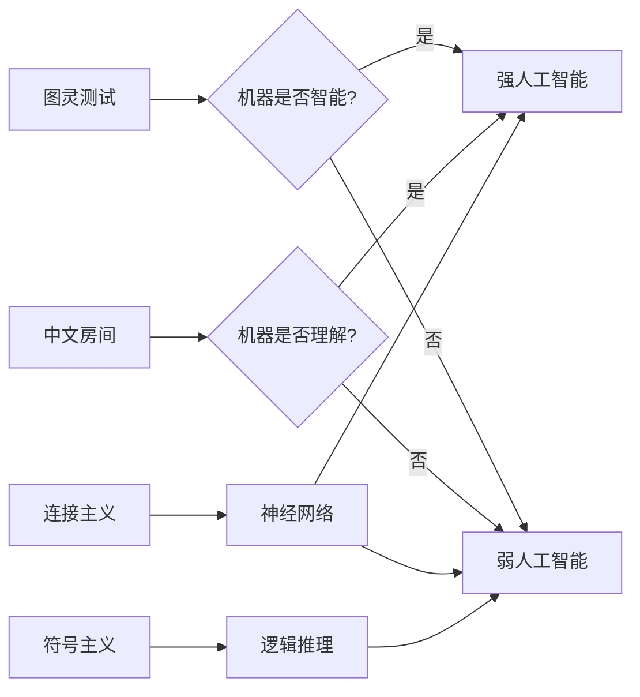

# 计算：第四部分 计算的极限 第 12 章 机器能思考吗 ChatGPT 与乌鸦

作者：禅与计算机程序设计艺术 / Zen and the Art of Computer Programming

## 1. 背景介绍

### 1.1 问题的由来

自从计算机诞生以来，人们就开始思考一个深奥而有趣的问题：机器能否像人类一样思考？这个问题涉及到计算机科学、人工智能、哲学、心理学等多个领域。近年来，随着人工智能技术的飞速发展，尤其是 ChatGPT 等大型语言模型的出现，"机器能思考吗"这一问题再次引发了广泛关注和讨论。

### 1.2 研究现状

目前，学术界对于"机器能否思考"尚无定论。支持者认为，随着人工智能算法的不断进步，机器已经表现出了类似人类思维的特征，如理解、推理、创造等。而怀疑者则指出，机器的所谓"思考"只是基于海量数据训练而成的模式匹配，缺乏真正的理解和意识。

### 1.3 研究意义

探讨"机器能否思考"这一问题，对于理解人工智能的本质、界定人类智能的特殊性、预测未来科技发展趋势等方面都具有重要意义。这不仅是一个技术问题，更是一个哲学问题，关乎人类对自身和世界的认知。

### 1.4 本文结构

本文将从以下几个方面展开论述：首先介绍图灵测试和中文房间思想实验等经典理论，阐明"机器思考"这一命题的由来和内涵；然后重点分析当前最先进的对话式 AI 系统 ChatGPT 的工作原理，评估其在模拟人类智能方面取得的成就和局限；接着从认知科学的角度，对比 ChatGPT 与人类思维、乌鸦智能的异同；最后展望人工智能未来的发展方向和可能带来的影响。

## 2. 核心概念与联系

- 图灵测试：由图灵提出，用于判定机器是否具有智能的思想实验。
- 中文房间：由 Searle 提出，用于反驳机器能真正理解语言的思想实验。 
- 连接主义：认为智能源自大量神经元之间的连接，启发了神经网络算法。
- 符号主义：认为智能源自对符号的运算和操纵，启发了逻辑推理系统。
- 认知科学：研究智能的计算模型，整合心理学、神经科学、哲学等学科。
- 强人工智能：具有类似人类的自主意识和泛化能力，是 AI 发展的终极目标。
- 弱人工智能：针对特定任务的智能系统，如语音识别、下棋程序等。



## 3. 核心算法原理 & 具体操作步骤

### 3.1 算法原理概述

ChatGPT 采用的是自然语言处理领域的 Transformer 神经网络架构。Transformer 的核心是注意力机制，它能够学习文本序列中各个位置之间的依赖关系，捕捉到全局的上下文信息。具体来说，ChatGPT 使用了 GPT(Generative Pre-trained Transformer) 预训练模型，在大规模无标签文本数据上进行自监督学习，掌握了丰富的语言知识。

### 3.2 算法步骤详解

1. 输入编码：将输入文本转化为向量表示，添加位置编码以引入顺序信息。
2. 自注意力计算：通过 query、key、value 计算序列各位置之间的注意力权重。
3. 前馈神经网络：对注意力输出进行非线性变换，提取高层特征。
4. 残差连接和层标准化：缓解深度网络的梯度消失问题，加速收敛。
5. Decoder 生成：根据编码结果和之前生成的词，预测下一个词的概率分布。
6. 贪心搜索或 beam search：从概率分布中采样出质量较高的生成结果。

### 3.3 算法优缺点

优点：
- 注意力机制能够建模长程依赖，生成连贯、流畅的文本。
- 预训练捕捉了丰富的语言知识，具备一定的常识推理能力。
- 端到端生成，不需要人工设计复杂的特征和规则。

缺点：
- 模型参数量巨大，训练和推理成本高昂。
- 容易生成事实性错误，对于知识密集型任务效果有限。
- 难以加入外部知识，泛化能力不足。

### 3.4 算法应用领域

ChatGPT 作为通用语言模型，可应用于多个自然语言处理任务：
- 对话系统：如智能客服、聊天机器人等。
- 问答系统：根据给定问题生成相关答案。
- 文本生成：如写作助手、内容创作等。
- 语言翻译：进行多语言互译。
- 文本分类：对文本进行主题、情感等分类。

## 4. 数学模型和公式 & 详细讲解 & 举例说明

### 4.1 数学模型构建

Transformer 的核心是注意力机制 (attention)，可以表示为将 query 向量 $q$ 与一组 key 向量 $k_i$ 进行相似度计算，得到权重系数 $\alpha_i$，然后用 $\alpha_i$ 对 value 向量 $v_i$ 进行加权求和，得到 attention 值。其数学模型可以表示为：

$$
\begin{aligned}
\alpha_i &= \frac{\exp(q \cdot k_i)}{\sum_j \exp(q \cdot k_j)} \\
\text{Attention}(q, K, V) &= \sum_i \alpha_i v_i
\end{aligned}
$$

其中，$K$ 和 $V$ 分别表示所有 key 向量和 value 向量组成的矩阵。

### 4.2 公式推导过程

Transformer 中使用的是多头注意力 (multi-head attention)，即将 $Q$、$K$、$V$ 矩阵各自乘以不同的权重矩阵 $W^Q$、$W^K$、$W^V$，然后并行计算多个 attention 值，最后拼接起来再乘以权重矩阵 $W^O$。公式如下：

$$
\begin{aligned}
\text{MultiHead}(Q, K, V) &= \text{Concat}(\text{head}_1, \dots, \text{head}_h)W^O \\
\text{head}_i &= \text{Attention}(QW_i^Q, KW_i^K, VW_i^V)
\end{aligned}
$$

其中，$W_i^Q \in \mathbb{R}^{d_{\text{model}} \times d_k}$，$W_i^K \in \mathbb{R}^{d_{\text{model}} \times d_k}$，$W_i^V \in \mathbb{R}^{d_{\text{model}} \times d_v}$，$W^O \in \mathbb{R}^{hd_v \times d_{\text{model}}}$，$h$ 为并行 attention 的数量，$d_k = d_v = d_{\text{model}}/h$。

### 4.3 案例分析与讲解

以一个英文句子 "The animal didn't cross the street because it was too tired" 为例，说明 Transformer 的注意力机制如何起作用。

首先，将句子中的每个词映射为词向量，然后添加位置编码，得到输入矩阵 $X$。接着，通过多头注意力计算得到隐藏状态矩阵 $Z$：

$$
\begin{aligned}
Q &= XW^Q \\
K &= XW^K \\ 
V &= XW^V \\
Z &= \text{MultiHead}(Q, K, V)
\end{aligned}
$$

在计算注意力时，模型会自动学习到词与词之间的依赖关系。例如，代词 "it" 与前面的名词 "animal" 有较强的关联，因此对应的注意力权重会较大。

最后，将 $Z$ 矩阵送入前馈神经网络，再叠加几个 Transformer Block，就得到了最终的输出表示。这个表示编码了句子的语义信息，可用于下游的各种任务。

### 4.4 常见问题解答

Q：Transformer 为什么采用多头注意力？
A：多头注意力允许模型在不同的表示子空间内学习到不同的语义信息，提高了模型的表达能力。此外，多头注意力能并行计算，提高了训练效率。

Q：为什么要在输入中加入位置编码？
A：Transformer 是一个非循环的结构，没有捕捉序列顺序信息的机制。位置编码引入了单词的位置信息，使得模型能够区分不同位置的词。

Q：Transformer 的计算复杂度是多少？
A：Transformer 的计算复杂度是 $O(n^2 \cdot d)$，其中 $n$ 是序列长度，$d$ 是特征维度。由于采用了自注意力机制，计算复杂度是平方级的，这限制了 Transformer 处理超长文本的能力。

## 5. 项目实践：代码实例和详细解释说明

### 5.1 开发环境搭建

- Python 3.x
- PyTorch 深度学习框架
- Transformers 库：包含预训练的 Transformer 模型
- GPU 硬件加速（可选）

安装命令：
```bash
pip install torch transformers
```

### 5.2 源代码详细实现

使用 Hugging Face 的 Transformers 库，可以方便地调用预训练的 ChatGPT 模型。以下是一个简单的对话生成示例：

```python
from transformers import AutoTokenizer, AutoModelForCausalLM

# 加载预训练的 ChatGPT 模型和分词器
model_name = "microsoft/DialoGPT-large"
tokenizer = AutoTokenizer.from_pretrained(model_name)
model = AutoModelForCausalLM.from_pretrained(model_name)

# 定义初始对话历史
history = []

while True:
    # 获取用户输入
    user_input = input("User: ")
    
    # 将对话历史编码为模型输入
    input_ids = tokenizer.encode(user_input, return_tensors="pt")
    history.append(input_ids)
    model_input = torch.cat(history, dim=-1)
    
    # 生成模型回复
    output = model.generate(
        model_input, 
        max_length=1000, 
        pad_token_id=tokenizer.eos_token_id,
        no_repeat_ngram_size=3,
        do_sample=True,
        top_k=100, 
        top_p=0.7,
        temperature=0.8
    )
    
    # 解码模型输出
    response = tokenizer.decode(
        output[:, model_input.shape[-1]:][0], 
        skip_special_tokens=True
    )
    
    # 打印模型回复并更新对话历史
    print(f"ChatGPT: {response}")
    history.append(output[:, model_input.shape[-1]:])
```

### 5.3 代码解读与分析

1. 首先加载预训练的 ChatGPT 模型和对应的分词器。这里使用了微软开源的 DialoGPT 模型，它在大规模对话数据集上进行了预训练，具有较好的对话生成能力。
2. 初始化一个空的对话历史列表 `history`，用于存储之前的对话内容。
3. 进入一个无限循环，不断获取用户输入，生成模型回复，并更新对话历史。
4. 使用分词器将用户输入编码为模型可接受的张量格式，添加到对话历史中，并将历史拼接为完整的模型输入。
5. 调用 `model.generate()` 方法生成模型回复。这里设置了一些生成参数，如最大长度、不重复 n-gram、采样策略等，以提高生成质量和多样性。
6. 对模型生成的输出进行解码，去除特殊字符，得到最终的回复文本。
7. 打印模型回复，并将其添加到对话历史中，以便下一轮对话使用。

### 5.4 运行结果展示

以下是一个简单的人机对话示例：

```
User: Hello, how are you today?
ChatGPT: I'm doing well, thank you for asking. How about you? How has your