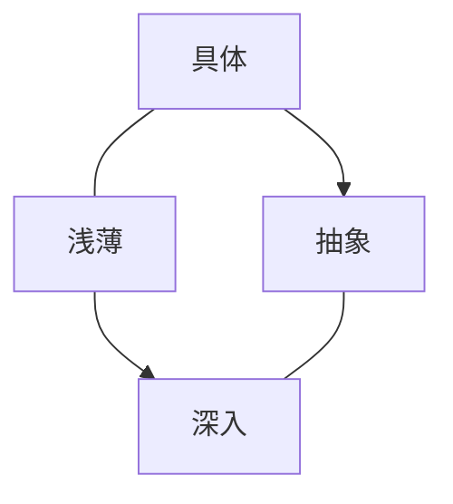
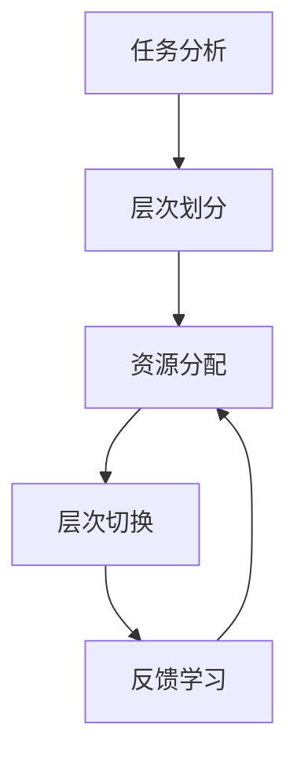

# 认知发展中的浅薄与复杂

## 1. 背景介绍

### 1.1 问题的由来

在当今信息时代,人类认知发展面临着前所未有的挑战和机遇。随着技术的飞速发展,信息量呈指数级增长,人们可以轻松获取海量信息。然而,这种信息过载也带来了一些负面影响,例如注意力分散、浅层次思考和认知能力下降等问题。

与此同时,人工智能(AI)、大数据和物联网等新兴技术不断推动着认知发展的复杂化。这些技术使得人类可以处理更加复杂的问题,但也增加了认知负担。因此,在这个充满矛盾的时代,我们需要重新思考认知发展的本质,寻求平衡浅薄与复杂之间的关系。

### 1.2 研究现状

目前,认知科学、教育心理学和神经科学等领域都在探索认知发展的规律和影响因素。一些研究表明,浅层次思考和注意力分散会降低认知效率,而深度思考和专注则有助于提高认知能力。同时,复杂性也是认知发展的重要驱动力,因为它促进了人类解决更加困难的问题。

然而,现有研究往往将浅薄和复杂视为两个独立的概念,缺乏将它们统一到同一理论框架下的尝试。因此,我们需要一个更加全面的视角来审视认知发展中的这两个关键因素。

### 1.3 研究意义

深入探讨认知发展中的浅薄与复杂,对于我们更好地理解和发展人类认知能力具有重要意义。首先,它有助于我们认识到浅薄和复杂之间的矛盾和统一,从而更好地把握认知发展的本质。其次,它可以为教育、工作和日常生活中的认知训练提供理论指导,帮助人们培养更加高效的认知习惯。此外,这一研究也将为人工智能系统的设计和优化提供启示,促进人机协作和增强人类认知能力。

### 1.4 本文结构

本文将从多个角度探讨认知发展中的浅薄与复杂。首先,我们将介绍浅薄和复杂的核心概念及它们之间的联系。然后,我们将深入分析认知发展的核心算法原理和数学模型,并通过案例分析加以说明。接下来,我们将展示一个实际项目的代码实现,并解释其中的关键步骤。最后,我们将探讨认知发展的实际应用场景、未来发展趋势和面临的挑战。

## 2. 核心概念与联系

在探讨认知发展中的浅薄与复杂之前,我们需要首先明确这两个概念的含义及它们之间的关联。

**浅薄(Shallowness)**指的是认知活动缺乏深度和专注,往往表现为注意力分散、思维肤浅和缺乏批判性思考。浅薄认知通常是由于信息过载、多任务处理和即时gratification(即时满足)等因素导致的。

**复杂(Complexity)**则指认知对象或任务的intrinsic difficulty(内在难度)。复杂认知需要处理大量信息、建立多重关联和解决高度抽象的问题。复杂性来源于问题本身的性质,以及认知者的知识水平和经验。

虽然浅薄和复杂看似是对立的概念,但它们实际上是相互关联的。一方面,过度的浅薄会阻碍我们理解和处理复杂问题;另一方面,复杂性也可能导致我们采取浅层次的策略来简化认知负担。

为了更好地理解这一关系,我们可以借助**"认知维度理论"**。该理论将认知活动分为两个正交维度:水平维度(从具体到抽象)和垂直维度(从浅薄到深入)。浅薄和复杂分别位于垂直维度的两个极端,而认知发展的目标是在两个维度上都达到更高的水平。

上图展示了认知维度理论中的四个象限。左下角代表具体且浅薄的认知,右上角则代表抽象且深入的认知,这是认知发展的最高境界。通过分析不同象限的特点,我们可以更好地把握浅薄与复杂之间的关系,并探索如何在两个维度上实现平衡和发展。

## 3. 核心算法原理和具体操作步骤

### 3.1 算法原理概述

为了量化和优化认知发展中的浅薄与复杂,我们提出了一种基于**多层次认知架构**的算法。该算法的核心思想是将认知过程分解为多个层次,每个层次对应不同的认知深度和复杂程度。通过在不同层次之间切换和调节,算法可以实现浅薄与复杂之间的动态平衡。

该算法基于**认知负载理论**和**注意力资源管理**等认知科学原理,旨在最大限度地利用有限的认知资源。它的优势在于能够根据任务需求和个体差异动态调整认知策略,从而提高认知效率和效果。

### 3.2 算法步骤详解

我们的多层次认知架构算法包括以下主要步骤:

1. **任务分析**:首先对待处理的认知任务进行分析,确定其复杂程度和所需的认知资源。

2. **层次划分**:根据任务复杂度,将认知过程划分为多个层次,每个层次对应不同的认知深度和策略。较浅的层次采用启发式或简化策略,而较深的层次则使用更加精细和复杂的方法。

3. **资源分配**:根据任务需求和个体的认知能力,在不同层次之间动态分配注意力和工作记忆等认知资源。

4. **层次切换**:在认知过程中,算法会根据实时反馈和任务进展情况,在不同层次之间进行切换和调节,以维持最佳的认知状态。

5. **反馈学习**:算法会记录每次认知过程的效果,并根据反馈进行持续优化,以提高未来任务的处理效率。

上述步骤可以用下面的流程图来概括:

在实际应用中,我们可以根据具体场景对算法进行调整和优化。例如,在教育领域,我们可以将算法应用于自适应学习系统,根据学生的知识水平和学习进度动态调整教学策略和难度。在工作场景中,算法可以帮助员工更好地管理注意力资源,在繁重的工作任务和中断之间保持平衡。

### 3.3 算法优缺点

我们的多层次认知架构算法具有以下优点:

- **动态平衡**:能够根据任务需求和个体差异动态调整浅薄与复杂之间的平衡,提高认知效率。
- **资源优化**:通过合理分配有限的认知资源,避免资源浪费和认知过载。
- **可扩展性**:算法框架具有良好的可扩展性,可以根据需求增加或修改层次和策略。
- **持续学习**:算法会根据反馈不断优化自身,从而适应不同的任务和环境。

然而,该算法也存在一些潜在的缺点和挑战:

- **参数调优**:算法涉及多个参数和阈值的设置,需要大量的数据和试验来进行调优。
- **个体差异**:不同个体的认知能力和偏好存在显著差异,需要个性化的参数配置。
- **复杂度**:算法本身的复杂度较高,实现和部署可能需要大量的计算资源。
- **数据需求**:算法需要大量的认知数据进行训练和优化,这可能会带来隐私和伦理方面的挑战。

### 3.4 算法应用领域

我们的多层次认知架构算法可以应用于多个领域,以优化认知发展中的浅薄与复杂之间的平衡:

- **教育**:在自适应学习系统中,算法可以根据学生的知识水平和学习进度动态调整教学策略和难度。
- **工作**:算法可以帮助员工更好地管理注意力资源,在繁重的工作任务和中断之间保持平衡。
- **人机交互**:在人机交互系统中,算法可以根据用户的认知状态动态调整界面和交互方式,提高用户体验。
- **认知训练**:算法可以用于设计个性化的认知训练方案,针对性地提高注意力、工作记忆等认知能力。
- **人工智能**:算法可以应用于人工智能系统的设计和优化,使其能够更好地模拟和补充人类的认知过程。

总的来说,我们的算法为多个领域提供了一种有效的方法,帮助人类更好地管理和发展自身的认知能力,应对日益复杂的认知需求。

## 4. 数学模型和公式详细讲解与举例说明

### 4.1 数学模型构建

为了量化和优化认知发展中的浅薄与复杂,我们构建了一个基于**多层次认知架构**的数学模型。该模型旨在描述不同层次之间的资源分配和切换策略,并为算法的实现提供理论基础。

我们将认知过程划分为 $N$ 个层次,每个层次 $i$ 对应一个认知深度 $d_i$ 和复杂度 $c_i$。认知深度 $d_i$ 描述了该层次的思考深度和专注程度,取值范围为 $[0,1]$,其中 $0$ 表示极浅薄, $1$ 表示极深入。复杂度 $c_i$ 描述了该层次所处理问题的内在难度,也取值范围为 $[0,1]$,其中 $0$ 表示极简单, $1$ 表示极复杂。

我们假设个体拥有总的认知资源 $R$,需要在不同层次之间进行分配。对于第 $i$ 层,分配的资源量为 $r_i$,满足约束条件:

$$\sum_{i=1}^{N} r_i = R$$

每个层次的认知效率 $e_i$ 由深度 $d_i$、复杂度 $c_i$ 和分配的资源量 $r_i$ 共同决定,可以用下式表示:

$$e_i = f(d_i, c_i, r_i)$$

其中,函数 $f$ 描述了三个变量之间的关系。一种简化的线性模型可以写作:

$$e_i = \alpha d_i - \beta c_i + \gamma r_i$$

这里 $\alpha$、$\beta$ 和 $\gamma$ 是模型参数,需要通过实验数据进行拟合。

我们的目标是最大化总的认知效率 $E$,即所有层次效率之和:

$$\max E = \sum_{i=1}^{N} e_i$$

同时满足资源约束条件:

$$\sum_{i=1}^{N} r_i = R$$

通过建立和求解这一优化问题,我们可以得到最优的资源分配策略 $\{r_i^*\}$,从而实现浅薄与复杂之间的最佳平衡。

### 4.2 公式推导过程

下面我们将详细推导上述数学模型中的公式,并解释它们的含义和应用场景。

首先,我们定义每个层次的认知效率 $e_i$ 为该层次完成任务的速度或质量。显然,效率会受到认知深度 $d_i$、复杂度 $c_i$ 和分配的资源量 $r_i$ 的影响。

- 当认知深度 $d_i$ 较高时,表示该层次采用了更加专注和深入的认知策略,有利于提高效率。
- 当复杂度 $c_i$ 较高时,表示该层次所处理的问题更加困难,会降低效率。
- 当分配的资源量 $r_i$ 较多时,该层次拥有更多的计算能力和工作记忆,有利于提高效率。

因此,我们可以假设效率 $e_i$ 是深度 $d_i$、复杂度 $c_i$ 和