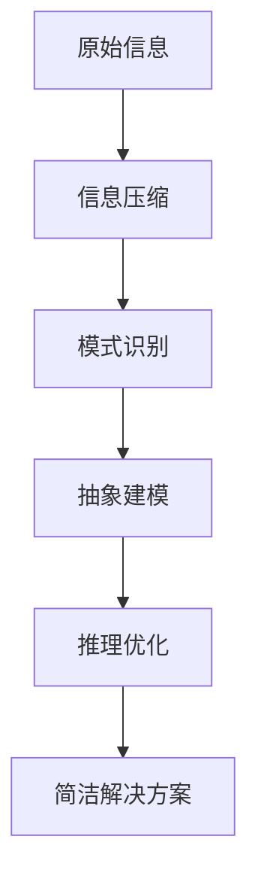

# 认知发展中的深刻简洁阶段

## 1. 背景介绍

### 1.1 问题的由来

人类认知发展一直是心理学和神经科学领域的核心研究课题之一。随着人工智能技术的不断进步,研究人类认知发展过程及其内在机理对于构建通用人工智能系统具有重要意义。传统的认知发展理论主要关注儿童早期认知能力的获得,但对于成人后期认知发展阶段的探讨相对较少。

### 1.2 研究现状  

近年来,一些研究者开始关注成人后期认知发展的"深刻简洁阶段"(Profound Simplicity Stage)。这一阶段指的是,经过长期学习和实践积累后,个体能够对复杂问题形成深刻而简洁的理解和解决方案。然而,目前对于这一阶段的本质特征、发展机制和影响因素等方面的研究还较为薄弱。

### 1.3 研究意义

深入探究"深刻简洁阶段",有助于我们全面把握人类认知发展的整体过程,揭示高阶认知能力的形成机制。这不仅具有重要的理论意义,而且对于培养具有创新思维和解决复杂问题能力的人才也有重要的现实指导意义。同时,研究这一阶段的认知特点和神经基础,或许能为构建通用人工智能系统提供有益的启示。

### 1.4 本文结构

本文将首先介绍"深刻简洁阶段"的核心概念及其与其他认知发展阶段的联系,接着阐述其发展的核心算法原理和数学模型,并通过案例分析对模型进行讲解。然后探讨这一阶段在实际应用中的体现,并给出相关的学习资源和工具推荐。最后,总结研究成果,展望未来的发展趋势和面临的挑战。

## 2. 核心概念与联系

"深刻简洁阶段"是人类认知发展的高阶阶段,表现为个体能够对复杂问题形成深邃而精简的理解和解决方案。这一阶段建立在前期认知发展的基础之上,但又展现出独特的认知特征。

根据皮亚杰的认知发展理论,人类认知发展大致可分为感知运动阶段、前运算阶段、具体运算阶段和形式运算阶段。其中,形式运算阶段标志着个体开始具备抽象推理和系统思考的能力,这为进入"深刻简洁阶段"奠定了基础。

不过,"深刻简洁阶段"并非孤立存在,它与其他认知发展阶段存在内在联系。例如,在这一阶段,个体对具体事物的感知能力并未减弱,但感知过程更加高效和精准;对于抽象概念的理解也更加深入,能够透过现象把握本质。因此,"深刻简洁阶段"可被视为对前期各阶段认知能力的综合和升华。

此外,进入"深刻简洁阶段"并非一蹴而就,而是一个渐进的过程。个体需要通过长期的学习、实践和反思,不断积累经验,优化认知策略,才能逐步达到这一阶段。同时,这一阶段也并非是认知发展的终点,个体的认知能力可能会在这一阶段后继续深化和完善。

## 3. 核心算法原理和具体操作步骤

### 3.1 算法原理概述

"深刻简洁阶段"的核心算法原理可概括为"精减求精"。具体来说,它包括以下几个关键环节:

1. 信息压缩:对大量原始信息进行高效压缩,提取出关键特征和本质规律。
2. 模式识别:在压缩后的信息中识别出潜在的模式和结构。
3. 抽象建模:基于识别出的模式,构建出精简的抽象模型。
4. 推理优化:在抽象模型的基础上,进行高效的推理和优化,得到简洁的解决方案。

这一算法原理的实现,需要综合运用多种认知策略,包括注意力控制、工作记忆、类比推理、发散思维和收敛思维等。通过有效整合这些策略,个体才能逐步完成从复杂到简洁的认知转化过程。

### 3.2 算法步骤详解

1. **信息压缩**

   - 通过注意力控制机制,有选择性地关注信息中的关键部分。
   - 利用工作记忆和长期记忆,对信息进行编码、压缩和存储。
   - 运用发散思维,从多角度考虑信息的内涵和外延。

2. **模式识别**  

   - 基于类比推理,将新信息与已有知识建立联系。
   - 通过对比分析,发现信息之间的相似性和规律性。
   - 运用收敛思维,整合分散的信息,形成统一的模式。

3. **抽象建模**

   - 将识别出的模式抽象为精简的数学模型或概念模型。
   - 通过思维实验,验证和完善抽象模型的合理性和适用性。
   - 在必要时,对模型进行调整和优化,使其更加精炼。

4. **推理优化**

   - 在抽象模型的框架下,进行高效的逻辑推理和计算。
   - 结合启发式搜索等优化算法,寻找最优或近似最优解。
   - 将推理结果具体化为简洁的解决方案或决策建议。

### 3.3 算法优缺点

"深刻简洁阶段"的核心算法具有以下优点:

- 能够高效处理大量复杂信息,提取出本质内涵。
- 形成的解决方案简洁精炼,易于理解和实施。
- 具有很强的泛化能力,可应用于广泛的问题领域。

但同时,该算法也存在一些缺点和局限性:

- 过度简化可能导致信息损失,无法捕捉全部细节。
- 对已有知识和认知框架存在一定依赖,难以完全摆脱固有思维定式。
- 算法的有效性在很大程度上取决于个体的经验和智力水平。

### 3.4 算法应用领域

"深刻简洁阶段"的核心算法可应用于多个领域,包括但不限于:

- **科学研究**:用于发现自然规律、构建理论模型。
- **工程设计**:简化复杂系统,实现高效优化。
- **决策分析**:从大量信息中提炼关键因素,做出明智决策。
- **教育教学**:帮助学生形成对知识的深刻理解。
- **艺术创作**:捕捉事物的本质,创作出简洁而富有内涵的作品。

## 4. 数学模型和公式详细讲解举例说明

为了更好地刻画"深刻简洁阶段"的认知过程,我们可以构建一个数学模型。该模型旨在量化表征个体对复杂信息的理解程度,并描述从复杂到简洁的转化过程。

### 4.1 数学模型构建

假设一个认知系统接收到一个包含 $N$ 个特征的信息输入 $\boldsymbol{x} = (x_1, x_2, \ldots, x_N)$,其中每个特征 $x_i$ 取值为 0 或 1。该系统的目标是找到一个能够很好地描述输入信息的简洁模型 $\boldsymbol{y} = (y_1, y_2, \ldots, y_M)$,其中 $M \ll N$。

我们定义一个目标函数 $J(\boldsymbol{x}, \boldsymbol{y})$ 来衡量模型 $\boldsymbol{y}$ 对输入信息 $\boldsymbol{x}$ 的描述质量,即模型的精确性和简洁性。该目标函数可以表示为:

$$J(\boldsymbol{x}, \boldsymbol{y}) = \alpha \cdot \text{Accuracy}(\boldsymbol{x}, \boldsymbol{y}) - \beta \cdot \text{Complexity}(\boldsymbol{y})$$

其中:

- $\text{Accuracy}(\boldsymbol{x}, \boldsymbol{y})$ 表示模型 $\boldsymbol{y}$ 对输入信息 $\boldsymbol{x}$ 的描述精确度,取值范围为 $[0, 1]$,值越大表示描述越精确。
- $\text{Complexity}(\boldsymbol{y})$ 表示模型 $\boldsymbol{y}$ 的复杂度,可以用模型的维数 $M$ 或其他复杂度度量来衡量。
- $\alpha$ 和 $\beta$ 分别是精确度和复杂度的权重系数,用于平衡两者之间的关系。

在这个框架下,"深刻简洁阶段"的核心算法就是寻找一个能够最大化目标函数 $J(\boldsymbol{x}, \boldsymbol{y})$ 的最优模型 $\boldsymbol{y}^*$,即:

$$\boldsymbol{y}^* = \arg\max_{\boldsymbol{y}} J(\boldsymbol{x}, \boldsymbol{y}) = \arg\max_{\boldsymbol{y}} \left[ \alpha \cdot \text{Accuracy}(\boldsymbol{x}, \boldsymbol{y}) - \beta \cdot \text{Complexity}(\boldsymbol{y}) \right]$$

这实际上是一个精确度和简洁性之间的权衡问题。算法需要在这两个目标之间寻找最佳平衡点,得到一个能够精确描述输入信息的同时又尽可能简洁的模型。

### 4.2 公式推导过程

下面我们来推导上述目标函数中的 $\text{Accuracy}(\boldsymbol{x}, \boldsymbol{y})$ 和 $\text{Complexity}(\boldsymbol{y})$ 的具体形式。

**精确度 $\text{Accuracy}(\boldsymbol{x}, \boldsymbol{y})$**

我们可以将精确度定义为模型 $\boldsymbol{y}$ 对输入信息 $\boldsymbol{x}$ 的重构误差的补,即:

$$\text{Accuracy}(\boldsymbol{x}, \boldsymbol{y}) = 1 - \frac{\|\boldsymbol{x} - \hat{\boldsymbol{x}}\|_2^2}{\|\boldsymbol{x}\|_2^2}$$

其中 $\hat{\boldsymbol{x}}$ 是基于模型 $\boldsymbol{y}$ 对输入信息 $\boldsymbol{x}$ 的重构,即:

$$\hat{\boldsymbol{x}} = f(\boldsymbol{y})$$

这里 $f(\cdot)$ 是一个解码函数,用于从简洁模型 $\boldsymbol{y}$ 重构出原始信息的估计 $\hat{\boldsymbol{x}}$。

**复杂度 $\text{Complexity}(\boldsymbol{y})$**  

模型 $\boldsymbol{y}$ 的复杂度可以用其维数 $M$ 来衡量,即:

$$\text{Complexity}(\boldsymbol{y}) = M$$

当然,也可以使用其他复杂度度量,如最小描述长度(Minimum Description Length)等。

将上述公式代入目标函数 $J(\boldsymbol{x}, \boldsymbol{y})$,我们得到:

$$J(\boldsymbol{x}, \boldsymbol{y}) = \alpha \cdot \left( 1 - \frac{\|\boldsymbol{x} - f(\boldsymbol{y})\|_2^2}{\|\boldsymbol{x}\|_2^2} \right) - \beta M$$

这就是我们要最大化的目标函数,它平衡了模型的精确度和简洁度。通过优化该目标函数,我们可以得到最优的简洁模型 $\boldsymbol{y}^*$。

### 4.3 案例分析与讲解

为了更好地理解上述数学模型,我们来分析一个具体的案例。假设我们要对一幅 $32 \times 32$ 像素的黑白图像进行压缩和简化,图像可以表示为一个 $1024$ 维的二值向量 $\boldsymbol{x}$。我们的目标是找到一个能够很好描述该图像的简洁模型 $\boldsymbol{y}$,例如一个参数化的几何形状模型。

在这个例子中,解码函数 $f(\boldsymbol