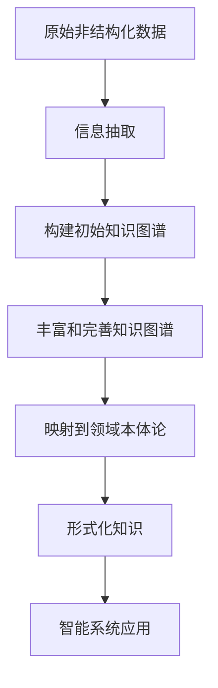

# 认知的形式化：抽象的数据在智能时代被比作"石油"，可以进行大数据挖掘，帮助寻求事物运行的规律

## 1. 背景介绍

### 1.1 问题的由来

在当今时代，数据已经成为了一种新型的战略资源。随着信息技术的不断发展和数据采集手段的日益完善，海量的数据被不断产生和积累。这些数据蕴含着巨大的价值潜力，可以被视为"新石油"。然而，原始数据的形式往往是杂乱无章、难以直接利用的。因此，如何从这些原始数据中提取有价值的信息和知识，并将其形式化以供智能系统理解和利用，成为了一个亟待解决的问题。

### 1.2 研究现状

为了解决上述问题，研究人员一直在努力探索数据的形式化表示方法。目前，已经出现了一些成熟的技术和框架，如知识图谱、本体论、语义网等。这些技术旨在将非结构化或半结构化的数据转化为具有语义关联的形式化表示，从而使得机器能够更好地理解和处理这些数据。

然而，现有的形式化表示方法仍然存在一些不足之处。例如，它们通常只能处理特定领域或特定类型的数据，缺乏通用性和可扩展性。此外，构建和维护这些形式化表示系统往往需要大量的人工劳动,成本高昂。

### 1.3 研究意义

形式化表示数据对于实现真正的人工智能具有重要意义。只有将原始数据转化为机器可理解的形式,智能系统才能够从中获取知识,进行推理和决策。因此,发展更加通用、高效、可扩展的数据形式化表示方法,是推动人工智能发展的关键所在。

此外,形式化表示数据也为许多其他领域带来了新的机遇。例如,在知识管理领域,形式化表示可以帮助企业更好地组织和利用内部知识资产;在自然语言处理领域,形式化表示可以提高机器对自然语言的理解能力;在决策支持系统中,形式化表示可以为决策提供更加可靠的数据基础。

### 1.4 本文结构

本文将首先介绍数据形式化表示的核心概念和原理,包括知识图谱、本体论等。然后,将详细阐述一种新型的数据形式化表示算法,包括其数学模型、具体实现步骤等。接下来,本文将通过实际案例和代码示例,展示该算法在实践中的应用。最后,本文将总结该领域的未来发展趋势和面临的挑战。

## 2. 核心概念与联系

数据形式化表示的核心概念包括:

1. **知识图谱(Knowledge Graph)**: 知识图谱是一种将结构化数据以图的形式表示的方法。在知识图谱中,实体(Entity)通过关系(Relation)相互连接,形成一个具有语义关联的知识网络。知识图谱可以清晰地展示实体之间的关系,便于机器理解和推理。

2. **本体论(Ontology)**: 本体论是一种明确定义概念、属性和关系的形式化表示方法。它为特定领域构建了一个共享的概念模型,使得不同系统之间可以交换和重用知识。本体论通常采用一种层次化的结构,从最抽象的概念到最具体的实例。

3. **语义网(Semantic Web)**: 语义网是一种基于Web标准的知识表示和共享方式。它使用了一系列标准化的语言和技术,如RDF、OWL等,旨在赋予Web内容以明确定义的含义,使机器能够自动理解和处理这些内容。

4. **知识表示(Knowledge Representation)**: 知识表示是指将知识以机器可理解的形式进行编码和存储的过程。常见的知识表示方法包括逻辑规则、框架、语义网络等。选择合适的知识表示方式对于机器学习和推理至关重要。

5. **推理(Reasoning)**: 推理是指根据已有的知识和规则,推导出新的知识或结论的过程。在形式化表示的数据基础上,智能系统可以进行各种推理,如规则推理、案例推理、模糊推理等,从而获取新的见解和洞察力。

上述概念相互关联、相辅相成。知识图谱和本体论为数据提供了形式化的表示方式,语义网则提供了一种在Web环境下共享和交换这些形式化知识的标准。知识表示和推理则是将这些形式化知识应用于智能系统的关键技术。

## 3. 核心算法原理 & 具体操作步骤

### 3.1 算法原理概述

本节将介绍一种新型的数据形式化表示算法,该算法综合了知识图谱、本体论和语义网等技术,旨在实现更加通用、高效和可扩展的数据形式化表示。

该算法的核心思想是:首先,利用自然语言处理和信息抽取技术从非结构化数据(如文本、网页等)中提取出实体、关系和属性等元素;然后,基于这些元素自动构建一个初始的知识图谱;接着,利用机器学习和语义推理技术不断丰富和完善这个知识图谱,同时将其映射到一个领域本体论中;最后,将得到的形式化知识按照语义网标准进行编码和存储,以便在不同系统之间共享和交换。

该算法的优势在于,它能够自动从非结构化数据中提取知识,减少了人工构建的工作量;同时,它也具有很强的通用性和可扩展性,可以适用于不同领域的数据。此外,该算法将知识图谱、本体论和语义网等技术有机结合,形成了一个完整的数据形式化表示解决方案。

### 3.2 算法步骤详解

1. **信息抽取**

   - 使用自然语言处理技术(如命名实体识别、关系抽取等)从非结构化数据(如文本、网页等)中提取出实体、关系和属性等元素。
   - 对提取出的元素进行清洗和规范化处理,消除歧义和冗余。

2. **构建初始知识图谱**

   - 基于提取出的实体、关系和属性等元素,构建一个初始的知识图谱。
   - 在知识图谱中,实体通过关系相互连接,属性则描述实体的特征。

3. **丰富和完善知识图谱**

   - 利用机器学习技术(如实体链接、关系预测等)从其他数据源中发现新的实体、关系和属性,并将它们添加到知识图谱中。
   - 使用语义推理技术(如规则推理、模式推理等)推导出隐含的知识,进一步丰富知识图谱。
   - 通过人工校验和反馈,不断完善和优化知识图谱的质量。

4. **映射到领域本体论**

   - 构建一个与所处理数据领域相关的本体论,定义该领域的概念、属性和关系。
   - 将知识图谱中的实体、关系和属性映射到本体论中的相应概念,建立语义关联。

5. **编码为语义网格式**

   - 使用语义网标准(如RDF、OWL等)将形式化的知识进行编码和存储。
   - 确保编码后的知识可以在不同系统之间共享和交换。

6. **智能系统应用**

   - 将形式化表示的知识应用于各种智能系统,如问答系统、决策支持系统、推荐系统等。
   - 这些系统可以基于形式化知识进行推理和决策,提供更加智能化的服务。

### 3.3 算法优缺点

**优点:**

1. **自动化程度高**: 该算法能够自动从非结构化数据中提取知识,减少了人工构建的工作量。

2. **通用性和可扩展性强**: 该算法可以适用于不同领域的数据,并且可以通过机器学习和语义推理技术不断丰富和完善知识库。

3. **综合多种技术**: 该算法将知识图谱、本体论和语义网等技术有机结合,形成了一个完整的数据形式化表示解决方案。

4. **促进知识共享和重用**: 通过将形式化知识编码为语义网格式,该算法有助于在不同系统之间共享和重用知识。

**缺点:**

1. **算法复杂度高**: 该算法涉及多种技术,如自然语言处理、机器学习、语义推理等,算法实现和优化较为复杂。

2. **数据质量依赖**: 算法的性能在很大程度上依赖于原始数据的质量和覆盖范围。低质量或缺乏覆盖的数据可能会导致知识库的不完整或错误。

3. **领域依赖性**: 尽管该算法具有一定的通用性,但在应用于特定领域时,仍需要构建相应的领域本体论,并对算法进行一定程度的调整和优化。

4. **知识一致性挑战**: 在不断丰富和完善知识库的过程中,如何确保新增知识与已有知识的一致性,是一个需要解决的挑战。

### 3.4 算法应用领域

该数据形式化表示算法可以应用于多个领域,包括但不限于:

1. **知识管理**: 帮助企业或组织构建内部知识库,有效组织和利用知识资产。

2. **问答系统**: 为基于知识的问答系统提供形式化的知识基础,提高问答质量和准确性。

3. **决策支持系统**: 将形式化知识应用于决策支持系统,为决策提供更加可靠的数据基础。

4. **推荐系统**: 利用形式化知识对用户偏好和项目特征进行建模,提供个性化的推荐服务。

5. **自然语言处理**: 形式化知识可以增强机器对自然语言的理解和生成能力,提升自然语言处理的性能。

6. **知识发现**: 通过对形式化知识进行挖掘和分析,发现隐藏的模式和规律,获取新的见解和洞察力。

7. **智能助理**: 为智能助理系统提供丰富的知识库,实现更加智能化的人机交互和服务。

8. **教育和学习**: 构建基于知识图谱的教育资源库,为学习者提供直观、互联的知识结构。

总的来说,该算法为各种智能系统提供了形式化的知识基础,有助于提高这些系统的智能水平和决策能力。

## 4. 数学模型和公式 & 详细讲解 & 举例说明

### 4.1 数学模型构建

在数据形式化表示算法中,我们需要构建一个数学模型来描述知识图谱的结构和语义关联。这个数学模型可以用一个有向图 $G = (V, E)$ 来表示,其中:

- $V$ 是一个节点集合,表示实体(Entity)。
- $E$ 是一个边集合,表示实体之间的关系(Relation)。

每个实体 $v \in V$ 都可以被描述为一个属性(Attribute)集合 $A_v$,其中每个属性 $a \in A_v$ 都是一个键值对 $(k, v)$,表示该实体在属性 $k$ 上的取值为 $v$。

此外,我们还需要定义一个函数 $\phi: E \rightarrow R$,将每个边 $e \in E$ 映射到一个关系类型 $r \in R$,其中 $R$ 是所有可能的关系类型集合。

因此,整个知识图谱可以用一个四元组 $\mathcal{K} = (V, E, A, \phi)$ 来表示,其中 $A = \bigcup_{v \in V} A_v$ 是所有实体的属性集合。

在这个数学模型中,我们的目标是根据给定的非结构化数据 $\mathcal{D}$,学习一个最优的知识图谱 $\mathcal{K}^*$,使得它能够最大程度地捕