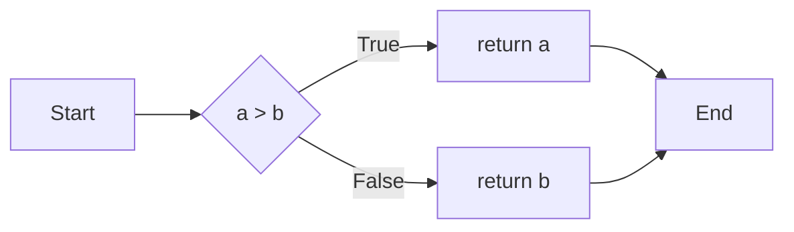

# 论代码洁癖：追求极致和完美

## 1. 背景介绍

### 1.1 问题的由来

在软件开发的世界中,代码质量一直是一个备受关注的话题。随着项目规模的不断扩大和复杂度的持续增加,代码的可维护性和可扩展性变得至关重要。然而,许多开发人员在编写代码时往往会忽视这些因素,导致代码变得混乱、难以理解,甚至出现bug和性能问题。这种情况不仅会影响项目的进度,还可能导致未来的维护和升级工作变得更加困难。

### 1.2 研究现状

为了解决这一问题,许多专家和实践者提出了各种编码实践和原则,旨在提高代码质量。其中,"代码洁癖"(Code Obsession)是一种追求代码极致和完美的理念,它强调编写简洁、优雅、高效且易于维护的代码。这种理念已经得到了越来越多开发人员的认可和实践,并且在一些领先的软件公司中得到了广泛应用。

### 1.3 研究意义

代码洁癖不仅可以提高代码质量,还能提高开发效率,减少bug数量,降低维护成本,并为未来的扩展和升级奠定基础。此外,它还能培养开发人员的编程习惯,提高他们对代码质量的重视程度,从而促进整个团队的专业水平提升。因此,研究和实践代码洁癖具有重要的理论和实践意义。

### 1.4 本文结构

本文将全面探讨代码洁癖的理念、原则和实践方法。首先,我们将介绍代码洁癖的核心概念和与其他编码实践的联系。然后,我们将深入探讨代码洁癖的核心算法原理和具体操作步骤,包括数学模型和公式的详细讲解。接下来,我们将通过项目实践和代码示例,展示如何在实际开发中应用代码洁癖。最后,我们将总结代码洁癖的实际应用场景、未来发展趋势和面临的挑战。

## 2. 核心概念与联系

代码洁癖(Code Obsession)是一种追求代码极致和完美的理念,它强调编写简洁、优雅、高效且易于维护的代码。这种理念源于对代码质量的极度重视,旨在通过严格的编码实践和原则,创造出卓越的代码。

代码洁癖与其他一些著名的编码实践和原则密切相关,例如:

- **干净代码**(Clean Code):强调代码应该易于阅读和理解,具有良好的结构和命名约定。
- **重构**(Refactoring):通过重新组织代码结构,提高代码的可读性和可维护性,同时保持原有功能不变。
- **测试驱动开发**(Test-Driven Development,TDD):先编写测试用例,然后编写实现代码,确保代码符合预期行为。
- **面向对象设计原则**(Object-Oriented Design Principles):如单一职责原则、开放封闭原则等,旨在提高代码的可维护性和可扩展性。

代码洁癖融合了这些实践和原则的精髓,并将它们发展到了一个新的高度。它不仅关注代码的功能正确性,还强调代码的可读性、可维护性和可扩展性,追求代码的简洁、优雅和高效。

## 3. 核心算法原理 & 具体操作步骤

### 3.1 算法原理概述

代码洁癖的核心算法原理可以概括为以下几个方面:

1. **模块化设计**:将代码划分为多个模块,每个模块只负责单一职责,从而提高代码的可维护性和可扩展性。
2. **面向对象设计**:遵循面向对象设计原则,如单一职责原则、开放封闭原则等,提高代码的灵活性和可复用性。
3. **代码重构**:通过重构技术,不断优化代码结构和设计,提高代码的可读性和可维护性。
4. **测试驱动开发**:先编写测试用例,再编写实现代码,确保代码符合预期行为,并提高代码的健壮性。
5. **代码审查**:通过代码审查,发现和修复潜在的问题,提高代码质量。
6. **持续集成**:通过自动化构建和测试,及时发现和修复问题,确保代码质量。

### 3.2 算法步骤详解

实践代码洁癖的具体步骤如下:

1. **需求分析**:明确需求,确定系统的功能和非功能需求。
2. **架构设计**:根据需求,设计系统的整体架构,包括模块划分、接口定义等。
3. **模块设计**:为每个模块进行详细设计,包括类的设计、接口定义等。
4. **编码实现**:按照设计实现代码,遵循代码洁癖的原则和实践。
5. **单元测试**:编写单元测试用例,确保每个模块的功能正确性。
6. **集成测试**:将各个模块集成,进行集成测试,确保系统的整体功能正确性。
7. **代码审查**:进行代码审查,发现和修复潜在的问题。
8. **重构优化**:根据代码审查结果和实际运行情况,进行代码重构,优化代码结构和设计。
9. **持续集成**:将代码集成到持续集成环境中,进行自动化构建和测试。
10. **部署上线**:将通过测试的代码部署到生产环境中。
11. **持续改进**:根据用户反馈和新需求,持续改进和优化代码。

### 3.3 算法优缺点

代码洁癖的优点包括:

- 提高代码质量,减少bug数量。
- 提高代码的可维护性和可扩展性。
- 培养良好的编程习惯,提高团队的专业水平。
- 降低软件开发和维护成本。

缺点包括:

- 实践过程较为耗时,可能会延长开发周期。
- 对开发人员的编码能力和经验要求较高。
- 需要持续的代码审查和重构,增加了一定的工作量。

### 3.4 算法应用领域

代码洁癖可以应用于各种软件开发项目,包括:

- 企业级应用程序开发
- 网站和Web应用程序开发
- 移动应用程序开发
- 游戏开发
- 嵌入式系统开发
- 科学计算和数据分析

无论项目规模大小,代码洁癖都可以帮助开发人员编写高质量的代码,提高软件的可维护性和可扩展性。

## 4. 数学模型和公式 & 详细讲解 & 举例说明

### 4.1 数学模型构建

在代码洁癖中,我们可以使用数学模型来量化和评估代码质量。一种常见的模型是**代码复杂度模型**,它使用一些指标来衡量代码的复杂程度,例如:

- **圈复杂度**(Cyclomatic Complexity,CC):衡量代码中条件语句和循环语句的复杂程度。
- **加权方法计数**(Weighted Method Count,WMC):衡量一个类中方法的复杂程度。
- **深度继承树**(Depth of Inheritance Tree,DIT):衡量一个类的继承层次深度。
- **耦合度**(Coupling):衡量代码模块之间的依赖关系。

我们可以将这些指标组合起来,构建一个综合的代码复杂度模型:

$$
\text{Code Complexity} = \alpha \times \text{CC} + \beta \times \text{WMC} + \gamma \times \text{DIT} + \delta \times \text{Coupling}
$$

其中,$$\alpha$$、$$\beta$$、$$\gamma$$和$$\delta$$是权重系数,根据实际情况进行调整。

### 4.2 公式推导过程

我们可以通过一些简单的例子来推导代码复杂度模型中的各个指标。

**圈复杂度(CC)**

圈复杂度是基于**控制流图**(Control Flow Graph)计算得到的。控制流图是一种表示程序控制流的图形表示,其中每个节点代表一个程序语句或基本块,边表示控制流的转移。

圈复杂度的计算公式如下:

$$
\text{CC} = E - N + 2P
$$

其中,$$E$$是控制流图中边的数量,$$N$$是节点的数量,$$P$$是连通分量的数量(通常为1)。

例如,对于以下代码片段:

```java
int max(int a, int b) {
    if (a > b) {
        return a;
    } else {
        return b;
    }
}
```

它的控制流图如下:



根据公式,我们可以计算出圈复杂度为2:

$$
\text{CC} = 5 - 5 + 2 \times 1 = 2
$$

**加权方法计数(WMC)**

加权方法计数是根据一个类中方法的复杂度来计算的。对于每个方法,我们可以使用圈复杂度作为它的复杂度指标。然后,将所有方法的复杂度相加,即得到该类的加权方法计数。

$$
\text{WMC} = \sum_{i=1}^{n} \text{CC}_i
$$

其中,$$n$$是该类中方法的数量,$$\text{CC}_i$$是第$$i$$个方法的圈复杂度。

**深度继承树(DIT)**

深度继承树是指一个类在继承层次结构中的最大深度。深度继承树越深,代码的复杂度就越高,因为需要考虑更多的继承关系和方法覆盖。

$$
\text{DIT} = \max(\text{depth}(c))
$$

其中,$$\text{depth}(c)$$是类$$c$$在继承层次结构中的深度。

**耦合度(Coupling)**

耦合度衡量代码模块之间的依赖关系。高度耦合会导致代码难以维护和扩展。我们可以使用**扇入耦合度**(Fan-In Coupling)和**扇出耦合度**(Fan-Out Coupling)来量化耦合度。

扇入耦合度是指一个模块被多少其他模块所依赖,而扇出耦合度是指一个模块依赖于多少其他模块。理想情况下,这两个指标都应该保持在较低的水平。

$$
\text{Fan-In Coupling} = |\{m | m \text{ depends on } c\}|
$$

$$
\text{Fan-Out Coupling} = |\{m | c \text{ depends on } m\}|
$$

其中,$$c$$是代码模块,$$m$$是其他模块。

### 4.3 案例分析与讲解

让我们通过一个简单的案例来分析代码复杂度模型的应用。

假设我们有一个简单的`Calculator`类,它提供了加法、减法、乘法和除法四种运算。代码如下:

```java
public class Calculator {
    public int add(int a, int b) {
        return a + b;
    }

    public int subtract(int a, int b) {
        return a - b;
    }

    public int multiply(int a, int b) {
        int result = 0;
        for (int i = 0; i < b; i++) {
            result += a;
        }
        return result;
    }

    public int divide(int a, int b) {
        if (b == 0) {
            throw new ArithmeticException("Division by zero");
        }
        int result = 0;
        while (a >= b) {
            a -= b;
            result++;
        }
        return result;
    }
}
```

我们可以计算出这个类的各个代码复杂度指标:

- 圈复杂度(CC):
  - `add`: 1
  - `subtract`: 1
  - `multiply`: 2
  - `divide`: 3
- 加权方法计数(WMC): 1 + 1 + 2 + 3 = 7
- 深度继承树(DIT): 1 (没有继承)
- 耦合度(Coupling):
  - Fan-In Coupling: 0 (没有其他模块依赖于`Calculator`)
  - Fan-Out Coupling: 0 (`Calculator`没有依赖于其他模块)

根据这些指标,我们可以发现`divide`方法的复杂度较高,因为它包含了条件语句和循环语句。如果我们使用更简单的算法实现除法运算,就可以降低代码的复杂度。

此外,我们还可以通过引入一些设计模式,如策略模式或工厂模式,来降低`Calculator`类的