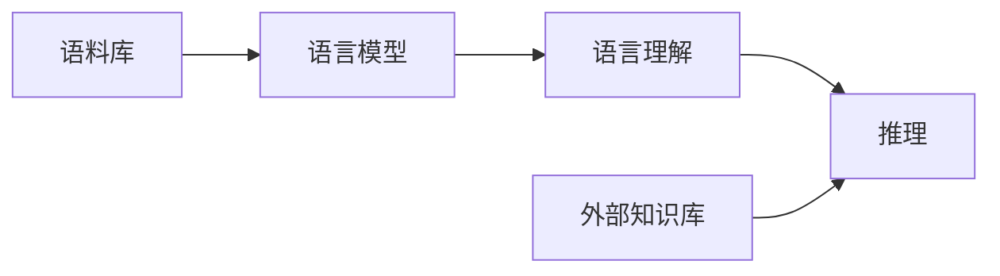

# 语言与推理：大模型的挑战

## 1. 背景介绍
### 1.1 问题的由来
近年来,随着计算机硬件性能的不断提升和深度学习技术的快速发展,大规模语言模型(Large Language Models, LLMs)取得了令人瞩目的成就。从GPT-3到ChatGPT,再到最新的GPT-4,这些大模型展现出了惊人的自然语言理解和生成能力,引发了学术界和工业界的广泛关注。然而,在语言模型取得巨大进步的同时,它们在语言推理方面的局限性也日益凸显。如何提升大模型的语言推理能力,成为了自然语言处理领域亟待解决的重要问题。

### 1.2 研究现状 
目前,大规模语言模型主要采用基于Transformer架构的自回归生成式模型,通过在海量文本数据上进行预训练,学习到丰富的语言知识。这类模型在机器翻译、对话系统、文本摘要等任务上取得了优异的性能。但研究发现,尽管这些模型具备一定的语言理解能力,但在复杂推理、常识推理等方面还存在明显不足。例如,大模型难以准确回答需要多步推理的问题,对隐含语义的理解能力有限,容易产生逻辑错误和自相矛盾的语句。这说明当前的语言模型更多是对语言模式的匹配和记忆,在语言推理能力上还有很大的提升空间。

### 1.3 研究意义
语言推理能力是人工智能迈向通用人工智能的关键一环。提升大模型的语言推理能力,不仅有助于构建更加智能、鲁棒的自然语言处理系统,还将推动认知科学、心理学等领域对人类语言认知机制的研究。同时,语言推理能力的进步也将促进人机交互、知识图谱构建、智能问答等应用的发展。因此,探索提升大模型语言推理能力的方法,具有重要的理论意义和实践价值。

### 1.4 本文结构
本文将围绕大模型的语言推理能力展开探讨。第2部分介绍语言推理涉及的核心概念及其内在联系。第3部分重点阐述基于知识增强的语言推理方法。第4部分建立语言推理的数学模型并给出详细推导。第5部分展示基于外部知识库的语言推理的代码实现。第6部分分析语言推理技术的实际应用场景。第7部分推荐语言推理领域的学习资源和工具。第8部分总结全文,展望语言推理技术的发展趋势与挑战。第9部分列举常见问题解答。

## 2. 核心概念与联系
在探讨大模型的语言推理能力之前,我们首先需要厘清几个核心概念:

- 语言模型(Language Model):用于计算一个句子或词序列出现概率的模型。它通过学习大规模语料库中词与词之间的关联,来预测下一个最可能出现的词。大规模语言模型通常基于Transformer等神经网络架构构建。

- 语言理解(Language Understanding):是指计算机系统理解自然语言文本的含义和用户意图的能力。它涉及词义消歧、指代消解、语义角色标注、篇章理解等多个层面。语言理解是实现智能对话、信息抽取、机器翻译等应用的基础。

- 推理(Reasoning):是根据已知的事实和规则,推导出新的结论或判断的过程。推理是人类智能的核心能力之一。在自然语言处理中,推理任务包括常识推理、因果推理、逻辑推理等。

- 知识(Knowledge):是人类对客观世界的认识结果,包括事实、规则、经验等。知识可以显式地表示为知识库、本体等结构化形式,也可以隐式地蕴含在大规模语料库中。知识是进行语言推理的重要基础。

这几个概念之间有着紧密的联系。语言模型通过学习语料库中蕴含的知识,获得了初步的语言理解能力。但要进行复杂的语言推理,仅仅依靠语言模型学到的知识是不够的,还需要引入外部知识,并建立起知识与语言之间的连接。因此,知识增强是提升语言模型推理能力的重要手段。

## 3. 核心算法原理 & 具体操作步骤
### 3.1 算法原理概述
基于知识增强的语言推理的核心思想是,将外部知识库引入语言模型,通过将知识表示与语言表示进行对齐,使模型能够利用知识进行推理。具体来说,该方法主要包括以下几个步骤:

1. 构建外部知识库,存储结构化或非结构化的世界知识。
2. 对知识库进行表示学习,将知识编码为稠密向量。常用的知识表示学习方法有TransE、RESCAL等。
3. 在语言模型中引入知识表示,通过注意力机制等方式实现知识与语言的融合。
4. 在下游任务中利用知识增强的语言模型进行推理。模型可以通过知识库获取推理所需的背景知识。

### 3.2 算法步骤详解
下面以更具体的步骤详细阐述该算法:

步骤1:知识库构建。根据任务需求,从结构化数据(如Wikidata)或非结构化文本(如Wikipedia)中提取知识,构建外部知识库。知识库以三元组(head, relation, tail)的形式存储事实知识。

步骤2:知识表示学习。使用知识表示学习算法(如TransE)将知识库中的实体和关系映射到低维稠密向量空间中。给定三元组 $(h,r,t)$,TransE 的目标是学习实体和关系的嵌入向量,使得 $\mathbf{h} + \mathbf{r} \approx \mathbf{t}$。

步骤3:将知识库嵌入引入预训练语言模型。以BERT为例,可以在输入中加入特殊的 [ENT] 标记,将知识库中的实体嵌入向量与对应的词嵌入进行融合:

$$\mathbf{h}_i^{(l+1)} = \text{Transformer}(\mathbf{h}_i^{(l)}, \mathbf{k}_i)$$

其中 $\mathbf{h}_i^{(l)}$ 表示第 $l$ 层第 $i$ 个 token 的隐状态, $\mathbf{k}_i$ 表示对应实体的知识库嵌入向量。

步骤4:在下游任务中应用知识增强的语言模型。以问答任务为例,模型可以根据问题从知识库中检索相关的实体和关系,并将其嵌入引入语言模型,生成回答。

### 3.3 算法优缺点
知识增强的语言推理方法的优点包括:
- 显式利用外部知识,弥补了语言模型自身知识的不足。
- 通过知识表示学习,将符号知识嵌入到连续语义空间,便于与神经网络模型集成。
- 在常识推理、事实问答等任务上取得了显著的性能提升。

但该方法也存在一些局限性:
- 依赖高质量的外部知识库,知识库的构建成本较高。
- 知识表示学习的效果受到知识库覆盖度、稀疏性等因素影响。
- 现有方法对隐含知识的建模能力有限,难以处理需要深层推理的复杂问题。

### 3.4 算法应用领域
知识增强的语言推理技术可以应用于以下领域:
- 智能问答:利用知识库进行问题理解和答案生成,提升系统的可解释性和准确性。
- 对话系统:融合外部知识,使对话系统能够进行开放域对话,提供更加丰富、合理的响应。
- 阅读理解:通过知识引入增强语言模型对文本的理解能力,回答需要常识推理的问题。
- 知识图谱构建:利用语言模型从文本中抽取实体和关系,辅助知识图谱的自动构建。

## 4. 数学模型和公式 & 详细讲解 & 举例说明
### 4.1 数学模型构建
我们以知识表示学习算法TransE为例,介绍其数学模型的构建过程。

TransE将知识库中的实体和关系嵌入到同一个 $d$ 维实数向量空间中。对于一个三元组 $(h,r,t)$,TransE的核心假设是:

$$\mathbf{h} + \mathbf{r} \approx \mathbf{t}$$

其中 $\mathbf{h}, \mathbf{r}, \mathbf{t} \in \mathbb{R}^d$ 分别表示头实体、关系、尾实体的嵌入向量。这个假设可以解释为:对于一个正确的三元组,头实体嵌入向量经过关系嵌入向量的平移,应该接近尾实体嵌入向量。

基于这个假设,我们可以定义一个打分函数 $f_r(h,t)$ 来衡量一个三元组的合理性:

$$f_r(h,t) = \|\mathbf{h} + \mathbf{r} - \mathbf{t}\|_{L1/L2}$$

打分函数的值越小,表示三元组越合理。TransE的目标是学习实体和关系的嵌入向量,使得正确三元组的打分函数值小于错误三元组。

### 4.2 公式推导过程
TransE采用马金边(margin-based)损失函数进行训练。对于每个正确三元组 $(h,r,t)$,我们通过替换头实体或尾实体构造一个错误三元组 $(h',r,t')$。然后最小化如下损失函数:

$$\mathcal{L} = \sum_{(h,r,t) \in \mathcal{S}} \sum_{(h',r,t') \in \mathcal{S}'_{(h,r,t)}} [\gamma + f_r(h,t) - f_r(h',t')]_+$$

其中 $\mathcal{S}$ 表示正确三元组集合, $\mathcal{S}'_{(h,r,t)}$ 表示对应的错误三元组集合, $\gamma$ 是超参数,表示正确三元组和错误三元组之间的间隔, $[x]_+ = \max(0, x)$ 是合页损失函数。

通过最小化该损失函数,可以使正确三元组的打分函数值比错误三元组小 $\gamma$,从而学习到合理的实体和关系嵌入向量。

### 4.3 案例分析与讲解
下面我们以一个具体的例子来说明TransE的训练过程。

假设知识库中包含以下三元组:
- (北京, 首都, 中国)
- (华盛顿, 首都, 美国)
- (伦敦, 首都, 英国)

我们希望学习这些实体和关系的嵌入向量,使得 $\mathbf{北京} + \mathbf{首都} \approx \mathbf{中国}$, $\mathbf{华盛顿} + \mathbf{首都} \approx \mathbf{美国}$, $\mathbf{伦敦} + \mathbf{首都} \approx \mathbf{英国}$。

在训练过程中,我们从正确三元组中采样一个,如(北京,首都,中国),然后构造一个错误三元组,如(北京,首都,美国)。计算它们的打分函数值:

$$f_{首都}(北京,中国) = \|\mathbf{北京} + \mathbf{首都} - \mathbf{中国}\|$$
$$f_{首都}(北京,美国) = \|\mathbf{北京} + \mathbf{首都} - \mathbf{美国}\|$$

然后计算损失:

$$\mathcal{L} = [\gamma + f_{首都}(北京,中国) - f_{首都}(北京,美国)]_+$$

通过反向传播更新实体和关系的嵌入向量,使 $f_{首都}(北京,中国)$ 比 $f_{首都}(北京,美国)$ 小 $\gamma$。

经过多轮迭代,模型可以学习到合理的嵌入向量,使得在嵌入空间中,$(北京,首都,中国)$ 比 $(北京,首都,美国)$ 更加接近。

### 4.4 常见问题解答
Q: TransE能否处理一对多、多对一