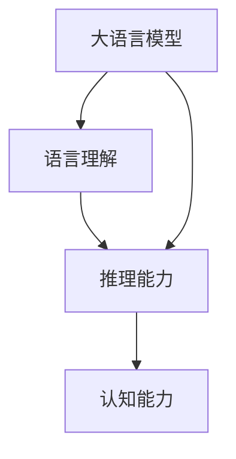

# 语言与推理：大模型的认知误区

关键词：大语言模型、认知能力、推理能力、语言理解、思维误区

## 1. 背景介绍
### 1.1  问题的由来
近年来，随着深度学习技术的快速发展，大规模语言模型(Large Language Models, LLMs)在自然语言处理领域取得了令人瞩目的成就。从GPT-3到ChatGPT，这些模型展示了惊人的语言生成和对话能力，引发了人们对人工智能是否具备真正的语言理解和推理能力的热烈讨论。
### 1.2  研究现状
目前，学术界对大模型的语言理解和推理能力存在不同看法。一些研究者认为，尽管LLMs在语言任务上表现出色，但它们本质上仍是基于统计模式匹配的黑盒模型，缺乏真正的语义理解和逻辑推理能力。另一些学者则持相反观点，认为LLMs已经初步具备了语言理解和推理的能力，未来有望进一步逼近人类水平。
### 1.3  研究意义 
深入探讨大模型的语言理解和推理能力，对于推动人工智能的发展具有重要意义。一方面，它有助于我们更好地理解当前AI系统的局限性，为未来的研究指明方向；另一方面，揭示LLMs在语言理解和推理方面的优势与不足，也为开发更加智能、可解释、鲁棒的AI系统提供了重要参考。
### 1.4  本文结构
本文将围绕大模型的语言理解和推理能力展开深入探讨。首先，我们将介绍相关的核心概念及其内在联系；其次，分析LLMs在语言理解和推理任务中的表现，剖析其背后的核心算法原理；再次，通过构建数学模型和案例分析，揭示大模型在语义理解和逻辑推理方面存在的局限性；最后，总结LLMs在认知能力方面的优势与不足，并展望未来的研究方向与挑战。

## 2. 核心概念与联系
要深入理解大模型的语言理解和推理能力，首先需要厘清几个核心概念：
- 语言理解：是指AI系统从文本中提取语义信息，理解词语、短语乃至句子的含义，把握上下文逻辑关系的能力。它是自然语言处理的核心目标之一。  
- 推理能力：是指根据已知的事实和规则，推导出新的结论或判断的能力。在人工智能领域，推理能力是衡量系统智能水平的重要指标。
- 大语言模型：是指在海量文本数据上训练的神经网络模型，通过自监督学习掌握了语言的统计规律和模式。当前主流的LLMs包括GPT系列、BERT、T5等。
- 认知能力：泛指智能主体感知、理解、思考、学习、记忆等多方面的综合能力。语言理解和推理能力是认知能力的重要组成部分。

这几个概念之间存在紧密的内在联系。语言理解是推理的基础，没有对文本语义的准确把握，就无法进行有效的逻辑推理。而推理能力又是语言理解的升华，真正的语言理解不仅要知其然，还要知其所以然，能对语言内容进行合理的推断和延伸。大语言模型是当前实现语言理解和推理的主要技术手段。而语言理解和推理能力的高低，则直接反映了LLMs的认知水平。

下图展示了这几个核心概念之间的关系：

## 3. 核心算法原理 & 具体操作步骤
### 3.1  算法原理概述
当前主流的大语言模型如GPT-3、BERT等，主要采用了Transformer的编码器-解码器架构和自注意力机制。模型通过在大规模语料上的预训练，学习到了语言的统计模式和语义表示。在此基础上，模型可以通过微调或提示工程，完成语言理解、文本生成、问答等下游任务。
### 3.2  算法步骤详解
以GPT-3为例，其训练和应用的主要步骤如下：

1. 语料准备：收集海量的无标签文本数据，进行清洗和预处理。
2. 模型初始化：根据Transformer架构，初始化GPT-3的模型参数。
3. 预训练：使用自回归的方式，让模型在大规模语料上进行自监督学习，通过优化语言建模损失函数，掌握语言的统计规律。
4. 微调或提示：针对特定的下游任务，在预训练模型的基础上进行微调，或者设计适当的提示，引导模型完成任务。
5. 推理应用：将微调或提示后的模型应用到实际的语言理解、问答、对话等场景中。

### 3.3  算法优缺点
GPT-3等大语言模型的优点在于：
- 强大的语言建模能力，能够生成流畅、连贯的文本。
- 通过预训练和迁移学习，可以快速适应不同的下游任务。 
- 在语言理解和问答方面表现出色，在一定程度上具备语义理解和推理能力。

但同时，这些模型也存在一些局限性：
- 模型参数量巨大，训练和推理成本高昂。
- 作为黑盒模型，其内部工作机制难以解释，可解释性差。
- 在逻辑推理、常识推理等方面仍然存在局限，容易产生幻觉和错误。

### 3.4  算法应用领域
大语言模型已经在多个领域得到广泛应用，如：
- 智能问答：通过语言理解和知识推理，为用户提供准确、完整的答案。
- 对话系统：支持多轮对话，提供个性化、上下文相关的回复。  
- 文本生成：自动撰写文章、新闻、评论等各类文本内容。
- 机器翻译：实现不同语言之间的互译，提高翻译的流畅度和准确性。
- 文本分类：对文本的主题、情感等进行自动分类和标注。

## 4. 数学模型和公式 & 详细讲解 & 举例说明
### 4.1  数学模型构建
为了定量分析大语言模型的语言理解和推理能力，我们可以构建如下数学模型：

令$U$表示模型的语言理解能力，$R$表示推理能力，$P$表示模型在下游任务上的性能，则我们可以用函数$f$表示它们之间的关系：

$$P = f(U, R)$$

其中，$f$可以是线性函数或非线性函数，具体形式需要根据实际情况而定。

进一步，我们可以用信息论的方法来度量语言理解能力$U$。设$X$表示输入的文本，$Y$表示文本的真实语义，则$U$可以用互信息$I(X;Y)$来度量：

$$U = I(X;Y) = H(Y) - H(Y|X)$$

其中，$H(Y)$表示语义信息的熵，$H(Y|X)$表示在给定文本$X$的条件下，语义信息$Y$的条件熵。$I(X;Y)$越大，说明模型从文本中提取语义信息的能力越强。

类似地，我们可以用逻辑公式来刻画推理能力$R$。设$A$表示已知的事实或前提，$B$表示待推断的结论，则$R$可以表示为：

$$R = P(B|A) = \frac{P(A|B)P(B)}{P(A)}$$

其中，$P(B|A)$表示在给定前提$A$的条件下，结论$B$成立的概率。$P(A|B)$表示在结论$B$成立的条件下，前提$A$出现的概率。$P(B)$和$P(A)$分别表示结论$B$和前提$A$的先验概率。$R$越大，说明模型根据已知信息推理未知结论的能力越强。

### 4.2  公式推导过程
以上公式中，互信息$I(X;Y)$的推导过程如下：

$$
\begin{aligned}
I(X;Y) &= \sum_{x,y} P(x,y) \log \frac{P(x,y)}{P(x)P(y)} \\
&= \sum_{x,y} P(x,y) \log \frac{P(y|x)}{P(y)} \\
&= \sum_{x,y} P(x,y) \log P(y|x) - \sum_{x,y} P(x,y) \log P(y) \\
&= \sum_{x} P(x) \sum_{y} P(y|x) \log P(y|x) - \sum_{y} P(y) \log P(y) \\
&= - \sum_{x} P(x) H(Y|X=x) - H(Y) \\
&= H(Y) - H(Y|X)
\end{aligned}
$$

其中，第二步利用了条件概率公式；第三步利用了对数的性质；第四步利用了边缘化原理；第五步利用了条件熵和熵的定义。

而推理能力$R$中的贝叶斯公式可以直接由条件概率的定义推导得到：

$$
\begin{aligned}
P(B|A) &= \frac{P(A \cap B)}{P(A)} \\
&= \frac{P(A|B)P(B)}{P(A)}
\end{aligned}
$$

### 4.3  案例分析与讲解
下面我们通过一个简单的例子来说明如何用以上模型分析大语言模型的语言理解和推理能力。

假设我们有以下两个句子：
- 句子1：小明是一名优秀的学生，他的数学成绩一直名列前茅。
- 句子2：小明参加了数学竞赛，获得了全市第一名。

我们想考察大模型是否能理解句子1和句子2的语义，并推断出"小明的数学竞赛成绩很好"这一结论。

首先，我们用互信息来度量模型对句子语义的理解能力。设$X_1$和$X_2$分别表示句子1和句子2，$Y$表示"小明数学成绩好"这一语义信息，则理解能力$U$可以表示为：

$$U = I(X_1,X_2;Y) = H(Y) - H(Y|X_1,X_2)$$

如果模型能够充分理解两个句子的语义，提取出"小明数学成绩好"这一信息，则$H(Y|X_1,X_2)$会很小，$I(X_1,X_2;Y)$会很大。反之，如果模型无法准确理解句子语义，则互信息值会较小。

其次，我们用贝叶斯公式来度量模型的推理能力。设前提$A$为"小明数学成绩好"，结论$B$为"小明数学竞赛成绩好"，则：

$$R = P(B|A) = \frac{P(A|B)P(B)}{P(A)}$$

如果模型能够根据已知前提准确推断出结论，则$P(A|B)$和$P(B|A)$都会较大，推理能力$R$的值会较高。反之，如果模型无法进行有效推理，则$R$值会较低。

通过计算不同模型在以上案例中的$U$和$R$值，我们可以定量比较它们在语言理解和推理方面的能力差异。

### 4.4  常见问题解答
Q: 互信息$I(X;Y)$无法直接从数据中计算怎么办？
A: 在实践中，由于语义信息$Y$难以直接观测，互信息往往难以直接计算。一种常用的做法是，用有标注的数据训练一个语义分类器，然后用分类器的性能作为互信息的近似。也可以考虑用无监督的聚类方法，把语义相近的文本聚为一类，再估计聚类结果与文本之间的互信息。

Q: 贝叶斯公式中的概率$P(A)$、$P(B)$等难以准确估计怎么办？
A: 在实际应用中，准确估计先验概率$P(A)$、$P(B)$等确实比较困难。一种解决方案是用大规模语料库的统计信息进行近似。也可以考虑用因子图、贝叶斯网络等概率图模型来建模推理过程，从数据中学习条件概率分布。

Q: 如何评估大模型在复杂推理任务上的能力？
A: 评估复