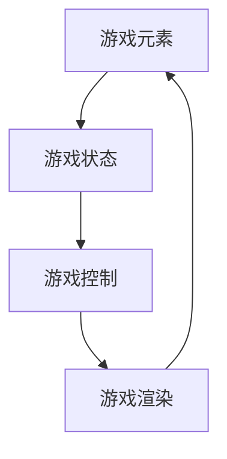
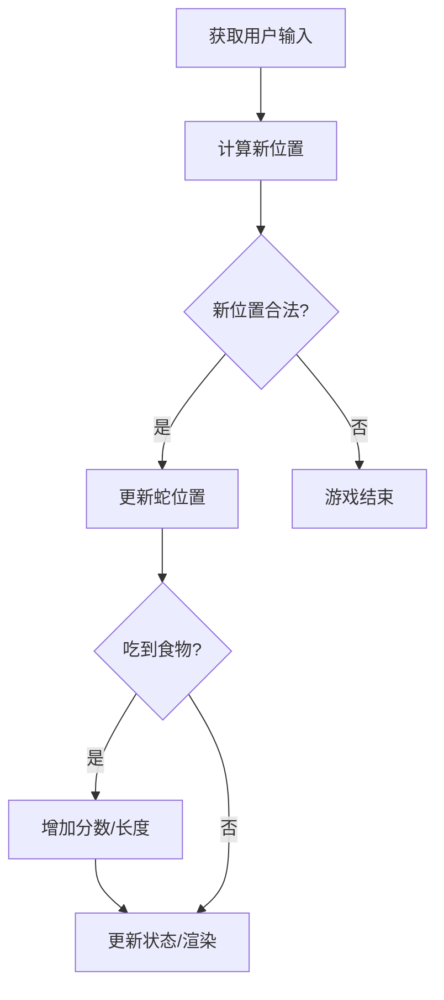
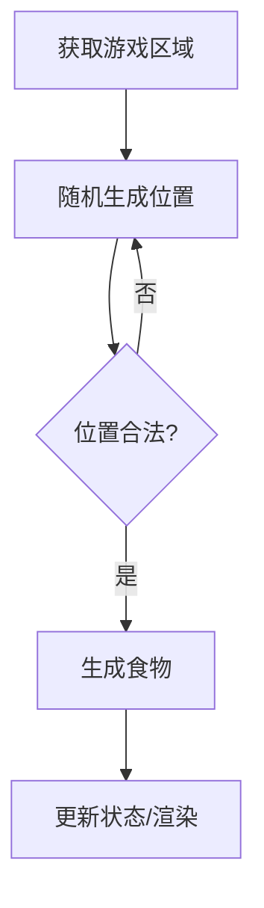
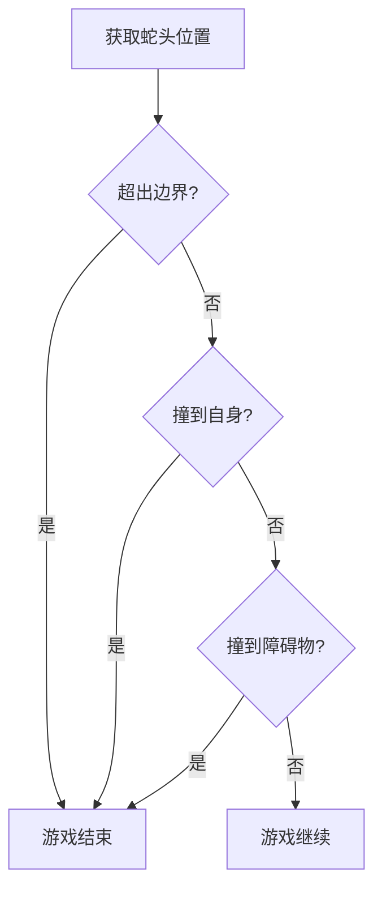
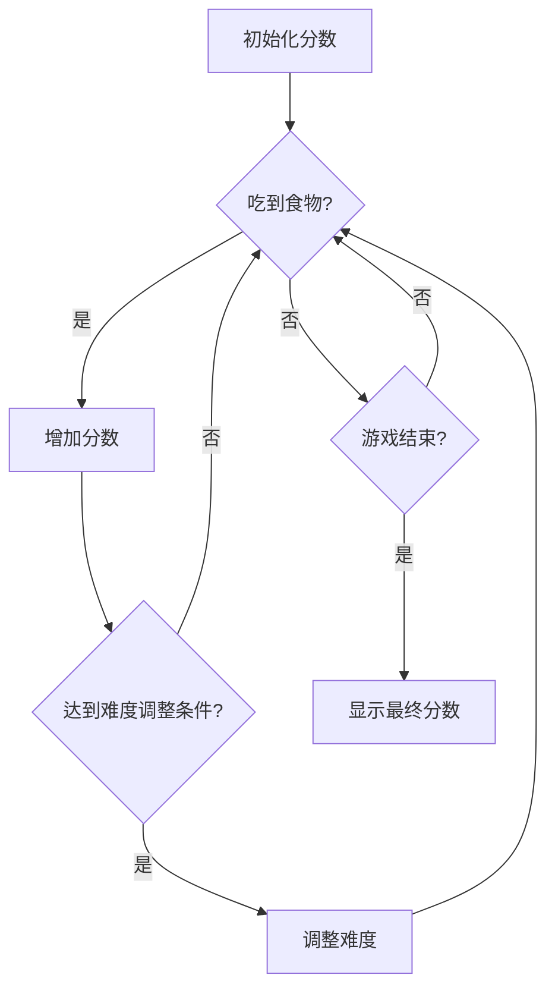
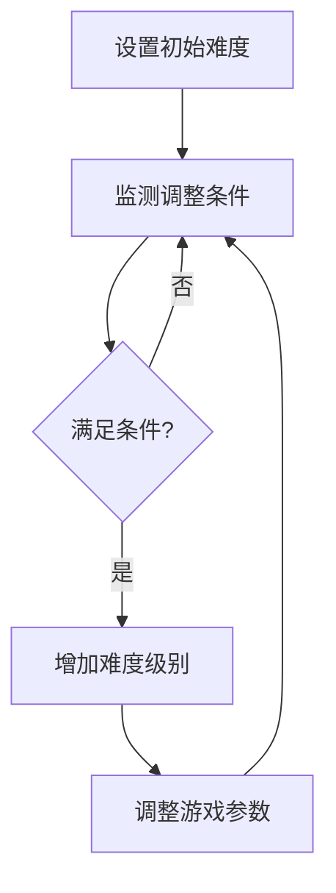

以下是《贪吃蛇小游戏的设计与实现》这篇技术博客文章的正文内容：

# 贪吃蛇小游戏的设计与实现

## 1. 背景介绍

### 1.1 问题的由来

贪吃蛇游戏是一款经典的益智游戏,最早可以追溯到1976年。游戏的目标是控制一条不断延长的蛇,在有限的空间内尽可能地吃更多的食物,而不会撞到障碍物或自己的身体。这款游戏看似简单,但实际上需要玩家具备良好的空间思维能力和策略性思维。

随着时代的发展,贪吃蛇游戏已经从最初的黑白显示器移植到了各种平台和设备上,成为了程序员入门的经典项目之一。无论是在课堂上、编程比赛中,还是在程序员的个人项目中,贪吃蛇游戏都是一个常见的选题。

### 1.2 研究现状

贪吃蛇游戏的实现方式有多种多样,从最基础的命令行版本到使用不同编程语言和图形库实现的各种图形界面版本。目前,已有大量的开源项目和教程分享了贪吃蛇游戏的实现细节,但大多数只涉及到了基本功能的实现,缺乏对游戏设计、算法优化和扩展性等方面的深入探讨。

### 1.3 研究意义 

通过对贪吃蛇游戏的深入研究和实现,我们可以学习到以下几个方面的知识:

1. **游戏设计**: 包括游戏规则、难度曲线、分数机制等,培养系统化思维能力。

2. **算法与数据结构**: 蛇的移动、食物的生成、碰撞检测等需要合理的算法和数据结构支持。

3. **图形编程**: 使用不同的图形库,了解图形编程的基本概念和技术。

4. **交互设计**: 合理的用户交互界面对游戏体验至关重要。

5. **代码架构**: 模块化、可扩展性等设计原则在游戏开发中同样适用。

6. **项目实践**: 从需求分析到测试上线,完整的项目实践过程。

因此,贪吃蛇游戏不仅是一个有趣的小游戏,更是一个综合运用多种编程知识的绝佳实践项目。

### 1.4 本文结构

本文将从以下几个方面深入探讨贪吃蛇游戏的设计与实现:

1. 核心概念与关联
2. 核心算法原理及具体步骤
3. 数学模型与公式推导
4. 代码实现与解读
5. 实际应用场景
6. 相关工具与资源推荐
7. 总结与发展趋势
8. 常见问题解答

## 2. 核心概念与联系

在设计和实现贪吃蛇游戏之前,我们需要理解以下几个核心概念及其相互关系:

1. **游戏元素**
   - 蛇(Snake)
   - 食物(Food)
   - 障碍物(Obstacle)
   - 游戏区域(GameArea)

2. **游戏状态**
   - 分数(Score)
   - 游戏难度(Difficulty)
   - 游戏结束条件(GameOverCondition)

3. **游戏控制**
   - 用户输入(UserInput)
   - 蛇的移动(SnakeMovement)
   - 碰撞检测(CollisionDetection)

4. **游戏渲染**
   - 图形绘制(GraphicsRendering)
   - 动画效果(Animation)
   - 用户界面(UserInterface)

这些概念之间存在着紧密的联系,它们共同构成了贪吃蛇游戏的核心框架。我们需要合理设计和实现每个概念,并保证它们之间的协调运作,才能让游戏运行良好。

## 3. 核心算法原理 & 具体操作步骤

### 3.1 算法原理概述

贪吃蛇游戏的核心算法主要包括以下几个方面:

1. **蛇的移动**: 根据用户输入,控制蛇在游戏区域内的移动方向和速度。

2. **食物生成**: 在游戏区域内随机生成食物,供蛇吃掉后增长身体。

3. **碰撞检测**: 检测蛇是否撞到了障碍物或自身,判断游戏是否结束。

4. **分数计算**: 根据吃掉的食物数量,计算并更新游戏分数。

5. **难度调整**: 根据分数或其他条件,动态调整游戏难度。

这些算法需要合理的数据结构支持,并与游戏渲染和用户交互模块协同工作,才能实现流畅的游戏体验。

### 3.2 算法步骤详解

#### 3.2.1 蛇的移动算法

蛇的移动算法是游戏的核心部分,它需要实时根据用户输入更新蛇的位置和方向。一种常见的实现方式是使用双端队列(Deque)来模拟蛇的身体,根据移动方向在队列的头部添加新的位置,在尾部删除旧的位置。

算法步骤如下:

1. 获取用户输入,判断蛇的新方向。
2. 根据新方向,计算蛇头的新位置。
3. 检查新位置是否合法(没有撞到障碍物或自身)。
4. 如果新位置合法,则在双端队列的头部添加新位置,在尾部删除旧位置。
5. 如果新位置不合法,则游戏结束。
6. 根据新位置,判断是否吃到了食物,如果吃到,则增加分数,并在双端队列尾部添加一个新的位置(蛇身体增长)。
7. 更新游戏状态和渲染。

#### 3.2.2 食物生成算法

食物生成算法需要在游戏区域内随机选择一个位置,作为新食物的生成点。该位置不能与蛇的身体或障碍物重合。

算法步骤如下:

1. 获取游戏区域的大小和边界。
2. 随机生成一个位置坐标(x,y)。
3. 检查该位置是否与蛇的身体或障碍物重合。
4. 如果重合,则返回步骤2,重新生成一个位置。
5. 如果不重合,则在该位置生成新的食物。
6. 更新游戏状态和渲染。

#### 3.2.3 碰撞检测算法

碰撞检测算法需要判断蛇是否撞到了障碍物或自身,从而决定游戏是否结束。

算法步骤如下:

1. 获取蛇头的位置。
2. 检查该位置是否超出游戏区域边界。
3. 检查该位置是否与蛇身体(除蛇头外)的其他部分重合。
4. 检查该位置是否与障碍物重合。
5. 如果任何一个条件满足,则游戏结束。
6. 否则,游戏继续。

#### 3.2.4 分数计算算法

分数计算算法需要根据吃掉的食物数量,实时更新游戏分数。

算法步骤如下:

1. 初始化分数为0。
2. 每次蛇吃掉一个食物,则分数增加预设的值(如10分)。
3. 根据分数的不同阶段,可以调整游戏难度(如加快蛇的移动速度)。
4. 在游戏结束时,显示最终得分。

#### 3.2.5 难度调整算法

难度调整算法需要根据一定的条件(如分数阈值或时间),动态调整游戏难度,以保持游戏的趣味性和挑战性。

算法步骤如下:

1. 设置初始难度级别。
2. 定义难度调整的条件(如分数阈值或时间间隔)。
3. 在游戏运行过程中,持续监测是否满足难度调整条件。
4. 如果满足条件,则增加难度级别(如加快蛇的移动速度、增加障碍物数量等)。
5. 根据新的难度级别,调整相应的游戏参数。

### 3.3 算法优缺点

上述算法具有以下优点:

1. **简单直观**: 算法思路清晰,容易理解和实现。
2. **高效性能**: 大部分操作的时间复杂度为O(1),能够保证游戏的流畅性。
3. **可扩展性**: 可以根据需求,方便地添加新的游戏元素和规则。

但也存在一些缺点:

1. **局限性**: 仅适用于基本的贪吃蛇游戏,对于更复杂的变种可能需要重新设计算法。
2. **随机性**: 食物生成和难度调整的随机性可能会影响游戏体验。
3. **可预测性**: 算法本身是确定性的,长期玩下去可能会感到乏味。

### 3.4 算法应用领域

贪吃蛇游戏的核心算法不仅可以应用于游戏开发,还可以应用于以下领域:

1. **路径规划**: 蛇的移动算法可以用于机器人路径规划、导航系统等领域。
2. **图形渲染**: 蛇身体的渲染算法可以用于绘制曲线、动画等图形效果。
3. **人工智能**: 可以设计AI算法,让计算机自动控制蛇的移动。
4. **教育领域**: 作为算法和数据结构的入门示例,在编程教学中具有重要价值。

## 4. 数学模型和公式 & 详细讲解 & 举例说明

在贪吃蛇游戏的设计和实现过程中,我们需要建立一些数学模型来描述和求解相关的问题。

### 4.1 数学模型构建

#### 4.1.1 游戏区域模型

我们可以将游戏区域看作一个二维平面,使用坐标系来表示。设游戏区域的宽度为W,高度为H,则游戏区域可以用一个矩形区域表示:

$$
GameArea = \{(x,y) | 0 \leq x < W, 0 \leq y < H\}
$$

其中,$(x,y)$表示平面上的一个点的坐标。

#### 4.1.2 蛇的模型

我们可以将蛇看作是一系列相连的点组成的序列,用一个有序集合来表示:

$$
Snake = \{(x_1,y_1), (x_2,y_2), \ldots, (x_n,y_n)\}
$$

其中,$(x_i,y_i)$表示蛇身体的第i个点的坐标,蛇头