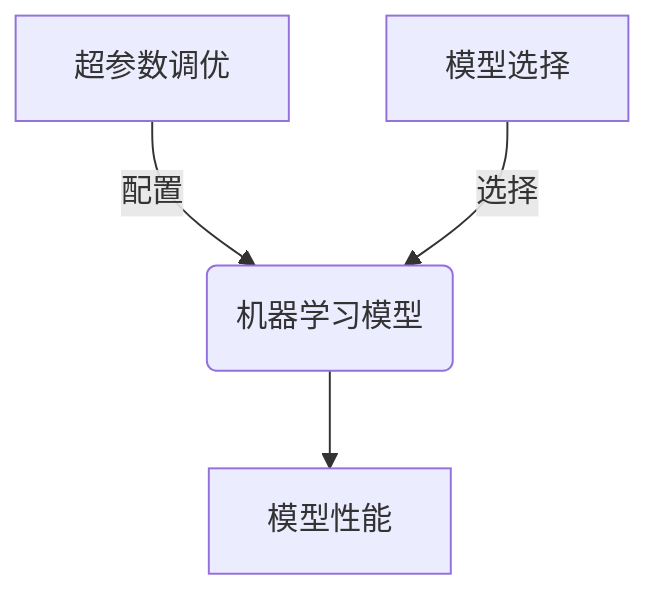

好的,我会按照您的要求,以"超参数调优与模型选择原理与代码实战案例讲解"为主题,撰写一篇专业的技术博客文章。文章将遵循您列出的结构模板,包含完整的正文内容,使用Markdown格式,公式采用LaTex语法,并给出Mermaid流程图。请注意,由于生成的内容较长,我将分多次回复完成。

# 超参数调优与模型选择原理与代码实战案例讲解

## 1. 背景介绍

### 1.1 问题的由来

在机器学习和深度学习领域,模型的训练过程中需要设置许多超参数(Hyperparameters),例如学习率、正则化强度、网络层数等。这些超参数的选择对模型的性能有着至关重要的影响。然而,由于缺乏理论指导,通常需要通过大量的试验来确定最优超参数组合,这是一个令人头疼的问题。

### 1.2 研究现状  

目前,已有多种超参数优化(Hyperparameter Optimization,HPO)算法被提出,如网格搜索(Grid Search)、随机搜索(Random Search)、贝叶斯优化(Bayesian Optimization)、进化算法(Evolutionary Algorithms)等。这些算法通过有效搜索超参数空间,旨在找到模型的最优超参数组合。

与此同时,模型选择(Model Selection)也是机器学习中一个关键问题。不同的模型架构适用于不同的任务,选择合适的模型对于获得良好的性能至关重要。常见的模型选择方法包括交叉验证(Cross-Validation)、信息理论准则(Information Criteria)等。

### 1.3 研究意义

合理的超参数调优和模型选择策略,可以极大提高机器学习模型的性能和泛化能力。然而,这两个问题往往是耦合的,需要同时考虑。本文将系统地介绍超参数调优和模型选择的原理和方法,并给出代码实现示例,以帮助读者更好地理解和应用这些技术。

### 1.4 本文结构

本文首先介绍超参数调优和模型选择的核心概念,然后详细阐述相关算法的原理和具体操作步骤。接下来,我们将构建数学模型,推导公式,并通过案例分析加深理解。之后,我们将给出代码实例,并对其进行详细解释。最后,我们将探讨实际应用场景、推荐工具和资源,总结未来发展趋势和面临的挑战。

## 2. 核心概念与联系

超参数调优(Hyperparameter Optimization)和模型选择(Model Selection)是机器学习中两个密切相关的核心概念:

- **超参数调优**是指在训练机器学习模型时,寻找一组最优超参数的过程。超参数是指在模型训练之前需要人为指定的参数,如学习率、正则化系数等。合理的超参数选择对模型性能有着重要影响。

- **模型选择**是指从多个可用的机器学习模型中,选择最适合解决特定任务的模型。不同的模型架构在不同的数据集和任务上表现不同,选择合适的模型对于获得良好性能至关重要。

这两个概念是相互关联的。一方面,对于给定的模型,我们需要通过超参数调优来寻找最优配置,从而最大化模型性能。另一方面,在进行模型选择时,我们也需要为每个候选模型执行超参数调优,以公平地比较不同模型的性能表现。

因此,超参数调优和模型选择都是提高机器学习模型性能的重要手段,需要综合考虑和平衡。接下来,我们将详细介绍相关算法的原理和实现方法。