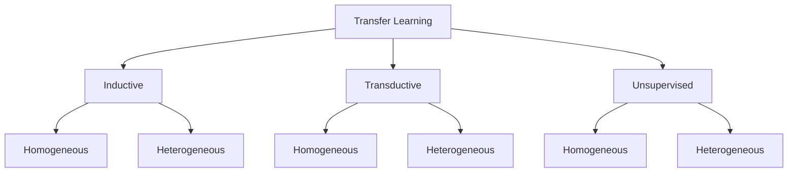
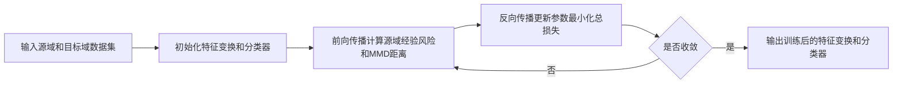

# 迁移学习(Transfer Learning) - 原理与代码实例讲解

关键词：迁移学习、深度学习、机器学习、领域自适应、特征表示

## 1. 背景介绍
### 1.1  问题的由来
在现实世界中,我们经常面临数据不足、标注成本高昂等问题,导致很多机器学习任务难以实现。而人类有着非凡的学习迁移能力,可以将已学知识快速迁移到新任务中。受此启发,迁移学习应运而生,旨在利用已有知识来辅助目标领域的学习。

### 1.2  研究现状
迁移学习近年来得到了广泛关注和研究。许多研究者提出了各种迁移学习方法,如基于实例、特征、模型和关系的迁移学习等。这些方法在计算机视觉、自然语言处理等领域取得了显著成果。但现有方法仍存在诸多局限,如负迁移问题、领域自适应能力不足等。

### 1.3  研究意义 
迁移学习可以显著降低机器学习的数据需求和计算开销,使一些样本稀缺的任务成为可能。同时它还能提高模型的泛化能力,加速学习进程。深入研究迁移学习,对于推动人工智能的发展具有重要意义。

### 1.4  本文结构
本文将全面介绍迁移学习的原理和应用。第2部分阐述迁移学习的核心概念;第3部分讲解几种主要的迁移学习算法;第4部分建立迁移学习的数学模型并给出公式推导;第5部分通过代码实例演示如何实现迁移学习;第6部分讨论迁移学习的应用场景;第7部分推荐相关工具和资源;第8部分总结全文并展望未来;第9部分列出常见问题解答。

## 2. 核心概念与联系
迁移学习的目标是利用源领域的知识来辅助目标领域的学习任务。其核心是找到源领域和目标领域之间的相似性,并加以利用。

源领域(Source Domain)指已有大量标注数据的领域,模型可以从中学到知识。
目标领域(Target Domain)指缺乏足够标注数据的领域,需要借助源领域的知识。
两个领域间的相似性可体现在实例、特征、模型等不同层面。

根据学习目标,迁移学习可分为:
- 归纳式迁移学习(Inductive Transfer Learning):目标域存在标注样本,任务不同
- 直推式迁移学习(Transductive Transfer Learning):目标域无标注样本,任务相同
- 无监督迁移学习(Unsupervised Transfer Learning):源域和目标域均无标注样本

根据源域和目标域是否相同,又可分为:
- 同构迁移学习(Homogeneous):特征空间相同 
- 异构迁移学习(Heterogeneous):特征空间不同

下图展示了迁移学习的分类体系:



## 3. 核心算法原理 & 具体操作步骤
### 3.1  算法原理概述
迁移学习的核心是找到源域和目标域的相似性,并加以利用。主要有四类方法:基于实例、特征、模型和关系的迁移。

### 3.2  算法步骤详解
1) 基于实例的迁移学习
通过权重重用源域中与目标域相似的实例,直接用于目标任务的学习。典型算法如TrAdaBoost:
- 初始化目标域样本权重
- 在加权后的源域和目标域上训练基分类器
- 计算基分类器在目标域上的错误率
- 根据错误率更新目标域样本权重
- 重复以上步骤直至收敛

2) 基于特征的迁移学习  
学习一个公共特征空间,使不同域的数据分布相似。典型算法如DASA:
- 最小化源域和目标域的MMD距离
- 最小化标签预测的经验风险
- 最大化决策边界到各类样本的距离
- 交替优化特征变换矩阵和分类矩阵直至收敛

3) 基于模型的迁移学习
将源域学到的模型参数迁移到目标域。以微调为例:
- 在源域数据上训练神经网络 
- 冻结底层参数,用目标域数据微调顶层
- 输出域自适应的目标模型

4) 基于关系的迁移学习
挖掘不同域数据中的关系知识,指导迁移过程。以MRAN为例:
- 在源域学习逻辑规则 
- 估计源域和目标域的差异
- 修正规则的置信度
- 应用修正后的规则预测目标域标签

### 3.3  算法优缺点
| 算法 | 优点 | 缺点 |
|------|------|------|
| 基于实例 | 原理简单,易实现 | 计算开销大,负迁移风险高 |
| 基于特征 | 降低了域差异,泛化性强 | 学习复杂度高,参数敏感 |
| 基于模型 | 直接复用模型,效率高 | 源模型性能要求高  | 
| 基于关系 | 可解释性强,鲁棒性好 | 关系挖掘困难,适用范围小 |

### 3.4  算法应用领域
迁移学习被广泛应用于计算机视觉、自然语言处理、语音识别、行为识别、推荐系统等领域。比如:
- 利用ImageNet预训练模型进行图像分类
- 基于BERT的跨语言文本分类
- 跨域的用户情感分析
- 跨场景的人体动作识别
- 跨平台的用户兴趣迁移

## 4. 数学模型和公式 & 详细讲解 & 举例说明
### 4.1  数学模型构建
定义源域 $\mathcal{D}_s=\left\{\left(\mathbf{x}_{i}^{s}, y_{i}^{s}\right)\right\}_{i=1}^{n_s}$,其中$\mathbf{x}_i^s \in \mathcal{X}, y_i^s \in \mathcal{Y}$。

定义目标域$\mathcal{D}_t=\left\{\left(\mathbf{x}_{i}^{t}\right)\right\}_{i=1}^{n_t}, \mathbf{x}_i^t \in \mathcal{X}$。

迁移学习的目标是学习一个分类器$f:\mathcal{X} \rightarrow \mathcal{Y}$,最小化目标风险:
$$R_{t}(f)=\mathbb{E}_{\left(\mathbf{x}^{t}, y^{t}\right) \sim \mathcal{D}_{t}} L\left(f\left(\mathbf{x}^{t}\right), y^{t}\right)$$

其中$L$为损失函数。由于目标域标注数据缺乏,直接优化上式不可行,因此需要利用源域知识。

### 4.2  公式推导过程
以基于特征的迁移学习为例。假设学习到一个变换$\phi$,将原始特征映射到一个公共空间,使不同域的边缘分布相似,同时保持各自的条件分布。数学上可表示为优化:

$$\min _{\phi} \operatorname{dist}\left(\mathbb{E}_{p\left(\mathbf{x}^{s}\right)}\left[\phi\left(\mathbf{x}^{s}\right)\right], \mathbb{E}_{p\left(\mathbf{x}^{t}\right)}\left[\phi\left(\mathbf{x}^{t}\right)\right]\right)+\lambda R_{s}\left(f_{\phi}\right)$$

其中$\operatorname{dist}$为分布差异度量,$\lambda$为权衡因子,$f_{\phi}$为变换后的分类器。

常用的分布差异度量包括MMD(最大均值差异)和CORAL(协方差对齐损失)。MMD定义为:

$$\operatorname{MMD}(\mathcal{D}_s,\mathcal{D}_t)=\left\|\frac{1}{n_s} \sum_{i=1}^{n_s} \phi\left(\mathbf{x}_{i}^{s}\right)-\frac{1}{n_t} \sum_{i=1}^{n_t} \phi\left(\mathbf{x}_{i}^{t}\right)\right\|_{\mathcal{H}}$$

其中$\mathcal{H}$为再生核希尔伯特空间。

CORAL的定义为:

$$\operatorname{CORAL}(\mathcal{D}_s,\mathcal{D}_t)=\frac{1}{4d^2}\left\|C_s-C_t\right\|_{F}^{2}$$

其中$C_s$和$C_t$分别为源域和目标域特征的协方差矩阵,$d$为特征维度。

### 4.3  案例分析与讲解
以基于MMD的域自适应为例。给定源域标注数据集和目标域无标注数据集,我们的目标是学习一个特征变换$\phi$和分类器$f$,最小化如下损失:

$$\mathcal{L}=\frac{1}{n_s} \sum_{i=1}^{n_s} L\left(f\left(\phi\left(\mathbf{x}_{i}^{s}\right)\right), y_{i}^{s}\right)+\lambda \operatorname{MMD}^{2}\left(\mathcal{D}_{s}^{\phi}, \mathcal{D}_{t}^{\phi}\right)$$

其中第一项为源域上的经验风险,第二项为变换后特征的MMD距离。通过联合优化特征变换和分类器,可以得到一个域不变的特征表示,从而实现跨域泛化。

算法流程如下:



### 4.4  常见问题解答
Q: 如何权衡源域经验风险和分布匹配损失?
A: 通过调节$\lambda$参数。$\lambda$越大,越强调分布匹配,反之则越强调经验风险最小化。通常需要通过交叉验证来选取最优$\lambda$值。

Q: 除了MMD和CORAL,还有哪些常用的域差异度量?
A: 其他常见度量包括KL散度、Wasserstein距离、最大均值差异、中心矩距离等。不同度量适用于不同场景,如MMD适合高维数据,Wasserstein距离对离群点更鲁棒。

Q: 如何理解负迁移?
A: 负迁移指不恰当的知识迁移反而降低了学习性能。可能原因包括源域和目标域差异过大,或迁移策略不合理。需要谨慎设计迁移方法,如引入样本权重、对抗学习等来缓解负迁移。

## 5. 项目实践：代码实例和详细解释说明
### 5.1  开发环境搭建
本项目基于PyTorch实现,需要安装以下依赖库:
- python 3.8
- pytorch 1.8
- numpy
- scikit-learn
- tqdm

可以通过以下命令安装:
```
pip install torch==1.8.0 numpy scikit-learn tqdm
```

### 5.2  源代码详细实现
以下代码展示了如何用PyTorch实现基于MMD的深度域自适应:

```python
import torch
import torch.nn as nn
import torch.optim as optim
from sklearn.datasets import load_svmlight_file
from sklearn.model_selection import train_test_split
from tqdm import tqdm

# 定义特征提取器
class FeatureExtractor(nn.Module):
    def __init__(self, n_features, n_hidden):
        super(FeatureExtractor, self).__init__()
        self.net = nn.Sequential(
            nn.Linear(n_features, n_hidden),
            nn.ReLU(),
            nn.Linear(n_hidden, n_hidden),
            nn.ReLU(),
            nn.Linear(n_hidden, n_hidden),
            nn.ReLU()
        )
    
    def forward(self, x):
        return self.net(x)

# 定义分类器
class Classifier(nn.Module):
    def __init__(self, n_hidden, n_classes):
        super(Classifier, self).__init__()
        self.net = nn.Linear(n_hidden, n_classes)

    def forward(self, x):
        return self.net(x)

#