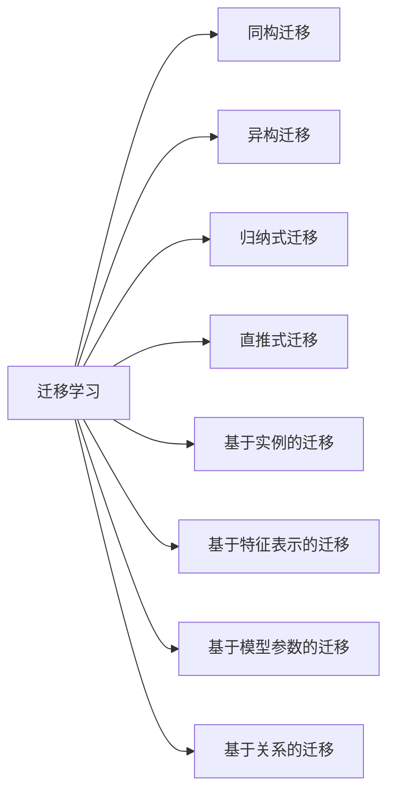

# 迁移学习原理与代码实战案例讲解

关键词：迁移学习、深度学习、小样本学习、领域自适应、参数迁移

## 1. 背景介绍
### 1.1 问题的由来
在现实世界中,我们经常会遇到训练数据不足的情况,传统的机器学习方法在这种情况下往往表现不佳。而人类却有很强的学习迁移能力,可以将过去学习到的知识迁移到新的任务中。受此启发,迁移学习应运而生,它试图利用已有的知识来学习新的任务,从而缓解训练数据不足的问题。
### 1.2 研究现状
近年来,迁移学习受到了学术界和工业界的广泛关注。一方面,迁移学习为解决小样本学习问题提供了新的思路;另一方面,迁移学习在计算机视觉、自然语言处理等领域取得了显著成果。代表性的工作包括:
- DAN[1]和RTN[2]等基于特征表示的迁移学习方法
- 领域对抗神经网络DANN[3]
- 深度适应网络DAN[4] 
- 对抗式迁移学习方法如ADDA[5]等
### 1.3 研究意义
迁移学习具有重要的理论和实践意义:
1. 迁移学习为缓解训练数据不足问题提供了新的解决方案,有望大幅降低人工标注成本。
2. 迁移学习有助于提高模型的泛化能力,使其能够更好地适应新的任务和环境。
3. 迁移学习为实现通用人工智能(AGI)奠定了基础。
### 1.4 本文结构
本文将全面介绍迁移学习的原理和方法,内容安排如下:
- 第2节介绍迁移学习的核心概念
- 第3节详细讲解几种主要的迁移学习算法
- 第4节给出迁移学习常用的数学模型和公式
- 第5节通过代码实例演示如何实现迁移学习
- 第6节总结迁移学习的实际应用场景
- 第7节推荐迁移学习的学习资源和工具
- 第8节讨论迁移学习的发展趋势和挑战
- 第9节为常见问题提供解答

## 2. 核心概念与联系
迁移学习的目标是利用已学习过的知识来学习新任务,从而提高学习效率和性能。相比传统机器学习,迁移学习具有以下特点:
- 利用先验知识:迁移学习利用源领域学到的知识来辅助目标领域的学习。
- 缓解数据稀疏:当目标领域数据不足时,利用源领域数据可以缓解过拟合。 
- 提高学习效率:从头开始学习耗时耗力,迁移学习可以显著提高学习效率。
- 提高模型泛化:迁移学习使模型更好地适应新的任务,提高了模型的泛化能力。

根据源领域和目标领域的相似程度,迁移学习可分为同构迁移和异构迁移:
- 同构迁移:源领域和目标领域的特征空间、样本空间完全相同。
- 异构迁移:源领域和目标领域的特征空间、样本空间不完全相同。

按照标签空间是否相同,迁移学习又可分为归纳式迁移和直推式迁移:
- 归纳式迁移:源领域和目标领域的标签空间不同。
- 直推式迁移:源领域和目标领域的标签空间相同。

此外,根据迁移的知识类型,还可将迁移学习分为:
- 基于实例的迁移:直接对实例进行迁移,如TrAdaBoost算法。
- 基于特征表示的迁移:学习跨领域的共同特征表示,如CORAL算法。
- 基于模型参数的迁移:直接迁移源领域模型的部分参数,如LWF算法。
- 基于关系的迁移:挖掘领域之间的关系,指导迁移过程。

下图给出了这些概念之间的关系:

## 3. 核心算法原理 & 具体操作步骤
### 3.1 算法原理概述
迁移学习的核心是找到源领域和目标领域之间的联系,并利用这种联系来指导知识迁移。根据联系建模的角度,迁移学习算法可分为数据分布适配、模型参数适配、特征表示适配等类型。本节重点介绍几种经典的迁移学习算法。
### 3.2 算法步骤详解
1. TrAdaBoost算法
TrAdaBoost是一种经典的基于实例的迁移学习算法,其基本思想是对源领域和目标领域数据进行联合训练,并根据实例的重要性自适应调整权重。算法步骤如下:
- 输入:源领域带标签数据 $D_s=\{(x_i^s,y_i^s)\}_{i=1}^{n_s}$,目标领域无标签数据 $D_t=\{x_j^t\}_{j=1}^{n_t}$
- 初始化权重:$w_i=1/n_s (1 \leq i \leq n_s), v_j=1/n_t (1 \leq j \leq n_t)$
- for $m=1,2,...,M$:
  - 用带权重的源领域数据 $\{(x_i^s,y_i^s,w_i)\}_{i=1}^{n_s}$ 训练弱分类器 $f_m$
  - 在目标领域数据上计算错误率:
    $\epsilon_m=\sum_{j=1}^{n_t}v_j I(f_m(x_j^t) \neq y_j^t) / \sum_{j=1}^{n_t}v_j$
  - 计算 $f_m$ 的权重:$\alpha_m=\frac{1}{2} \ln \frac{1-\epsilon_m}{\epsilon_m}$
  - 更新源领域数据权重:$w_i=w_i \exp(-\alpha_m y_i^s f_m(x_i^s)) (1 \leq i \leq n_s)$
  - 更新目标领域数据权重:$v_j=v_j \exp(\alpha_m |f_m(x_j^t)|) (1 \leq j \leq n_t)$
  - 权重归一化
- 输出:$f(x)=\mathrm{sign}(\sum_{m=1}^M \alpha_m f_m(x))$

2. CORAL算法
CORAL是一种无监督的特征表示适配方法,通过最小化源领域和目标领域特征的协方差差异来学习领域不变表示。算法步骤如下:
- 输入:源领域数据 $D_s=\{x_i^s\}_{i=1}^{n_s}$,目标领域数据 $D_t=\{x_j^t\}_{j=1}^{n_t}$
- 计算源领域和目标领域特征的均值:$\mu_s,\mu_t$
- 计算源领域和目标领域特征的协方差矩阵:$C_s,C_t$
- 计算矩阵 $A=C_s^{-\frac{1}{2}}C_tC_s^{-\frac{1}{2}}$
- 对 $A$ 进行特征值分解:$A=U \Sigma U^T$
- 计算变换矩阵:$W=C_s^{-\frac{1}{2}}U \Sigma^{\frac{1}{2}}$
- 变换源领域和目标领域特征:$\hat{x}_i^s=W^T(x_i^s-\mu_s), \hat{x}_j^t=W^T(x_j^t-\mu_t)$

3. DANN算法
DANN是一种对抗式的特征表示适配方法,通过引入领域判别器和对抗训练来学习领域不变表示。算法步骤如下:
- 输入:源领域带标签数据 $D_s=\{(x_i^s,y_i^s)\}_{i=1}^{n_s}$,目标领域无标签数据 $D_t=\{x_j^t\}_{j=1}^{n_t}$
- 初始化特征提取器 $G_f$、标签预测器 $G_y$、领域判别器 $G_d$
- repeat:
  - 从 $D_s$ 采样 $\{(x_i^s,y_i^s)\}_{i=1}^{m}$,从 $D_t$ 采样 $\{x_j^t\}_{j=1}^{m}$
  - 提取特征:$f_i^s=G_f(x_i^s),f_j^t=G_f(x_j^t)$
  - 计算标签预测损失:$L_y=-\frac{1}{m}\sum_{i=1}^m \log G_y(y_i^s|f_i^s)$
  - 计算领域判别损失:$L_d=-\frac{1}{m}\sum_{i=1}^m \log G_d(0|f_i^s)-\frac{1}{m}\sum_{j=1}^m \log G_d(1|f_j^t)$
  - 更新 $G_f,G_y$ 以最小化 $L_y-\lambda L_d$
  - 更新 $G_d$ 以最小化 $L_d$
- until 收敛
- 输出:$G_f,G_y$

### 3.3 算法优缺点
- TrAdaBoost:
  - 优点:可同时利用源领域标签信息和目标领域未标注数据,较为简单高效
  - 缺点:容易受源领域和目标领域差异的影响,泛化能力有限
- CORAL:
  - 优点:无需标签信息,可有效缓解领域偏移问题
  - 缺点:线性变换的表达能力有限,难以处理复杂特征
- DANN:  
  - 优点:端到端训练,可学习深层次的领域不变特征
  - 缺点:对抗训练不够稳定,容易欠拟合或过拟合

### 3.4 算法应用领域
迁移学习在多个领域得到了广泛应用,例如:
- 计算机视觉:物体识别、图像分类、语义分割等
- 自然语言处理:情感分析、命名实体识别、机器翻译等
- 语音识别:说话人自适应、口音识别等
- 推荐系统:跨域推荐、冷启动问题等

## 4. 数学模型和公式 & 详细讲解 & 举例说明
### 4.1 数学模型构建
迁移学习通常涉及源领域 $\mathcal{D}_s=\{X_s,f_s\}$ 和目标领域 $\mathcal{D}_t=\{X_t,f_t\}$,其中 $X$ 为特征空间,$f$ 为边缘概率分布。给定源领域标记数据 $\{(x_i^s,y_i^s)\}_{i=1}^{n_s} \in X_s \times Y_s$ 和目标领域无标记数据 $\{x_j^t\}_{j=1}^{n_t} \in X_t$,迁移学习的目标是学习目标领域的条件概率分布 $f_t(y|x)$。

为刻画源领域和目标领域的差异,可引入如下概念:
- 联合概率分布偏移:$P_s(x,y) \neq P_t(x,y)$
- 条件概率分布偏移:$Q_s(y|x) \neq Q_t(y|x)$
- 边缘概率分布偏移:$P_s(x) \neq P_t(x)$

大部分迁移学习算法的基本假设是条件概率分布一致,即 $Q_s(y|x)=Q_t(y|x)$。在此假设下,可通过适配边缘分布 $P_s(x)$ 和 $P_t(x)$ 来缓解领域偏移。

### 4.2 公式推导过程
以CORAL为例,其目标是学习一个线性变换 $W$,使得变换后的源领域和目标领域特征具有相似的二阶统计量。令 $\hat{X}_s=\{W^T(x_i^s-\mu_s)\}_{i=