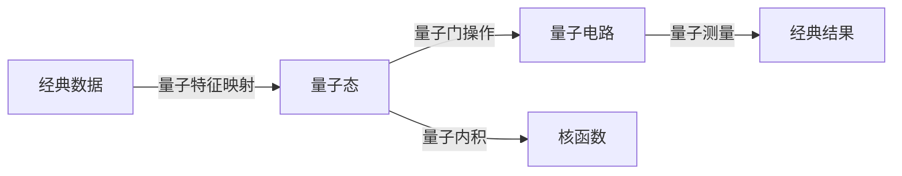

# 量子机器学习原理与代码实战案例讲解

## 1. 背景介绍
### 1.1 问题的由来
近年来,随着量子计算技术的飞速发展,将量子计算与机器学习相结合,探索量子机器学习(Quantum Machine Learning, QML)成为了一个极具前景的研究方向。传统的机器学习算法在处理大规模、高维度数据时常常面临计算瓶颈,而量子计算独特的并行性和高效性为解决这一难题提供了新的思路。量子机器学习通过利用量子力学的基本原理,如量子叠加、纠缠等,有望在机器学习领域取得突破性进展。

### 1.2 研究现状
目前,量子机器学习的研究主要集中在量子算法设计、量子神经网络、量子核方法等方面。一些经典的机器学习算法,如支持向量机(SVM)、主成分分析(PCA)等已被成功移植到量子计算框架下。同时,研究人员还提出了一些专门针对量子系统设计的机器学习算法,如量子变分算法(VQA)、量子近似优化算法(QAOA)等。这些研究成果为量子机器学习的发展奠定了坚实的基础。

### 1.3 研究意义
量子机器学习的研究意义主要体现在以下几个方面:

1. 突破经典算法瓶颈:量子并行性和高维度处理能力有望帮助突破传统机器学习算法面临的计算瓶颈,实现更高效、更精准的学习和预测。

2. 拓展应用场景:量子机器学习可应用于量子模拟、量子信号处理、量子图像识别等新兴领域,为这些领域的发展提供新的动力。

3. 促进量子计算发展:机器学习是检验量子计算实用性的重要场景之一,量子机器学习的进展也将反过来推动量子计算硬件和软件生态的完善。

### 1.4 本文结构
本文将从以下几个方面对量子机器学习展开深入探讨:第2部分介绍量子机器学习的核心概念;第3部分重点讲解几种主要的量子机器学习算法原理;第4部分给出相关数学模型和公式推导;第5部分通过代码实例演示量子机器学习的实现;第6部分讨论量子机器学习的应用场景;第7部分推荐相关学习资源;第8部分对量子机器学习的发展前景做出展望。

## 2. 核心概念与联系
量子机器学习是建立在量子力学和机器学习两大理论基础之上的交叉学科。其核心是利用量子系统的独特性质,如量子叠加、纠缠、干涉等,来实现更高效的机器学习算法。下面我们来看几个量子机器学习的核心概念:

- 量子态(Quantum state):量子系统所处的状态,可以用状态向量或密度矩阵来描述。量子态的叠加性质是量子并行计算的基础。

- 量子门(Quantum gate):作用于量子态的基本操作单元,通过量子门的组合可以实现各种量子算法。常见的量子门包括 Hadamard 门、CNOT 门等。

- 量子电路(Quantum circuit):由量子门组成的计算流程图,是编写量子程序的主要方式。通过设计合适的量子电路,可以实现对量子态的各种变换和测量。

- 量子测量(Quantum measurement):从量子态中提取经典信息的过程。测量会导致量子态的塌缩,因此测量策略的选择是量子机器学习的关键问题之一。

- 量子内积(Quantum inner product):两个量子态之间的相似度度量,在许多量子机器学习算法中扮演核函数的角色。

- 量子特征映射(Quantum feature map):将经典数据映射到量子态空间的方法,使经典机器学习算法能够在量子系统上实现。

下图展示了量子机器学习各核心概念之间的联系:

## 3. 核心算法原理 & 具体操作步骤
### 3.1 算法原理概述
量子机器学习算法可分为两大类:一类是将经典机器学习算法移植到量子系统上,利用量子加速获得性能提升;另一类则是针对量子系统本身的特点设计的全新算法。下面重点介绍几种代表性的量子机器学习算法:

1. 量子支持向量机(QSVM):通过将经典数据映射到量子态空间,利用量子内积加速核函数计算,从而实现更高效的 SVM 训练和预测。

2. 量子主成分分析(QPCA):利用量子相位估计算法对数据协方差矩阵进行特征值分解,得到数据的主成分。相比经典 PCA,QPCA 在处理高维数据时具有指数级加速优势。

3. 量子变分算法(VQA):一种混合量子-经典算法框架,通过经典优化算法调整量子电路参数,使电路输出最小化某个损失函数。VQA 可用于解决组合优化、特征值计算等问题。

4. 量子近似优化算法(QAOA):基于变分原理设计的量子启发式算法,通过交替施加问题哈密顿量和混合哈密顿量,找到优化问题的近似最优解。

### 3.2 算法步骤详解
以 QSVM 为例,详细说明其算法步骤:

1. 数据预处理:将经典数据集 $\{x_i,y_i\}$ 映射到量子态空间,得到训练集量子态 $\{|\psi(x_i)\rangle\}$。常见的映射方法有振幅编码、基于 Ansatz 电路的编码等。

2. 构建 SVM 优化问题:将 SVM 的对偶问题表示为关于拉格朗日乘子 $\alpha$ 的凸二次规划:

$$
\begin{aligned}
\min_\alpha \quad & \frac{1}{2}\sum_{i,j} y_i y_j \alpha_i \alpha_j |\langle\psi(x_i)|\psi(x_j)\rangle|^2 - \sum_i \alpha_i \\
\mathrm{s.t.} \quad & 0 \leq \alpha_i \leq C, \quad \sum_i y_i \alpha_i = 0
\end{aligned}
$$

其中 $|\langle\psi(x_i)|\psi(x_j)\rangle|^2$ 为量子态之间的内积,可通过 Swap Test 电路高效求解。

3. 求解优化问题:使用量子优化算法,如 QAOA、量子梯度下降等,求解上述凸二次规划,得到最优解 $\alpha^*$。

4. 构建分类器:根据 $\alpha^*$ 得到 QSVM 分类器:

$$
f(x) = \mathrm{sgn}\left(\sum_i y_i \alpha_i^* |\langle\psi(x_i)|\psi(x)\rangle|^2 + b\right)
$$

其中 $b$ 为偏置项,可通过 KKT 条件求得。

5. 模型评估:使用测试集数据评估 QSVM 分类器的性能,如精度、F1 值等。

### 3.3 算法优缺点
QSVM 的主要优势在于:

1. 量子加速:通过将核函数计算转化为量子态内积,QSVM 可实现 $O(log(n))$ 的加速比,其中 $n$ 为训练样本数。

2. 高维处理:量子态天然适合处理高维数据,QSVM 可有效避免维度灾难问题。

3. 非线性建模:通过量子特征映射,QSVM 可处理非线性分类问题。

但 QSVM 也存在一些局限性:

1. 编码难度:将经典数据有效映射到量子态空间是一个难题,不当的编码方式可能导致量子优势丧失。

2. 噪声影响:量子系统容易受到环境噪声干扰,导致算法性能下降。因此 QSVM 对量子硬件的质量要求较高。

3. 经典优化:QSVM 的训练过程仍需借助经典优化算法,如果优化问题本身较难求解,则量子加速优势可能无法体现。

### 3.4 算法应用领域
QSVM 等量子机器学习算法可应用于以下领域:

1. 量子化学:预测分子性质、化学反应路径等。

2. 量子图像处理:图像分类、目标检测等。

3. 金融数据分析:股票趋势预测、金融风险评估等。

4. 生物信息学:蛋白质结构预测、基因表达分析等。

5. 社交网络挖掘:社团检测、链接预测等。

## 4. 数学模型和公式 & 详细讲解 & 举例说明
### 4.1 数学模型构建
以下是 QSVM 的数学模型构建过程。

首先,将 $n$ 个 $d$ 维经典数据点 $\{(\vec{x_i},y_i)\}_{i=1}^n$ 映射到量子态空间,得到训练集量子态 $\{|\psi(\vec{x_i})\rangle\}_{i=1}^n$。假设量子特征映射函数为 $\phi$,则 $|\psi(\vec{x_i})\rangle = \phi(\vec{x_i})$。

其次,类似经典 SVM,构建以下优化问题:

$$
\begin{aligned}
\min_{\vec{w},b,\xi} \quad & \frac{1}{2}||\vec{w}||^2 + C\sum_{i=1}^n \xi_i \\
\mathrm{s.t.} \quad & y_i(\langle\vec{w}|\phi(\vec{x_i})\rangle + b) \geq 1 - \xi_i, \\
& \xi_i \geq 0, \quad i=1,\dots,n.
\end{aligned}
$$

其中 $\vec{w},b$ 为分类超平面参数,$\xi_i$ 为松弛变量,$C$ 为惩罚系数,控制间隔宽度和误分类容忍度之间的平衡。

引入拉格朗日乘子 $\alpha=(\alpha_1,\dots,\alpha_n)$ 和 $\beta=(\beta_1,\dots,\beta_n)$,得到拉格朗日函数:

$$
L(\vec{w},b,\xi,\alpha,\beta) = \frac{1}{2}||\vec{w}||^2 + C\sum_{i=1}^n \xi_i - \sum_{i=1}^n \alpha_i [y_i(\langle\vec{w}|\phi(\vec{x_i})\rangle + b) - 1 + \xi_i] - \sum_{i=1}^n \beta_i\xi_i
$$

根据 KKT 条件,上述优化问题可转化为关于 $\alpha$ 的对偶问题:

$$
\begin{aligned}
\max_\alpha \quad & \sum_{i=1}^n \alpha_i - \frac{1}{2}\sum_{i,j=1}^n y_i y_j \alpha_i \alpha_j |\langle\phi(\vec{x_i})|\phi(\vec{x_j})\rangle|^2 \\
\mathrm{s.t.} \quad & 0 \leq \alpha_i \leq C, \quad i=1,\dots,n, \\
& \sum_{i=1}^n y_i \alpha_i = 0.
\end{aligned}
$$

求解上述对偶问题,得到最优解 $\alpha^*=(\alpha_1^*,\dots,\alpha_n^*)$,则 QSVM 的分类决策函数为:

$$
f(\vec{x}) = \mathrm{sgn}\left(\sum_{i=1}^n y_i \alpha_i^* |\langle\phi(\vec{x_i})|\phi(\vec{x})\rangle|^2 + b\right)
$$

其中偏置项 $b$ 可由 KKT 条件求得:对任意满足 $0<\alpha_k^*<C$ 的 $k$,有

$$
b = y_k - \sum_{i=1}^n y_i \alpha_i^* |\langle\phi(\vec{x_i})|\phi(\vec{x_k})\rangle|^2
$$

### 4.2 公式推导过程
以下详细说明 QSVM 数学模型推导过程中的几个关键步骤。

**1. 拉格朗日函数构建**

为求解原始优化问题,引入拉格朗日乘子 $\alpha_i\geq 0$ 和 