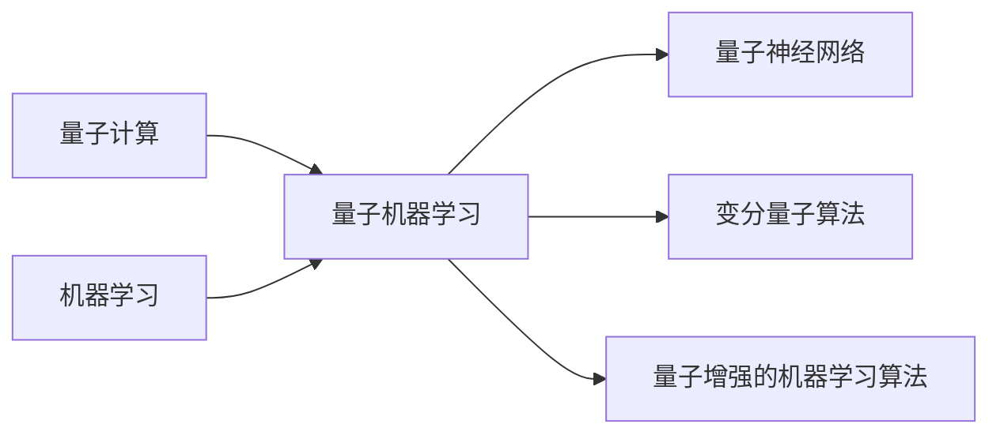
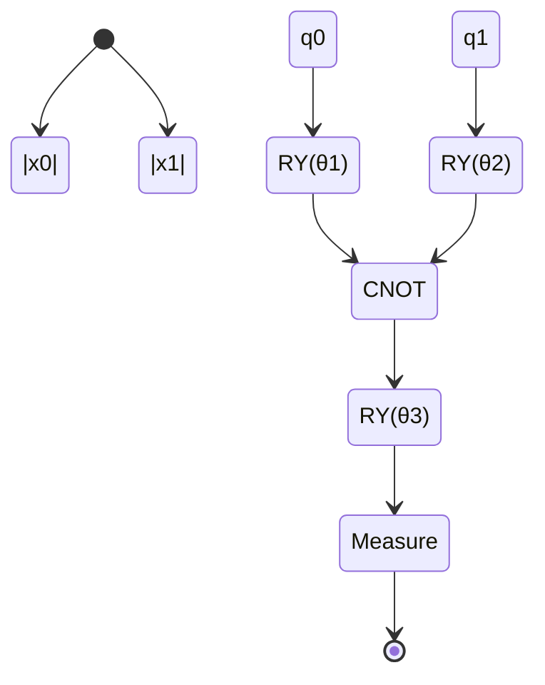

# 量子机器学习原理与代码实战案例讲解

关键词：量子计算、机器学习、量子机器学习、量子算法、量子线路、量子神经网络、变分量子算法

## 1. 背景介绍
### 1.1 问题的由来
近年来，随着量子计算技术的飞速发展，将量子计算与机器学习相结合，利用量子计算的独特优势来解决传统机器学习中的难题，已经成为了一个新兴的研究热点。量子机器学习（Quantum Machine Learning）作为量子计算和机器学习交叉融合的产物，为人工智能的发展开辟了新的道路。

### 1.2 研究现状
目前，量子机器学习的研究主要集中在量子增强的机器学习算法、量子神经网络、变分量子算法等方面。一些科技巨头如谷歌、IBM、微软等都在积极布局量子机器学习领域。谷歌开发了量子张量网络等量子机器学习模型；IBM提出了量子电路学习等量子机器学习框架；微软也推出了量子机器学习工具包 QML。

### 1.3 研究意义
量子机器学习利用量子计算的高并行性、量子叠加等独特性质，有望在高维数据处理、特征提取、模型训练等方面取得突破，极大提升机器学习的性能。量子机器学习的发展对于推动人工智能的进步、解决传统机器学习的瓶颈问题具有重要意义。

### 1.4 本文结构
本文将从量子机器学习的核心概念入手，详细阐述其中的关键算法原理，并通过数学模型和代码实例深入讲解量子机器学习的实现细节。同时，本文还将介绍量子机器学习的实际应用场景，分析其未来发展趋势与面临的挑战。

## 2. 核心概念与联系
量子机器学习是将量子计算与机器学习相结合的交叉学科。其核心思想是利用量子计算的独特优势，如量子并行性、量子叠加、量子纠缠等，来增强传统的机器学习算法。

在量子机器学习中，数据通常被编码到量子态上，通过构建量子线路模型对其进行处理。量子线路由量子门组成，量子门可对量子态进行各种变换操作。通过设计合适的量子线路结构，并优化其参数，可以实现对量子态的特征提取、分类、回归等任务。

量子机器学习的一个重要分支是量子神经网络，它模仿经典神经网络的结构，使用量子线路来构建类似于神经元的量子单元。通过训练优化量子神经网络的参数，可以实现对量子数据的非线性变换和特征学习。

此外，变分量子算法是量子机器学习中的另一个重点研究方向。变分量子算法利用参数化量子线路和经典优化算法，通过迭代优化线路参数来最小化某个损失函数，从而求解机器学习问题。

下图展示了量子机器学习的核心概念之间的联系：



## 3. 核心算法原理 & 具体操作步骤
### 3.1 算法原理概述
量子机器学习的核心算法包括量子神经网络算法和变分量子算法两大类。

量子神经网络算法借鉴了经典神经网络的思想，使用量子线路来构建类似于神经元的量子单元。通过设计合适的量子线路结构，并优化其参数，可以实现对量子数据的非线性变换和特征学习。

变分量子算法则利用参数化量子线路和经典优化算法，通过迭代优化线路参数来最小化某个损失函数，从而求解机器学习问题。变分量子算法的核心思想是将问题转化为一个参数优化问题，通过经典优化算法来更新量子线路的参数，不断逼近最优解。

### 3.2 算法步骤详解
以变分量子分类器算法为例，其具体步骤如下：

1. 数据编码：将经典数据编码到量子态上，常见的编码方式有振幅编码、角度编码等。
2. 构建参数化量子线路：设计合适的参数化量子线路结构，用于对量子态进行变换操作。
3. 定义损失函数：选择合适的损失函数，如交叉熵损失函数，用于评估模型的性能。
4. 初始化线路参数：随机初始化参数化量子线路的参数。
5. 迭代优化：
   - 前向传播：将编码后的量子态输入到参数化量子线路中，得到输出量子态。
   - 测量输出：对输出量子态进行测量，得到分类结果。
   - 计算损失：根据分类结果和真实标签计算损失函数值。
   - 求解梯度：计算损失函数对量子线路参数的梯度。
   - 更新参数：使用经典优化算法（如梯度下降）更新量子线路参数。
6. 迭代终止：重复步骤5，直到达到预设的迭代次数或损失函数值满足要求。

### 3.3 算法优缺点
变分量子分类器算法的优点包括：
- 可以有效处理高维量子数据，具有良好的特征学习能力。
- 通过经典优化算法更新参数，训练过程相对简单。
- 可以适应不同的量子线路结构和编码方式。

但变分量子分类器算法也存在一些局限性：
- 量子线路的设计需要依赖先验知识和经验，不同问题需要设计不同的线路结构。
- 训练过程中需要大量的量子线路评估和测量，对量子硬件的性能要求较高。
- 算法的收敛速度和性能受限于经典优化算法的选择。

### 3.4 算法应用领域
变分量子分类器算法可以应用于各种分类任务，如图像分类、语音识别、金融风险预测等。此外，变分量子算法还可以用于其他机器学习任务，如回归、聚类、生成模型等。

## 4. 数学模型和公式 & 详细讲解 & 举例说明
### 4.1 数学模型构建
在变分量子分类器算法中，我们通过构建参数化量子线路来实现对量子态的变换操作。假设输入量子态为 $|\psi_{\text{in}}\rangle$，参数化量子线路可以表示为一个幺正算符 $U(\theta)$，其中 $\theta$ 为线路的参数向量。经过量子线路变换后，输出量子态为：

$$|\psi_{\text{out}}\rangle = U(\theta)|\psi_{\text{in}}\rangle$$

接下来，我们对输出量子态进行测量，得到分类结果。测量结果可以用一个观测算符 $M$ 来表示，例如对于二分类问题，我们可以选择 $M=|0\rangle\langle0|$。分类结果的概率可以表示为：

$$p(y|\theta) = \langle\psi_{\text{out}}|M|\psi_{\text{out}}\rangle$$

其中 $y$ 表示分类标签。

### 4.2 公式推导过程
在训练过程中，我们需要最小化一个损失函数，常用的损失函数有交叉熵损失函数：

$$L(\theta) = -\sum_{i=1}^{N} y_i \log p(y_i|\theta) + (1-y_i) \log (1-p(y_i|\theta))$$

其中 $N$ 为训练样本数，$y_i$ 为第 $i$ 个样本的真实标签。

为了优化损失函数，我们需要计算其对量子线路参数 $\theta$ 的梯度。梯度可以通过参数移位法（Parameter-Shift Rule）来估计：

$$\frac{\partial L(\theta)}{\partial \theta_k} \approx \frac{L(\theta+\frac{\pi}{2}e_k) - L(\theta-\frac{\pi}{2}e_k)}{2}$$

其中 $e_k$ 为第 $k$ 个标准基向量。

得到梯度后，我们可以使用经典优化算法（如梯度下降）来更新量子线路参数：

$$\theta \leftarrow \theta - \alpha \nabla_{\theta} L(\theta)$$

其中 $\alpha$ 为学习率。

### 4.3 案例分析与讲解
下面我们以一个简单的二分类问题为例，说明变分量子分类器算法的应用。

假设我们有一个二维数据集，数据点分布在两个类别中。我们可以使用振幅编码将数据点编码到量子态上：

$$|\psi_{\text{in}}\rangle = x_0|00\rangle + x_1|01\rangle + x_2|10\rangle + x_3|11\rangle$$

其中 $x_i$ 为数据点的坐标分量。

接下来，我们设计一个简单的参数化量子线路，包含一些单量子门和双量子门，如：



其中 RY 表示绕 Y 轴旋转的单量子门，CNOT 表示受控非门。

我们选择测量第一个量子比特的 $|0\rangle$ 态概率作为分类结果。损失函数选择交叉熵损失函数。

在训练过程中，我们不断迭代优化量子线路参数 $\theta$，直到损失函数值满足要求或达到预设的迭代次数。

最终，我们得到一个训练好的变分量子分类器模型，可以用于对新的数据点进行分类预测。

### 4.4 常见问题解答
1. 问：变分量子分类器算法中的量子线路结构如何设计？
   答：量子线路的设计需要根据具体问题和数据的特点来定制。通常可以采用一些常见的量子线路模块，如量子特征映射、量子神经网络层等。线路的深度和宽度也需要根据问题的复杂度来调整。

2. 问：变分量子分类器算法的训练过程中，如何评估量子线路的性能？
   答：我们可以使用一些评估指标，如准确率、精确率、召回率等，来评估量子线路的性能。这需要在训练过程中定期在验证集上测试模型的表现。此外，我们还可以监控损失函数的变化趋势，判断模型是否收敛。

3. 问：变分量子分类器算法对量子硬件有什么要求？
   答：变分量子分类器算法需要在量子计算机上运行，对量子比特的数量、连接拓扑、噪声水平等都有一定要求。目前的量子硬件还存在一些限制，如量子比特数量有限、噪声水平较高等，这对算法的性能有一定影响。

## 5. 项目实践：代码实例和详细解释说明
### 5.1 开发环境搭建
要实现变分量子分类器算法，我们需要使用量子编程框架和工具。目前常用的量子编程框架有 Qiskit、Cirq、PyQuil 等。以 Qiskit 为例，我们可以通过以下步骤搭建开发环境：

1. 安装 Anaconda 或 Miniconda
2. 创建并激活一个新的虚拟环境
3. 安装 Qiskit：`pip install qiskit`
4. 安装 Jupyter Notebook：`pip install jupyter`

### 5.2 源代码详细实现
下面是使用 Qiskit 实现变分量子分类器算法的示例代码：

```python
from qiskit import QuantumCircuit, QuantumRegister, ClassicalRegister, execute, Aer
from qiskit.circuit.library import RYGate, CXGate
from qiskit.aqua.components.optimizers import SPSA
from qiskit.aqua.components.loss_functions import CrossEntropyLoss

# 定义量子线路
def create_circuit(x, theta):
    qr = QuantumRegister(2)
    cr = ClassicalRegister(1)
    qc = QuantumCircuit(qr, cr)
    
    # 数据编码
    qc.initialize([x[0], x[1], x[2], x[3]], qr)
    
    