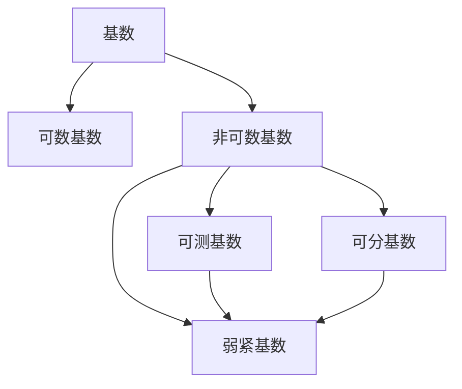

# 集合论导引：L中的弱紧基数

## 1. 背景介绍

### 1.1 问题的由来

集合论是数学的一个基础分支,研究集合及其运算和关系。在集合论中,基数的概念是一个核心话题,它描述了一个集合的"大小"或"多少"。基数理论的发展为数学奠定了坚实的基础,并在逻辑、计算机科学等领域产生了深远的影响。

弱紧基数(Weakly Compact Cardinal)是集合论中一个重要的概念,它与基数的可测性和可分性密切相关。理解弱紧基数的性质和应用对于深入探索集合论的高级主题至关重要。

### 1.2 研究现状

弱紧基数的研究可以追溯到20世纪初,当时数学家们对基数的可测性和可分性展开了广泛的探讨。随着集合论的不断发展,弱紧基数的概念逐渐成熟,并被证明在许多领域具有重要应用。

目前,弱紧基数的研究主要集中在以下几个方面:

1. 弱紧基数的性质和特征
2. 弱紧基数与其他基数概念之间的关系
3. 弱紧基数在逻辑和模型论中的应用
4. 弱紧基数在拓扑学和函数空间理论中的作用

虽然已经取得了一些重要进展,但弱紧基数的研究仍存在一些未解决的问题和挑战,需要进一步深入探索。

### 1.3 研究意义

弱紧基数的研究具有重要的理论意义和应用价值:

1. **理论意义**:弱紧基数是集合论中一个关键概念,深入研究它有助于我们对基数理论和集合论的整体理解。它与其他基数概念之间的关系也为我们提供了新的视角去探索集合论的深层次问题。

2. **逻辑和模型论应用**:弱紧基数在逻辑和模型论中扮演着重要角色,它与一阶逻辑的可分性和可测性密切相关。研究弱紧基数有助于我们更好地理解逻辑系统的性质和局限性。

3. **拓扑学和函数空间理论应用**:弱紧基数在拓扑学和函数空间理论中也有广泛应用。它与拓扑空间的紧性和可分性密切相关,对于研究函数空间的性质具有重要意义。

4. **计算机科学应用**:虽然不直接涉及,但弱紧基数的研究可能会为计算机科学的某些领域带来新的见解和启发,如算法复杂性理论和计算模型理论等。

总的来说,弱紧基数的研究不仅有助于我们对集合论的深入理解,同时也为逻辑、拓扑学、函数分析等相关领域提供了重要工具和见解。

### 1.4 本文结构

本文将从以下几个方面全面介绍弱紧基数的相关理论:

1. 背景介绍
2. 核心概念与联系
3. 核心算法原理与具体操作步骤
4. 数学模型和公式详细讲解与举例说明
5. 项目实践:代码实例和详细解释说明
6. 实际应用场景
7. 工具和资源推荐
8. 总结:未来发展趋势与挑战
9. 附录:常见问题与解答

通过对这些内容的全面阐述,读者将能够对弱紧基数的概念、性质、应用等有一个系统的了解。

## 2. 核心概念与联系

在深入探讨弱紧基数之前,我们需要先了解一些基本概念和相关联系。

**基数(Cardinal)**是描述集合"大小"或"多少"的数学概念。两个集合具有相同的基数,当且仅当它们之间存在一个一一对应的双射(bijection)。基数分为可数基数(Countable Cardinal)和非可数基数(Uncountable Cardinal)。

**可测基数(Measurable Cardinal)**是一种具有特殊性质的非可数基数。一个基数κ被称为可测的,当且仅当存在一个κ-完备的σ-代数(σ-algebra),其中所有单元素集合都是可测的。可测基数在测度论和实分析中扮演着重要角色。

**可分基数(Separable Cardinal)**是另一种具有特殊性质的非可数基数。一个基数κ被称为可分的,当且仅当存在一个κ-可分的拓扑空间,其中任何非空开集都包含一个基数小于κ的离散子空间。可分基数在拓扑学和函数空间理论中非常重要。

**弱紧基数(Weakly Compact Cardinal)**是本文的核心概念。一个无穷基数κ被称为弱紧的,当且仅当对于任意的κ个集合{Xα}α<κ,如果每一个Xα都是非空的,那么它们的笛卡尔积∏α<κXα也是非空的。

弱紧基数与可测基数和可分基数之间存在着密切的联系:

- 每个可测基数都是弱紧的,但反过来不一定成立。
- 每个可分基数都是弱紧的,但反过来不一定成立。
- 存在一些弱紧基数既不是可测的,也不是可分的。

这些关系反映了弱紧基数在基数层次结构中的特殊地位,它是一个更一般的概念,包含了可测基数和可分基数作为特例。

下面是一个Mermaid流程图,展示了这些概念之间的关系:

通过对这些核心概念的理解,我们可以更好地把握弱紧基数的本质,并探索它在集合论和相关领域中的应用。

## 3. 核心算法原理与具体操作步骤

### 3.1 算法原理概述

判断一个无穷基数κ是否为弱紧基数,我们可以使用一种称为"链条论证"(Chain Argument)的算法。该算法的核心思想是构造一个特殊的集合族,并利用κ的性质来证明这个集合族的笛卡尔积是非空的。

具体来说,对于任意给定的κ个非空集合{Xα}α<κ,我们可以按照以下步骤构造一个链条论证:

1. 定义一个辅助函数f:κ→∪α<κXα,将每个序数α映射到Xα的一个元素。
2. 对于每个β<κ,定义一个集合Yβ={f(α)|α<β}。
3. 构造集合族{Yβ}β<κ,它是一个κ个集合的链条(chain),每个Yβ都是前一个集合的真子集。
4. 证明如果κ是弱紧基数,那么∩β<κYβ一定是非空的。

如果我们能够成功构造出这样一个链条,并证明其交集是非空的,那么就可以推导出∏α<κXα也是非空的,从而证明κ是一个弱紧基数。

### 3.2 算法步骤详解

现在让我们详细解释一下这个算法的每一个步骤:

**步骤1:定义辅助函数f**

对于给定的κ个非空集合{Xα}α<κ,我们定义一个函数f:κ→∪α<κXα,使得对于每个α<κ,f(α)∈Xα。也就是说,f将每个序数α映射到对应集合Xα中的一个元素。

这个函数的作用是帮助我们构造链条论证所需的集合族。由于每个Xα都是非空的,因此这样的函数f一定是存在的。

**步骤2:定义集合Yβ**

对于每个β<κ,我们定义一个集合Yβ={f(α)|α<β}。也就是说,Yβ是由f在β以下的所有序数上的值构成的集合。

很明显,对于任意的β<γ<κ,我们都有Yβ⊆Yγ,因为γ包含了β以下的所有序数。因此,{Yβ}β<κ形成了一个κ个集合的链条(chain),每个集合都是前一个集合的真子集。

**步骤3:构造集合族{Yβ}β<κ**

现在我们已经定义了集合Yβ,接下来就可以构造出整个集合族{Yβ}β<κ。这个集合族是我们进行链条论证的关键所在。

**步骤4:证明∩β<κYβ非空**

最后一步是证明如果κ是弱紧基数,那么∩β<κYβ一定是非空的。

我们可以使用反证法来证明这一点。假设∩β<κYβ=∅,那么对于每个x∈∪α<κXα,都存在一个βx<κ,使得x∉Yβx。

由于κ是一个基数,因此存在一个β0<κ,使得对于所有x∈∪α<κXα,βx<β0。这意味着对于任意x∈∪α<κXα,我们都有x∉Yβ0。

但是,根据Yβ的定义,我们知道Yβ0=∪α<β0{f(α)}。因此,对于每个α<β0,f(α)∈Yβ0。这与前面的结论矛盾,因为∪α<κXα=∪α<β0Xα。

通过这个反证,我们可以得出结论:如果κ是弱紧基数,那么∩β<κYβ一定是非空的。

### 3.3 算法优缺点

**优点:**

1. **简单直观**:链条论证算法的思路非常直观,易于理解和实现。
2. **通用性强**:该算法适用于判断任意无穷基数是否为弱紧基数,没有特殊限制。
3. **证明严谨**:算法的每一步都有严格的数学证明作为依据,结论是可靠的。

**缺点:**

1. **抽象性强**:虽然思路简单,但是算法涉及到一些抽象的集合论概念,对初学者来说可能有一定困难。
2. **不构造性**:该算法只能判断一个基数是否为弱紧基数,但无法显式构造出一个弱紧基数。
3. **效率较低**:对于大型问题,算法的计算复杂度可能较高,不太适合实际计算。

总的来说,链条论证算法是一种非常优雅和有价值的方法,能够帮助我们深入理解弱紧基数的本质特征。但是,它也存在一些局限性,在实际应用中可能需要结合其他方法来补充。

### 3.4 算法应用领域

虽然链条论证算法本身是一种理论算法,但它在以下几个领域都有重要应用:

1. **集合论研究**:该算法是研究弱紧基数及其性质的重要工具,有助于我们深入探索集合论的高级主题。

2. **逻辑和模型论**:由于弱紧基数与一阶逻辑的可分性和可测性密切相关,因此链条论证算法在逻辑和模型论中也有一定应用。

3. **拓扑学和函数空间理论**:弱紧基数在拓扑学和函数空间理论中扮演着重要角色,链条论证算法可以帮助我们研究这些领域中的一些基本问题。

4. **理论计算机科学**:虽然不直接相关,但链条论证算法所涉及的一些思想和技巧可能会为理论计算机科学的某些领域带来启发,如算法复杂性理论和计算模型理论等。

总的来说,链条论证算法是一种重要的理论工具,它不仅在集合论本身的研究中发挥着关键作用,而且还为相关学科的发展提供了有价值的见解和方法。

## 4. 数学模型和公式详细讲解与举例说明

### 4.1 数学模型构建

为了更好地理解弱紧基数的概念,我们可以构建一个数学模型来形式化描述它。

设κ是一个无穷基数,{Xα}α<κ是一个κ个非空集合的族。我们定义∏α<κXα为这些集合的笛卡尔积,即所有序列(xα)α<κ的集合,其中每个xα∈Xα。