好的,我会按照您的要求,以《集合论导引：嘎尔文-海纳定理》为题,撰写一篇专业的技术博客文章。文章将遵循您提供的约束条件,包括字数、格式、目录结构等要求。现在,让我们开始探讨这个有趣而深邃的数学主题。

# 集合论导引：嘎尔文-海纳定理

## 1. 背景介绍

### 1.1 问题的由来

集合论作为数学的一个基础分支,其重要性不言而喻。它为我们研究数学对象及其性质提供了坚实的理论基础。在集合论的发展历程中,有许多著名的定理和理论问世,其中嘎尔文-海纳定理(Galvin-Hajnal Theorem)就是一个具有里程碑意义的成果。

这一定理的起源可以追溯到20世纪60年代。当时,数学家嘎尔文(Fred Galvin)和海纳(András Hajnal)在研究无限集合的分割问题时,提出了一个看似简单但实则深邃的猜想。这个猜想后来被证明正确,并被命名为嘎尔文-海纳定理。

### 1.2 研究现状

嘎尔文-海纳定理在提出后不久就引起了数学界的广泛关注。许多著名数学家,如埃尔多斯(Paul Erdős)、马丁(Donald A. Martin)等,都对这一定理进行了深入研究。他们不仅给出了多种不同的证明方法,而且探讨了定理在不同领域的应用。

近年来,随着计算机科学的飞速发展,嘎尔文-海纳定理在理论计算机科学、组合数学等领域也展现出了重要的应用价值。例如,它被用于研究无限博弈论、图论算法、递归理论等领域。

### 1.3 研究意义 

嘎尔文-海纳定理的重要意义主要体现在以下几个方面:

1. **理论基础**:它为研究无限集合的分割问题奠定了坚实的理论基础,拓展了集合论的研究领域。

2. **应用价值**:该定理在计算机科学、组合数学等领域具有广泛的应用,为解决一些理论和实际问题提供了有力工具。

3. **思维启发**:定理背后所蕴含的数学思想和证明技巧,为数学工作者提供了宝贵的思维启发。

4. **交叉学科**:嘎尔文-海纳定理将集合论、组合数学、计算机科学等学科紧密联系在一起,促进了不同领域的交叉融合。

### 1.4 本文结构

本文将全面深入地探讨嘎尔文-海纳定理。我们将从定理的背景和核心概念出发,详细阐述定理的数学本质、证明思路和技巧。同时,我们还将介绍定理在不同领域的应用,以及相关的开放性问题和发展趋势。文章的主要结构如下:

```mermaid
graph TD
    A[集合论导引：嘎尔文-海纳定理] --> B[背景介绍]
    B --> C[问题的由来]
    B --> D[研究现状]
    B --> E[研究意义]
    B --> F[本文结构]
    A --> G[核心概念与联系]
    A --> H[核心算法原理&具体操作步骤]
    H --> I[算法原理概述]
    H --> J[算法步骤详解]
    H --> K[算法优缺点]
    H --> L[算法应用领域]
    A --> M[数学模型和公式&详细讲解&举例说明]
    M --> N[数学模型构建]
    M --> O[公式推导过程]
    M --> P[案例分析与讲解]
    M --> Q[常见问题解答]
    A --> R[项目实践：代码实例和详细解释说明]
    R --> S[开发环境搭建]
    R --> T[源代码详细实现]
    R --> U[代码解读与分析]
    R --> V[运行结果展示]
    A --> W[实际应用场景]
    A --> X[工具和资源推荐]
    X --> Y[学习资源推荐]
    X --> Z[开发工具推荐]
    X --> AA[相关论文推荐]
    X --> AB[其他资源推荐]
    A --> AC[总结：未来发展趋势与挑战]
    AC --> AD[研究成果总结]
    AC --> AE[未来发展趋势]
    AC --> AF[面临的挑战]
    AC --> AG[研究展望]
    A --> AH[附录：常见问题与解答]
```

## 2. 核心概念与联系

在深入探讨嘎尔文-海纳定理之前,我们需要先了解一些基本的集合论概念。这些概念不仅是定理的理论基础,也是我们理解和应用定理的关键所在。

**集合**:集合是数学中最基本的概念之一。一个集合是由若干确定的元素所组成的整体。我们通常使用大写字母(如A、B、X等)来表示集合,使用花括号{}来列出集合中的元素。例如,A = {1, 2, 3}表示一个包含三个元素1、2和3的集合。

**子集**:如果一个集合B中的所有元素都属于另一个集合A,那么我们称B是A的子集,记作B ⊆ A。例如,{1, 2}是{1, 2, 3}的子集。

**幂集**:对于任意一个集合A,我们可以构造出A的所有子集组成的集合,这个集合被称为A的幂集,记作P(A)。例如,如果A = {1, 2},那么A的幂集P(A) = {∅, {1}, {2}, {1, 2}}。

**分割**:对于一个给定的集合A,如果我们能够将A划分为若干个不相交的子集,且这些子集的并集仍然等于A,那么我们就称这种划分为A的一个分割。形式上,如果存在一组不相交的子集{A1, A2, ..., An},使得A1 ∪ A2 ∪ ... ∪ An = A,那么{A1, A2, ..., An}就是A的一个分割。

**序数**:序数是用来描述有序集合中元素的位置或排列顺序的数字。最小的序数是0,它对应于空集∅。接下来是1,对应于只包含一个元素的集合{∅}。然后是2,对应于{∅,{∅}}。序数的概念在研究无限集合时扮演着重要的角色。

上述概念虽然简单,但却是嘎尔文-海纳定理的基石。定理本身关注的是无限集合的分割问题,即如何将一个无限集合划分为若干个无限子集,并满足某些特定的条件。这种问题在集合论、组合数学和计算机科学中有着广泛的应用。

## 3. 核心算法原理 & 具体操作步骤

### 3.1 算法原理概述

嘎尔文-海纳定理的核心思想可以概括为:对于任意一个无限集合A,如果我们以一种特殊的方式对A进行分割,那么在分割过程中必然会出现一个"大"的同胞子集。

所谓"同胞子集"(homogeneous set),是指一个子集中的元素在某种意义上是"相似"或"等价"的。例如,对于实数集R,我们可以根据数的奇偶性将其划分为两个同胞子集:奇数集和偶数集。

在嘎尔文-海纳定理中,我们关注的是集合A在序数上的分割。也就是说,我们将A划分为若干个子集,每个子集都对应于一个序数。这种分割方式被称为"规范分割"(canonical partition)。

定理指出,对于任意一个无限集合A,如果我们以规范分割的方式对A进行分割,那么在分割过程中必然会出现一个"大"的同胞子集B,其基数(元素个数)至少为ω(B) = min{α : cf(α) > ω},其中cf(α)表示α的余数(cofinality)。

这个结论看似简单,但它揭示了无限集合分割问题的一个深刻本质:在某些特殊情况下,无限集合的分割必然会产生"大"的同胞子集。这一性质在许多数学领域都有重要应用,如递归理论、图论算法等。

### 3.2 算法步骤详解

现在,让我们更加细致地分析一下嘎尔文-海纳定理的证明过程和算法步骤。

1. **构造规范分割**:给定一个无限集合A,我们首先需要构造A的规范分割。具体步骤如下:
   
   a. 将A中的每个元素x与其在A中的位置(即其序数)α(x)联系起来,从而得到一个序数集合S = {α(x) | x ∈ A}。
   
   b. 对S进行递增排序,得到一个严格递增的序数序列{αi}。
   
   c. 将A划分为若干个子集{Aα},其中Aα = {x ∈ A | α(x) = α}。这就是A的规范分割。

2. **构造同胞树**:在规范分割的基础上,我们可以构造一棵"同胞树"(homogeneous tree)。这棵树的每个节点对应于A的一个子集,且子集之间存在包含关系。具体步骤如下:
   
   a. 树的根节点对应于整个集合A。
   
   b. 对于任意一个节点X,如果X可以进一步分割为{X0, X1, ..., Xn},那么我们就将这些子集作为X的子节点。
   
   c. 重复上一步,直到所有节点都不能再分割为止。

3. **寻找"大"的同胞子集**:在构造好同胞树之后,我们可以利用数学归纳法和反证法,证明在树中必然存在一个"大"的同胞子集B,其基数满足ω(B) = min{α : cf(α) > ω}。

   a. 首先,我们证明对于任意一个序数α,如果cf(α) ≤ ω,那么在同胞树中一定存在一个节点X,使得ω(X) = α。
   
   b. 接下来,我们证明对于任意一个无限集合A,在同胞树中一定存在一个"大"的同胞子集B,使得ω(B) ≥ min{α : cf(α) > ω}。
   
   c. 结合上面两个结论,我们就可以推出ω(B) = min{α : cf(α) > ω}。

上述步骤看似复杂,但实际上它们都源自于一个关键的观察:在规范分割过程中,同胞子集之间存在着一种递归的包含关系。通过巧妙地利用这种递归性质,我们就可以发现并构造出所需的"大"同胞子集。

### 3.3 算法优缺点

嘎尔文-海纳定理的证明过程展现了数学家们精妙绝伦的思维能力和创造力。然而,就像任何其他算法一样,它也存在一些优缺点。

**优点**:

1. **理论意义深远**:定理揭示了无限集合分割问题的一个基本本质,为相关领域的研究奠定了坚实的理论基础。

2. **思路巧妙独特**:证明过程中所采用的同胞树构造方法和归纳思路,展现了数学家们独特的创新思维。

3. **应用前景广阔**:定理在递归理论、图论算法等领域都有重要应用,为解决实际问题提供了有力工具。

**缺点**:

1. **理解难度较大**:由于涉及到许多抽象的集合论概念和复杂的数学推理,定理的理解和掌握确实存在一定难度。

2. **计算复杂度高**:在实际应用中,构造规范分割和同胞树的计算复杂度可能会很高,尤其是对于大规模的无限集合。

3. **一般性不足**:虽然定理为无限集合的分割问题提供了重要启示,但它只关注了一种特殊的分割方式(规范分割),对于其他类型的分割方式,定理的适用性可能会受到限制。

总的来说,嘎尔文-海纳定理是一个具有里程碑意义的数学成果,它的优点和重要性是不可否认的。但同时,我们也需要认识到它的局限性,并继续探索更加一般化和实用的理论和算法。

### 3.4 算法应用领域

