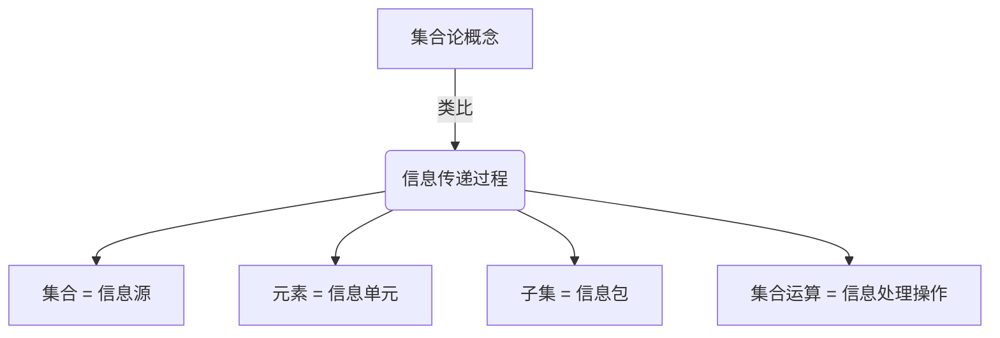
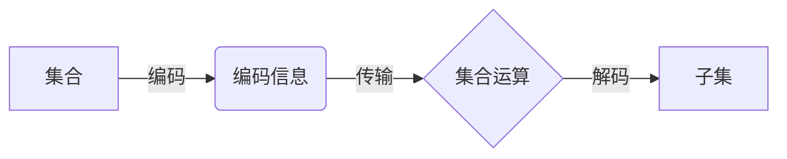
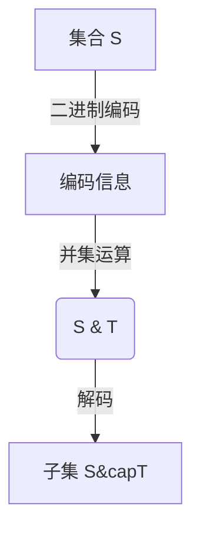

# 集合论导引：集合论传递模型

## 1. 背景介绍

### 1.1 问题的由来

集合论作为数学的一个基础分支,其重要性不言而喻。它为数学家们提供了一种描述和处理抽象概念的强大工具。然而,传统的集合论教学方法往往过于枯燥和抽象,使得许多学生难以掌握其核心思想。因此,如何以一种更加生动和直观的方式来传授集合论,成为了一个亟待解决的问题。

### 1.2 研究现状

近年来,一些数学教育工作者开始尝试采用新颖的教学方法来改善这一状况。其中,集合论传递模型(Set Theory Transmission Model,简称STTM)就是一种备受关注的尝试。该模型旨在通过构建一个类比于信息传递的隐喻,来帮助学生更好地理解集合论的核心概念。

### 1.3 研究意义

集合论传递模型的提出,为集合论教学带来了新的契机。通过将抽象的集合论概念与日常生活中的信息传递过程相联系,学生们能够更加直观地把握集合论的本质,从而提高学习效率和兴趣。此外,该模型还为集合论的教学方法论提供了新的视角,有助于推动数学教育的创新和发展。

### 1.4 本文结构

本文将从集合论传递模型的核心概念出发,深入探讨其理论基础和算法实现。我们将首先介绍模型的背景和基本思想,然后详细阐述其核心算法原理和数学模型,并通过实际案例进行说明和分析。接下来,我们将展示该模型在教学实践中的应用,并分享相关的工具和资源。最后,我们将总结该模型的发展趋势和面临的挑战,为未来的研究提供一些思路和建议。

## 2. 核心概念与联系

集合论传递模型的核心思想是将集合论中的基本概念(如集合、元素、子集等)类比为信息传递过程中的发送方、接收方和信道。具体来说:

1. **集合**被视为一个"信息源"(Source),它包含了一系列待传递的"信息元素"。
2. **元素**则代表了这些待传递的"信息单元"。
3. **子集**相当于从信息源中抽取出的一部分"信息包"。
4. **集合运算**(如并集、交集等)则对应于对这些"信息包"进行的各种处理和组合操作。

通过这种类比,学生们可以将抽象的集合论概念与日常生活中的信息传递过程联系起来,从而更好地理解和掌握它们。

该模型不仅为集合论提供了一种直观的理解方式,同时也为信息论等其他学科带来了新的视角和启发。通过将两个看似不相关的领域联系起来,我们可以发现它们之间存在着许多有趣的内在联系,从而拓展我们的思维视野。

## 3. 核心算法原理与具体操作步骤

### 3.1 算法原理概述

集合论传递模型的核心算法原理是基于信息论中的"信道编码"(Channel Coding)思想。具体来说,它将集合论中的概念和运算过程类比为信息的编码、传输和解码过程。

在该算法中,集合被视为一个"信息源",其中的元素就是待传递的"信息单元"。我们需要将这些信息单元进行适当的编码,以便于通过"信道"(即集合运算)进行传输。接收方则需要对传输过来的编码信息进行解码,从而还原出原始的信息内容。

该算法的关键在于设计出一种高效的编码方案,使得信息在传输过程中不会出现失真或丢失。同时,解码过程也需要足够简单和高效,以确保整个过程的可行性和实用性。

### 3.2 算法步骤详解

1. **编码阶段**:将集合中的元素按照一定规则进行编码,生成对应的编码信息。常用的编码方式包括:
   - 二进制编码:将每个元素映射为一个二进制序列。
   - 霍夫曼编码:根据元素出现的概率,为常见元素分配较短的编码。
   - 算术编码:将整个集合映射为一个区间,每个元素对应该区间的一个子区间。

2. **传输阶段**:将编码后的信息通过集合运算(如并集、交集等)进行传输。不同的集合运算对应于不同的"信道",具有不同的特性(如噪声水平、带宽等)。

3. **解码阶段**:接收方根据已知的解码算法,对传输过来的编码信息进行解码,还原出原始的集合及其元素。

以二进制编码为例,该过程可以描述如下:

1) 将集合 $S = \{a, b, c\}$ 中的元素进行二进制编码,得到编码信息 $\{00, 01, 10\}$。
2) 将编码信息与另一集合 $T = \{x, y\}$ 进行并集运算,得到新集合 $S \cup T = \{00, 01, 10, x, y\}$。
3) 接收方对该新集合进行解码,提取出包含二进制编码的子集 $\{00, 01, 10\}$,并将其解码还原为原始集合 $S = \{a, b, c\}$。

### 3.3 算法优缺点

**优点**:

- 直观性:该算法为集合论提供了一种直观的理解方式,有助于学生掌握抽象概念。
- 灵活性:可以采用多种不同的编码方案,从而适应不同的应用场景和需求。
- 扩展性:该算法不仅适用于集合论,还可以推广到其他数学领域,为解决复杂问题提供新的思路。

**缺点**:

- 复杂度:编码和解码过程可能会导致算法的时间和空间复杂度增加。
- 精度损失:在某些情况下,编码和解码过程可能会导致一定程度的信息损失或精度降低。
- 局限性:该算法主要针对有限集合,对于无限集合可能会存在一定局限性。

### 3.4 算法应用领域

集合论传递模型及其核心算法不仅可以应用于集合论教学,还可以在以下领域发挥作用:

- **数据压缩**:该算法可以用于设计高效的数据压缩算法,将数据编码为更加紧凑的形式,从而节省存储空间和传输带宽。
- **错误纠正码**:通过设计合理的编码方案,可以为数据传输增加一定的容错能力,提高传输的可靠性。
- **信息隐藏**:将敏感信息隐藏在集合运算的过程中,实现信息的安全传输和保护。
- **组合优化**:将组合优化问题转化为集合运算的形式,利用该算法寻找最优解。

## 4. 数学模型和公式详细讲解与举例说明

### 4.1 数学模型构建

为了更好地描述和分析集合论传递模型,我们需要构建一个严格的数学模型。该模型的基本元素包括:

- $\mathcal{U}$: 宇集,表示所有可能的元素集合。
- $\mathcal{S}$: 集合族,是 $\mathcal{U}$ 的子集的集合,即 $\mathcal{S} \subseteq \mathcal{P}(\mathcal{U})$。
- $\mathcal{C}$: 编码函数族,将集合映射为编码信息,即 $\mathcal{C} = \{c: \mathcal{S} \rightarrow \mathcal{M}\}$,其中 $\mathcal{M}$ 是编码信息的集合。
- $\mathcal{D}$: 解码函数族,将编码信息还原为原始集合,即 $\mathcal{D} = \{d: \mathcal{M} \rightarrow \mathcal{S}\}$。
- $\Phi$: 集合运算族,描述了集合之间的各种运算,如并集、交集等。

在该模型中,我们的目标是找到一个合适的编码函数 $c \in \mathcal{C}$ 和解码函数 $d \in \mathcal{D}$,使得对于任意集合 $S \in \mathcal{S}$,有:

$$d(c(S) \Phi T) = S \Phi T$$

其中 $T \in \mathcal{S}$ 是任意另一集合,符号 $\Phi$ 表示集合运算。这个等式保证了在编码、传输和解码的过程中,集合的本质信息没有丢失或失真。

### 4.2 公式推导过程

接下来,我们将推导出一种特殊的编码方案,即基于素数的编码。该编码方案的思想是:将每个元素与一个素数相关联,并将集合表示为这些素数的乘积。

假设集合 $S = \{x_1, x_2, \ldots, x_n\}$,我们构造一个单射 $f: \mathcal{U} \rightarrow \mathbb{P}$,将每个元素 $x_i$ 映射为一个素数 $p_i$,其中 $\mathbb{P}$ 是素数集合。那么,我们可以定义编码函数为:

$$c(S) = \prod_{x_i \in S} f(x_i) = \prod_{i=1}^n p_i$$

即将集合 $S$ 编码为其对应素数的乘积。

解码函数则可以定义为:

$$d(m) = \{x_i \in \mathcal{U} | f(x_i) \text{ is a prime divisor of } m\}$$

即将编码信息 $m$ 分解为素数,然后将对应的元素加入解码后的集合。

利用这种编码方案,我们可以证明对于任意集合 $S, T \in \mathcal{S}$,有:

$$d(c(S) \cdot c(T)) = S \cup T$$
$$d\left(\frac{c(S)}{c(T)}\right) = S \setminus T$$

即通过简单的整数运算(乘法和除法),我们就可以实现集合的并集和差集操作。这种编码方案不仅简单高效,而且具有很好的可扩展性,可以推广到更复杂的集合运算。

### 4.3 案例分析与讲解

为了更好地理解上述数学模型和公式,我们来看一个具体的案例。假设有集合 $S = \{2, 3, 5\}$ 和 $T = \{3, 7, 11\}$,我们将它们编码为素数的乘积:

$$\begin{aligned}
c(S) &= 2 \times 3 \times 5 = 30 \\
c(T) &= 3 \times 7 \times 11 = 231
\end{aligned}$$

那么,我们可以计算出:

$$\begin{aligned}
c(S) \cdot c(T) &= 30 \times 231 = 6930 \\
d(6930) &= \{2, 3, 5, 7, 11\} = S \cup T
\end{aligned}$$

同理,我们也可以计算出集合的差集:

$$\begin{aligned}
\frac{c(S)}{c(T)} &= \frac{30}{231} = \frac{2 \times 3 \times 5}{3 \times 7 \times 11} \\
d\left(\frac{30}{231}\right) &= \{2, 5\} = S \setminus T
\end{aligned}$$

通过这个例子,我们可以清楚地看到,利用素数编码的方法,我们可以将集合运算转化为简单的整数运算,从而大大简化了计算过程。同时,这种编码方案也具有很好的可扩展性,可以推广到更复杂的集合运算和应用场景。

### 4.4 常见问题解答

1. **为什么要使用素数编码?**

   使