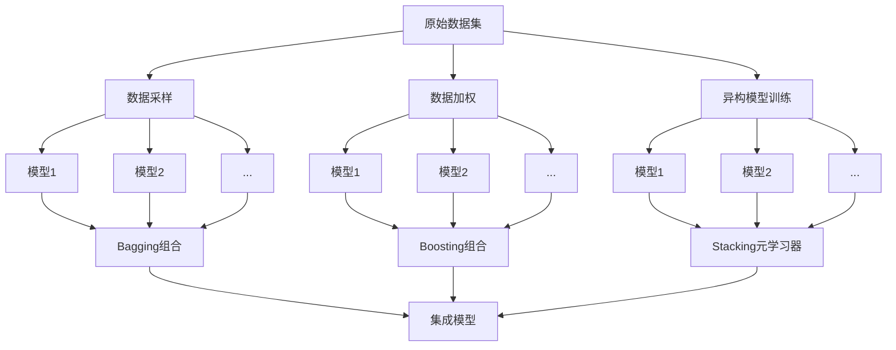

# 集成学习(Ensemble Learning)原理与代码实战案例讲解

关键词：集成学习、Bagging、Boosting、Stacking、随机森林、AdaBoost、GBDT、XGBoost

## 1. 背景介绍
### 1.1 问题的由来
在机器学习领域,单一模型往往难以获得令人满意的性能。为了提高预测的准确性和鲁棒性,人们提出了集成学习的概念。集成学习通过组合多个基学习器的预测结果来获得比单一模型更好的性能。

### 1.2 研究现状 
集成学习作为一种重要的机器学习范式,近年来得到了广泛的研究和应用。各种集成方法如Bagging、Boosting、Stacking等被相继提出,并在不同领域展现出优异的性能。一些经典的集成模型如随机森林、AdaBoost、GBDT等在工业界得到了大量的应用。

### 1.3 研究意义
集成学习能够显著提升预测的准确性,减小过拟合风险,具有重要的理论意义和实践价值。深入理解集成学习的内在机理,探索新的集成方法,对于推动机器学习的发展具有重要意义。

### 1.4 本文结构
本文将首先介绍集成学习的核心概念,然后重点讲解几种主要的集成学习算法原理和数学模型,并通过代码实例进行演示说明。最后总结集成学习的发展趋势和面临的挑战。

## 2. 核心概念与联系
集成学习的核心思想是通过组合多个弱学习器构建一个强学习器。这里的弱学习器是指泛化性能略优于随机猜测的模型,强学习器则是泛化性能远优于随机猜测的模型。通过恰当的组合策略,集成模型的整体性能可以显著优于单模型。

集成学习主要包括三类方法:
- Bagging(Bootstrap Aggregating):从原始数据中采样构建多个数据子集,在每个子集上训练一个基学习器,然后通过投票或平均的方式组合。代表算法有随机森林。
- Boosting:通过迭代训练多个弱学习器,每次根据上一轮弱学习器的表现调整训练样本的权重,然后加权组合所有弱学习器。代表算法有AdaBoost和GBDT。
- Stacking:将多个异构模型组合在一起,通过元学习器学习如何组合这些模型。

下图展示了集成学习的总体框架:

## 3. 核心算法原理 & 具体操作步骤
### 3.1 算法原理概述
#### 3.1.1 Bagging
Bagging通过Bootstrap采样生成多个数据子集,每个子集训练出一个基学习器,然后将所有基学习器的预测结果通过投票或平均的方式进行组合。Bagging能够减小方差,适用于不稳定的学习算法如决策树和神经网络。

#### 3.1.2 Boosting
Boosting通过迭代训练多个弱学习器,每次迭代根据上一轮弱学习器的表现调整训练样本的权重,对预测错误的样本施加更高的权重,然后将所有弱学习器加权组合。Boosting能够减小偏差,将多个弱学习器级联成强学习器。

#### 3.1.3 Stacking
Stacking先在原始数据上训练出多个异构的初级学习器,然后将它们的输出作为次级学习器的输入,由次级学习器学习如何组合初级学习器。Stacking能够融合不同模型的特点,常用于竞赛中提升性能。

### 3.2 算法步骤详解
#### 3.2.1 Bagging步骤
1. 从原始数据集中进行Bootstrap采样,生成T个数据子集
2. 在每个数据子集上训练一个基学习器
3. 对新样本,将T个基学习器的预测结果通过投票或平均的方式组合

#### 3.2.2 Boosting步骤
以AdaBoost为例:
1. 初始化训练数据的权值分布
2. 对m=1,2,...,M
   a. 使用具有权值分布的训练数据训练出基学习器
   b. 计算基学习器的误差率
   c. 计算基学习器的权重系数
   d. 更新训练数据的权值分布
3. 将基学习器进行加权组合得到最终的强学习器
   
#### 3.2.3 Stacking步骤
1. 将数据集划分为训练集和测试集
2. 选择初级学习算法训练多个初级学习器
3. 将初级学习器的输出在测试集上作为次级学习器的输入
4. 训练次级学习器得到最终的集成模型

### 3.3 算法优缺点
- Bagging的优点是可以减小方差,提高泛化性能,缺点是略有偏差。
- Boosting的优点是可以减小偏差,不易过拟合,缺点是对噪声敏感。
- Stacking的优点是可以融合不同模型的特点,缺点是计算开销较大。

### 3.4 算法应用领域
集成学习被广泛应用于分类、回归、异常检测、推荐系统等领域。一些著名的应用包括:
- 随机森林在金融风控、生物信息学等领域的应用
- AdaBoost在人脸检测、目标跟踪等领域的应用
- GBDT在点击率预估、搜索排序等领域的应用
- XGBoost在各类数据竞赛中的应用

## 4. 数学模型和公式 & 详细讲解 & 举例说明
### 4.1 数学模型构建
#### 4.1.1 Bagging数学模型
假设训练数据集为$D=\{(x_1,y_1),(x_2,y_2),...,(x_m,y_m)\}$,Bagging训练出T个基学习器$h_1,h_2,...,h_T$。

对分类问题,集成模型的预测函数为:
$$H(x)=\mathop{\arg\max}_{y\in\mathcal{Y}}\sum_{t=1}^T\mathbb{I}(h_t(x)=y)$$

对回归问题,集成模型的预测函数为:
$$H(x)=\frac{1}{T}\sum_{t=1}^Th_t(x)$$

#### 4.1.2 AdaBoost数学模型
AdaBoost训练出T个弱学习器$h_1,h_2,...,h_T$以及对应的权重系数$\alpha_1,\alpha_2,...,\alpha_T$。

集成模型的预测函数为:
$$H(x)=\mathop{\arg\max}_{y\in\mathcal{Y}}\sum_{t=1}^T\alpha_t\mathbb{I}(h_t(x)=y)$$

其中弱学习器$h_t$的权重系数为:
$$\alpha_t=\frac{1}{2}\ln\frac{1-\epsilon_t}{\epsilon_t}$$

$\epsilon_t$为弱学习器$h_t$在权值分布$D_t$下的误差率:
$$\epsilon_t=\sum_{i=1}^mD_t(x_i)\mathbb{I}(h_t(x_i)\neq y_i)$$

训练数据的权值分布$D_{t+1}$的更新公式为:
$$D_{t+1}(x_i)=\frac{D_t(x_i)}{Z_t}\times\begin{cases}
e^{-\alpha_t}, & h_t(x_i)=y_i \\
e^{\alpha_t}, & h_t(x_i)\neq y_i
\end{cases}$$

其中$Z_t$为规范化因子:
$$Z_t=\sum_{i=1}^mD_t(x_i)e^{-\alpha_ty_ih_t(x_i)}$$

### 4.2 公式推导过程
#### 4.2.1 Bagging误差率推导
假设基学习器的误差率为$\epsilon$,集成模型通过简单投票得到最终预测。

当$\epsilon<0.5$时,集成模型的误差率为:
$$\begin{aligned}
\overline{\epsilon} &= \sum_{k=0}^{\lfloor T/2\rfloor}\binom{T}{k}(1-\epsilon)^k\epsilon^{T-k} \\
&\leq \exp\left(-\frac{1}{2}T(1-2\epsilon)^2\right)
\end{aligned}$$

可见集成模型的误差率随着基学习器数量T的增大而指数级下降。

#### 4.2.2 AdaBoost误差率推导
AdaBoost的训练误差界为:
$$\frac{1}{m}\sum_{i=1}^m\mathbb{I}(H(x_i)\neq y_i)\leq\frac{1}{m}\sum_{i=1}^m\exp\left(-y_i\sum_{t=1}^T\alpha_th_t(x_i)\right)=\prod_{t=1}^TZ_t$$

可见AdaBoost的训练误差界由每一轮的规范化因子$Z_t$连乘得到。

当弱学习器的误差率$\epsilon_t$略小于0.5时,$Z_t<1$,因此AdaBoost的训练误差随着迭代次数T的增大而下降。

### 4.3 案例分析与讲解
下面以二分类问题为例,展示Bagging和AdaBoost的集成过程。

假设有6个样本:
$$\begin{array}{ccc}
\hline
\text{编号} & \text{特征} & \text{标签} \\
\hline
1 & (1,2) & +1 \\
2 & (2,1) & +1 \\
3 & (2,3) & -1 \\
4 & (3,2) & -1 \\
5 & (3,3) & -1 \\
6 & (4,1) & +1 \\
\hline
\end{array}$$

#### 4.3.1 Bagging案例
假设通过Bootstrap采样得到3个数据子集:
$$\begin{aligned}
D_1=\{(1,2,+1),(2,1,+1),(2,1,+1),(3,2,-1),(4,1,+1)\} \\
D_2=\{(1,2,+1),(2,3,-1),(3,3,-1),(3,3,-1),(4,1,+1)\} \\
D_3=\{(2,1,+1),(2,3,-1),(3,2,-1),(3,3,-1),(4,1,+1)\}
\end{aligned}$$

在每个数据子集上训练一个决策树桩作为基学习器:
$$\begin{aligned}
h_1: x^{(1)}<2.5\rightarrow+1,\text{else}-1 \\
h_2: x^{(2)}<2.5\rightarrow+1,\text{else}-1 \\
h_3: x^{(1)}<3.5\rightarrow+1,\text{else}-1
\end{aligned}$$

对测试样本$(1,1)$,三个基学习器的预测结果为:
$$h_1(1,1)=+1,h_2(1,1)=+1,h_3(1,1)=+1$$

通过简单投票得到Bagging的预测结果为$H(1,1)=+1$。

#### 4.3.2 AdaBoost案例
首先初始化训练数据的权值分布:
$$D_1=(1/6,1/6,1/6,1/6,1/6,1/6)$$

然后进行3轮迭代:

第1轮:
- 训练弱学习器$h_1:x^{(1)}<2.5\rightarrow+1,\text{else}-1$
- 计算误差率$\epsilon_1=1/6$
- 计算权重系数$\alpha_1=0.973$
- 更新权值分布$D_2=(0.07,0.07,0.29,0.29,0.29,0.07)$

第2轮:
- 训练弱学习器$h_2:x^{(2)}<2.5\rightarrow+1,\text{else}-1$
- 计算误差率$\epsilon_2=2/7$
- 计算权重系数$\alpha_2=0.424$
- 更新权值分布$D_3=(0.12,0.21,0.21,0.12,0.12,0.21)$

第3轮:
- 训练弱