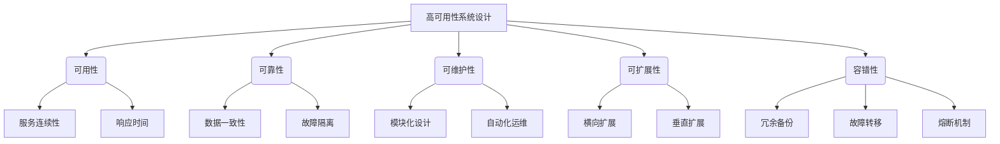

# 高可用性系统设计的实例分析

## 1. 背景介绍

### 1.1 问题的由来

在当今快节奏的数字时代，系统的高可用性已经成为一个关键的设计目标。无论是大型企业还是初创公司,都希望自己的系统能够提供持续不间断的服务,最大程度地减少系统宕机时间。然而,随着系统复杂性的不断增加,实现高可用性系统设计变得更加具有挑战性。

传统的单体架构系统很容易遇到单点故障问题,一旦某个组件发生故障,整个系统就会瘫痪。此外,由于缺乏弹性和扩展性,这些系统很难应对突发的高负载情况,从而导致性能下降和服务中断。

### 1.2 研究现状

为了解决上述问题,业界提出了多种高可用性系统设计方案,例如:

- **分布式系统架构**: 将系统拆分为多个独立的服务,每个服务都有多个实例运行,从而提高系统的容错能力和可扩展性。
- **微服务架构**: 将系统划分为一组小型、自治的服务,每个服务都可以独立部署和扩展,提高系统的灵活性和可维护性。
- **容错设计**: 采用冗余备份、负载均衡、熔断机制等技术,提高系统的容错能力,避免单点故障。
- **自动化运维**: 通过自动化工具和流程,实现系统的自动化部署、监控和恢复,减少人为操作引入的风险。

尽管已经有许多成熟的高可用性设计方案,但是如何在实际项目中正确地应用和组合这些方案,仍然是一个值得探讨的课题。

### 1.3 研究意义

高可用性系统设计对于企业和用户来说都至关重要。一方面,它可以确保系统的持续运行,避免因系统故障而导致的经济损失和用户流失;另一方面,它也是企业提高竞争力和用户体验的关键因素。

通过分析实际项目中的高可用性系统设计实例,我们可以更好地理解不同设计方案的优缺点,掌握正确的设计思路和最佳实践。这不仅可以为未来的系统设计提供借鉴,也有助于我们更好地评估和优化现有系统的可用性。

### 1.4 本文结构

本文将从以下几个方面深入探讨高可用性系统设计:

1. 介绍高可用性系统设计的核心概念和原理。
2. 分析高可用性系统设计中常用的算法和数学模型。
3. 通过实际项目案例,详细解释高可用性系统设计的具体实现过程。
4. 讨论高可用性系统设计在不同场景下的应用。
5. 总结高可用性系统设计的发展趋势和面临的挑战。

## 2. 核心概念与联系

在深入探讨高可用性系统设计之前,我们需要先了解一些核心概念及它们之间的联系。这些概念构成了高可用性系统设计的基础,对于理解和实现高可用性系统设计至关重要。

1. **可用性(Availability)**: 指系统在特定时间内保持运行和提供服务的能力。可用性通常用系统的正常运行时间与总运行时间的比率来衡量。提高可用性的关键是确保服务的连续性和快速响应时间。

2. **可靠性(Reliability)**: 指系统在特定条件下,在规定的时间内能够正常运行而不出现故障的能力。可靠性强调系统的稳定性和数据一致性,以及对故障的隔离和容错能力。

3. **可维护性(Maintainability)**: 指系统在运行过程中,能够被方便地修改、更新和维护的能力。良好的可维护性需要模块化设计和自动化运维,以降低维护成本和风险。

4. **可扩展性(Scalability)**: 指系统能够根据需求的变化,通过增加或减少资源来适应不同的负载和用户量的能力。可扩展性包括横向扩展(增加节点)和垂直扩展(增加单节点资源)两种方式。

5. **容错性(Fault Tolerance)**: 指系统在发生故障时,能够通过冗余备份、故障转移和熔断机制等措施,继续提供服务而不中断的能力。容错性是实现高可用性的关键。

这些概念相互关联且影响着高可用性系统设计的各个方面。例如,提高可靠性和容错性可以提高系统的可用性;良好的可维护性有助于快速修复故障,从而提高可用性和可靠性;可扩展性则确保系统能够应对不断增长的负载,保持高可用性。

## 3. 核心算法原理 & 具体操作步骤

在高可用性系统设计中,有几种核心算法和技术原理被广泛应用,它们为实现高可用性提供了理论基础和具体实现方法。本节将重点介绍其中的几种核心算法原理及其具体操作步骤。

### 3.1 算法原理概述

1. **一致性哈希算法(Consistent Hashing)**

一致性哈希算法是一种分布式哈希算法,常用于实现负载均衡和数据分片。它通过将节点和数据映射到同一个哈希环上,并根据它们在环上的位置来决定数据的分布,从而实现了数据的均匀分布和节点的动态加入或移除。

2. **Raft 算法**

Raft 算法是一种用于实现分布式一致性的算法,常用于构建高可用的分布式系统。它通过选举机制选出领导者(Leader),由领导者协调数据的复制和日志的同步,从而实现了数据的强一致性和容错能力。

3. **租约(Lease)机制**

租约机制是一种用于实现分布式系统中的资源协调和故障检测的技术。它通过为每个资源分配一个有限的租约时间,在租约到期前必须续约,否则就会被认为已经失效。这种机制可以有效地检测节点故障并进行资源重新分配,从而提高系统的可用性。

4. **熔断(Circuit Breaker)机制**

熔断机制是一种用于防止级联故障的设计模式。它通过监控服务的调用情况,在发现故障时快速切断服务调用,防止故障扩散到整个系统。同时,它还提供了自动恢复机制,在服务恢复后自动重新连接,从而提高了系统的容错能力和可用性。

### 3.2 算法步骤详解

#### 一致性哈希算法

1. 定义一个哈希环,将节点和数据都映射到这个环上。
2. 对节点和数据进行哈希运算,得到它们在环上的位置。
3. 按顺时针方向,将数据映射到第一个节点上。
4. 当有新节点加入或者节点移除时,只需要重新映射受影响的数据,不会影响其他数据的分布。

#### Raft 算法

1. 选举阶段:
   - 每个节点初始化为跟随者(Follower)状态。
   - 如果一个节点在一段时间内没有收到领导者的心跳,它会发起选举,进入候选人(Candidate)状态。
   - 候选人向其他节点发送请求投票的消息。
   - 如果一个候选人获得了大多数节点的投票,它就会成为新的领导者。

2. 日志复制阶段:
   - 领导者接收客户端的请求,将请求追加到自己的日志中。
   - 领导者并行地将日志条目复制到集群中的其他节点。
   - 当日志条目被安全复制到大多数节点后,领导者就会应用该日志条目,并向客户端返回结果。

3. 成员变更阶段:
   - 当需要添加或移除节点时,由领导者协调进行配置变更。
   - 新的配置会作为一个日志条目被复制到集群中。
   - 当新配置被提交后,集群就会进入新的配置。

#### 租约机制

1. 为每个资源分配一个唯一的租约ID和租约时间。
2. 客户端向资源管理器请求获取资源的租约。
3. 如果资源可用,资源管理器会分配一个租约给客户端。
4. 客户端在租约到期前必须续约,否则租约会被自动回收。
5. 如果资源管理器在一段时间内没有收到客户端的续约请求,就会认为客户端已经失效,并回收该租约。
6. 其他客户端可以请求获取被回收的租约,从而获取对应的资源。

#### 熔断机制

1. 监控服务的调用情况,包括调用次数、失败次数、响应时间等指标。
2. 设置阈值,当指标超过阈值时,触发熔断机制。
3. 熔断机制会切断对故障服务的调用,直接返回默认值或错误信息。
4. 定期尝试重新连接服务,如果服务已经恢复,则关闭熔断机制,恢复正常调用。
5. 记录熔断事件,用于监控和分析。

### 3.3 算法优缺点

#### 一致性哈希算法

优点:
- 数据分布均匀,负载均衡效果好。
- 节点的动态加入或移除只需要重新映射受影响的数据,不会影响整个系统。
- 具有较好的扩展性和容错能力。

缺点:
- 计算复杂度较高,需要进行多次哈希运算。
- 数据的迁移成本较高,当节点数量变化较大时,需要重新映射大量数据。
- 不能完全避免数据倾斜问题,某些节点可能会承载更多的数据。

#### Raft 算法

优点:
- 算法简单,易于理解和实现。
- 能够提供强一致性保证,适合构建高可用的分布式系统。
- 具有良好的容错能力,能够自动处理领导者故障和网络分区问题。

缺点:
- 写入性能较低,因为需要等待大多数节点复制日志后才能提交。
- 不适合读多写少的场景,因为所有读请求都需要通过领导者进行。
- 集群规模扩大后,日志复制的开销会增加,影响性能。

#### 租约机制

优点:
- 能够有效地检测节点故障,并及时回收资源。
- 通过租约时间的设置,可以控制资源的使用期限。
- 简单易用,易于集成到分布式系统中。

缺点:
- 需要一个中心化的资源管理器来管理租约,可能会成为单点故障。
- 租约时间的设置需要权衡,时间太短会导致频繁续约,时间太长会延迟故障检测。
- 在网络分区或者高延迟的情况下,可能会出现错误的租约回收。

#### 熔断机制

优点:
- 能够快速切断故障服务的调用,防止故障扩散到整个系统。
- 提供了自动恢复机制,可以在服务恢复后自动重新连接。
- 降低了系统的耦合度,提高了系统的容错能力和可用性。

缺点:
- 需要设置合适的熔断阈值,阈值过高或过低都会影响系统的可用性。
- 可能会导致部分请求被直接拒绝,影响用户体验。
- 增加了系统的复杂性,需要额外的监控和管理机制。

### 3.4 算法应用领域

#### 一致性哈希算法

- 负载均衡: 用于将请求均匀分布到多个服务器上,实现负载均衡。
- 分布式缓存: 用于将数据分片存储在多个缓存节点上,提高缓存的