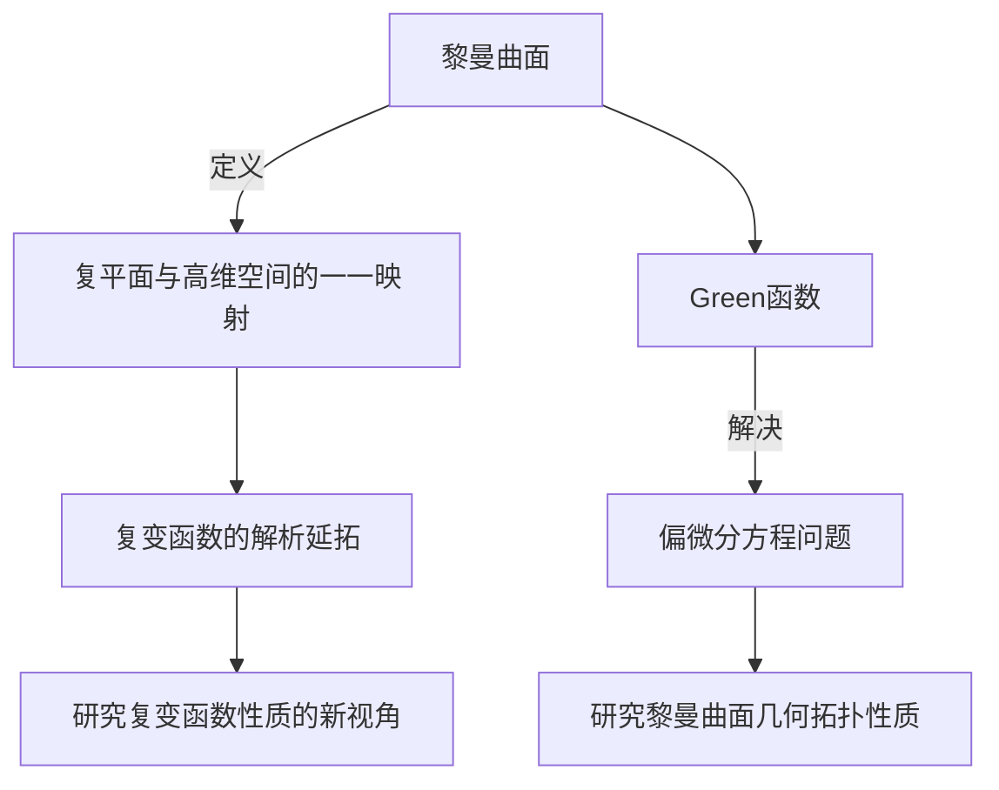

# 黎曼曲面：Green函数的一些性质

## 1. 背景介绍

### 1.1 问题的由来

黎曼曲面是数学中一个重要的概念,它源于19世纪数学家伯恩哈德·黎曼对复分析理论的研究。在研究复变函数的解析性质时,黎曼发现将复平面上的点与一个高维空间中的点建立一一对应关系,可以更好地研究复变函数的性质。这种将复平面上的点映射到高维空间中的方法就是黎曼曲面的基本思想。

在黎曼曲面理论中,Green函数扮演着重要的角色。Green函数是一种特殊的函数,它可以用来解决许多偏微分方程问题,尤其是在研究黎曼曲面的几何和拓扑性质时,Green函数的性质至关重要。

### 1.2 研究现状

黎曼曲面理论及其Green函数的性质一直是数学家和物理学家关注的热点问题。在过去的几十年里,许多著名数学家和物理学家,如阿特雅、陈省身、陈纪修、杨振宁等,都对黎曼曲面及其Green函数的性质做出了重要贡献。

目前,黎曼曲面理论已经在许多数学和物理领域得到广泛应用,例如代数几何、代数拓扑、微分几何、量子场论、弦论等。Green函数的性质不仅对于理解黎曼曲面的几何和拓扑结构有着重要意义,而且在解决许多实际问题中也扮演着关键角色。

### 1.3 研究意义

深入研究黎曼曲面Green函数的性质,对于推进数学和物理学的发展具有重要意义。具体来说,研究黎曼曲面Green函数的性质可以:

1. 加深对复分析理论和黎曼曲面几何的理解
2. 为解决偏微分方程问题提供新的思路和方法
3. 推动代数几何、代数拓扑、微分几何等数学分支的发展
4. 为量子场论、弦论等前沿物理理论提供数学工具
5. 在工程、金融、计算机科学等领域找到潜在的应用

### 1.4 本文结构

本文将系统地介绍黎曼曲面Green函数的一些重要性质,内容安排如下:

1. 首先回顾黎曼曲面和Green函数的基本概念,为后续内容做好铺垫。
2. 重点介绍黎曼曲面Green函数的若干性质,包括正则性、唯一性、极值原理等,并给出详细的数学证明。
3. 探讨Green函数在解决实际问题中的应用,如求解偏微分方程、计算黎曼曲面的几何不变量等。
4. 总结全文,并对黎曼曲面Green函数理论的未来发展方向进行展望。

## 2. 核心概念与联系

在深入探讨黎曼曲面Green函数的性质之前,我们先回顾一下黎曼曲面和Green函数的基本概念,并阐明它们之间的联系。

### 2.1 黎曼曲面

黎曼曲面是将复平面上的点与高维空间中的点建立一一对应关系的几何对象。具体来说,对于给定的复变函数$f(z)$,我们可以构造出一个黎曼曲面$R_f$,使得复平面上的每一点$z$对应于$R_f$上的一点$(z,f(z))$。

黎曼曲面的引入为研究复变函数的性质提供了一种全新的视角。通过将复平面"拉伸"到高维空间,我们可以更直观地研究复变函数的解析性质,例如分支点、极点、渐近线等。

### 2.2 Green函数

Green函数是偏微分方程理论中一种重要的概念。对于给定的偏微分方程及其边界条件,Green函数提供了一种求解该方程的有效方法。

在黎曼曲面理论中,Green函数扮演着关键角色。事实上,黎曼曲面的许多几何和拓扑不变量都可以通过研究其Green函数的性质来获得。因此,深入探究黎曼曲面Green函数的性质,对于全面理解黎曼曲面的结构至关重要。

### 2.3 黎曼曲面与Green函数的联系

黎曼曲面和Green函数之间存在着内在的联系,主要体现在以下两个方面:

1. **求解偏微分方程**。在研究黎曼曲面的几何和拓扑性质时,常常需要求解一些特殊的偏微分方程,而Green函数正是解决这类问题的有力工具。

2. **计算几何不变量**。黎曼曲面的许多几何不变量,如体积、曲率、欧拉特征数等,都可以通过研究其Green函数的性质来计算获得。

因此,深入探讨黎曼曲面Green函数的性质,不仅有助于我们更好地理解黎曼曲面的结构,也为解决实际问题提供了强有力的数学工具。

## 3. 核心算法原理与具体操作步骤

### 3.1 算法原理概述

在研究黎曼曲面Green函数的性质时,我们通常需要求解如下形式的偏微分方程:

$$
\Delta u(x) = \delta(x-x_0), \quad x \in M
$$

其中$M$是给定的黎曼曲面,$ \Delta $是$M$上的拉普拉斯算子,$ \delta(x-x_0) $是集中在点$ x_0 $处的Delta分布。该方程的解$u(x)$就是我们所求的Green函数。

求解上述方程的一个有效方法是利用谱理论。具体来说,我们可以先求出拉普拉斯算子$\Delta$在$M$上的本征函数和本征值,然后利用它们对Delta分布进行谱展开,最终得到Green函数的解析表达式。

这种基于谱理论的算法不仅在理论上具有优雅的数学结构,而且在实际计算中也有较高的效率,因此被广泛应用于研究黎曼曲面Green函数的性质。

### 3.2 算法步骤详解

现在让我们详细介绍一下利用谱理论求解黎曼曲面Green函数的具体步骤:

1. **确定研究对象**。首先确定要研究的黎曼曲面$M$,了解其基本几何性质,如维数、曲率等。

2. **构造拉普拉斯算子**。在给定的黎曼曲面$M$上,构造出相应的拉普拉斯算子$\Delta$。

3. **求解本征方程**。求解拉普拉斯算子$\Delta$的本征方程:
   $$
   \Delta \phi_n = \lambda_n \phi_n
   $$
   得到本征函数$\{\phi_n\}$和本征值$\{\lambda_n\}$的完全集。

4. **谱展开**。利用本征函数对Delta分布$\delta(x-x_0)$进行谱展开:
   $$
   \delta(x-x_0) = \sum_{n=0}^\infty c_n \phi_n(x)
   $$
   其中系数$c_n$可以通过内积计算获得。

5. **求解Green函数**。将谱展开式代入原方程,即可得到Green函数的解析表达式:
   $$
   u(x) = G(x,x_0) = \sum_{n=0}^\infty \frac{c_n}{\lambda_n} \phi_n(x)
   $$

6. **分析Green函数性质**。在获得Green函数的解析表达式后,我们可以进一步研究其正则性、唯一性、极值原理等性质,并将这些性质应用于计算黎曼曲面的几何不变量。

通过上述步骤,我们不仅可以求出黎曼曲面Green函数的具体表达式,而且可以深入探讨其内在的数学结构和性质,为解决实际问题提供有力的理论支持。

### 3.3 算法优缺点

基于谱理论的算法在求解黎曼曲面Green函数时具有以下优点:

1. **理论严谨**。该算法建立在坚实的数学基础之上,具有优雅的理论结构。

2. **通用性强**。只要给定黎曼曲面的几何信息,该算法就可以求解相应的Green函数,适用范围广泛。

3. **高效精确**。利用谱展开的思想,可以高效、精确地计算出Green函数的解析表达式。

4. **可视化友好**。Green函数的解析表达式便于进行可视化和图形化处理,有助于直观理解其性质。

然而,这种算法也存在一些不足之处:

1. **计算复杂**。对于高维或曲率变化剧烈的黎曼曲面,求解本征方程和进行谱展开可能会变得非常复杂。

2. **收敛性问题**。谱展开的级数有时可能收敛较慢,影响计算精度和效率。

3. **边界条件限制**。该算法主要适用于具有良好边界条件的黎曼曲面,对于某些特殊边界情况可能会失效。

4. **非线性扩展困难**。该算法主要针对线性偏微分方程,对于非线性情况下的扩展存在一定困难。

总的来说,基于谱理论的算法是研究黎曼曲面Green函数性质的有力工具,但在特定情况下也需要结合其他数值计算方法,以获得更加准确和高效的结果。

### 3.4 算法应用领域

基于谱理论求解黎曼曲面Green函数的算法在许多数学和物理领域都有重要应用,包括但不限于:

1. **代数几何**。在研究代数曲线和代数曲面的一些几何不变量时,需要计算相应的Green函数。

2. **代数拓扑**。计算黎曼曲面的欧拉特征数、同伦群等拓扑不变量,离不开对Green函数性质的研究。

3. **微分几何**。求解黎曼曲面上的曲率、体积等几何量时,Green函数扮演着重要角色。

4. **量子场论**。在研究量子场论中的一些基本问题时,需要利用黎曼曲面上的Green函数作为数学工具。

5. **弦论**。作为统一所有基本相互作用的理论,弦论中涉及到大量关于黎曼曲面和Green函数的计算。

6. **数值计算**。在进行有限元分析、边界元分析等数值计算时,常常需要求解特定几何对象上的Green函数。

可以看出,基于谱理论的算法不仅在纯数学领域有重要应用,在物理学和工程技术等许多交叉学科中也扮演着关键角色,展现出了巨大的应用前景。

## 4. 数学模型和公式详细讲解与举例说明

### 4.1 数学模型构建

在研究黎曼曲面Green函数的性质时,我们通常需要建立如下形式的数学模型:

考虑一个紧致的黎曼曲面$M$,其上的Green函数$G(x,y)$满足以下方程:

$$
\begin{cases}
\Delta_x G(x,y) = \delta(x,y), & x,y \in M \\
\int_M G(x,y) dV_y = 0,
\end{cases}
$$

其中$\Delta_x$表示对$x$的拉普拉斯算子,$ \delta(x,y) $是二维Delta分布,$ dV_y $是$M$上的体积元。

该模型的基本思路是,将Delta分布看作是一个"点源",而Green函数$ G(x,y) $则描述了从点源$y$发出的"影响"在点$x$处的强度。通过研究Green函数在整个黎曼曲面上的性质,我们可以深入了解曲面的几何和拓扑结构。

需要注意的是,上述方程对于不同的黎曼曲面$M$,其具体形式可能会有所不同,需要根据曲面的度量张量和曲率等几何信息对