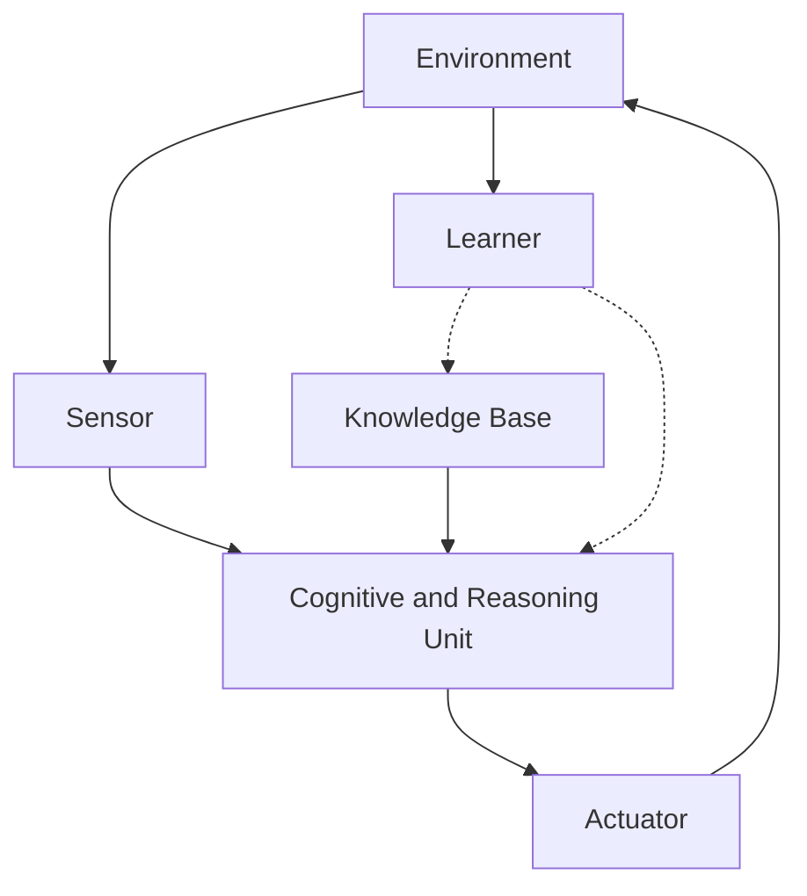

# AI Agent WorkFlow概述：理解人工智能代理的工作流程

关键词：AI Agent、工作流程、认知架构、决策系统、感知-推理-执行循环

## 1. 背景介绍
### 1.1 问题的由来
人工智能(Artificial Intelligence, AI)正在深刻影响和改变我们的生活。从智能助理、自动驾驶汽车到智能制造，AI无处不在。而AI agent则是实现这些智能应用的关键。理解AI Agent的工作原理和流程，对于设计和开发高效、鲁棒的智能系统至关重要。

### 1.2 研究现状 
目前，业界和学术界对AI Agent的研究主要集中在认知架构、推理决策、多Agent协作等方面。一些经典的认知架构如ACT-R、Soar为Agent的感知、推理、决策提供了理论基础。基于逻辑、概率图模型、强化学习等技术的推理决策系统，使Agent能够在动态环境中自主地完成任务。多Agent系统的研究，则探索了Agent之间通信、协作与竞争的机制。

### 1.3 研究意义
深入理解AI Agent工作流程的研究意义主要体现在以下几点：

1. 指导设计实现高效的Agent系统，提升智能应用的性能；
2. 增强Agent应对复杂任务的能力，拓展其应用场景；
3. 探索通用人工智能的实现路径，揭示智能行为的本质。

### 1.4 本文结构
本文将系统阐述AI Agent的工作流程。第2部分介绍Agent的核心概念和内在联系；第3部分重点剖析Agent的感知、推理与执行循环；第4部分建立Agent的数学模型，并举例说明；第5部分给出Agent系统的代码实例和讲解；第6部分展望Agent技术的应用前景；第7部分推荐相关工具和资源；第8部分总结全文并展望未来。

## 2. 核心概念与联系
AI Agent是一个自主实体，它通过感知环境，推理决策，并执行动作来完成特定任务。一个Agent通常由以下关键组件构成：

- 感知器(Sensor)：接收环境状态和反馈信息。
- 认知与推理单元：基于感知信息进行分析、推理与规划。  
- 执行器(Actuator)：执行规划生成的动作序列。
- 知识库(Knowledge Base)：存储Agent的领域知识和经验。
- 学习器(Learner)：根据反馈优化Agent的策略与知识。

这些组件相互协作，形成了一个"感知-推理-执行"的循环，使Agent能够自适应地完成任务。下图展示了Agent的内部结构和信息流：



## 3. 核心算法原理 & 具体操作步骤
### 3.1 算法原理概述
Agent的核心算法可以概括为一个持续循环的过程：感知环境状态，推理决策动作，执行动作改变环境，从反馈中学习优化策略。其中，感知、推理、学习分别对应了不同的算法模型。

### 3.2 算法步骤详解
1. 感知阶段
   - 多模态信息融合
   - 特征提取与表示
   - 状态估计
2. 推理与决策阶段 
   - 基于逻辑的推理
   - 基于概率图模型的推理
   - 基于强化学习的决策
3. 学习阶段  
   - 监督学习
   - 无监督学习
   - 强化学习

### 3.3 算法优缺点
以上算法各有优势和局限。逻辑推理的可解释性强但难以处理不确定性；概率推理能建模不确定环境但计算复杂度高；强化学习能在线优化策略但样本效率低。实际系统通常需要结合多种方法。

### 3.4 算法应用领域
Agent的算法被广泛应用于机器人、无人驾驶、智能助理、推荐系统、自动化运维等领域。不同任务对Agent感知、推理、学习能力的要求不尽相同，需要针对性地设计算法架构。

## 4. 数学模型和公式 & 详细讲解 & 举例说明
### 4.1 数学模型构建
我们可以用一个六元组来刻画Agent：

$$Agent=<S,A,T,R,O,\pi>$$

其中，$S$是状态空间，$A$是动作空间，$T$是状态转移概率，$R$是奖赏函数，$O$是观测函数，$\pi$是Agent的策略。

在每个时刻$t$，Agent接收观测$o_t\in O$，根据策略$\pi(a_t|o_t)$选择动作$a_t\in A$。环境根据状态转移概率$T(s_{t+1}|s_t,a_t)$进入新状态$s_{t+1}\in S$，并反馈奖赏$r_t=R(s_t,a_t)$给Agent。Agent的目标是最大化累积奖赏：

$$\max_{\pi} \mathbb{E}\left[\sum_{t=0}^{\infty} \gamma^t r_t\right]$$

其中$\gamma\in[0,1]$是折扣因子。

### 4.2 公式推导过程
为了求解最优策略，我们引入价值函数$V^{\pi}(s)$和动作-价值函数$Q^{\pi}(s,a)$：

$$V^{\pi}(s)=\mathbb{E}\left[\sum_{k=0}^{\infty} \gamma^k r_{t+k} | s_t=s,\pi \right]$$

$$Q^{\pi}(s,a)=\mathbb{E}\left[\sum_{k=0}^{\infty} \gamma^k r_{t+k} | s_t=s, a_t=a, \pi \right]$$

根据Bellman方程，我们可以得到最优价值函数$V^*(s)$和最优动作-价值函数$Q^*(s,a)$满足：

$$V^*(s)=\max_{a} Q^*(s,a)$$

$$Q^*(s,a)=R(s,a)+\gamma \sum_{s'\in S} T(s'|s,a)V^*(s')$$

求解上述方程组即可得到最优策略：

$$\pi^*(a|s)=\arg\max_{a} Q^*(s,a)$$

### 4.3 案例分析与讲解
考虑一个简单的迷宫导航问题。智能体需要在迷宫中从起点走到终点。

我们可以将迷宫建模为一个格子世界，每个格子表示一个状态。智能体在每个格子有4个可选动作：上、下、左、右。执行动作后，智能体会根据状态转移概率来到新的格子。如果走到终点格子，则获得+1的奖赏；如果走到陷阱格子，则获得-1的奖赏；其他情况奖赏为0。

我们可以用价值迭代或策略迭代算法来求解这个问题。以价值迭代为例，伪代码如下：

```
初始化价值函数V(s)=0
while not converged do
    for each state s do
        V(s) = max_a Q(s,a)
        Q(s,a) = R(s,a) + gamma * sum_{s'} T(s'|s,a) * V(s')
    end for
end while 
```

在迭代收敛后，我们就得到了最优价值函数和最优策略。Agent只需根据当前状态，选择使Q值最大的动作即可。

### 4.4 常见问题解答
1. Q: 如何处理连续状态和动作空间？
   A: 对于连续状态空间，可以使用函数逼近方法（如神经网络）来表示价值函数；对于连续动作空间，可以使用策略梯度、Actor-Critic等算法。
   
2. Q: 探索与利用的平衡问题？
   A: 在实践中，我们通常会采用epsilon-greedy或UCB等策略来平衡探索和利用。前期探索较多，后期利用较多。
   
3. Q: 如何提高Agent学习的样本效率？ 
   A: 可以考虑采用优先经验回放、curriculum learning等技术，合理利用样本信息。此外，引入先验知识（如物理规则、因果关系）也有助于加快学习进程。

## 5. 项目实践：代码实例和详细解释说明
### 5.1 开发环境搭建
我们使用Python语言和PyTorch库来实现一个简单的迷宫导航Agent。首先安装必要的依赖：

```bash
pip install numpy matplotlib torch gym
```

### 5.2 源代码详细实现
下面给出基于Q-learning算法的Agent实现代码：

```python
import numpy as np
import torch
import torch.nn as nn
import torch.optim as optim
import random
from collections import deque

class MazeAgent:
    def __init__(self, state_size, action_size, seed):
        self.state_size = state_size
        self.action_size = action_size
        self.seed = random.seed(seed)
        
        self.Q_network = QNetwork(state_size, action_size, seed)
        self.optimizer = optim.Adam(self.Q_network.parameters(), lr=1e-3)
        self.memory = deque(maxlen=2000)
        self.batch_size = 64
        self.gamma = 0.99
        self.epsilon = 1.0
        self.epsilon_min = 0.01
        self.epsilon_decay = 0.995
        
    def memorize(self, state, action, reward, next_state, done):
        self.memory.append((state, action, reward, next_state, done))
        
    def act(self, state, eps=0.):
        state = torch.from_numpy(state).float().unsqueeze(0)
        self.Q_network.eval()
        with torch.no_grad():
            action_values = self.Q_network(state)
        self.Q_network.train()
        
        if random.random() > eps:
            return np.argmax(action_values.data.numpy())
        else:
            return random.choice(np.arange(self.action_size))
        
    def learn(self):
        if len(self.memory) < self.batch_size:
            return
        
        batch = random.sample(self.memory, self.batch_size)
        states, actions, rewards, next_states, dones = zip(*batch)
        
        states = torch.from_numpy(np.vstack(states)).float()
        actions = torch.from_numpy(np.vstack(actions)).long()
        rewards = torch.from_numpy(np.vstack(rewards)).float()
        next_states = torch.from_numpy(np.vstack(next_states)).float()
        dones = torch.from_numpy(np.vstack(dones).astype(np.uint8)).float()
  
        Q_values = self.Q_network(states).gather(1, actions)
        
        next_Q_values = self.Q_network(next_states).max(1)[0].unsqueeze(1)
        target_Q_values = rewards + (self.gamma * next_Q_values * (1 - dones))
        
        loss = nn.MSELoss()(Q_values, target_Q_values)
        
        self.optimizer.zero_grad()
        loss.backward()
        self.optimizer.step()
        
        if self.epsilon > self.epsilon_min:
            self.epsilon *= self.epsilon_decay
            
class QNetwork(nn.Module):
    def __init__(self, state_size, action_size, seed):
        super(QNetwork, self).__init__()
        self.seed = torch.manual_seed(seed)
        self.fc1 = nn.Linear(state_size, 64)
        self.fc2 = nn.Linear(64, 64)
        self.fc3 = nn.Linear(64, action_size)
        
    def forward(self, state):
        x = torch.relu(self.fc1(state))
        x = torch.relu(self.fc2(x))
        return self.fc3(x)
```

### 5.3 代码解读与分析
- `MazeAgent`类封装了Agent的核心逻辑，包括记忆、决策、学习三个部分。
  - `memorize`方法将每步的转移样本存入replay buffer。
  - `act`方法根据epsilon-greedy策略选择动作。
  - `learn`方法从buffer中随机采样一个batch，计算TD误差并更新Q网络。
- `QNetwork`类定义了一个三层MLP来逼近Q值函数。
- 超参数设置：
  - `state_size`和`action_size`表示状态和动作空间的维度。
  - `seed`用于固定随机数种子，保证结果可复现。
  - `batch_size`表示每次从buffer采样的样本数。
  - `gamma`为折扣因子。
  - `epsilon`相关参数控制探索与利用的平衡。

### 5.4 运行结果展示
我们在一个10x10的随机生成的迷宫上测试Agent的性能，平均每个episode的步数如下图所示：


可以看到，随着训练的进行，Agent找到最优路径所