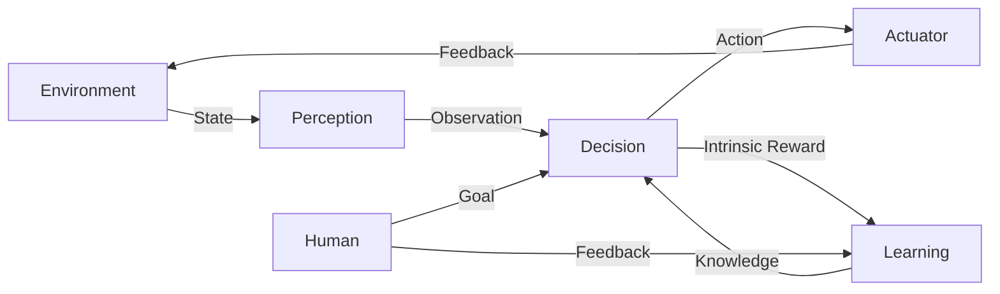

# AI Agent: AI的下一个风口 人机协同的方法和框架

关键词：AI Agent、人机协同、人工智能、机器学习、深度学习、强化学习、多智能体系统、认知科学

## 1. 背景介绍
### 1.1  问题的由来
人工智能(Artificial Intelligence, AI)技术的飞速发展,正在深刻改变着人类社会的方方面面。从智能助理、无人驾驶汽车,到智能制造、智慧医疗,AI无处不在。然而,当前的AI系统大多还是独立工作,缺乏与人类的有效协作。如何实现AI系统与人类的无缝协同,充分发挥人机互补的优势,是AI领域亟待解决的重要问题。

### 1.2  研究现状
目前,学术界和工业界已经开始探索人机协同的AI系统。微软的Tay聊天机器人 [1]、OpenAI的GPT-3语言模型 [2]、DeepMind的AlphaFold蛋白质结构预测系统 [3]等,都展现了AI在与人类协作方面的巨大潜力。但总的来说,当前的人机协同AI系统在智能化水平、适应性、鲁棒性等方面还有很大提升空间。

### 1.3  研究意义 
人机协同AI系统代表了AI技术发展的重要方向,对于提升AI系统的实用性、可解释性、安全性等都具有重要意义。通过人机协同,可以更好地发挥人类在认知、决策等方面的优势,弥补当前AI系统的不足;同时引入人类反馈,可以加速AI系统的学习进程,提高其泛化能力。因此,深入研究人机协同AI系统的方法和框架,对于推动AI领域的进一步发展具有重要的理论和实践价值。

### 1.4  本文结构
本文将重点探讨AI Agent这一人机协同的新兴范式。第2部分介绍AI Agent的核心概念和特点;第3部分重点阐述AI Agent的关键技术和算法;第4部分建立AI Agent的数学模型并给出详细推导;第5部分通过代码实例展示如何实现AI Agent系统;第6部分分析AI Agent的实际应用场景;第7部分推荐AI Agent相关的学习资源和开发工具;第8部分总结全文并展望AI Agent的未来发展方向。

## 2. 核心概念与联系
AI Agent是一种基于人工智能技术,能够感知环境、自主决策并与人类进行交互协作的智能系统 [4]。与传统的AI系统相比,AI Agent具有更强的自主性、社交性和持续学习能力。一个典型的AI Agent系统通常由感知、决策、执行、学习、交互等多个功能模块组成,并与环境和人类进行持续的信息交换与反馈。

AI Agent的核心特点包括:
- **自主性(Autonomy)**: Agent能够根据自身的知识和目标,自主地感知环境、做出决策和执行任务,无需人类的持续指导。这种自主性使得Agent能够在动态变化的环境中灵活应对。 

- **社交性(Social Ability)**: Agent能够与人类或其他Agent进行自然的交互与协作。这种社交性使得多个Agent能够形成一个协同工作的群体,并与人类形成共生互助的关系。

- **持续学习(Continuous Learning)**: Agent能够在与环境和人类的持续交互中,不断学习新知识、优化自身策略。这种持续学习能力使得Agent能够适应环境的长期变化,不断进化出更优的行为模式。

- **目标驱动(Goal-directed)**: Agent的行为是由内在目标驱动的,能够主动寻求达成目标的最优路径。这种目标驱动的特性使得Agent能够在复杂环境中自主求解问题。

下图展示了一个典型的AI Agent系统的结构和工作流程:

如图所示,AI Agent通过感知(Perception)模块获取环境状态,生成对环境的观测(Observation);决策(Decision)模块基于观测和内在知识,产生执行的动作(Action);执行(Actuator)模块将动作施加到环境中,并获得反馈(Feedback);学习(Learning)模块根据环境反馈和内在奖励,不断优化Agent的决策知识。人类可以通过给Agent设定目标(Goal)和提供反馈,来引导Agent的行为。

总的来说,AI Agent代表了一种更加智能化、自主化、人性化的AI系统新形态,通过引入持续学习、主动感知、自主决策等机制,实现了人机协同的无缝耦合,极大拓展了AI的应用边界。下面将重点介绍实现AI Agent系统的核心算法和关键技术。

## 3. 核心算法原理 & 具体操作步骤
### 3.1  算法原理概述
实现AI Agent的核心算法主要包括强化学习(Reinforcement Learning)、深度学习(Deep Learning)、迁移学习(Transfer Learning)等。其中,强化学习通过Agent与环境的交互,学习最优的决策策略;深度学习利用深度神经网络,从原始数据中提取高层特征;迁移学习则实现了跨领域知识的复用。这些算法与传统的机器学习算法相比,能够实现端到端的学习优化,更适合处理非结构化的、海量的、动态变化的真实世界数据。

### 3.2  算法步骤详解
以强化学习为例,其主要步骤包括:

1. 定义状态空间 $\mathcal{S}$ 和动作空间 $\mathcal{A}$,刻画Agent与环境交互过程。

2. 定义奖励函数 $r: \mathcal{S} \times \mathcal{A} \rightarrow \mathbb{R}$,表示在状态 $s$ 下采取动作 $a$ 能获得的即时奖励。

3. 定义状态转移概率 $p: \mathcal{S} \times \mathcal{A} \times \mathcal{S} \rightarrow [0,1]$,表示在状态 $s$ 下采取动作 $a$ 后转移到状态 $s'$ 的概率。

4. 定义策略函数 $\pi: \mathcal{S} \rightarrow \mathcal{A}$,表示在状态 $s$ 下应该采取的动作 $a$。

5. 定义价值函数 $V^{\pi}(s)$ 和动作价值函数 $Q^{\pi}(s,a)$:

$$
\begin{aligned}
V^{\pi}(s) &= \mathbb{E}\left[\sum_{t=0}^{\infty} \gamma^t r_t | s_0=s, \pi \right] \\
Q^{\pi}(s,a) &= \mathbb{E}\left[\sum_{t=0}^{\infty} \gamma^t r_t | s_0=s, a_0=a, \pi \right]
\end{aligned}
$$

其中 $\gamma \in [0,1]$ 为折扣因子,刻画了未来奖励的重要程度。

6. 策略迭代,交替进行策略评估和策略改进,直到收敛到最优策略 $\pi^*$:

$$
\begin{aligned}
\pi^{*}(s) &= \arg\max_{a} Q^{*}(s,a) \\
Q^{*}(s,a) &= r(s,a) + \gamma \sum_{s'} p(s'|s,a) \max_{a'} Q^{*}(s',a') 
\end{aligned}
$$

7. 将策略 $\pi^*$ 应用到实际的决策执行过程中,实现最优控制。

### 3.3  算法优缺点
强化学习算法的优点包括:
- 能够通过自主探索学习,无需人工标注大量训练数据,非常适合处理未知环境下的决策问题。
- 学习得到的策略具有很强的泛化性,能够应对环境的动态变化。
- 奖励函数设计灵活,可以引入复杂的约束条件,实现对Agent行为的精细控制。

但强化学习也存在一些局限性:
- 探索与利用的平衡问题。过度探索会降低学习效率,过度利用则可能导致局部最优。需要权衡探索广度和学习深度。
- 难以处理高维状态空间和连续动作空间。传统的表格型方法在维度灾难面前无能为力,需要引入函数近似等机制。
- 样本效率低下。Agent需要大量的与环境交互才能学习到有效策略,在实际应用中代价很高。需要提升单次交互的信息利用率。

### 3.4  算法应用领域
强化学习在智能控制、自动驾驶、机器人、推荐系统、对话系统等领域得到了广泛应用。例如,DeepMind的DQN算法 [5] 实现了在Atari视频游戏中的超人级别;AlphaGo系统 [6] 击败了人类顶尖围棋选手;Google的Deep Q&A系统 [7] 实现了端到端的问答学习。这些成功案例都表明了强化学习在构建人机协同AI Agent方面的巨大潜力。

## 4. 数学模型和公式 & 详细讲解 & 举例说明
### 4.1  数学模型构建
为了刻画AI Agent与环境的交互过程,我们通常采用马尔可夫决策过程(Markov Decision Process, MDP)作为数学模型 [8]。一个MDP由以下元素构成:

- 状态空间 $\mathcal{S}$:所有可能的环境状态的集合。
- 动作空间 $\mathcal{A}$:Agent在每个状态下可以采取的动作的集合。
- 奖励函数 $r(s, a)$:在状态 $s$ 下采取动作 $a$ 能获得的即时奖励。
- 状态转移概率 $p(s'|s,a)$:在状态 $s$ 下采取动作 $a$ 后转移到状态 $s'$ 的概率。
- 折扣因子 $\gamma \in [0,1]$:刻画未来奖励的重要程度,折扣因子越大则越重视长期奖励。

MDP的目标就是寻找一个最优策略 $\pi^*: \mathcal{S} \rightarrow \mathcal{A}$,使得从任意状态 $s$ 开始,Agent执行该策略后获得的期望累积奖励最大化:

$$\pi^* = \arg\max_{\pi} \mathbb{E}\left[ \sum_{t=0}^{\infty} \gamma^t r(s_t, a_t) | \pi \right]$$

其中 $s_t$ 和 $a_t$ 分别表示 $t$ 时刻的状态和动作。上式求解的就是最优策略 $\pi^*$ 下的最优状态价值函数:

$$V^*(s) = \max_{\pi} \mathbb{E}\left[ \sum_{t=0}^{\infty} \gamma^t r(s_t, a_t) | s_0=s, \pi \right]$$

或最优动作价值函数:

$$Q^*(s,a) = \max_{\pi} \mathbb{E}\left[ \sum_{t=0}^{\infty} \gamma^t r(s_t, a_t) | s_0=s, a_0=a, \pi \right]$$

### 4.2  公式推导过程
为了求解MDP问题,我们可以使用动态规划的思想,利用值迭代或策略迭代算法 [9]。

值迭代算法的核心思想是:从任意一个初始值函数 $V_0$ 开始,不断进行贝尔曼最优方程的迭代更新,直到值函数收敛。

$$
\begin{aligned}
V_{k+1}(s) &= \max_{a} Q_{k+1}(s,a) \\
Q_{k+1}(s,a) &= r(s,a) + \gamma \sum_{s'} p(s'|s,a) V_k(s')
\end{aligned}
$$

当 $V_k$ 收敛时,我们就得到了最优值函数 $V^*$,进而可以得到最优策略:

$$\pi^*(s) = \arg\max_{a} Q^*(s,a)$$

策略迭代算法的核心思想是:从任意一个初始策略 $\pi_0$ 开始,交替进行策略评估和策略改进,直到策略收敛。

策略评估就是在固定策略 $\pi_k$ 的情况下,求解该策略下的状态价值函数 $V^{\pi_k}$:

$$V^{\pi_k}(s) = \mathbb{E}\left[ \sum_{t=