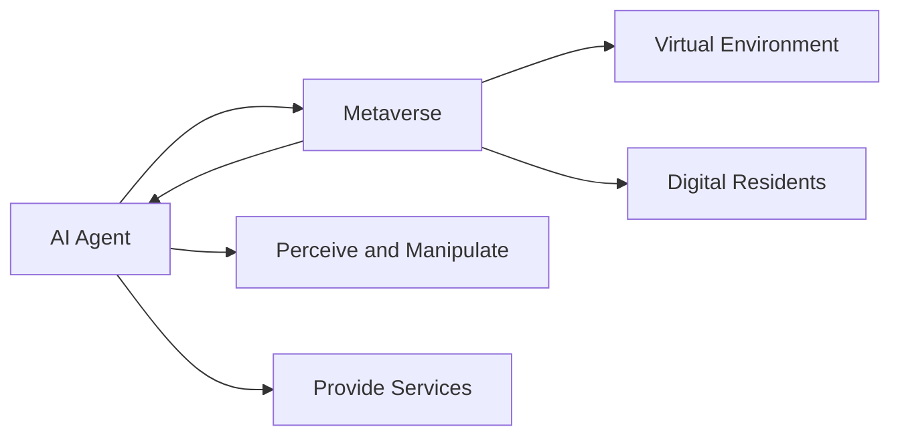

# AI Agent: AI的下一个风口 智能体在元宇宙里的应用

关键词：人工智能、智能体、元宇宙、虚拟世界、深度学习、强化学习、多智能体系统

## 1. 背景介绍
### 1.1  问题的由来
人工智能(Artificial Intelligence, AI)技术的飞速发展,催生了智能体(AI Agent)这一崭新的研究方向。智能体作为AI领域的前沿课题,正受到学术界和工业界的广泛关注。与此同时,元宇宙(Metaverse)的概念开始走入大众视野,为智能体的研究和应用带来了新的机遇和挑战。如何将智能体技术与元宇宙相结合,成为了亟待探索的问题。

### 1.2  研究现状
目前,国内外已有不少学者开始研究智能体在元宇宙中的应用。一些研究聚焦于单个智能体在虚拟环境中的决策与控制,另一些则探索了多智能体之间的交互与协作。谷歌的DeepMind团队提出了多智能体强化学习的框架,并在虚拟游戏环境中取得了不错的效果。微软的研究人员则利用智能体构建了一个虚拟助手系统,可以在元宇宙中为用户提供个性化服务。

### 1.3  研究意义 
智能体与元宇宙的结合具有重要的理论和实践意义。一方面,元宇宙为智能体提供了一个逼真的虚拟环境,可以作为智能体算法的测试平台,推动相关理论的发展。另一方面,智能体可以扮演虚拟人、NPC等角色,为元宇宙注入更多的智能元素,提升用户体验。此外,智能体还可以应用于元宇宙中的教育培训、智能制造等领域,为行业赋能。总的来说,智能体与元宇宙的融合将催生诸多创新应用,引领AI发展的新方向。

### 1.4  本文结构
本文将系统地探讨智能体在元宇宙中的应用。第2部分介绍智能体与元宇宙的核心概念及二者之间的关系。第3部分重点阐述智能体的核心算法原理与具体实现步骤。第4部分从数学角度对智能体的建模与优化进行分析。第5部分通过代码实例,展示如何构建一个简单的元宇宙智能体系统。第6部分总结智能体在元宇宙中的典型应用场景。第7部分推荐相关的学习资源与开发工具。第8部分对智能体未来的发展趋势与面临的挑战进行展望。第9部分附录了一些常见问题解答。

## 2. 核心概念与联系
智能体(AI Agent)是一种能够感知环境并采取行动以实现特定目标的自主实体。它融合了人工智能的多个分支,包括机器学习、自然语言处理、计算机视觉等技术,具有一定的智能性和自主性。根据应用场景的不同,智能体可以分为反应型、目标型、效用型、学习型等类型。

元宇宙(Metaverse)最早由尼尔·斯蒂芬森在科幻小说《雪崩》中提出,是一个由计算机和网络技术构建的虚拟现实空间。在元宇宙中,用户以虚拟化身的形式存在,可以与其他用户互动,参与各种社交、娱乐、经济活动。元宇宙的概念近年来备受关注,被视为互联网发展的下一个阶段。

智能体与元宇宙之间有着天然的联系。一方面,元宇宙可以为智能体提供一个虚拟的生存和运行环境。智能体作为元宇宙中的数字居民,能够自主地感知和操纵虚拟世界,执行各种任务。另一方面,智能体可以为元宇宙注入更多的智能化内容,比如扮演NPC角色,为用户提供服务,丰富元宇宙的生态。二者的结合将开创虚实共生、人机协作的新范式。

下图展示了智能体与元宇宙的关系:



## 3. 核心算法原理 & 具体操作步骤
### 3.1 算法原理概述
智能体的核心算法主要包括以下几类:
1. 基于规则的推理:通过专家知识构建规则库,智能体根据规则进行推理决策。
2. 深度学习:利用深度神经网络从数据中学习特征,实现感知、预测等功能。
3. 强化学习:通过试错与环境交互,学习最优的行为策略以获得累积奖励最大化。
4. 进化算法:模拟生物进化过程,通过选择、交叉、变异等操作优化智能体的策略。

### 3.2 算法步骤详解
以强化学习为例,智能体的学习过程可分为以下步骤:
1. 智能体观察当前环境状态 $s_t$；
2. 根据策略 $\pi$ 选择一个动作 $a_t$；
3. 执行动作 $a_t$ 后,环境进入新状态 $s_{t+1}$,并反馈奖励 $r_t$；  
4. 智能体利用新的转移样本 $(s_t,a_t,r_t,s_{t+1})$ 更新策略 $\pi$；
5. 重复步骤1-4,直到满足终止条件。

其中,策略 $\pi$ 一般用深度神经网络来参数化,通过梯度上升等优化算法来更新网络参数,提高智能体的决策能力。常见的强化学习算法包括 Q-learning、SARSA、Policy Gradient 等。

### 3.3 算法优缺点
强化学习的优点在于:
- 通过不断与环境交互,智能体可以学习到适应性强的策略；
- 不需要人工标注数据,非常适合元宇宙这种复杂环境；
- 可以同时优化短期奖励和长期累积奖励,具有一定的规划能力。

但强化学习也存在一些局限:
- 样本效率较低,需要大量的探索和试错；
- 对奖励函数的设计有较高要求,奖励稀疏时难以训练；
- 容易过拟合,泛化能力有待提高。

### 3.4 算法应用领域
智能体算法在元宇宙中有广泛的应用,例如:
- 虚拟助手:为用户提供导航、问答、推荐等智能服务；
- 自动驾驶:控制虚拟车辆在元宇宙中行驶； 
- 游戏NPC:扮演游戏中的非玩家角色,提供更加智能的互动体验；
- 虚拟教师:在元宇宙中提供个性化的教学服务。

## 4. 数学模型和公式 & 详细讲解 & 举例说明
### 4.1 数学模型构建
以强化学习中的 Q-learning 算法为例,我们可以用如下数学模型来刻画智能体的学习过程。

首先定义智能体和环境的交互过程为一个马尔可夫决策过程(MDP),即一个五元组 $\mathcal{M}=\langle\mathcal{S},\mathcal{A},\mathcal{P},\mathcal{R},\gamma\rangle$:
- $\mathcal{S}$ 表示有限的状态集；
- $\mathcal{A}$ 表示有限的动作集；
- $\mathcal{P}$ 是状态转移概率,即在状态 $s$ 下执行动作 $a$ 后转移到状态 $s'$ 的概率 $\mathcal{P}_{ss'}^a$；
- $\mathcal{R}$ 是奖励函数,即在状态 $s$ 下执行动作 $a$ 后获得的即时奖励 $\mathcal{R}_s^a$；
- $\gamma\in[0,1]$ 是折扣因子,表示对未来奖励的重视程度。

智能体的目标是学习一个最优策略 $\pi^*$,使得期望累积奖励最大化:

$$\pi^*=\arg\max_\pi\mathbb{E}\left[\sum_{t=0}^\infty\gamma^t\mathcal{R}_{s_t}^{a_t}\middle|\pi\right]$$

其中 $\mathbb{E}[\cdot]$ 表示期望, $s_t$ 和 $a_t$ 分别表示 $t$ 时刻的状态和动作。

为了获得最优策略,Q-learning 引入了动作值函数 $Q(s,a)$,表示在状态 $s$ 下执行动作 $a$ 的期望累积奖励:

$$Q(s,a)=\mathbb{E}\left[\sum_{t=0}^\infty\gamma^t\mathcal{R}_{s_t}^{a_t}\middle|s_0=s,a_0=a,\pi\right]$$

如果我们能够准确估计出 $Q(s,a)$ 的值,就可以据此得到最优策略:

$$\pi^*(s)=\arg\max_a Q(s,a)$$

### 4.2 公式推导过程
Q-learning 的核心是通过不断的状态转移来更新 $Q(s,a)$ 的估计值。根据贝尔曼方程,最优动作值函数 $Q^*(s,a)$ 满足如下关系:

$$Q^*(s,a)=\mathcal{R}_s^a+\gamma\sum_{s'\in\mathcal{S}}\mathcal{P}_{ss'}^a\max_{a'}Q^*(s',a')$$

由此可以得到 Q-learning 的更新公式:

$$Q(s_t,a_t)\leftarrow Q(s_t,a_t)+\alpha\left[r_t+\gamma\max_aQ(s_{t+1},a)-Q(s_t,a_t)\right]$$

其中 $\alpha\in(0,1]$ 为学习率。这个更新公式可以解释为:对 $Q(s_t,a_t)$ 的估计值进行校正,校正的方向是 TD 误差 $r_t+\gamma\max_aQ(s_{t+1},a)-Q(s_t,a_t)$,校正的步长由学习率 $\alpha$ 控制。

在实际应用中,我们通常用函数近似的方法来表示 $Q(s,a)$,即用一个参数化函数 $Q_\theta(s,a)$ 来近似 $Q^*(s,a)$,其中 $\theta$ 为待学习的参数。一个常见的选择是用深度神经网络来表示 $Q_\theta(s,a)$。结合函数近似,Q-learning 的更新公式可改写为:

$$\theta\leftarrow\theta+\alpha\left[r_t+\gamma\max_aQ_\theta(s_{t+1},a)-Q_\theta(s_t,a_t)\right]\nabla_\theta Q_\theta(s_t,a_t)$$

### 4.3 案例分析与讲解
下面我们以一个简单的例子来说明 Q-learning 的工作原理。考虑一个格子世界环境,如下图所示:

```
+---+---+---+
| S |   |   |
+---+---+---+
|   |   | G |
+---+---+---+
```

其中 S 表示智能体的初始位置,G 表示目标位置。智能体可以执行上下左右四个动作,每走一步奖励为-1,到达目标位置奖励为0。

我们用一个 Q 表格来存储每个状态-动作对的价值估计,初始化为0:

|   | 上  | 下  | 左  | 右  |
|---|---|---|---|---|
| S | 0 | 0 | 0 | 0 |
|(1,2)| 0 | 0 | 0 | 0 |
|(1,3)| 0 | 0 | 0 | 0 |
|(2,1)| 0 | 0 | 0 | 0 |
|(2,2)| 0 | 0 | 0 | 0 |
| G | 0 | 0 | 0 | 0 |

接下来智能体开始与环境交互。假设前两轮的状态转移如下:

1. S $\stackrel{\text{右}}{\longrightarrow}$ (1,2) $\stackrel{\text{下}}{\longrightarrow}$ (2,2),获得奖励-2
2. S $\stackrel{\text{下}}{\longrightarrow}$ (2,1) $\stackrel{\text{右}}{\longrightarrow}$ (2,2),获得奖励-2

根据 Q-learning 的更新公式,我们对 Q 表格进行