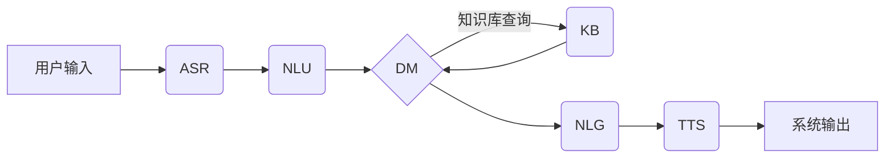
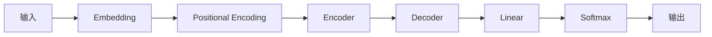

# AI Agent: AI的下一个风口 自然语言带来交互革命

关键词：AI Agent、自然语言交互、人工智能、对话系统、智能助理

## 1. 背景介绍
### 1.1 问题的由来
人工智能技术的快速发展,催生了一系列智能应用和产品,其中AI Agent作为人机交互的重要界面,正受到越来越多的关注。传统的人机交互方式如键盘、鼠标等,已经难以满足人们日益增长的智能化需求。自然语言交互作为最接近人类交流方式的交互形态,正成为AI时代人机交互的新风口。
### 1.2 研究现状  
当前,以Siri、Alexa、小爱同学等为代表的智能语音助手已经成为人们生活中的重要组成部分。这些AI Agent具备语音识别、自然语言理解、知识问答等多项AI能力,可以通过自然语言与人进行交流并提供相应服务。但是,当前的AI Agent在对话理解、任务执行等方面还存在诸多局限性,离真正意义上的智能对话还有较大差距。
### 1.3 研究意义
自然语言交互代表了人机交互的未来趋势和方向。研究AI Agent的自然语言处理和对话生成技术,对于提升人机交互体验、拓展人工智能应用范围具有重要意义。同时,AI Agent蕴含着巨大的商业价值,在智能客服、教育培训、智慧医疗等领域前景广阔。因此,深入探索AI Agent的实现原理和关键技术,对于推动人工智能产业发展意义重大。
### 1.4 本文结构
本文将全面探讨AI Agent的技术原理、实现方法和应用实践。第2部分介绍AI Agent的核心概念和关键技术。第3部分重点阐述AI Agent的核心算法。第4部分给出AI Agent的数学模型和公式推导。第5部分通过代码实例讲解AI Agent的实现过程。第6部分分析AI Agent的应用场景。第7部分推荐AI Agent相关的工具和资源。第8部分总结全文并展望未来。

## 2. 核心概念与联系
AI Agent是融合了多项人工智能技术的智能系统,通过自然语言理解用户需求,并根据知识库进行推理和任务规划,最终给出满足用户需求的答复或执行相应的操作。其核心在于利用自然语言处理(NLP)技术对用户输入进行语义理解,并通过对话管理和对话生成产生自然、连贯、得体的回复。

AI Agent的关键技术包括:
- 自然语言理解(NLU):对用户输入进行语法分析、语义解析,提取关键信息
- 对话管理(DM):根据上下文和用户意图,控制对话流程,完成多轮交互
- 对话生成(NLG):根据系统意图,结合上下文,组织语言,生成自然回复
- 知识库(KB):存储结构化和非结构化知识,支持问答和推理
- 语音识别(ASR)和语音合成(TTS):实现语音交互

这些技术相互配合,形成了AI Agent的核心架构:



## 3. 核心算法原理 & 具体操作步骤
### 3.1 算法原理概述
AI Agent的核心算法主要包括自然语言理解、对话管理和对话生成三大部分。其中,自然语言理解常用的算法有:
- 基于规则的方法:如正则表达式、句法分析等
- 基于统计的方法:如隐马尔可夫模型、条件随机场等
- 基于深度学习的方法:如RNN、LSTM、Transformer等

对话管理常用的算法有:
- 有限状态机:将对话看作状态的转移,每个状态执行特定的动作
- 基于框架的方法:通过填充框架的槽位,完成信息的收集和交互
- 基于规划的方法:将对话看作一个规划问题,通过搜索完成多轮交互

对话生成常用的算法有:
- 基于检索的方法:从对话语料中检索出最相似的答复
- 基于生成的方法:通过seq2seq等模型,生成新颖的答复
- 基于强化学习的方法:通过奖励最大化,学习对话策略

### 3.2 算法步骤详解
以基于深度学习的端到端对话系统为例,其主要步骤如下:

(1) 数据准备:收集大规模对话语料,进行清洗和预处理,并构建训练集、验证集和测试集。

(2) 模型构建:根据需求选择合适的模型架构,如Transformer、GPT等。设计编码器将用户输入映射为向量,设计解码器根据编码向量生成回复。

(3) 模型训练:利用训练集数据,通过监督学习方法训练模型参数。通常采用极大似然估计,最小化交叉熵损失函数:

$$
\mathcal{L}(\theta) = -\sum_{i=1}^{N}\log p(y_i|x_i;\theta)
$$

其中$\theta$为模型参数,$x_i$和$y_i$分别为第$i$个样本的输入和输出。

(4) 模型评估:在验证集上评估模型性能,如perplexity、BLEU等指标。不断调整模型超参数,如学习率、批大小等,优化模型效果。

(5) 模型推理:利用训练好的模型,对新的用户输入进行推理,生成回复。生成过程通过贪心搜索或beam search等策略,从左到右逐个生成响应词语。

(6) 人类评估:邀请用户对模型生成的回复进行主观评估,如流畅性、相关性、信息量等。根据反馈进一步改进模型。

(7) 模型部署:将训练好的模型封装为API,集成到对话系统中。设计合理的系统架构,保证推理速度和稳定性。

### 3.3 算法优缺点
端到端的对话生成算法具有以下优点:
- 端到端训练,减少人工特征工程
- 生成多样化、个性化的回复
- 学习海量知识,具备一定的常识推理能力

但也存在一些不足:
- 需要大规模高质量数据,训练成本高
- 泛化能力有限,容易过拟合
- 缺乏可解释性,难以控制生成过程
- 安全性和伦理风险,可能生成不恰当内容

### 3.4 算法应用领域
端到端对话生成算法已经在多个领域得到应用,如:
- 智能客服:提供全天候客户服务,解答常见问题
- 虚拟助理:执行信息查询、任务规划等个性化服务
- 陪伴聊天:提供情感支持,缓解孤独感
- 知识问答:根据海量知识,回答开放域问题

## 4. 数学模型和公式 & 详细讲解 & 举例说明 
### 4.1 数学模型构建
对话生成可以看作一个条件语言模型,给定输入序列$X=(x_1,x_2,...,x_m)$,生成输出序列$Y=(y_1,y_2,...,y_n)$。用概率公式表示为:

$$
P(Y|X) = \prod_{i=1}^{n} P(y_i|X, y_1, ..., y_{i-1})
$$

即输出序列的概率等于每个词的概率乘积,每个词的概率由输入序列和之前的输出决定。

为了建模这种条件概率,可以使用Transformer等神经网络模型。Transformer由编码器和解码器组成,如下图所示:



编码器将输入序列$X$映射为一组隐向量$H=(h_1,h_2,...,h_m)$,解码器根据$H$和之前的输出$y_{<i}$生成当前输出$y_i$。

### 4.2 公式推导过程
编码器和解码器内部都是由多个相同的子层堆叠而成,主要包括多头注意力(Multi-Head Attention)和前馈神经网络(Feed Forward)两部分。

多头注意力用于捕捉序列中不同位置之间的相关性,公式如下:

$$
\text{MultiHead}(Q,K,V) = \text{Concat}(\text{head}_1, ..., \text{head}_h)W^O \\
\text{head}_i = \text{Attention}(QW_i^Q, KW_i^K, VW_i^V)
$$

其中$Q$、$K$、$V$分别为查询、键、值矩阵,$W$为可学习的参数矩阵。

前馈神经网络用于对特征进行非线性变换,公式如下:

$$
\text{FFN}(x) = \max(0, xW_1 + b_1)W_2 + b_2
$$

其中$W_1,b_1,W_2,b_2$为可学习的参数。

在训练过程中,模型参数通过最小化交叉熵损失进行优化:

$$
\mathcal{L}(\theta) = -\sum_{i=1}^{N}\log P(Y_i|X_i;\theta)
$$

其中$\theta$为模型参数,$X_i$和$Y_i$为第$i$个样本的输入和输出。

### 4.3 案例分析与讲解
下面以一个简单的对话为例,说明Transformer的生成过程:

输入:今天天气怎么样?
输出:今天天气晴朗,温度适宜,非常适合外出游玩。

生成过程如下:

(1) 将输入序列通过编码器,得到一组隐向量表示:

```
今 -> [-0.1, 0.2, ..., -0.3] 
天 -> [0.3, -0.1, ..., 0.2]
天 -> [-0.2, 0.1, ..., 0.4]
气 -> [0.5, 0.2, ..., -0.1]
怎 -> [0.1, -0.4, ..., 0.3]
么 -> [-0.3, 0.2, ..., 0.1]
样 -> [0.2, 0.1, ..., -0.2]
```

(2) 解码器根据编码结果,逐个生成输出序列:
- 生成第一个词"今":基于输入序列的隐向量表示,通过注意力机制得到权重分布,选择概率最大的词"今"作为输出。
- 生成第二个词"天":在已生成"今"的基础上,再次计算注意力权重分布,选择概率最大的词"天"作为输出。
- 依此类推,直到生成<eos>表示结束。

(3) 输出最终的生成结果"今天天气晴朗,温度适宜,非常适合外出游玩。"

可以看出,Transformer通过注意力机制捕捉输入序列的上下文信息,再结合已生成内容,从而得到流畅、连贯的生成结果。

### 4.4 常见问题解答
问:Transformer相比传统的seq2seq模型有何优势?
答:Transformer通过自注意力机制实现并行计算,大大提高了训练和推理效率。此外,Transformer可以更好地捕捉长距离依赖,生成更加连贯的结果。

问:Transformer是否适合任意长度的输入序列?
答:理论上Transformer可以处理任意长度的序列,但实际应用中受限于显存和计算资源,通常会设置最大长度。对于超长序列,可以采用分块注意力等优化策略。

## 5. 项目实践：代码实例和详细解释说明
### 5.1 开发环境搭建
首先需要安装PyTorch、Transformers等必要的库:

```
pip install torch 
pip install transformers
```

### 5.2 源代码详细实现
下面给出了一个基于Transformer的简单对话生成示例:

```python
import torch
from transformers import AutoTokenizer, AutoModelForCausalLM

# 加载预训练的tokenizer和model
tokenizer = AutoTokenizer.from_pretrained("microsoft/DialoGPT-medium")
model = AutoModelForCausalLM.from_pretrained("microsoft/DialoGPT-medium")

# 定义函数:将对话历史编码为模型输入
def encode(history):
    input_ids = tokenizer.encode(history, return_tensors="pt")
    return input_ids

# 定义函数:根