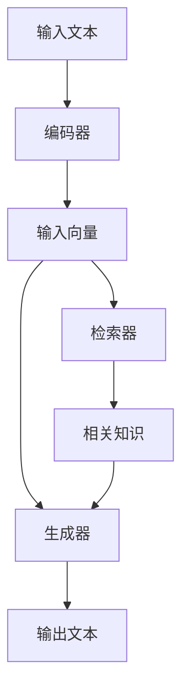

以下是根据您提供的要求和模板，为主题"AI大模型原理与应用：RAG是一个工程问题，有十几个环节都要优化"所撰写的技术博客文章。

# AI 大模型原理与应用：RAG 是一个工程问题，有十几个环节都要优化

## 1. 背景介绍

### 1.1 问题的由来

随着人工智能技术的不断发展，大型语言模型已经成为自然语言处理领域的关键技术之一。这些模型通过在大量文本数据上进行预训练,能够捕捉丰富的语义和上下文信息,从而在下游任务中表现出色。然而,这些大型语言模型存在一些固有的缺陷,例如:

1. 知识不足:尽管经过大规模预训练,但模型的知识仍然有限,无法涵盖所有领域的知识。
2. 事实一致性差:模型生成的内容可能与事实不一致,存在矛盾和错误。
3. 推理能力有限:模型缺乏强大的推理和分析能力,难以处理复杂的推理任务。

为了解决这些问题,研究人员提出了一种新的模型架构,即检索增强生成(Retrieval-Augmented Generation,RAG)模型。RAG模型通过将检索和生成相结合,利用外部知识库来补充模型的知识,从而提高模型的事实一致性和推理能力。

### 1.2 研究现状

近年来,RAG模型受到了广泛关注,多个著名的科技公司和研究机构都在积极开展相关研究。例如:

- Facebook AI Research提出了RAG模型,并在多个任务上取得了令人鼓舞的结果。
- Google AI推出了基于RAG的多模态模型Multitask Adaptive Retrieval-Augmented Generation(MARA),用于处理图像和文本的多模态任务。
- OpenAI开发了基于RAG的对话系统,用于生成更加丰富、一致和有见地的回复。

尽管取得了一定进展,但RAG模型仍然面临着诸多挑战,需要在多个环节进行优化和改进。

### 1.3 研究意义

RAG模型的研究和应用具有重要的理论和实际意义:

- 理论意义:RAG模型为大型语言模型引入了新的范式,有助于探索模型融合外部知识的新方法,推动自然语言处理领域的发展。
- 实际意义:RAG模型可以应用于多个领域,如问答系统、对话系统、文本生成等,提高系统的准确性和可靠性,为用户提供更好的服务。

### 1.4 本文结构

本文将全面介绍RAG模型的原理和应用,包括以下主要内容:

1. 核心概念与联系
2. 核心算法原理和具体操作步骤
3. 数学模型和公式详细讲解及案例分析
4. 项目实践:代码实例和详细解释说明
5. 实际应用场景
6. 工具和资源推荐
7. 未来发展趋势与挑战
8. 常见问题与解答

## 2. 核心概念与联系

RAG模型是一种融合了检索(Retrieval)和生成(Generation)能力的新型语言模型架构。它包含以下三个关键组件:

1. **编码器(Encoder)**: 负责将输入文本编码为向量表示。
2. **检索器(Retriever)**: 基于输入向量在知识库中检索相关文档或段落。
3. **生成器(Generator)**: 根据输入向量和检索到的知识,生成最终的输出文本。

这三个组件通过以下步骤协同工作:

编码器将输入文本编码为向量表示,检索器基于该向量在知识库中检索相关知识,生成器综合输入向量和检索到的知识生成最终输出。

RAG模型的核心思想是利用外部知识库来补充语言模型的知识,从而提高模型的事实一致性和推理能力。它将检索和生成两个环节有机结合,实现了知识增强的生成过程。

## 3. 核心算法原理与具体操作步骤

### 3.1 算法原理概述

RAG模型的核心算法原理可以概括为以下三个步骤:

1. **编码(Encoding)**: 使用预训练的编码器模型(如BERT)将输入文本编码为向量表示。
2. **检索(Retrieval)**: 基于输入向量在知识库中检索相关文档或段落,通常采用向量相似度匹配的方法。
3. **生成(Generation)**: 将输入向量和检索到的知识作为条件,使用预训练的生成器模型(如GPT)生成最终的输出文本。

在实际应用中,这三个步骤可能会有一些变体和优化,但基本原理是一致的。

### 3.2 算法步骤详解

1. **编码步骤**:
   - 使用预训练的编码器模型(如BERT)对输入文本进行编码,得到输入向量表示。
   - 编码器模型通过自注意力机制捕捉输入文本中的上下文信息和语义关系。

2. **检索步骤**:
   - 基于输入向量在知识库中检索相关文档或段落。
   - 常用的检索方法包括向量相似度匹配、密集检索(Dense Retrieval)和稀疏检索(Sparse Retrieval)等。
   - 密集检索通过计算输入向量与知识库中所有向量表示的相似度,选取最相关的文档或段落。
   - 稀疏检索则利用倒排索引等传统信息检索技术进行检索。

3. **生成步骤**:
   - 将输入向量和检索到的知识作为条件,使用预训练的生成器模型(如GPT)生成最终的输出文本。
   - 生成器模型通过自回归(Autoregressive)方式生成文本,每次根据之前生成的内容和条件信息预测下一个词。
   - 生成过程中可以引入各种策略和技巧,如梯度裁剪(Gradient Clipping)、顶端采样(Top-k Sampling)等,以提高生成质量。

### 3.3 算法优缺点

**优点**:

- 利用外部知识库补充语言模型的知识,提高了事实一致性和推理能力。
- 检索和生成两个环节相结合,实现了知识增强的生成过程。
- 模型架构灵活,可以根据实际需求调整各个组件的实现方式。

**缺点**:

- 需要构建高质量的知识库,这可能是一个耗时且昂贵的过程。
- 检索和生成两个环节的性能均会影响最终的生成质量。
- 模型训练和推理过程相对复杂,需要更多的计算资源。

### 3.4 算法应用领域

RAG模型可以应用于多个自然语言处理领域,包括但不限于:

- **问答系统**: 利用知识库提高问答系统的准确性和覆盖面。
- **对话系统**: 生成更加丰富、一致和有见地的对话回复。
- **文本生成**: 生成高质量的文本内容,如新闻报道、故事创作等。
- **事实核查**: 验证生成文本的事实一致性,纠正错误信息。
- **知识推理**: 利用知识库进行复杂的推理和分析任务。

## 4. 数学模型和公式详细讲解与举例说明

### 4.1 数学模型构建

RAG模型的核心数学模型可以表示为:

$$P(y|x, c) = \sum_{z \in \mathcal{Z}} P(y|x, z, c)P(z|x, c)$$

其中:

- $x$表示输入文本
- $y$表示生成的输出文本
- $c$表示从知识库检索到的相关知识
- $z$表示潜在的知识表示
- $\mathcal{Z}$表示所有可能的知识表示的集合

该模型的目标是最大化生成输出文本$y$的条件概率$P(y|x, c)$,即在给定输入文本$x$和检索到的知识$c$的情况下,生成最可能的输出文本$y$。

为了计算$P(y|x, c)$,我们需要对潜在的知识表示$z$进行边缘化(Marginalization),并分解为两个部分:

1. $P(y|x, z, c)$: 给定输入文本$x$、知识表示$z$和检索知识$c$时,生成输出文本$y$的概率。
2. $P(z|x, c)$: 给定输入文本$x$和检索知识$c$时,潜在知识表示$z$的概率。

这两个部分分别对应于生成器(Generator)和检索器(Retriever)的作用。

### 4.2 公式推导过程

我们可以进一步将$P(y|x, z, c)$和$P(z|x, c)$分解为更细粒度的模型组件:

$$P(y|x, z, c) = \prod_{t=1}^{|y|} P(y_t|y_{<t}, x, z, c)$$

$$P(z|x, c) = \sum_{d \in \mathcal{D}} P(z|d, x)P(d|x, c)$$

其中:

- $P(y_t|y_{<t}, x, z, c)$表示生成器在给定之前生成的文本$y_{<t}$、输入文本$x$、知识表示$z$和检索知识$c$的情况下,生成第$t$个词$y_t$的概率。
- $P(z|d, x)$表示给定知识库中的文档$d$和输入文本$x$时,潜在知识表示$z$的概率。
- $P(d|x, c)$表示给定输入文本$x$和检索知识$c$时,文档$d$被检索到的概率。
- $\mathcal{D}$表示知识库中所有文档的集合。

通过这种分解,我们可以将RAG模型的训练和推理过程分为编码器(Encoder)、检索器(Retriever)和生成器(Generator)三个部分,分别优化相应的模型组件。

### 4.3 案例分析与讲解

为了更好地理解RAG模型的工作原理,我们来分析一个具体的案例。

假设我们需要构建一个问答系统,回答关于"量子计算"的问题。我们拥有一个包含量子计算相关知识的文档集合作为知识库。

给定一个输入问题"什么是量子比特(Qubit)?"。RAG模型的工作流程如下:

1. **编码步骤**:
   - 使用预训练的编码器模型(如BERT)将输入问题"什么是量子比特(Qubit)?"编码为向量表示$x$。

2. **检索步骤**:
   - 基于输入向量$x$,在知识库中检索与"量子比特"相关的文档或段落。
   - 假设检索到的最相关知识$c$是:"量子比特是量子计算的基本单位,它可以同时表示0和1两种量子态的叠加。"

3. **生成步骤**:
   - 将输入向量$x$和检索知识$c$输入到生成器模型中。
   - 生成器模型综合输入和知识信息,生成最终的回答$y$,例如:"量子比特是量子计算中的基本信息单位,它可以同时表示0和1两种量子态的叠加,这种叠加态是经典计算中无法实现的,是量子计算能够实现并行计算的关键所在。"

在这个过程中,RAG模型利用了外部知识库中的信息,生成了更加准确和丰富的回答,而不是仅依赖于语言模型本身的知识。

### 4.4 常见问题解答

1. **为什么需要将检索和生成两个环节结合?**

将检索和生成结合是为了充分利用语言模型和外部知识库的优势。语言模型擅长捕捉上下文和语义信息,而知识库则提供了丰富的事实知识。通过结合两者,我们可以生成更加准确、一致和有见地的输出。

2. **如何构建高质量的知识库?**

构建高质量的知识库是RAG模型取得良好性能的关键。知识库的质量取决于数据来源、数据清洗、知识表示等多个方面。通常需要从可靠的数据源(如维基百科、专业文献等)收集数据,并进行必