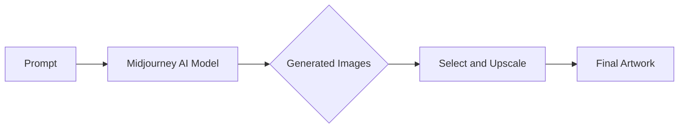

# AIGC从入门到实战：云想衣裳花想容：Midjourney 助你成为画中仙

## 1. 背景介绍

### 1.1 问题的由来

随着人工智能技术的飞速发展,AI生成内容(AIGC)正在席卷各个领域。从文本、语音到图像、视频,AI正在以前所未有的速度和质量生成各种内容。其中,AI绘画尤其引人注目。通过输入简单的文本描述,AI系统就可以自动生成栩栩如生的图像和画作。这种技术正在颠覆传统的艺术创作方式,为普通大众提供了低门槛、高质量的艺术创作工具。

### 1.2 研究现状

目前,业界已经涌现出多个优秀的AI绘画平台,如Midjourney、Stable Diffusion、DALL-E等。它们各有特色,但都能生成令人惊艳的画作。其中,Midjourney以其独特的艺术风格和强大的功能脱颖而出,成为AI绘画领域的佼佼者。越来越多的艺术家和爱好者开始使用Midjourney进行艺术创作和探索。

### 1.3 研究意义

深入研究Midjourney的原理和使用方法,对于普及AI绘画技术,降低艺术创作门槛,激发大众创造力具有重要意义。通过系统介绍Midjourney的概念、原理、实践和应用,可以帮助更多人快速掌握这一前沿技术,用AI绘画表达内心的想象和创意。同时,Midjourney的成功经验也为其他AI绘画平台的发展提供了有益借鉴。

### 1.4 本文结构

本文将从以下几个方面展开论述:

- 介绍AIGC和Midjourney的核心概念和联系
- 剖析Midjourney的核心算法原理和操作步骤
- 讲解Midjourney所依赖的数学模型和公式
- 通过代码实例演示如何使用Midjourney进行AI绘画
- 探讨Midjourney在艺术创作等领域的实际应用场景
- 推荐Midjourney的学习资源、开发工具和相关论文
- 总结Midjourney的研究成果,展望其未来发展趋势和挑战
- 解答读者在使用Midjourney过程中的常见问题

## 2. 核心概念与联系

在深入探讨Midjourney之前,我们有必要先了解几个核心概念:

- AIGC:AI Generated Content的缩写,指由人工智能自动生成的各种内容,包括文本、图像、音频、视频等。AIGC正成为继PGC(专业生产内容)、UGC(用户生成内容)之后的又一种重要内容生产方式。

- 文生图:给定一段文本描述,自动生成与之匹配的图像。这是AIGC领域的一个重要分支,代表技术如Stable Diffusion、DALL-E、Midjourney等。

- Prompt:提示词,指输入给AI系统的文本描述,引导其生成特定的图像。撰写优质的Prompt是使用Midjourney的关键。

- Diffusion Model:扩散模型,一种生成式深度学习模型,通过逐步去噪的方式生成高质量图像,是当前AIGC的主流技术之一。

Midjourney正是一个基于扩散模型的文生图平台。它以Prompt为输入,利用强大的AI模型和海量的图像数据,生成匹配Prompt描述的精美画作。整个过程可以用下图表示:



## 3. 核心算法原理 & 具体操作步骤

### 3.1 算法原理概述

Midjourney采用扩散模型(Diffusion Model)作为其核心算法。扩散模型通过迭代的去噪过程,将高斯噪声逐步"扩散"为清晰的图像。具体来说,模型接受图像和噪声作为输入,通过神经网络学习噪声分布,逐步去除噪声,最终生成干净的图像。

### 3.2 算法步骤详解

Midjourney的扩散模型可以分为以下几个关键步骤:

1. 编码:将输入的文本Prompt通过Transformer编码为隐空间表示。

2. 加噪:在隐空间中加入高斯噪声,模拟扩散过程的起点。

3. 去噪:通过神经网络迭代去除噪声,每次迭代将噪声水平降低一点,直到获得干净的隐空间表示。

4. 解码:将去噪后的隐空间表示解码为像素空间,生成最终的图像。

整个过程可以用下面的数学公式表示:

$$z_t = \alpha_t z_{t-1} + \sqrt{1-\alpha_t^2} \epsilon_t$$

其中,$z_t$是去噪过程中的隐变量,$\alpha_t$是噪声水平,$\epsilon_t$是高斯噪声。通过迭代更新$z_t$,最终得到干净的图像表示$z_0$。

### 3.3 算法优缺点

扩散模型相比其他生成式模型(如GAN)有以下优点:

- 样本质量高:生成的图像清晰自然,细节丰富。
- 训练稳定:不易出现模式崩溃,对超参数不敏感。
- 适用范围广:可以生成任意大小和风格的图像。

但扩散模型也有一些局限性,如:

- 推理速度慢:生成一张图像需要多次迭代,耗时较长。
- 占用内存大:需要在训练过程中存储所有时间步的隐变量。

### 3.4 算法应用领域

得益于其出色的图像生成效果,扩散模型已在多个领域得到应用,如:

- 艺术创作:生成各种风格的绘画、插图、概念设计等。
- 游戏设计:自动生成游戏场景、角色、贴图等素材。
- 虚拟形象:生成逼真的人物肖像,用于虚拟主播、数字人等。
- 图像编辑:进行图像补全、上色、风格迁移等操作。

Midjourney就是扩散模型在艺术创作领域的典型应用,为艺术家和爱好者提供了强大的创作工具。

## 4. 数学模型和公式 & 详细讲解 & 举例说明

### 4.1 数学模型构建

Midjourney的数学模型可以用下面的公式来描述:

$$p_\theta(x_0) = \int p_\theta(x_{0:T}) dx_{1:T} = \int p(x_T) \prod_{t=1}^T p_\theta(x_{t-1}|x_t) dx_{1:T}$$

其中,$x_0$是原始的干净图像,$x_1$到$x_T$是加入不同水平噪声的图像,$p_\theta(x_{t-1}|x_t)$是去噪过程的单步转移概率。目标是学习这个转移概率分布,从而在采样时从$x_T$开始,逐步去噪得到$x_0$。

### 4.2 公式推导过程

为了学习单步转移概率$p_\theta(x_{t-1}|x_t)$,我们假设它服从高斯分布:

$$p_\theta(x_{t-1}|x_t) = \mathcal{N}(x_{t-1}; \mu_\theta(x_t, t), \Sigma_\theta(x_t, t))$$

其中,均值$\mu_\theta$和方差$\Sigma_\theta$由神经网络预测。根据贝叶斯法则,我们可以得到:

$$p_\theta(x_t|x_{t-1}) = \frac{p_\theta(x_{t-1}|x_t)p(x_t)}{p_\theta(x_{t-1})} \propto p_\theta(x_{t-1}|x_t)p(x_t)$$

假设$p(x_t)$也服从高斯分布,那么$p_\theta(x_t|x_{t-1})$也是高斯分布。我们可以用神经网络预测它的均值和方差,然后最小化它与$p_\theta(x_{t-1}|x_t)p(x_t)$的KL散度,从而学习去噪过程。

### 4.3 案例分析与讲解

下面我们以一个具体的例子来说明Midjourney的生成过程:

假设我们输入的Prompt是"A beautiful sunset by the beach"。

1. 首先,Midjourney将这个Prompt编码为隐空间表示$z_T$。

2. 然后,它在$z_T$上加入高斯噪声,得到一个噪声表示$z'_T$。

3. 接下来,它通过神经网络迭代预测均值和方差,不断去噪,得到一系列的隐变量$z'_{T-1}, z'_{T-2}, ..., z'_0$。

4. 最后,它将$z'_0$解码为像素空间,得到一张噪声被去除的干净图像,呈现出日落海滩的唯美场景。

通过调节Prompt和超参数,我们可以控制生成图像的内容和风格,创作出心仪的艺术作品。

### 4.4 常见问题解答

问:Midjourney的生成过程需要多长时间?
答:取决于图像的复杂程度和分辨率,通常在几秒到几分钟之间。高分辨率图像需要更长的生成时间。

问:Midjourney生成的图像质量如何?
答:Midjourney生成的图像质量很高,细节丰富,色彩艳丽,具有艺术感。但有时也会出现一些扭曲、失真的瑕疵,需要通过后期编辑来修正。

问:如何控制Midjourney生成的图像风格?  
答:主要通过优化Prompt来控制。可以在Prompt中指定艺术家、流派、色调等关键词,引导模型生成特定风格的图像。此外,调整采样步数、guidance scale等超参数也能影响图像风格。

## 5. 项目实践：代码实例和详细解释说明

### 5.1 开发环境搭建

要使用Midjourney进行AI绘画,我们首先需要搭建开发环境。具体步骤如下:

1. 注册Midjourney账号,获取API密钥。
2. 安装Python 3和必要的库,如requests、PIL等。
3. 将API密钥配置到代码中。

完成以上步骤后,我们就可以开始编写代码调用Midjourney的API进行绘画了。

### 5.2 源代码详细实现

下面是一个使用Midjourney API生成图像的Python代码示例:

```python
import requests
from PIL import Image
from io import BytesIO

# 配置API密钥和URL
api_key = "your_api_key"
url = "https://api.midjourney.com/v1/generate"

# 设置Prompt和参数
prompt = "A beautiful sunset by the beach, trending on artstation"
params = {
    "prompt": prompt,
    "width": 512,
    "height": 512,
    "num_images": 1,
    "guidance_scale": 7.5,
    "steps": 50
}

# 发送HTTP请求生成图像
headers = {"Authorization": f"Bearer {api_key}"}
response = requests.post(url, json=params, headers=headers)

# 解析响应,显示生成的图像
if response.status_code == 200:
    data = response.json()
    image_url = data["images"][0]
    image_data = requests.get(image_url).content
    image = Image.open(BytesIO(image_data))
    image.show()
else:
    print(f"Error: {response.status_code} {response.text}")
```

### 5.3 代码解读与分析

让我们来逐步解析这段代码:

1. 首先,我们导入了必要的库:requests用于发送HTTP请求,PIL用于处理图像,BytesIO用于将字节流转换为文件对象。

2. 然后,我们配置了Midjourney的API密钥和URL。注意要替换为你自己的密钥。

3. 接下来,我们设置了要生成图像的Prompt和相关参数,如图像尺寸、生成数量、guidance scale、采样步数等。

4. 准备好参数后,我们构造HTTP请求,将Prompt和参数以JSON格式发送给Midjourney的API。注意要在请求头中包含API密钥。

5. 如果请求成功,我们从响应的JSON数据中提取生成的图像URL,再次发送HTTP请求获取图像数据。

6. 最后,我们用PIL库打开图像数据,并显示生成的图像。如果请求失败,则打印错误信息。

通过这段简单的代码,我们就可以利用Midjourney的API自动生成符合