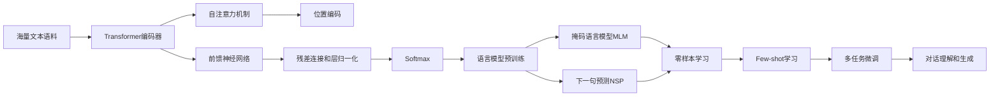

# AIGC从入门到实战：白也诗无敌，飘然思不群：ChatGPT，博学、"聪明"的好助手

关键词：AIGC, ChatGPT, 人工智能, 自然语言处理, 大语言模型, 深度学习, Transformer, 知识图谱, 强化学习, 人机交互

## 1. 背景介绍
### 1.1 问题的由来
随着人工智能技术的飞速发展,尤其是自然语言处理领域的突破性进展,人机对话系统已经成为当前的研究热点。传统的对话系统往往基于预定义的规则和模板,缺乏灵活性和泛化能力。而随着深度学习的兴起,大规模语言模型的出现为构建更加智能化的对话系统提供了新的思路。ChatGPT作为当前最为先进的大语言模型之一,以其强大的语言理解和生成能力,正在重塑人机交互的方式。
### 1.2 研究现状
近年来,以Transformer为代表的深度学习模型在自然语言处理领域取得了显著的成果。GPT(Generative Pre-trained Transformer)系列模型通过在大规模语料上进行无监督预训练,学习到了丰富的语言知识和生成能力。尤其是GPT-3的问世,以其1750亿参数的规模和强大的零样本学习能力,引发了学术界和工业界的广泛关注。微软、Google等科技巨头纷纷推出了自己的大语言模型,如Megatron-Turing NLG、PaLM等。而OpenAI推出的ChatGPT更是将其应用到了对话交互场景,展现出了惊人的语言理解和生成效果。
### 1.3 研究意义
ChatGPT的出现标志着人机对话技术的重大突破。它不仅能够理解用户的意图,还能根据上下文生成连贯、自然的回复。这为构建更加智能、人性化的对话系统提供了新的思路和方向。ChatGPT在教育、客服、娱乐等领域都具有广阔的应用前景。深入研究ChatGPT的原理和实现,对于推动人机交互技术的发展,实现人工智能在更多场景的落地应用,具有重要的理论和实践意义。
### 1.4 本文结构
本文将从以下几个方面对ChatGPT进行深入探讨：首先介绍ChatGPT所涉及的核心概念及其内在联系；然后重点阐述其底层的算法原理和关键技术细节；接着通过数学建模和公式推导加深理解；进一步给出ChatGPT的代码实现和应用案例；分析其在实际场景中的应用现状和未来潜力；最后总结全文,展望ChatGPT技术的发展趋势和挑战。

## 2. 核心概念与联系
ChatGPT是一种基于Transformer架构的大规模语言模型,它融合了多种人工智能技术,包括自然语言处理、知识表示、深度学习等。其核心是通过海量文本数据的预训练,学习语言的统计规律和隐含语义,从而具备强大的语言理解和生成能力。

下面通过一张Mermaid流程图来展示ChatGPT所涉及的核心概念及其内在联系:

从上图可以看出,ChatGPT的核心是基于Transformer编码器的语言模型预训练。它通过自注意力机制捕捉文本的长距离依赖关系,通过位置编码引入序列信息。同时使用残差连接和层归一化来加速训练和提高泛化性能。在预训练阶段,ChatGPT通过掩码语言模型(MLM)和下一句预测(NSP)两个任务来学习语言的统计规律和语义信息。基于预训练模型,ChatGPT可以通过零样本学习、Few-shot学习等方式快速适应新的任务。最终经过多任务微调,实现了出色的对话理解和生成效果。

这些核心概念环环相扣,共同构建了ChatGPT的技术框架。Transformer编码器是其算法基础,自注意力机制和位置编码是其关键组件,语言模型预训练是其核心策略,零样本学习和多任务微调是其重要手段,最终实现了智能对话交互的目标。

## 3. 核心算法原理 & 具体操作步骤
### 3.1 算法原理概述
ChatGPT的核心算法是基于Transformer的自注意力机制和预训练语言模型。Transformer通过自注意力机制来捕捉文本序列中的长距离依赖关系,克服了传统RNN/LSTM等模型的局限性。同时引入位置编码来引入词序信息。在预训练阶段,通过掩码语言模型(MLM)和下一句预测(NSP)任务来学习语言的统计规律和语义信息。预训练得到的模型具有强大的语言理解和生成能力,可以通过少量样本快速适应下游任务。
### 3.2 算法步骤详解
1. 文本序列的输入表示:将输入文本转换为词嵌入向量,并加上位置编码向量得到最终的输入表示。
2. Transformer编码器:通过多层堆叠的Transformer编码器对输入序列进行特征提取和语义编码。
   - 多头自注意力:将输入序列线性变换为Q、K、V三个矩阵,通过缩放点积计算自注意力权重,加权求和得到新的表示。
   - 残差连接和层归一化:将自注意力的输出与输入进行残差连接,并通过层归一化减少梯度消失/爆炸问题。
   - 前馈神经网络:通过两层全连接网络对特征进行非线性变换,增强模型的表达能力。
3. 预训练任务:
   - 掩码语言模型(MLM):随机掩码一定比例的词,让模型根据上下文预测被掩码的词,学习语言的统计规律。
   - 下一句预测(NSP):给定两个句子,让模型判断它们是否为连续的句子,学习语句间的语义连贯性。
4. 微调和推理:基于预训练模型,通过少量样本对模型进行微调,适应特定的下游任务。在推理阶段,根据输入的对话历史生成回复。
### 3.3 算法优缺点
优点:
- 自注意力机制可以有效捕捉长距离依赖,对语言理解至关重要。
- 预训练策略可以充分利用无标注数据,学习语言的一般规律和知识。
- 基于预训练模型的迁移学习和少样本学习,可以显著减少下游任务的标注成本。
- Transformer的并行计算能力强,训练和推理速度快。

缺点:  
- 模型参数量巨大,训练和推理成本高,对计算资源要求高。
- 模型容量有限,难以记忆和理解所有的世界知识。
- 对于一些强烈依赖常识和因果推理的任务,表现还有待提高。
- 模型可能产生幻觉和错误的信息,缺乏可解释性。
### 3.4 算法应用领域
ChatGPT作为先进的对话交互模型,在多个领域具有广泛的应用前景:
- 智能客服:提供24小时全天候的客户服务,自动解答用户问题,提高服务效率。
- 教育助手:协助学生学习,答疑解惑,提供个性化的学习指导。  
- 医疗助理:辅助医生进行病情分析和诊断,提供医疗咨询服务。
- 金融顾问:为用户提供投资理财建议,风险评估等智能金融服务。
- 娱乐陪伴:作为智能聊天伴侣,提供有趣的对话互动和情感陪伴。
- 辅助写作:协助用户进行文案创作,提供写作灵感和素材。

总之,ChatGPT为人机交互和智能对话系统开辟了新的可能性,有望在更多场景发挥重要作用。

## 4. 数学模型和公式 & 详细讲解 & 举例说明
### 4.1 数学模型构建
ChatGPT的核心是Transformer编码器,其数学模型可以表示为:

$$
\begin{aligned}
\mathbf{H}^0 &= \mathbf{E} + \mathbf{P} \\
\mathbf{Z}^l &= \mathrm{LayerNorm}(\mathbf{H}^{l-1} + \mathrm{MultiHead}(\mathbf{H}^{l-1})) \\
\mathbf{H}^l &= \mathrm{LayerNorm}(\mathbf{Z}^l + \mathrm{FFN}(\mathbf{Z}^l))
\end{aligned}
$$

其中,$\mathbf{E}$表示词嵌入矩阵,$\mathbf{P}$表示位置编码矩阵,$\mathbf{H}^0$表示输入序列的初始表示,$\mathbf{H}^l$表示第$l$层Transformer编码器的输出。$\mathrm{MultiHead}$表示多头自注意力机制,$\mathrm{FFN}$表示前馈神经网络,$\mathrm{LayerNorm}$表示层归一化操作。
### 4.2 公式推导过程
下面对多头自注意力机制的公式进行推导:

对于第$l$层第$i$个注意力头,输入$\mathbf{H}^{l-1}$首先被线性变换为查询矩阵$\mathbf{Q}_i^l$、键矩阵$\mathbf{K}_i^l$和值矩阵$\mathbf{V}_i^l$:

$$
\begin{aligned}
\mathbf{Q}_i^l &= \mathbf{H}^{l-1} \mathbf{W}_{Q_i}^l \\
\mathbf{K}_i^l &= \mathbf{H}^{l-1} \mathbf{W}_{K_i}^l \\
\mathbf{V}_i^l &= \mathbf{H}^{l-1} \mathbf{W}_{V_i}^l
\end{aligned}
$$

然后通过缩放点积计算自注意力权重:

$$
\mathbf{A}_i^l = \mathrm{softmax}(\frac{\mathbf{Q}_i^l {\mathbf{K}_i^l}^T}{\sqrt{d_k}})
$$

其中$d_k$为查询/键向量的维度,缩放因子$\sqrt{d_k}$用于控制点积结果的方差。

最后,将自注意力权重与值矩阵相乘,并将所有注意力头的结果拼接起来:

$$
\mathrm{MultiHead}(\mathbf{H}^{l-1}) = \mathrm{Concat}(\mathbf{A}_1^l\mathbf{V}_1^l, \dots, \mathbf{A}_h^l\mathbf{V}_h^l) \mathbf{W}_O^l
$$

其中$h$为注意力头的数量,$\mathbf{W}_O^l$为输出线性变换矩阵。
### 4.3 案例分析与讲解
下面以一个简单的例子来说明ChatGPT的工作原理。假设我们有以下对话:

用户:你好,今天天气怎么样?
ChatGPT:你好!今天是晴天,温度适宜,非常适合外出活动呢。不过记得涂些防晒霜哦。

首先,ChatGPT将用户的输入"你好,今天天气怎么样?"进行词嵌入和位置编码,得到初始表示$\mathbf{H}^0$。

然后,通过多层Transformer编码器对$\mathbf{H}^0$进行特征提取和语义编码。在自注意力机制中,模型学习到"今天"、"天气"等关键词之间的依赖关系,捕捉到询问天气的语义信息。

接着,模型根据编码后的表示,结合预训练阶段学习到的语言生成知识,生成回复"你好!今天是晴天,温度适宜,非常适合外出活动呢。不过记得涂些防晒霜哦。"。生成过程中,模型不断预测下一个词,直到生成完整的回复。

从回复可