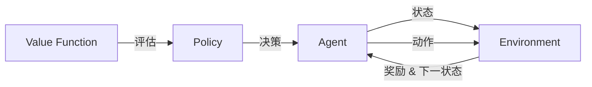

# AI人工智能 Agent：利用强化学习进行决策优化

关键词：人工智能、强化学习、Agent、决策优化、Markov Decision Process、Q-Learning

## 1. 背景介绍

### 1.1 问题的由来

在人工智能的发展历程中，如何让机器像人一样进行智能决策一直是一个核心问题。传统的规则系统和专家系统虽然在特定领域取得了不错的效果，但面对复杂多变的现实环境时，往往难以适应。因此，研究者们开始探索机器学习的方法，希望通过数据驱动的方式让机器具备自主学习和决策的能力。

### 1.2 研究现状

近年来，强化学习作为一种重要的机器学习范式受到广泛关注。与监督学习和无监督学习不同，强化学习是一种试错式学习，通过智能体（Agent）与环境的交互，根据反馈的奖励信号不断优化决策策略。强化学习在 AlphaGo、自动驾驶、机器人控制等领域取得了重大突破，展现出巨大的应用前景。

### 1.3 研究意义

利用强化学习优化 AI Agent 的决策过程，对于提升人工智能系统的自主性、适应性和鲁棒性具有重要意义。通过 Agent 与环境的持续交互和学习，可以在复杂多变的实际场景中找到最优决策，提高系统的性能和效率。这不仅能够促进人工智能在各行各业的应用，也为认知科学和神经科学的研究提供新的视角。

### 1.4 本文结构

本文将从强化学习的核心概念出发，重点介绍其中的 Markov Decision Process (MDP) 和 Q-Learning 算法。通过数学模型和代码实例的讲解，帮助读者深入理解强化学习的原理和实现。同时，本文还将探讨强化学习在实际应用中的场景和挑战，为相关研究提供参考。

## 2. 核心概念与联系

在强化学习中，几个核心概念环环相扣，共同构成了理论基础：

- Agent：智能体，是强化学习的主体，通过与环境交互进行决策和学习。
- Environment：环境，Agent 所处的世界，提供观测信息和奖励反馈。
- State：状态，环境在某一时刻的完整描述，Agent 根据状态选择行为。
- Action：动作或行为，Agent 与环境交互时采取的决策。
- Reward：奖励，环境对 Agent 行为的即时反馈，引导 Agent 优化策略。
- Policy：策略，Agent 根据当前状态选择动作的映射关系。
- Value Function：价值函数，评估每个状态或状态-动作对的长期累积奖励。

下图展示了这些概念之间的关系：



## 3. 核心算法原理 & 具体操作步骤

### 3.1 算法原理概述

强化学习的目标是学习一个最优策略，使得 Agent 在与环境交互的过程中获得最大的累积奖励。马尔可夫决策过程（Markov Decision Process，MDP）为强化学习提供了理论框架。MDP 由状态集合 $\mathcal{S}$，动作集合 $\mathcal{A}$，转移概率函数 $\mathcal{P}$ 和奖励函数 $\mathcal{R}$ 组成。Agent 的目标是寻找一个最优策略 $\pi^*$，最大化期望累积奖励。

Q-Learning 是一种经典的无模型强化学习算法，通过学习状态-动作值函数 $Q(s,a)$ 来逼近最优策略。Q 值表示在状态 $s$ 下采取动作 $a$ 的长期累积奖励期望。通过不断更新 Q 值，最终收敛到最优值函数 $Q^*$，从而得到最优策略。

### 3.2 算法步骤详解

Q-Learning 的核心是通过 Q 值的迭代更新来逼近最优策略。算法的主要步骤如下：

1. 初始化 Q 值表 $Q(s,a)$，对于所有的状态-动作对，初始值可以设为0或随机值。

2. 重复以下步骤，直到收敛或达到最大迭代次数：
   - 根据当前策略（如 $\epsilon$-greedy）选择一个动作 $a_t$，与环境交互，得到奖励 $r_{t+1}$ 和下一状态 $s_{t+1}$。
   - 更新 Q 值：
     $$Q(s_t,a_t) \leftarrow Q(s_t,a_t) + \alpha [r_{t+1} + \gamma \max_{a} Q(s_{t+1},a) - Q(s_t,a_t)]$$
     其中，$\alpha$ 是学习率，$\gamma$ 是折扣因子。
   - 更新当前状态：$s_t \leftarrow s_{t+1}$。

3. 返回最优策略 $\pi^*(s) = \arg\max_{a} Q(s,a)$。

### 3.3 算法优缺点

Q-Learning 的优点在于：
- 无需知道环境的转移概率和奖励函数，是一种无模型学习方法。
- 通过异步更新和探索，可以在连续状态空间中学习。
- 收敛性有理论保证，在一定条件下能够收敛到最优策略。

但 Q-Learning 也存在一些局限性：
- 对于大规模状态空间，Q 表的存储开销较大。
- 探索和利用的平衡需要仔细调节，容易陷入局部最优。
- 对于非平稳环境，学习效果可能受到影响。

### 3.4 算法应用领域

Q-Learning 及其变体在许多领域得到应用，如：
- 游戏 AI：如 AlphaGo 使用了深度强化学习，结合 Q-Learning 的思想。
- 机器人控制：通过强化学习优化机器人的运动策略和决策。  
- 推荐系统：将推荐问题建模为 MDP，使用 Q-Learning 优化推荐策略。
- 智能交通：利用强化学习优化交通信号灯控制和路径规划。

## 4. 数学模型和公式 & 详细讲解 & 举例说明

### 4.1 数学模型构建

马尔可夫决策过程为强化学习提供了数学模型。一个 MDP 由四元组 $\langle \mathcal{S}, \mathcal{A}, \mathcal{P}, \mathcal{R} \rangle$ 定义：

- 状态空间 $\mathcal{S}$：有限或无限的状态集合。
- 动作空间 $\mathcal{A}$：Agent 可选的动作集合。
- 转移概率函数 $\mathcal{P}(s'|s,a)$：在状态 $s$ 下选择动作 $a$ 后转移到状态 $s'$ 的概率。
- 奖励函数 $\mathcal{R}(s,a,s')$：在状态 $s$ 下选择动作 $a$ 并转移到状态 $s'$ 后获得的即时奖励。

MDP 需满足马尔可夫性质，即下一状态仅取决于当前状态和动作，与之前的历史状态无关。

在 MDP 中，策略 $\pi(a|s)$ 定义为在状态 $s$ 下选择动作 $a$ 的概率。状态价值函数 $V^{\pi}(s)$ 表示从状态 $s$ 开始，遵循策略 $\pi$ 的期望累积奖励：

$$V^{\pi}(s) = \mathbb{E}_{\pi} \left[ \sum_{t=0}^{\infty} \gamma^t R_{t+1} | S_0 = s \right]$$

其中，$\gamma \in [0,1]$ 是折扣因子，用于平衡即时奖励和长期奖励。

状态-动作价值函数 $Q^{\pi}(s,a)$ 表示在状态 $s$ 下选择动作 $a$，然后遵循策略 $\pi$ 的期望累积奖励：

$$Q^{\pi}(s,a) = \mathbb{E}_{\pi} \left[ \sum_{t=0}^{\infty} \gamma^t R_{t+1} | S_0 = s, A_0 = a \right]$$

最优价值函数 $V^*(s)$ 和 $Q^*(s,a)$ 分别表示在状态 $s$ 下遵循最优策略 $\pi^*$ 的期望累积奖励。

### 4.2 公式推导过程

Q-Learning 的核心是通过迭代更新来逼近最优 Q 值。根据 Bellman 最优方程，最优 Q 值满足：

$$Q^*(s,a) = \mathbb{E} \left[ R_{t+1} + \gamma \max_{a'} Q^*(S_{t+1},a') | S_t = s, A_t = a \right]$$

Q-Learning 使用样本平均来近似期望，得到更新公式：

$$Q(s_t,a_t) \leftarrow Q(s_t,a_t) + \alpha [r_{t+1} + \gamma \max_{a} Q(s_{t+1},a) - Q(s_t,a_t)]$$

其中，$\alpha \in (0,1]$ 是学习率，控制每次更新的步长。

可以证明，在适当的条件下（如所有状态-动作对被无限次访问），Q-Learning 能够收敛到最优 Q 值 $Q^*$。

### 4.3 案例分析与讲解

考虑一个简单的网格世界环境，如下图所示：

```
+-------+-------+-------+
|       |       |       |
|   A   |   B   |   C   |
|       |       |       |
+-------+-------+-------+
|       |       |       |
|   D   |   E   |   F   |
|       |       |       |
+-------+-------+-------+
```

Agent 的目标是从起点 A 出发，尽快到达终点 F。每个格子代表一个状态，Agent 可以选择上下左右四个动作。除了终点 F 有 +1 的奖励外，其他格子的即时奖励都为 0。

使用 Q-Learning 算法，设置学习率 $\alpha=0.5$，折扣因子 $\gamma=0.9$，初始 Q 值为 0。经过多轮迭代，Q 值收敛到最优值：

```
+-------+-------+-------+
|       |       |       |
|  0.81 |  0.90 |  1.00 |
|       |       |       |
+-------+-------+-------+
|       |       |       |
|  0.73 |  0.81 |  0.90 |
|       |       |       |
+-------+-------+-------+
```

最优策略为：在每个状态下选择 Q 值最大的动作，即总是向右或向上移动，最终到达目标 F。

### 4.4 常见问题解答

**Q1: Q-Learning 和 Sarsa 的区别是什么？**

A1: 两者的主要区别在于更新 Q 值时使用的动作选择方式。Q-Learning 使用下一状态的最大 Q 值来更新，属于异策略（Off-policy）学习；而 Sarsa 使用下一状态实际选择的动作对应的 Q 值来更新，属于同策略（On-policy）学习。

**Q2: 如何平衡探索和利用？**

A2: 常用的方法有 $\epsilon$-greedy 和 Softmax 探索。前者以 $\epsilon$ 的概率随机选择动作，以 $1-\epsilon$ 的概率选择 Q 值最大的动作；后者根据 Q 值的指数函数计算动作的选择概率。另外，Upper Confidence Bound（UCB）算法通过置信区间上界来权衡探索和利用。

**Q3: 如何处理连续状态和动作空间？**

A3: 对于连续状态空间，可以使用函数逼近方法（如线性函数、神经网络）来近似 Q 值函数。对于连续动作空间，可以使用 Actor-Critic 算法，将策略和价值函数分别用两个函数近似。深度确定性策略梯度（DDPG）算法结合了 DQN 和 Actor-Critic，适用于连续动作空间。

## 5. 项目实践：代码实例和详细解释说明

### 5.1 开发环境搭建

本项目使用 Python 3 和 NumPy 库进行开发。可以使用 pip 安装所需库：

```bash
pip install numpy
```

### 5.2 源代码详细实现

下面是一个简单的 Q-Learning 算法实现，用于求解网格世界问题：

```python