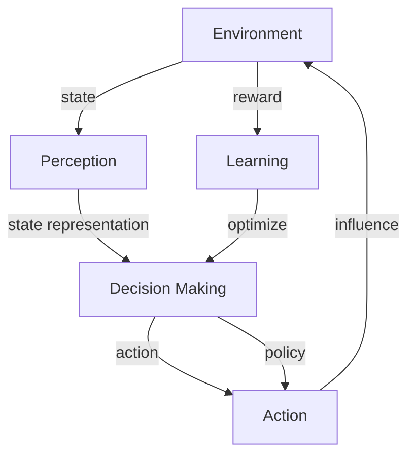

# AI人工智能 Agent：智能体的设计与实现

关键词：人工智能, 智能Agent, 强化学习, 深度学习, 知识表示, 推理, 规划, 多Agent系统

## 1. 背景介绍
### 1.1  问题的由来
人工智能(Artificial Intelligence, AI)是计算机科学领域的一个重要分支,其目标是研究如何让计算机具有智能,能够模拟、延伸和扩展人的智能。而智能Agent(Intelligent Agent)作为实现人工智能的重要途径和手段,受到了学术界和工业界的广泛关注。

智能Agent是一种能够感知环境,并根据环境做出自主决策和行动的计算机程序或系统。它集成了人工智能的多个领域,包括机器学习、知识表示、自动推理和规划等。设计和实现高效、鲁棒的智能Agent是人工智能的核心问题之一。

### 1.2  研究现状
近年来,随着机器学习尤其是深度学习的快速发展,智能Agent的研究取得了长足进展。一方面,深度强化学习为Agent的决策提供了有力工具,使得Agent能够在复杂环境中学习到最优策略。另一方面,大规模知识图谱的构建使得Agent能够拥有更全面的世界知识,具备更强的推理和规划能力。

同时,多Agent系统的研究也日益受到重视。通过Agent之间的交互与协作,多Agent系统能够解决单个Agent无法胜任的复杂任务。博弈论、机制设计等理论为多Agent系统的设计提供了指导。

### 1.3  研究意义
智能Agent技术在许多领域具有广阔的应用前景,如智能客服、自动驾驶、智慧城市等。研究和发展高水平的智能Agent,对于推动人工智能产业化、解决实际应用问题具有重要意义。

此外,智能Agent的研究也有助于我们更好地理解人类智能的本质,探索类人智能的实现途径。这对于认知科学、脑科学等学科的发展具有重要启示意义。

### 1.4  本文结构
本文将全面探讨智能Agent的设计与实现问题。第2节介绍智能Agent的核心概念及其之间的联系。第3节重点阐述几种主要的智能体架构和算法。第4节从理论层面对智能Agent的数学建模进行分析。第5节通过具体的代码实例,演示智能Agent的实现过程。第6节讨论智能Agent技术的实际应用场景。第7节推荐相关的学习资源和开发工具。第8节总结全文,并对智能Agent的未来发展趋势和挑战进行展望。

## 2. 核心概念与联系
智能Agent涉及了一系列核心概念,包括:
- **感知(Perception)**: Agent通过传感器获取环境信息的过程。
- **决策(Decision Making)**: Agent根据所获信息,选择下一步行动的过程。
- **行动(Action)**: Agent施加于环境的操作与影响。
- **环境(Environment)**: Agent所处的外部世界。环境可分为完全可观察/部分可观察、确定/非确定、单Agent/多Agent等类型。
- **状态(State)**: 环境在某一时刻的完整描述。
- **策略(Policy)**: Agent的行为决策规则,即状态到行动的映射。
- **奖励(Reward)**: 环境对Agent行为的即时反馈。
- **学习(Learning)**: Agent通过与环境的交互,不断优化策略以获得更高奖励的过程。

这些概念之间存在着紧密的逻辑关系。Agent通过感知获得环境状态信息,并结合当前策略做出决策,产生相应行动,进而影响环境状态并获得奖励反馈。同时,Agent不断学习和优化策略,以适应环境的变化。

理解这些核心概念之间的相互联系,是设计智能Agent的基础。下图给出了这些概念在Agent感知-决策-行动循环中的逻辑关系:



## 3. 核心算法原理 & 具体操作步骤
### 3.1  算法原理概述
智能Agent的实现涉及多种人工智能算法,主要包括:
1. **搜索算法**: 如A*搜索,用于在状态空间中寻找最优路径。
2. **强化学习**: 如Q-learning、策略梯度等,通过试错与环境交互来学习最优策略。
3. **规划算法**: 如STRIPS,用于根据目标分解生成行动序列。
4. **博弈算法**: 如Minimax搜索,用于多Agent竞争场景下的决策。

这些算法从不同角度解决了智能Agent面临的感知、决策、规划等问题。选择合适的算法,是实现高效Agent的关键。

### 3.2  算法步骤详解
以Q-learning为例,其核心步骤如下:
1. 初始化Q值表Q(s,a),表示在状态s下选择行动a的期望收益。
2. 重复以下步骤直到收敛:
   - 根据当前状态s,用ε-贪心策略选择一个行动a。
   - 执行行动a,观察下一状态s'和奖励r。 
   - 更新Q(s,a):
$$Q(s,a) \leftarrow Q(s,a)+\alpha [r+\gamma \max _{a'} Q(s',a')-Q(s,a)]$$
   其中α为学习率,γ为折扣因子。
   - s ← s'
3. 输出最优策略π*:
$$\pi^*(s)=\arg \max _{a} Q(s,a)$$

通过不断更新Q值并优化策略,Agent最终能够学习到最优行为策略。

### 3.3  算法优缺点
Q-learning的主要优点包括:
- 模型无关,不需要预先知道环境转移概率。
- 通过离线策略学习最优策略,具有一定的探索能力。

但其缺点也较为明显:
- 大规模状态空间下,Q表难以存储与收敛。
- 难以处理连续状态空间。
- 探索与利用的平衡问题。

因此在实际应用中,往往需要改进Q-learning,如引入函数近似、层次化学习等方法。

### 3.4  算法应用领域
强化学习算法在智能Agent领域有广泛应用,如:
- 游戏AI的设计,如AlphaGo。
- 机器人控制,如四足机器人的运动规划。
- 自动驾驶决策,如端到端驾驶模型。
- 推荐系统中的排序策略学习。

## 4. 数学模型和公式 & 详细讲解 & 举例说明
### 4.1  数学模型构建
马尔可夫决策过程(Markov Decision Process, MDP)是对智能Agent与环境交互的经典数学刻画。一个MDP由四元组(S,A,P,R)定义:
- S是有限状态集。
- A是有限行动集。
- P是状态转移概率函数,P(s'|s,a)表示在状态s下选择行动a后转移到状态s'的概率。
- R是奖励函数,R(s,a)表示在状态s下选择行动a获得的即时奖励。

在MDP框架下,智能Agent的目标是寻找一个最优策略π*,使得期望累积奖励最大化:
$$\pi^*=\arg \max _{\pi} \mathbb{E}\left[\sum_{t=0}^{\infty} \gamma^t R\left(s_t, \pi\left(s_t\right)\right)\right]$$
其中γ∈[0,1]为折扣因子,表示未来奖励的重要程度。

### 4.2  公式推导过程
为了求解最优策略,需要引入价值函数的概念。定义状态价值函数V^π(s)为从状态s开始,遵循策略π的期望回报:
$$V^{\pi}(s)=\mathbb{E}\left[\sum_{k=0}^{\infty} \gamma^k R\left(s_{t+k}, \pi\left(s_{t+k}\right)\right) | s_t=s\right]$$

类似地,定义动作价值函数Q^π(s,a)为在状态s下选择行动a,然后遵循策略π的期望回报:
$$Q^{\pi}(s, a)=\mathbb{E}\left[\sum_{k=0}^{\infty} \gamma^k R\left(s_{t+k}, \pi\left(s_{t+k}\right)\right) | s_t=s, a_t=a\right]$$

根据贝尔曼方程,价值函数满足如下递归关系:
$$V^{\pi}(s)=\sum_a \pi(a|s) \sum_{s'} P\left(s'|s, a\right)\left[R(s, a)+\gamma V^{\pi}\left(s'\right)\right]$$
$$Q^{\pi}(s, a)=\sum_{s'} P\left(s'|s, a\right)\left[R(s, a)+\gamma \sum_{a'} \pi\left(a'|s'\right) Q^{\pi}\left(s', a'\right)\right]$$

最优价值函数V^*(s)和Q^*(s,a)满足贝尔曼最优方程:
$$V^*(s)=\max _a \sum_{s'} P\left(s'|s, a\right)\left[R(s, a)+\gamma V^*\left(s'\right)\right]$$
$$Q^*(s, a)=\sum_{s'} P\left(s'|s, a\right)\left[R(s, a)+\gamma \max _{a'} Q^*\left(s', a'\right)\right]$$

因此,最优策略可表示为:
$$\pi^*(s)=\arg \max _a Q^*(s, a)$$

即在每个状态下选择Q值最大的行动。

### 4.3  案例分析与讲解
考虑一个简单的自动导航问题。机器人在一个网格世界中移动,目标是尽快到达指定位置。
- 状态空间S为所有网格坐标。
- 行动空间A为{上,下,左,右}。
- 转移概率P取决于地形,例如撞墙会停留在原位。
- 奖励函数R设置为每一步-1,到达目标位置+10。

这构成了一个典型的MDP。我们可以用价值迭代或策略迭代等算法,通过贝尔曼方程来求解最优策略。得到的策略将指导机器人选择最短路径到达目的地。

### 4.4  常见问题解答
Q: 现实问题中状态和行动空间往往很大,如何处理?
A: 可以考虑采用函数近似方法,用神经网络等模型来拟合价值函数,而不需要存储巨大的查找表。例如DQN算法就是一种成功的尝试。

Q: 环境存在不确定性时MDP还适用吗?
A: 部分可观察马尔可夫决策过程(POMDP)可以对此建模。引入了观察集合和观察概率,Agent需要根据观察历史来维护状态的信念分布。求解POMDP的算法包括POMCP、DESPOT等。

## 5. 项目实践：代码实例和详细解释说明
### 5.1  开发环境搭建
我们使用Python作为开发语言,安装必要的库:
- Numpy: 数值计算库
- Gym: 强化学习环境模拟库
- PyTorch: 深度学习框架

可以用如下命令安装:
```bash
pip install numpy gym torch
```

### 5.2  源代码详细实现
以下代码实现了一个简单的Q-learning智能体,用于OpenAI Gym中的Taxi环境。

```python
import numpy as np
import gym

class QLearningAgent:
    def __init__(self, env, alpha=0.1, gamma=0.9, epsilon=0.1):
        self.env = env
        self.Q = np.zeros((env.observation_space.n, env.action_space.n))
        self.alpha = alpha
        self.gamma = gamma
        self.epsilon = epsilon

    def choose_action(self, state):
        if np.random.uniform() < self.epsilon:
            return self.env.action_space.sample()  # 探索
        else:
            return np.argmax(self.Q[state])  # 利用

    def learn(self, state, action, reward, next_state, done):
        target = reward + self.gamma * np.max(self.Q[next_state]) * (1 - done)
        self.Q[state][action] += self.alpha * (target - self.Q[state][action])

    def train(self, num_episodes=1000):
        for _ in range(num_episodes):
            state = self.env.reset()
            done = False
            while not done:
                action = self.choose_action(state)
                next_state, reward, done, _ = self.env.step(action)
                self.learn(