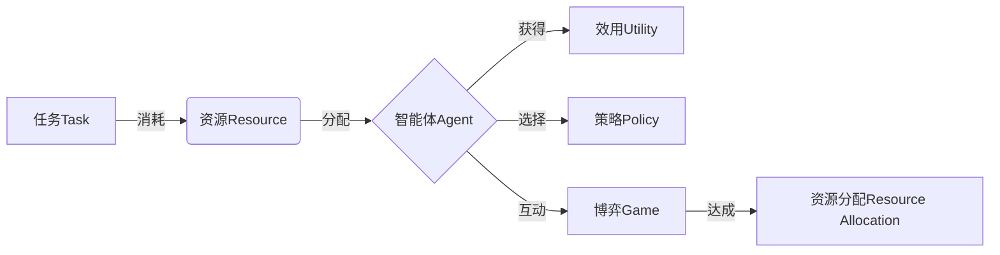

# AI人工智能 Agent：资源配置中智能体的应用

关键词：人工智能、智能体、Agent、资源配置、多智能体系统、强化学习、博弈论、优化算法

## 1. 背景介绍
### 1.1 问题的由来
在现代社会中,资源的合理配置与优化利用是一个关键问题。传统的资源配置方法,如线性规划、整数规划等,在面对动态变化的复杂环境时往往难以适应。人工智能技术的发展为解决这一问题提供了新的思路。将智能体(Agent)引入资源配置,通过智能体的自主学习、协同博弈等机制,可以实现资源的动态优化配置。
### 1.2 研究现状
近年来,国内外学者对于将智能体应用于资源配置的研究日益增多。Wooldridge等人较早地提出了多智能体资源配置(Multi-Agent Resource Allocation, MARA)的概念框架。随后,众多学者基于强化学习、博弈论、优化算法等方法,提出了一系列智能体资源配置模型与算法。如Jiang等人提出了一种基于深度强化学习的智能体资源配置方法;Wang等人研究了考虑不完全信息博弈的智能体资源配置问题;Li等人将群体智能优化算法引入智能体资源配置。这些研究拓展了智能体在资源配置中的应用,但在应对大规模复杂系统、异构智能体协同等方面仍面临挑战。
### 1.3 研究意义 
将智能体引入资源配置,对于提升资源利用效率、应对动态变化的复杂环境具有重要意义。一方面,智能体可以根据环境变化自主学习和调整策略,较传统方法更加灵活;另一方面,多智能体间的分工协作有助于应对大规模复杂系统的资源配置问题。研究智能体资源配置的模型、算法与应用,可以促进人工智能在资源管理领域的深入应用,推动经济社会的可持续发展。
### 1.4 本文结构
本文将围绕智能体在资源配置中的应用展开论述。第2部分介绍智能体资源配置的核心概念;第3部分阐述智能体资源配置的主要算法原理;第4部分建立智能体资源配置的数学模型并给出求解算法;第5部分通过项目实践演示智能体资源配置的代码实现;第6部分分析智能体资源配置的应用场景;第7部分推荐相关工具和资源;第8部分总结全文并展望未来;第9部分给出常见问题解答。

## 2. 核心概念与联系
智能体(Agent)是一种能够感知环境并做出自主行为的计算实体。它具有一定的智能,可以根据环境状态和目标做出决策。将智能体引入资源配置,形成了智能体资源配置(Agent-based Resource Allocation)的研究方向。

在智能体资源配置中,每个智能体负责管理一定的资源,通过与其他智能体的交互实现资源的优化配置。智能体资源配置涉及以下核心概念:

- 任务(Task):需要完成的工作,消耗一定的资源。
- 资源(Resource):完成任务所需的物质或条件,如资金、设备等。
- 效用(Utility):完成任务获得的收益。
- 策略(Policy):智能体根据当前环境状态选择行为的映射。
- 博弈(Game):多个智能体之间的策略互动与利益权衡。

在智能体资源配置中,每个智能体根据环境状态和自身效用,通过学习优化策略,并与其他智能体博弈,最终达成资源的合理分配。多智能体的引入使得资源配置能够应对更加复杂的动态环境。

智能体资源配置与多智能体系统(Multi-Agent System)、博弈论(Game Theory)、优化(Optimization)等领域紧密相关。多智能体系统为智能体资源配置提供了基础框架,博弈论为研究智能体间的策略互动提供了理论工具,优化方法则是智能体制定策略的重要手段。

总的来说,智能体资源配置通过将智能体的分布式自主决策引入资源管理,为解决复杂动态环境下的资源优化配置问题提供了新的思路和方法。

## 3. 核心算法原理 & 具体操作步骤
### 3.1 算法原理概述
智能体资源配置的核心是每个智能体根据环境状态学习优化自身的决策策略,并通过与其他智能体的博弈协商最终达成全局资源的优化配置。常用的智能体资源配置算法包括基于强化学习的算法和基于博弈论的算法两大类。
### 3.2 算法步骤详解
1. 基于强化学习的智能体资源配置算法
强化学习是一种重要的智能体学习范式,智能体通过与环境的交互,根据反馈的奖励信号不断优化自身策略。将强化学习引入智能体资源配置,每个智能体视其他智能体为环境的一部分,通过不断尝试资源分配策略并根据收益调整,最终学习到优化的分配策略。
典型的算法流程如下:
(1) 初始化每个智能体的策略参数。
(2) 各智能体根据当前策略进行资源分配,得到相应的收益。
(3) 各智能体根据收益更新策略参数,如使用Policy Gradient等方法。
(4) 重复步骤(2)(3),直到策略收敛或满足终止条件。

2. 基于博弈论的智能体资源配置算法
博弈论是研究多个理性行为主体在相互影响下如何做出决策的理论。将博弈论引入智能体资源配置,可以刻画多智能体之间的策略互动,求解博弈均衡作为资源分配的解。
典型的算法流程如下:
(1) 建立智能体资源配置博弈模型,定义智能体、策略空间和效用函数。
(2) 求解博弈均衡,如使用纳什均衡、帕累托最优等解概念。
(3) 将博弈均衡对应的策略作为各智能体的资源分配策略。
(4) 在动态环境下,重复步骤(1)-(3),求解动态博弈问题。

### 3.3 算法优缺点
基于强化学习的智能体资源配置算法的优点是能够在未知环境中自主学习,并可以处理大规模状态空间。但其学习效率较低,难以处理非平稳环境。
基于博弈论的智能体资源配置算法能够较好地刻画智能体间的相互影响,并给出均衡解作为资源分配方案。但其往往假设智能体的完全理性,且难以求解大规模博弈问题。

### 3.4 算法应用领域
智能体资源配置算法可应用于云计算中的资源调度、智能电网中的电力分配、交通管理中的流量调控等领域。这些领域往往涉及多个利益相关方,需要在动态变化的环境中实现资源的优化配置,智能体资源配置算法可以提供有效的解决方案。

## 4. 数学模型和公式 & 详细讲解 & 举例说明
### 4.1 数学模型构建
考虑一个多智能体资源配置问题,有$n$个智能体和$m$种资源。记第$i$个智能体分配到第$j$种资源的数量为$x_{ij}$,智能体$i$的决策变量为$\mathbf{x}_i=(x_{i1},\ldots,x_{im})$。
记智能体$i$分配资源$\mathbf{x}_i$时的效用为$u_i(\mathbf{x}_i,\mathbf{x}_{-i})$,其中$\mathbf{x}_{-i}$表示其他智能体的决策变量。各智能体的目标是最大化自身效用,即
$$\max_{\mathbf{x}_i} u_i(\mathbf{x}_i,\mathbf{x}_{-i}), \forall i=1,\ldots,n$$
同时,资源分配需满足一定的约束条件,如资源总量约束、智能体需求约束等,记为
$$\mathbf{x}_i \in X_i, \forall i=1,\ldots,n$$
其中$X_i$为智能体$i$的可行决策集合。

以上即为智能体资源配置问题的一般数学模型。求解该模型即得到了各智能体的最优资源分配策略。

### 4.2 公式推导过程
1. 基于强化学习的资源分配算法
以Q-learning为例,假设智能体$i$在状态$s$下选择动作$a$,得到即时奖励$r$并转移到状态$s'$,则Q值更新公式为
$$Q(s,a) \leftarrow Q(s,a) + \alpha[r+\gamma \max_{a'}Q(s',a')-Q(s,a)]$$
其中$\alpha$为学习率,$\gamma$为折扣因子。
智能体的策略$\pi$可基于Q值给出,如使用$\varepsilon$-greedy策略:
$$\pi(s)=\begin{cases}
\arg\max_a Q(s,a), & \text{with probability }1-\varepsilon \\
\text{random action}, & \text{with probability }\varepsilon
\end{cases}$$

2. 基于博弈论的资源分配算法
以纳什均衡为例,在智能体资源配置博弈$G=\langle N,(X_i),(u_i) \rangle$中,一个策略组合$\mathbf{x}^*=(\mathbf{x}_1^*,\ldots,\mathbf{x}_n^*)$为纳什均衡,当且仅当对任意智能体$i$,有
$$u_i(\mathbf{x}_i^*,\mathbf{x}_{-i}^*) \geq u_i(\mathbf{x}_i,\mathbf{x}_{-i}^*), \forall \mathbf{x}_i \in X_i$$
即在其他智能体策略不变的情况下,任意智能体无法通过单方面改变策略而获得更高效用。

求解纳什均衡的一种常用算法是最佳响应动态:
(1) 初始化策略组合$\mathbf{x}^{(0)}$。
(2) 在第$t$轮,智能体$i$求解以下最优化问题得到最佳响应策略$\mathbf{x}_i^{(t)}$:
$$\mathbf{x}_i^{(t)}=\arg\max_{\mathbf{x}_i \in X_i} u_i(\mathbf{x}_i,\mathbf{x}_{-i}^{(t-1)})$$
(3) 重复步骤(2),直至策略组合收敛。

### 4.3 案例分析与讲解
考虑一个简单的两智能体资源配置博弈问题。两个智能体分别为A和B,共同分配一项总量为1的资源。智能体A分配资源量为$x$,智能体B分配资源量为$1-x$,其中$0 \leq x \leq 1$。
两智能体的效用函数分别为:
$$u_A(x)=x(1-x), u_B(x)=(1-x)x$$
可以看出,两智能体的效用函数关于$x=0.5$对称。求解该博弈问题的纳什均衡,有:
$$\frac{\partial u_A}{\partial x}=1-2x=0 \Rightarrow x^*=0.5$$
$$\frac{\partial u_B}{\partial x}=1-2x=0 \Rightarrow x^*=0.5$$
故纳什均衡为$x^*=0.5$,此时两智能体的效用都达到最大值0.25,资源分配实现了帕累托最优。

### 4.4 常见问题解答
Q: 智能体如何获得效用函数信息?
A: 在完全信息博弈中,假设智能体知道所有智能体的效用函数。在不完全信息博弈中,智能体往往通过学习的方式估计其他智能体的效用函数。

Q: 如何求解大规模智能体资源配置问题?
A: 可以使用基于梯度的优化方法求解大规模非线性规划问题,如ADMM、LASSO等。也可使用启发式算法,如遗传算法、粒子群优化等。

Q: 如何处理动态环境下的智