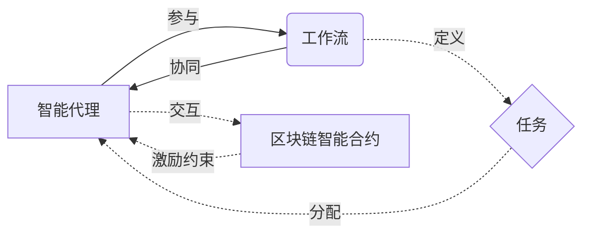

# AI人工智能代理工作流AI Agent WorkFlow：智能代理在智慧城市中的实践

关键词：人工智能, 智能代理, 工作流, 智慧城市, 多Agent系统

## 1. 背景介绍

### 1.1 问题的由来

随着人工智能技术的飞速发展,智能代理(Intelligent Agent)在各个领域得到了广泛应用。特别是在智慧城市建设中,智能代理正在发挥着越来越重要的作用。智能代理可以高效协同工作,优化城市资源配置,提升城市管理和服务水平。然而,如何构建高效的智能代理工作流,实现多个智能代理的协同与交互,仍然是一个亟待解决的问题。

### 1.2 研究现状

目前,国内外学者对智能代理的研究主要集中在单Agent系统的构建与优化。而对于多Agent系统的协同工作流的研究还比较少。已有的研究主要采用中心化控制的方式,存在灵活性不足、鲁棒性差等问题。因此,亟需探索一种分布式、去中心化的智能代理协同工作流模型。

### 1.3 研究意义 

本文针对智慧城市场景,提出了一种创新的AI智能代理工作流模型。该模型采用分布式架构,智能代理间通过点对点通信实现信息交互与任务协同。引入智能合约机制,利用区块链技术确保多方协作过程安全可信。本文的研究对于推动智能代理在智慧城市中的规模化应用具有重要意义。

### 1.4 本文结构

本文后续章节安排如下: 第2节介绍了智能代理、工作流等核心概念;第3节重点阐述了本文提出的智能代理工作流模型的架构原理和关键技术;第4节建立了智能代理协同博弈的数学模型,推导了纳什均衡求解公式;第5节给出了智能合约的代码实现,并结合案例进行了测试分析;第6节探讨了该工作流模型在智慧城市各个场景中的应用;第7节总结了全文的工作,展望了未来的研究方向。

## 2. 核心概念与联系

智能代理(Intelligent Agent): 是一种能够感知环境并做出自主决策与行动的计算机程序。它具有自主性、社会性、反应性、主动性等特点。

工作流(Workflow): 是一系列有序的任务的集合,用于实现特定的业务目标。工作流定义了任务执行的先后次序、分支条件、数据流转等。

本文提出将智能代理引入工作流建模与执行,形成智能代理工作流。多个智能代理在工作流中承担不同的任务角色,它们之间通过通信协议实现信息交互,并根据工作流定义协同完成任务。引入区块链智能合约,可以对智能代理的行为进行约束和激励,确保工作流高效、可信地执行。

智能代理工作流相关概念关系如下图所示:



## 3. 核心算法原理 & 具体操作步骤

### 3.1 算法原理概述

本文提出的智能代理工作流模型,核心是设计一种去中心化的任务分配与协同机制。该机制主要包括以下关键技术:

1. 工作流的形式化定义。采用Petri网对工作流进行建模,明确任务执行的依赖关系。
2. 智能代理的自主决策。每个智能代理根据自身能力和偏好,对任务进行估值并决定是否参与。
3. 基于智能合约的任务分配。利用区块链智能合约,实现任务的去中心化分配。
4. 博弈论均衡求解。将智能代理间的任务协同视为一个博弈问题,通过求解纳什均衡实现整体效用最大化。

### 3.2 算法步骤详解

算法主要分为任务分配阶段和任务执行阶段两部分。

任务分配阶段:
1. 工作流管理员发布任务到区块链网络。
2. 智能代理获取任务信息,并根据自身效用函数对任务估值。
3. 智能代理提交投标,声明愿意承担的任务及相应的报价。
4. 智能合约根据投标信息,利用匹配算法确定任务的最终分配方案。
5. 任务分配结果写入区块链,触发智能合约将任务分配给中标的智能代理。

任务执行阶段:
1. 获得任务的智能代理根据工作流定义,对所承担的任务进行拆解。
2. 智能代理之间通过P2P通信,协商任务执行的顺序与交互方式。 
3. 在任务执行过程中,智能代理实时上报任务完成状态到区块链。
4. 如果出现异常情况,智能代理间可以触发智能合约进行仲裁。
5. 当所有任务完成后,智能合约自动结算,向相关智能代理发放奖励。

### 3.3 算法优缺点

优点:
- 分布式架构,避免单点故障,提升系统鲁棒性。
- 智能代理自主决策,可以充分调动参与积极性。
- 智能合约可信,保障任务分配与奖励发放公平公正。
- 任务协同基于博弈均衡,可实现整体效用最大化。

缺点: 
- 算法复杂度较高,智能代理的计算和存储开销大。
- 区块链交易确认延时会影响任务分配效率。
- 对区块链依赖程度高,受限于区块链网络的性能。

### 3.4 算法应用领域

本文提出的智能代理工作流模型,可以广泛应用于智慧城市的各个场景,如智能交通调度、智慧医疗服务流程优化、智能电网需求响应等。同时在跨组织协同、产业链流程再造等领域也具有一定的应用前景。

## 4. 数学模型和公式 & 详细讲解 & 举例说明

### 4.1 数学模型构建

我们采用博弈论方法对智能代理间的任务协同问题进行建模。考虑一个由$n$个智能代理组成的多Agent系统,每个智能代理的策略空间为$S_i,i=1,2,...,n$。令$u_i$表示智能代理$i$的收益函数,则该博弈可以表示为:

$$G=<N,(S_i)_{i\in N},(u_i)_{i\in N}>$$

其中,$N={1,2,...,n}$为智能代理的集合。博弈的解即为纳什均衡,满足:

$$u_i(s_i^*,s_{-i}^*) \ge u_i(s_i,s_{-i}^*),\forall s_i \in S_i, \forall i \in N$$

$s_i^*$表示智能代理$i$在纳什均衡时的策略,$s_{-i}^*$表示其他智能代理的策略组合。

### 4.2 公式推导过程

为求解博弈均衡,我们首先假设智能代理的效用函数$u_i$可以准确估计。考虑智能代理$i$在承担任务$j$时的效用函数为:

$$u_{ij}=r_j-c_{ij}+\alpha_i \sum_{k \ne i} x_{kj}u_{kj}$$

其中,$r_j$表示任务$j$的奖励,$c_{ij}$表示智能代理$i$执行任务$j$的成本,$\alpha_i$为智能代理$i$的合作意愿系数,$x_{kj}$为智能代理$k$是否参与任务$j$的二值变量。

令$x_{ij}$表示智能代理$i$是否参与任务$j$,则智能代理$i$的总效用为:

$$u_i(x_i)=\sum_j x_{ij}u_{ij}$$

其中,$x_i=(x_{i1},x_{i2},...,x_{im})$表示智能代理$i$的策略向量。

假设任务的奖励可以在智能代理间分配,令$y_{ij}$表示智能代理$i$从任务$j$中获得的奖励份额,则有:

$$\sum_i y_{ij} \le r_j, \forall j$$

$$y_{ij} \ge 0, \forall i,j$$

综上,智能代理间的任务协同博弈可以表示为如下的优化问题:

$$\max \sum_i u_i(x_i)$$

$$s.t. \sum_i y_{ij} \le r_j, \forall j$$

$$y_{ij} \ge 0, \forall i,j$$

$$x_{ij} \in {0,1}, \forall i,j$$

该问题可以进一步转化为混合整数规划问题求解。

### 4.3 案例分析与讲解

我们以智慧交通场景中的路口信号灯控制为例,说明智能代理工作流的应用。假设某个路口有4个方向的信号灯,每个信号灯由一个智能代理控制。令东西方向为1,2;南北方向为3,4。

信号灯的可选配时方案如下表所示:

| 方案 | 东西绿灯时长(s) | 南北绿灯时长(s) | 奖励分值 |
|-----|--------------|--------------|-------|
| 1   | 30           | 30           | 10    |
| 2   | 40           | 20           | 12    |
| 3   | 20           | 40           | 12    |

4个智能代理的博弈收益矩阵如下(单位:分):

|       | 方案1 | 方案2 | 方案3 |
|-------|------|------|------|
| Agent1| 5    | 8    | 2    |
| Agent2| 5    | 8    | 2    |
| Agent3| 5    | 2    | 8    |
| Agent4| 5    | 2    | 8    |

可以看出,如果4个智能代理都选择方案1,则各自的收益为5分,系统总收益为20分。而纳什均衡是Agent1,2选择方案2,Agent3,4选择方案3,此时系统总收益可以达到28分。通过智能代理工作流引入博弈机制,可以实现多Agent系统的收益最大化。

### 4.4 常见问题解答

Q: 智能代理如何获得任务的效用函数?

A: 可以通过强化学习等方法,让智能代理不断与环境交互,在线学习效用函数。在实际应用中,也可以由领域专家赋予智能代理先验的效用函数。随着任务的执行,智能代理可以动态调整自身的效用评估。

Q: 任务分配的匹配算法如何设计?

A: 可以将任务分配问题建模为二部图匹配问题,采用匈牙利算法等经典算法求解。同时,考虑到任务类型的异质性,也可以引入偏好机制,设计启发式的匹配算法。

Q: 如何避免智能代理作恶?

A: 一方面,原生层面可以在智能代理的设计中嵌入道德伦理规范,约束其行为。另一方面,我们引入了区块链智能合约,可以对智能代理的任务执行过程进行监管,一旦发现违规行为,可以通过合约直接进行惩罚。

## 5. 项目实践：代码实例和详细解释说明

### 5.1 开发环境搭建

本项目使用Solidity语言编写智能合约,并基于Truffle框架进行开发测试。

首先安装Node.js,然后通过npm安装Truffle:

```bash
npm install -g truffle
```

新建一个Truffle项目,并在contracts目录下创建智能合约文件TaskAuction.sol。

### 5.2 源代码详细实现

TaskAuction.sol的主要代码如下:

```solidity
pragma solidity ^0.8.0;

contract TaskAuction {
    
    struct Task {
        uint id;
        string name;
        uint reward;
        bool completed;
    }
    
    struct Bid {
        uint taskId;
        address agentAddress;
        uint price;
        bool selected;
    }
    
    mapping (uint => Task) public tasks;
    uint public taskCount;
    
    mapping (uint => Bid[]) public bids;
    
    event TaskCreated(uint id, string name, uint reward);
    event BidSubmitted(uint taskId, address agentAddress, uint price);
    event BidSelected(uint taskId, address agentAddress, uint price);
    event TaskCompleted(uint id);
    
    function createTask(string memory