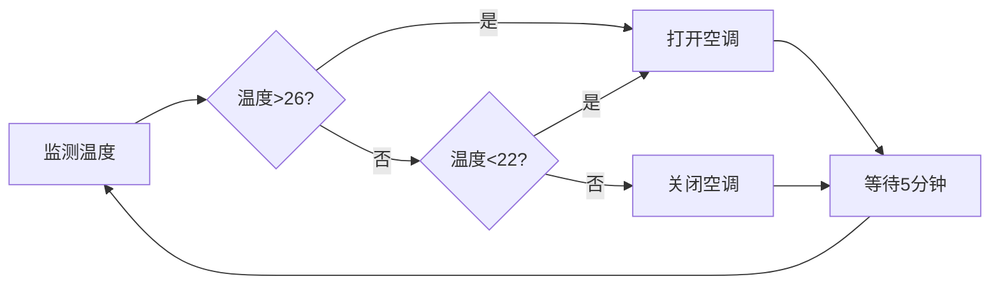

# AI人工智能代理工作流AI Agent WorkFlow：智能代理在物联网系统中的应用

关键词：人工智能、智能代理、工作流、物联网、多智能体系统

## 1. 背景介绍
### 1.1  问题的由来
随着人工智能技术的快速发展，智能代理(Intelligent Agent)在各个领域得到了广泛应用。特别是在物联网(Internet of Things, IoT)系统中，智能代理扮演着至关重要的角色。IoT设备数量庞大、异构性强、动态性高，对系统的自适应性、自组织性和智能化提出了更高要求。引入智能代理，可以显著提升IoT系统的自主性、灵活性和鲁棒性，实现设备的智能感知、协同决策与自主执行。

### 1.2  研究现状
目前，智能代理在IoT中的研究已取得了一定进展。学者们提出了多种智能代理模型和架构，如BDI(Belief-Desire-Intention)模型[1]、Soar认知架构[2]等。一些研究聚焦于智能代理的推理、规划与决策算法[3][4]，另一些关注多智能体协同与任务分配[5][6]。但现有工作大多针对特定应用场景，缺乏通用性；对复杂IoT环境下智能代理的工作流程缺乏系统性研究。

### 1.3  研究意义
系统研究智能代理在IoT系统中的工作流程，对于实现IoT的智能化与无缝集成具有重要意义：

(1) 提出一种通用的智能代理工作流范式，可适用于不同IoT应用场景，降低系统设计复杂度；

(2) 阐明智能代理在感知、决策到执行各环节的流程机制，便于算法设计与性能优化；

(3) 揭示多智能体协同的工作流组织方式，为构建高效、可扩展的大规模智能IoT系统提供理论指导。

### 1.4  本文结构
本文剩余部分安排如下：第2节介绍相关核心概念；第3节详述智能代理工作流的核心算法原理与操作步骤；第4节建立智能代理工作流的数学模型，并以案例说明；第5节给出代码实现与分析；第6节讨论智能代理工作流在IoT中的应用场景；第7节推荐相关工具和资源；第8节总结全文并展望未来研究方向；第9节为常见问题解答。

## 2. 核心概念与联系
智能代理(Intelligent Agent)是一种能够感知环境并做出自主行为以实现既定目标的计算实体[7]。它具备三个关键特征：

(1) 自主性(Autonomy)：能够独立运行，无需人工干预；

(2) 社会性(Social Ability)：能够与环境及其他代理交互；

(3) 反应性(Reactivity)和主动性(Proactiveness)：能够感知环境变化并及时做出反应，也能够主动采取行动。

在IoT系统中，智能代理内嵌于各种设备、传感器和执行器中，通过工作流(Workflow)的方式，实现设备的智能感知、决策与控制。智能代理工作流描述了代理完成任务的一系列活动及其执行顺序，涉及环境感知、推理决策、任务规划、协同通信、执行监控等核心环节。

多智能体系统(Multi-Agent System, MAS)是由多个智能代理通过交互实现系统整体功能的松耦合网络[8]。在IoT场景下，MAS为实现大规模异构设备的分布式智能提供了有力工具。MAS中，智能代理通过工作流相互协作，动态地感知、分析、决策与行动。

## 3. 核心算法原理 & 具体操作步骤
### 3.1  算法原理概述
智能代理工作流算法的核心是BDI模型与层次化任务网络规划(Hierarchical Task Network, HTN)[9]的结合。BDI模型刻画了代理的心智状态，包括信念(Belief)、欲望(Desire)和意图(Intention)。HTN则是一种启发式搜索规划算法，将复杂任务逐步分解为可执行的原子动作。

智能代理基于BDI模型感知IoT环境，产生欲望(目标)，并结合当前信念选择意图(行为)。然后利用HTN算法，将意图规划为一系列可执行的原子动作，即工作流。在执行过程中，代理持续监控环境变化，动态调整工作流。多个代理通过通信协商，实现工作流的分布式协同执行。

### 3.2  算法步骤详解
智能代理工作流算法主要包括以下步骤：

(1) 环境感知：代理通过传感器感知IoT环境，获取原始数据。

(2) 信念更新：代理将感知数据与先验知识相结合，更新自身信念库。常用方法有贝叶斯推理、模糊推理等。

(3) 欲望生成：代理根据信念库与内置偏好，产生一系列候选欲望(目标)。目标可用效用函数表示。

(4) 意图选择：代理基于欲望的效用值、环境约束等，选择当前最优意图(行为)。常用决策方法有基于规则、基于效用、博弈论等。

(5) 任务分解：代理利用HTN算法，将意图逐步分解为可执行的原子任务(动作)。分解过程中，原子任务间的时序、数据依赖等约束通过任务网络表示。

(6) 工作流生成：HTN规划得到的原子任务序列及其依赖关系，构成了代理的工作流。工作流通常用有向无环图(DAG)表示。

(7) 工作流执行：代理按照工作流控制结构，依次执行各原子任务。过程中通过执行器(如电机、开关等)影响物理世界。

(8) 动态监控：代理在执行过程中，持续监控环境变化。如果环境状态偏离预期，或出现突发事件，代理将动态调整工作流。

(9) 多代理协同：对于复杂任务，多个代理通过通信(如合约网协议)，协商任务分配方案，并协同执行各自工作流。

### 3.3  算法优缺点
智能代理工作流算法的优点包括：

(1) 结合BDI与HTN，兼顾代理的自主智能性和任务的层次化分解；

(2) 支持工作流的动态调整，适应IoT环境的动态变化；

(3) 支持多代理协同，提升了IoT系统的并行处理能力和鲁棒性。

算法的缺点包括：

(1) BDI推理与HTN规划的计算复杂度较高，实时性有待提升；

(2) 对领域知识的依赖性强，构建完备的领域模型工作量大；

(3) 多代理协同机制的设计仍有待进一步优化。

### 3.4  算法应用领域
智能代理工作流算法可广泛应用于智慧家居、智慧城市、工业互联网等典型IoT场景。如在智慧家居中，代理可感知室内环境，并自主控制照明、空调等设备，优化能耗；在工业互联网中，代理可监测设备状态，诊断故障，动态调度生产任务，提升生产效率。

## 4. 数学模型和公式 & 详细讲解 & 举例说明
### 4.1  数学模型构建
为形式化描述智能代理工作流，构建如下数学模型。

定义智能代理为一个六元组：
$$Agent=<B,D,I,P,A,E>$$

其中，$B$为信念库，$D$为欲望集，$I$为意图栈，$P$为规划器，$A$为执行器，$E$为环境。

信念库$B$可表示为谓词逻辑的原子公式(atom)集合：

$$B=\{p_1,p_2,...,p_n\}$$

其中$p_i$为原子公式，如$hasTemperature(room1,25)$表示房间1的温度为25度。

欲望$D$定义为目标的集合：
$$D=\{g_1,g_2,...,g_m\}$$

其中目标$g_i$可用效用函数$u(g_i)$表示，刻画了达成该目标的效用值。

意图$I$是当前决定执行的目标子集：
$$I\subseteq D$$

规划器$P$接受当前信念$B$、意图$I$及领域知识为输入，输出工作流$W$：

$$W=P(B,I,DomainKnowledge)$$

工作流$W$是一个有向无环图(DAG)：
$$W=<T,R>$$

其中$T$为原子任务集，$R\subseteq T\times T$为任务间的依赖关系。

执行器$A$负责执行工作流$W$中的原子任务。环境$E$通过状态转移函数$\delta$描述：

$$\delta:S\times A \rightarrow S$$

其中$S$为环境状态集。$\delta(s,a)$表示在状态$s$下执行动作$a$，环境将转移到新状态$s'$。

### 4.2  公式推导过程
基于以上模型，智能代理工作流的执行过程可形式化为如下步骤：

(1) 初始化：$B_0\leftarrow B_{init}$，$t\leftarrow 0$

(2) 感知：$B_t \leftarrow B_{t-1}\cup Perceive(E)$

(3) 决策：$I_t \leftarrow argmax_{I\subseteq D}U(I|B_t)$

(4) 规划：$W_t \leftarrow P(B_t,I_t,DomainKnowledge)$

(5) 执行：对于$W_t$中每个原子任务$\tau_i$，执行$A(\tau_i)$

(6) 监控：若$Eval(W_t|E)<\theta$，则中止执行，转(2)；否则，$t\leftarrow t+1$，转(5)

其中，$U(I|B_t)$为给定信念$B_t$下意图集$I$的效用，通过效用函数$u$累加计算：

$$U(I|B_t)=\sum_{g_i\in I}u(g_i|B_t)$$

$Eval(W_t|E)$为工作流$W_t$在环境$E$中执行的评估函数，$\theta$为评估阈值。评估函数可根据任务完成质量、实时性等指标设计。

### 4.3  案例分析与讲解
以智慧家居中的温控系统为例，说明智能代理工作流的执行过程。假设代理初始信念为$B_0=\{hasTemperature(room1,28)\}$，即房间1温度为28度。

欲望集合为$D=\{keepComfortable,savePower\}$，其中$keepComfortable$表示保持舒适，$savePower$表示节能。对应效用函数为：

$$
u(keepComfortable)=
\begin{cases}
1, & 22\leq t\leq 26\\
1-0.1|t-24|, & otherwise
\end{cases}
$$

$$
u(savePower)=
\begin{cases}
1, & |a-a_{off}|<1\\
0.5, & |a-a_{low}|<1\\
0, & otherwise
\end{cases}
$$

其中，$t$为房间温度，$a$为空调设置，$a_{off}$表示关闭，$a_{low}$表示低挡。

在初始状态下，$u(keepComfortable|B_0)=0.8$，$u(savePower|B_0)=0$。决策阶段选择意图$I_0=\{keepComfortable\}$。

规划器$P$基于领域知识(如空调运行模型)，生成工作流$W_0$：

执行器$A$执行$W_0$，持续监控房间温度。一旦温度回到[22,26]范围，评估函数值满足阈值，代理完成温控任务。

### 4.4  常见问题解答
Q: 如何设计智能代理的效用函数？

A: 效用函数的设计需要结合具体应用，常见的设计原则包括：(1)效用值在[0,1]范围内归一化；(2)对关键属性(如温度、能耗)建模，刻画属性值与效用的定量关系；(3)对多个属性的效用进行加权求和。

Q: 如何处理智能代理工作流的异