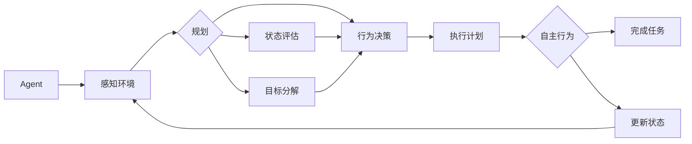

# AI人工智能代理工作流AI Agent WorkFlow：自主行为与规划策略在AI中的运用

关键词：人工智能、AI Agent、自主行为、规划策略、工作流、决策、自主学习

## 1. 背景介绍

### 1.1  问题的由来

随着人工智能技术的飞速发展，AI Agent在各个领域的应用日益广泛。传统的AI系统大多采用预定义的规则和模型，缺乏灵活性和自主性。如何赋予AI Agent更强的自主行为能力和动态规划策略，使其能够适应复杂多变的环境，高效完成任务，成为了AI领域亟待解决的问题。

### 1.2  研究现状

目前，国内外学者对AI Agent的自主行为和规划策略展开了广泛研究。DeepMind提出了深度强化学习算法DQN，使AI Agent能够通过与环境的交互自主学习策略。斯坦福大学的多智能体规划算法MCTS，让多个AI Agent能够协同规划，高效完成任务。国内清华大学、北京大学等高校也在AI自主行为领域取得了诸多进展。但现有方法仍存在泛化能力不足、规划效率偏低等问题，亟需进一步研究。

### 1.3  研究意义

研究AI Agent的自主行为和规划策略，对于提升AI系统的智能化水平、拓展AI应用场景具有重要意义。一方面，赋予AI更强的自主学习和规划能力，将大大提高AI系统的适应性和鲁棒性，使其能够在动态复杂的真实环境中稳定高效运行。另一方面，自主智能的AI Agent可以应用于更广泛的任务，如自动驾驶、智能制造、服务机器人等，为人类生活和生产带来便利。

### 1.4  本文结构

本文将重点探讨AI Agent自主行为与规划策略的核心原理和关键技术。第2部分介绍相关核心概念；第3部分重点阐述AI Agent自主行为的核心算法；第4部分建立AI规划策略的数学模型；第5部分给出具体的代码实现；第6部分分析AI Agent的实际应用场景；第7部分推荐相关工具和资源；第8部分总结全文并展望未来。

## 2. 核心概念与联系

在探讨AI Agent自主行为和规划策略前，我们首先要了解几个核心概念：

- **Agent**：能感知环境并作出行动的自主实体，具有一定的计算和决策能力。
- **自主行为**：Agent根据自身状态和环境信息，自主地产生行为决策和执行计划的过程。
- **规划策略**：Agent在多步决策问题中，对未来可能遇到的情况进行预判，并制定行动方案的策略。
- **工作流**：由一系列具有依赖关系的任务组成的任务流，用于指导Agent的行为决策。

这些概念环环相扣，共同构成了AI Agent的自主行为和规划能力。Agent感知环境，通过规划和决策自主产生行为，并以工作流的形式有序执行任务。自主行为让Agent具备了适应环境的能力，而规划策略则使其能预判未来，优化决策。二者融合，赋予了AI更强大的自主智能。

下图展示了AI Agent自主行为与规划策略的关系：

可见，规划和自主行为是AI Agent的两大核心能力，使其能够像人一样，根据环境动态地思考决策和行动。

## 3. 核心算法原理 & 具体操作步骤

### 3.1  算法原理概述

实现AI Agent的自主行为和规划，需要借助多种人工智能算法。其中最为关键的是强化学习和启发式搜索。

**强化学习**通过Agent与环境的交互，使其学习到最优的行为策略。Agent根据环境反馈的奖励值不断优化行为，以期获得长期最大化收益。Q-Learning和Policy Gradient是两类典型的强化学习算法。

**启发式搜索**则利用问题的启发信息引导搜索方向，快速找到最优解。这类算法通过评估搜索过程中的中间状态，舍弃无效路径，聚焦有希望的方向，从而大大提升了规划效率。典型的启发式搜索算法包括A*、蒙特卡洛树搜索等。

将强化学习和启发式搜索相结合，可以同时提升Agent的自主学习和规划能力，使其更加智能高效。多智能体系统中，Agent间还需要通过博弈论等算法协同规划决策。

### 3.2  算法步骤详解

下面以Q-Learning和A*为例，详细解释AI Agent自主行为和规划的实现步骤。

**Q-Learning的核心步骤如下：**

1. 初始化Q表格Q(s,a)，存储各状态-行为对的价值估计，初值可随机或置零。
2. Agent根据当前状态s，采用ϵ-greedy策略选取一个行为a：以ϵ的概率随机选择，或以1-ϵ的概率选择Q(s,a)最大的a。
3. 执行行为a，环境反馈下一状态s'和奖励r。 
4. 根据Bellman方程更新Q(s,a)：
$Q(s,a) \leftarrow Q(s,a)+\alpha [r+\gamma \max _{a^{\prime }} Q(s^{\prime }, a^{\prime })-Q(s,a)]$
其中，α为学习率，γ为折扣因子。
5. 将s'作为新的当前状态s，重复步骤2-5，直至达到终止状态。
6. 多次迭代训练，使Q(s,a)收敛到最优值，得到最优策略π*。

**A*搜索的核心步骤如下：**

1. 将起始节点加入开放列表OPEN，并计算其估价函数f(n)=g(n)+h(n)。其中，g(n)为起点到当前节点的实际代价，h(n)为当前节点到目标的估计代价。
2. 从OPEN中选取f(n)最小的节点n，并将其切换到关闭列表CLOSE。
3. 若n为目标节点，则搜索成功，返回路径；否则，继续搜索。
4. 扩展节点n，考察其所有子节点n'：
   - 若n'已在CLOSE中，则忽略。
   - 若n'已在OPEN中，比较经由n到达n'的g值与原g值，取较小者更新f值。
   - 若n'不在OPEN中，则将其加入OPEN，并计算f、g、h值。
5. 重复步骤2-4，直到找到目标节点，或OPEN为空（搜索失败）。

### 3.3  算法优缺点

Q-Learning的优点是模型无关，不需要预先知道环境转移概率，通过不断探索可学习到最优策略。但其缺点是状态空间过大时，学习效率较低，难以处理连续状态和行为空间。

A*搜索的优点是利用启发函数引导搜索方向，避免盲目搜索，提高了规划效率。但其缺点是需要良好的启发函数，否则搜索时间和空间复杂度会急剧上升。

### 3.4  算法应用领域

Q-Learning在智能体自主学习、机器人控制、自动驾驶等领域有广泛应用。如AlphaGo通过深度强化学习掌握围棋策略，达到了超人水平。

A*搜索在路径规划、图搜索、游戏AI等领域表现出色。如无人驾驶汽车使用A*算法规划最优行驶路径，谷歌地图应用A*进行路径搜索。

## 4. 数学模型和公式 & 详细讲解 & 举例说明

### 4.1  数学模型构建

为了刻画AI Agent的自主行为和规划过程，我们构建如下数学模型：

- 状态空间S：Agent所处的环境状态集合，每个状态s∈S为一个多维向量，描述Agent的内外部状态。
- 行为空间A：Agent能够采取的行为集合，每个行为a∈A对应一个具体动作。
- 奖励函数R：将每个状态转移映射为一个实数，表示环境对该转移的奖励值。
- 状态转移函数T：描述在状态s下采取行为a后，环境转移到下一状态s'的概率。
- 策略π：将每个状态映射为一个行为的概率分布，即π(a|s)=P(at=a|st=s)。

Agent的目标是寻找最优策略π*，使得期望累积奖励最大化：
$$
\pi^{*}=\arg \max _{\pi} \mathbb{E}\left[\sum_{t=0}^{\infty} \gamma^{t} r_{t} | \pi\right]
$$
其中，γ∈[0,1]为折扣因子，rt为t时刻获得的奖励。

在此基础上，我们定义状态-行为值函数Qπ(s,a)，表示从状态s开始，采用策略π选择行为a后的期望累积奖励：
$$
Q^{\pi}(s, a)=\mathbb{E}\left[\sum_{t=0}^{\infty} \gamma^{t} r_{t} | s_{0}=s, a_{0}=a, \pi\right]
$$
最优状态-行为值函数Q*(s,a)满足Bellman最优方程：
$$
Q^{*}(s, a)=\mathbb{E}_{s^{\prime}}\left[r+\gamma \max _{a^{\prime}} Q^{*}\left(s^{\prime}, a^{\prime}\right) | s, a\right]
$$

### 4.2  公式推导过程

下面我们推导Q-Learning算法的核心更新公式。

定义t时刻的TD误差：
$$
\delta_{t}=r_{t}+\gamma Q\left(s_{t+1}, a_{t+1}\right)-Q\left(s_{t}, a_{t}\right)
$$
根据梯度下降法，Q值的更新公式为：
$$
\begin{aligned}
Q\left(s_{t}, a_{t}\right) & \leftarrow Q\left(s_{t}, a_{t}\right)+\alpha \delta_{t} \\
&=Q\left(s_{t}, a_{t}\right)+\alpha\left[r_{t}+\gamma Q\left(s_{t+1}, a_{t+1}\right)-Q\left(s_{t}, a_{t}\right)\right]
\end{aligned}
$$
其中，α为学习率。考虑采用贪心策略，即always select the action with the highest estimated value，则有：
$$
Q\left(s_{t}, a_{t}\right) \leftarrow Q\left(s_{t}, a_{t}\right)+\alpha\left[r_{t}+\gamma \max _{a} Q\left(s_{t+1}, a\right)-Q\left(s_{t}, a_{t}\right)\right]
$$
这就是Q-Learning的核心更新公式。可以证明，在适当的条件下，Q(s,a)能够收敛到最优值函数Q*(s,a)。

### 4.3  案例分析与讲解

下面我们以一个简单的迷宫寻路问题为例，说明Q-Learning算法的执行过程。

如上图所示，Agent需要从S走到G，其中灰色方块为墙壁。状态空间为非障碍网格，行为空间为{上,下,左,右}。奖励函数设置为：到达G时奖励为+10，碰到墙壁为-1，其余情况为0。

假设折扣因子γ=0.9，学习率α=0.1，我们应用Q-Learning算法求解最优策略：

1. 初始化Q(s,a)=0。
2. 设置初始状态s=S。
3. 重复以下步骤，直到s=G：
   - 根据ϵ-greedy策略选择行为a。
   - 执行a，观察奖励r和下一状态s'。
   - 更新Q(s,a)：Q(s,a) ← Q(s,a)+0.1[r+0.9 max_a' Q(s',a')-Q(s,a)]
   - s ← s'
4. 重复步骤2-3，直至Q(s,a)收敛。

假设在第一轮中，Agent随机选择行为，得到如下一个状态转移序列：
S(右)→B(下)→C(右)→D(下)→H(左)→D(右)→E(右)→F(下)