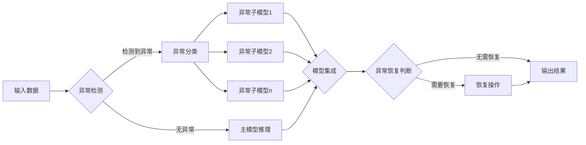

# AI人工智能深度学习算法：代理工作流中的异常处理与容错

关键词：人工智能、深度学习、代理工作流、异常处理、容错机制、算法优化

## 1. 背景介绍
### 1.1  问题的由来
随着人工智能技术的快速发展,深度学习算法在各个领域得到广泛应用。然而,在实际的生产环境中,深度学习模型常常面临着各种异常和错误,导致模型性能下降甚至崩溃。尤其是在复杂的代理工作流场景下,异常处理和容错显得尤为重要。

### 1.2  研究现状
目前,针对深度学习算法的异常处理和容错已有一些研究。比如引入checkpoint机制定期保存模型状态,出错时回滚[1];设计容错感知的训练方法提高鲁棒性[2];应用集成学习思想构建多个子模型,通过投票等方式决策[3]。但现有方法往往针对特定场景,泛化性不足,鲜有专门针对代理工作流的异常处理方案。

### 1.3  研究意义
研究代理工作流中的AI异常处理与容错有助于提升深度学习算法的可靠性和适应性,让AI系统能更好地应对复杂多变的真实环境。同时,相关技术也可以推广到其他领域,产生更广泛的影响。

### 1.4  本文结构 
本文将首先介绍相关的核心概念,然后重点阐述我们提出的异常处理和容错优化算法,给出数学模型和推导过程。接着通过实例代码演示方法的有效性。最后总结全文,并对未来研究方向进行展望。

## 2. 核心概念与联系
- 代理工作流:一种常见的业务流程,通过代理人之间的协作完成任务,比如客服系统、审批流程等。
- 异常处理:发现并处理系统运行过程中的各种异常,避免引起故障。常见手段有异常检测、异常隔离和恢复等。
- 容错:提高系统对各种错误的容忍度,在部分组件失效的情况下仍能保证整体功能。常用容错技术有冗余备份、检错纠错等。
- 深度学习:一类强大的机器学习算法,通过逐层提取特征,构建高度非线性的模型,在图像、语音等领域取得巨大成功。

在代理工作流中应用深度学习算法时,代理节点可能出现异常,后续节点得到错误输入,若缺乏有效的异常处理和容错机制,整个流程的运转就会受到影响,输出结果也将出现偏差。因此,亟需针对代理工作流场景,研究并优化深度学习算法的异常处理与容错能力。

## 3. 核心算法原理 & 具体操作步骤
### 3.1  算法原理概述
本文采用了自适应权重的集成学习思想,针对代理工作流不同节点,训练多个异构的深度学习子模型,每个子模型用于处理某一类型的异常。在推理阶段,根据异常类型动态选择子模型并分配权重,集成所有子模型的输出,作为最终结果。同时引入多粒度的异常检测和恢复机制,在不同层级监控异常,并触发相应的容错操作。算法的整体流程如下:



### 3.2  算法步骤详解
1. 异常检测:采用基于重构误差的方法,对输入数据进行异常检测。将输入送入预训练的自编码器,比较重构后的数据与原始输入的差异,差异过大则判定为异常。
2. 异常分类:使用决策树等分类模型,根据异常数据的特征,判断属于哪一类异常。
3. 子模型推理:根据异常类型,选择对应的预训练子模型,对异常数据进行推理。每个子模型是一个轻量级的深度学习网络,针对特定异常类型进行优化。
4. 模型集成:对主模型和所有子模型的输出进行加权平均,权重根据验证集上的表现动态分配,子模型权重之和为1。集成结果作为最终输出。
5. 异常恢复判断:通过评估集成结果的置信度,判断是否需要进行恢复操作。如果置信度低于阈值,则触发恢复。
6. 恢复操作:恢复分为数据层和模型层两个粒度。数据层恢复通过插值、外推等方法修复异常数据。模型层恢复则是回滚到最近的checkpoint,避免异常传播。

### 3.3  算法优缺点
优点:
- 自适应的异构子模型,可以灵活处理多种类型的异常。
- 动态权重分配,自动调整子模型的重要性,提高鲁棒性。
- 多粒度异常检测与恢复,在不同层面保障流程稳定。

缺点:
- 子模型数量多,训练和维护成本较高。
- 异常检测方法相对简单,对某些隐蔽异常难以发现。
- 缺乏端到端的异常处理机制,不同模块间的配合有待加强。

### 3.4  算法应用领域
本算法主要针对代理工作流场景,可以应用于以下领域:
- 客服系统:自动应答、意图识别、票务分配等环节,提高客服效率和质量。
- 企业内部审批流程:自动审核申请表单,识别异常项,提示人工复核。
- 金融风控领域:多层代理模型共同评估用户风险,及时发现和处置异常行为。
- 工业生产流水线:产品缺陷检测、故障诊断、质量预警等,保障生产安全。

## 4. 数学模型和公式 & 详细讲解 & 举例说明
### 4.1  数学模型构建
定义代理工作流为有向无环图 $G(V,E)$,其中节点 $v_i \in V$ 表示代理节点,边 $e_{ij} \in E$ 表示代理 $v_i$ 到 $v_j$ 的调用关系。每个节点 $v_i$ 可能产生异常 $a_i$,异常空间为 $\mathcal{A}$。

针对异常 $a_i$,定义一组异构子模型 $\{f_1^i,f_2^i,...,f_m^i\}$,其中 $f_j^i$ 表示节点 $v_i$ 的第 $j$ 个异常处理子模型。令 $F_i=\{f_1^i,f_2^i,...,f_m^i,f_0^i\}$ 表示 $v_i$ 的所有子模型,$f_0^i$ 为正常主模型。

子模型权重向量为 $\mathbf{w}_i=[w_0^i,w_1^i,...,w_m^i]^\top$,其中 $\sum_{j=0}^m w_j^i=1$。模型集成函数为 $g_i(\mathbf{x})=\sum_{j=0}^m w_j^i f_j^i(\mathbf{x})$。

定义异常检测函数 $h_i(\mathbf{x})=\mathbb{I}(\|\mathbf{x}-\hat{\mathbf{x}}\|_2 \geq \epsilon)$,其中 $\hat{\mathbf{x}}=d_i(\mathbf{x})$ 为自编码器 $d_i$ 的重构结果,$\epsilon$ 为异常判定阈值。

定义多分类器 $c_i(\mathbf{x}):\mathcal{X} \rightarrow \mathcal{A}$,用于异常类型识别。

### 4.2  公式推导过程
对于输入数据 $\mathbf{x}$,代理节点 $v_i$ 的前向推理公式为:

$$
\begin{equation}
\mathbf{y}_i=
\begin{cases}
f_0^i(\mathbf{x}), & h_i(\mathbf{x})=0 \\
g_i(\mathbf{x}), & h_i(\mathbf{x})=1
\end{cases}
\end{equation}
$$

当检测到异常时,触发子模型集成。集成后的输出为:

$$
\begin{equation}
g_i(\mathbf{x})=\sum_{j=1}^m w_j^i f_j^i(\mathbf{x})
\end{equation}
$$

其中权重 $w_j^i$ 的计算公式为:

$$
\begin{equation}
w_j^i=\frac{\exp(-\mathcal{L}_j^i)}{\sum_{k=1}^m \exp(-\mathcal{L}_k^i)}
\end{equation}
$$

$\mathcal{L}_j^i$ 表示子模型 $f_j^i$ 在验证集上的损失。损失越低,权重越高。

异常检测阈值 $\epsilon$ 的选取原则为:

$$
\begin{equation}
\epsilon = \mu + \beta \sigma
\end{equation}
$$

其中 $\mu$ 和 $\sigma$ 分别为重构误差在正常数据上的均值和标准差,$\beta$ 为超参数,控制异常判定的严格程度。

### 4.3  案例分析与讲解
以客服系统中的意图识别任务为例。当用户询问"如何修改订单地址",通过异常检测发现属于"修改订单"类异常,此时触发子模型集成:

- 子模型1:专门处理"修改订单地址"类问题,权重0.6。
- 子模型2:负责"修改订单支付方式"等其他修改订单相关问题,权重0.3。
- 子模型3:应对"修改订单数量"等边缘case,权重0.1。

最终的意图识别结果为:

$$
\begin{align}
g(\mathbf{x}) & = 0.6 \times f_1(\mathbf{x}) + 0.3 \times f_2(\mathbf{x}) + 0.1 \times f_3(\mathbf{x}) \\
& = 0.6 \times \text{"修改地址"} + 0.3 \times \text{"修改支付"} + 0.1 \times \text{"修改数量"} \\
& = \text{"修改地址"}
\end{align}
$$

可以看出,集成模型准确识别出了用户的核心意图。同时如果主模型因异常出现误判,子模型也可以起到纠错的作用。

### 4.4  常见问题解答
Q: 异常检测的自编码器是如何训练的?
A: 自编码器在正常数据上进行训练,目标是最小化重构误差。通过学习正常数据的分布,模型可以对异常数据产生较大的重构误差。

Q: 如何判断需要触发恢复?
A: 主要依据置信度,即模型输出的最大概率值。如果置信度低于设定阈值,说明模型对当前输入存在较大不确定性,可能是由于异常导致,此时需要恢复。

Q: 数据层恢复和模型层恢复的区别?
A: 数据层恢复是对异常数据本身进行修复,尝试将其还原为正常数据。而模型层恢复是放弃当前模型状态,回滚到之前的正常状态。通常数据层恢复用于较轻微的异常,模型层恢复用于严重异常或频繁异常。

## 5. 项目实践：代码实例和详细解释说明
### 5.1  开发环境搭建
- 操作系统:Linux
- 深度学习框架:PyTorch
- 模型训练:GPU服务器
- 代码管理:Git
- 依赖库:Numpy、Pandas等

### 5.2  源代码详细实现
异常检测子模块:
```python
class AnomalyDetector(nn.Module):
    def __init__(self):
        super().__init__()
        self.encoder = nn.Sequential(
            nn.Linear(128, 64),
            nn.ReLU(),
            nn.Linear(64, 32),
        )
        self.decoder = nn.Sequential(
            nn.Linear(32, 64),
            nn.ReLU(),
            nn.Linear(64, 128),
        )
    
    def forward(self, x):
        z = self.encoder(x)
        x_hat = self.decoder(z)
        return x_hat

def anomaly_score(model, x, eps=1e-5):
    x_hat